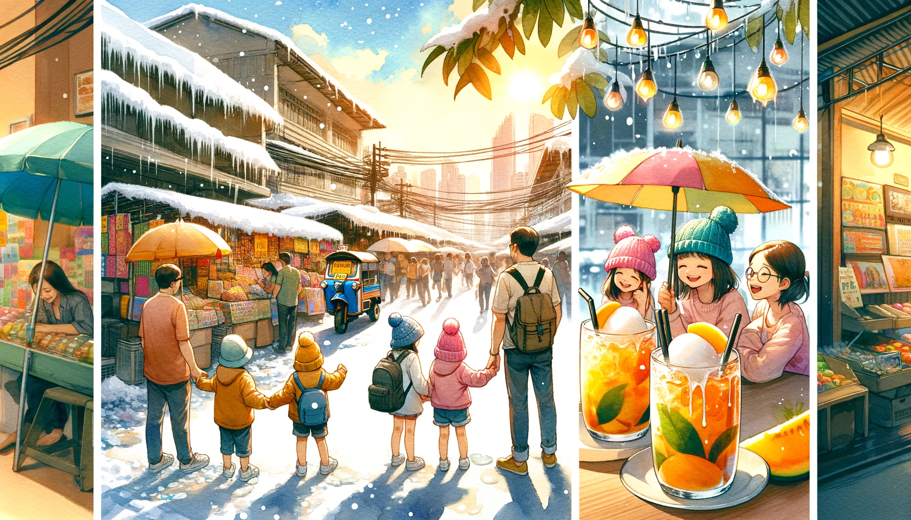
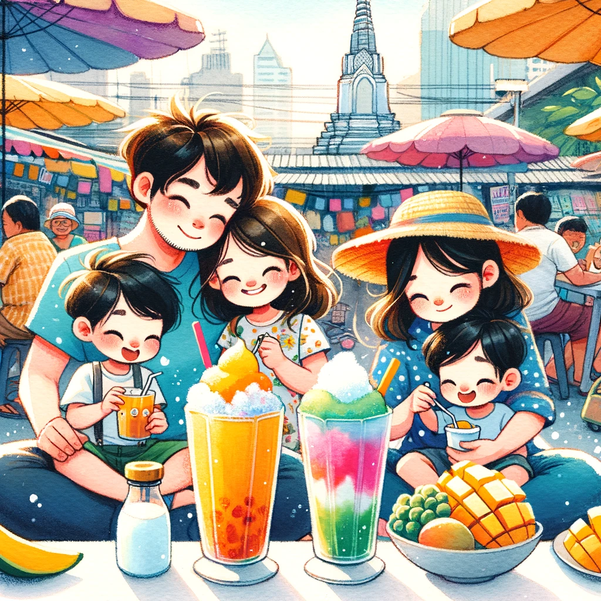

# 【随笔】曼谷炎热的冬天

不知不觉，就立春了。这天，大宝的姐姐们在家族群里发了一张又一张老家下大雪的视频，院子里完全被白雪覆盖，晒谷子的水泥地和菜地被这一场大雪抹成平整光滑的一整块，白皑皑的，看着特别喜庆。

看到这么多雪，我就忍不住开始幻想带着孩子们在雪地里撒欢儿的场景。然而，把目光从手机屏幕挪开，窗外的阳光明晃晃的依旧耀眼。自己穿着短袖T恤，随便动一动依旧会热得一身大汗。这是一个难得的周日，我们决定去恰图恰周末市场（*Chatuchak Weekend Market*）逛一逛。

大鱼似乎在一早和姐姐玩闹时把脚扭到了，走起路来一瘸一拐，总是嚷嚷着脚疼，要抱。最后只好全程抱着这个小家伙。于是乎，刚刚到目的地，就已经把我累坏了。买了几杯芒果牛奶冰沙，还有泰式奶茶冰沙，大宝找到一家卖帽子的小铺面，专心选着心仪的帽子，我便在店边找了个空地，把大鱼放下来，坐着休息。在我身边，有一个白人老太太，在这里已经坐了很久，满脸通红，大汗淋漓。我和她打着招呼，问她，是不是很热。

她摇着头，摆出一副夸张的表情说：

> Very Very Hot！（非常非常热！）

我们聊了一会儿天，她来自南非，说那里凉爽多了。她说了两个地名，一个应该是开普敦（Cape Town），很凉快；另一个或许是茨瓦内（Tshwane），也没有泰国这么热。大鱼和阿宝两个小朋友很是惹人喜爱，她总是笑吟吟地看着两个小家伙。她说，明天就要离开曼谷，经过迪拜然后回国。将是非常折腾的一天。我问她为什么不在迪拜玩几天？她说：

> No, No, No, In Dubai, Our Money is nothing!

大宝喜欢的太阳帽被另一个女孩子买走了，老板说要等下周才有同样颜色、同样款式的帽子。她只好选了同款黑色的帽子，看着也很不错。

总算是有了太阳帽，能些许抵挡一下曼谷冬天的炎炎酷热！

