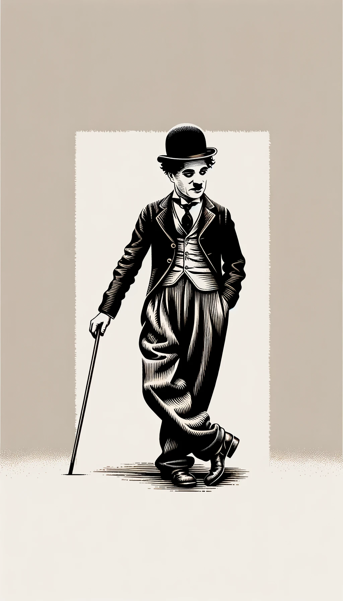

# 【生命⋅修行】再读卓别林的诗

这一次停下写文章，不知不觉竟然超过了15天。春节假期结束后，曾有好几次起心动念要重新开始，却总是被各种借口打断。终究，遇上一次长达9小时的飞行旅程，我心想，这下该没有任何借口重新捡起写作这件事儿了吧。

一上飞机，就忍不住翻看了一下座位前面的电影目录，竟然有《奥本海默》，于是乎，三个小时一晃而过。接着，困得打了会儿盹，直到被发小吃时点亮的灯光弄醒。等到吃完，离降落已经不过一个小时左右的时间了。我索性没有打开电脑，而是拿出钢笔和小本子，胡乱写起来。写着、写着，再一次想起了卓别林的诗——是的，最近他的诗总是一再跳入我的脑海。尤其是「SIMPLICITY」那一段。

我决定把这一段抄写下来，因为担心自己背得不熟练，我打开之前放在座椅后背Kindle，找到了这首诗。我忽然意识到，整首诗竟然是环环相扣的修行次第。

> As I began to love myself, I found that anguish and emotional suffering are only warning signs that I was living against my own truth, today I know this is **AUTHENTICITY**.

这第一段，讲的就是一切修行的开端——一切从痛苦的觉察开始。前两天，我意识到，自己内心痛苦几乎接近了十年前刚刚要离婚那段时间，只不过触发的诱因完全不同。那时我还反复念叨当年老同学G开导我的一句话：「痛苦即菩提」，但是菩提在哪里呢？

在黑暗的机舱里，在阅读灯辟出的一小块光明中，我反复咀嚼着这首诗的第一段，忽然顿悟：只有对「痛苦」有觉察，并明白这个「信号灯」的意义，才能开启迈向「真正菩提」的旅程。

> As I began to love myself I understood how much it can offend somebody if I try to force my desires on this person, even though I knew the time was not right and the person was not ready for it, and even though this person was me. Today I call it **RESPECT**.

然后呢，第一个要避免的误区，就是不能急！不要强行改变自己！不要在时机不对时，将这「修行的愿望」强加在自己身上……

> As I began to love myself I stopped craving for a different life, and I could see that everything that surrounded me was inviting me to grow. Today I call it **MATURITY**.

要做的，首先是接受现状。不要去追逐所谓不同的人生，完全地臣服于当下的现实，只有这样，才能看到周遭的一切，其实都是自己成长、修行之旅的邀约。

> As I began to love myself I understood that at any circumstance, I am in the right place at the right time, and everything happens at the exactly right moment. So I could be calm. Today I call it **SELF-CONFIDENCE**.

真正地臣服于当下之后，信心就会升起。你会意识到，任何时刻都是完美的时刻，一切发生得刚刚好！你会平静，而这平静源于真正臣服带来的十足信心。终于，你踏实地站在了这个完美的起点之上，是时候迈出第一步了。

> As I began to love myself I quit stealing my own time, and I stopped designing huge projects for the future. Today, I only do what brings me joy and happiness, things I love to do and that make my heart cheer, and I do them in my own way and in my own rhythm. Today I call it **SIMPLICITY**.

而这修行的第一步也很简单，以自己喜欢的方式，自己的节奏，去做自己喜欢，能带给内心清明愉悦的事情。

>  As I began to love myself I freed myself of anything that is no good for my health – food, people, things, situations, and everything that drew me down and away from myself. At first I called this attitude a healthy egoism. Today I know it is **LOVE OF ONESELF**.

在这修行过程中，有几个注意事项：第一，注意远离那些对自己有害，会把自己拉下来，远离真实自己的所有东西——不论是食物，人，事情，情景 / 环境，以及任何其它东西。

> As I began to love myself I quit trying to always be right, and ever since I was wrong less of the time. Today I discovered that is **MODESTY**.

第二，不要怕犯错。

> As I began to love myself I refused to go on living in the past and worrying about the future. Now, I only live for the moment, where everything is happening. Today I live each day, day by day, and I call it **FULFILLMENT**.

第三，不要活在过去，也不要焦虑未来。抓住每一个瞬间的机会，就这样踏踏实实、一天一天地修行下去。

> As I began to love myself I recognized that my mind can disturb me and it can make me sick. But as I connected it to my heart, my mind became a valuable ally. Today I call this connection **WISDOM OF THE HEART**.

在修行的旅程中，有一件最重要的事情，必须牢记：心是主人，脑是仆从。西行取经的路上，唐僧是真正的领队，而神通广大的齐天大圣孙悟空只是跟随他取经的大徒弟。这个秩序千万不能错！

> We no longer need to fear arguments, confrontations or any kind of problems with ourselves or others. Even stars collide, and out of their crashing new worlds are born. Today I know **THAT IS LIFE**!

最终，我们终将明白生命的真谛。争论、冲突、一切问题——无论是源自自己内在，还是源自与外界的碰撞——他们的诞生、爆发与消弭以及新世界诞生的过程，是必然发生的，并且这，就是美妙的生命——本身！

