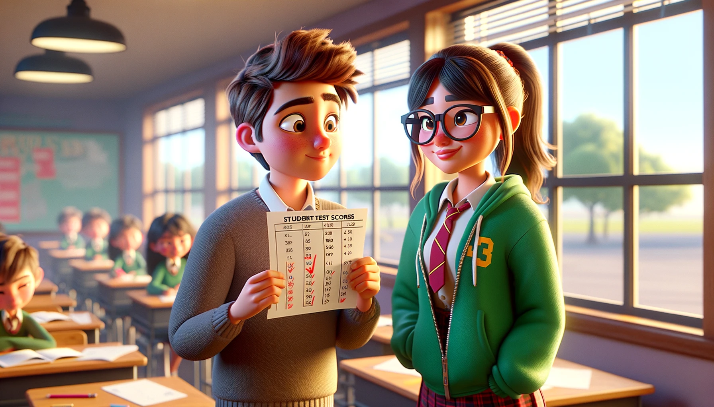

# 【生命•故事】（110）那个我再无机会打败的女孩

上初中没多久，自己成绩就变成了全班第一名（当然，一定程度上是因为原来小学那几个学习比我好的同学，都分到了其它班级）。经常性的单元测验，分数也会提醒自己的排名。但最主要是每次期中、期末考试后的总分排名。

渐渐地，我也习惯了这种第一名的待遇，直到有一天，有一名姓L的女同学在转学来到了我们班。她来了没多久，就是一次重要的考试，成绩出来后，我惊呆了。她的总分竟然高了我近50多分，妥妥地从我这里抢走了全班第一的荣誉。而且，我作为第二名，与她的分数差距竟然是那么大！班主任也揶揄我：

> 现在也知道山外有山，不会盲目骄傲了吧？

只记得那是一个常常扎着马尾辫的女孩，长得不算漂亮，有没有戴眼镜我已经记不清了，常常会穿一件绿色的外套。她不仅成绩好，人也很好。同学们有不懂的地方问她，她也会极其耐心地帮同学讲解。我感受到了竞争的压力，当然也有一点点小小嫉妒，但更多地则是对手出现的，那张摩拳擦掌的小兴奋。

我们关系还蛮不错的，遇到难题可以一起切磋。然后，每一次单元测试，都是暗自较量的机会。我只知道，自己真正能够稳打稳算赢过她的课目，只有物理。其它各科，都得加把劲才能跟上她的节奏。就这样，一次单元考试，又一次单元考试的比试过去。好像，中间经过了一次大考，我依然是班级第二名，但是距离她已经不再是50多分那么遥远的差距了。

然后，又一次。这次，我还是第二，但各科总分加起来，只不过比她低几分而已。更有意思的是，这次的物理考试，最后有一道10分的大题，老师给我打了一个大叉，说过程全错，答案正确，只给了1分。我清晰地记得自己解那道题目的过程，当时有一个物理公式需要用，但是自己记不住公式内容了。于是乎，我在题目最开始，用了一大半的篇幅，重新从一个基础公式推导出了这个需要用的公式。然后用这个推到出来的公式算出了正确答案。

我拿着卷子去找我们的物理老师，也就是我们当时的班主任理论。他听我讲完，再仔细看了看过程。说：

> 嗯，这么说来，你这样做也是对的。
>
> 不过，你的分数就不改了吧。都统计上报了！

于是，几乎只有我一个人知道，加上这9分，我就是事实上的全班第一名了。嗯，下一次，我一定能超过她，重新赢回全班第一的荣誉。

我是这么想着的，但老天爷轻轻地给我开了个玩笑。在那次考试后没多久，L转学了。这成了最后一次我们在分数上的较量。从此之后，与这个女孩的人生再无交集，我再也没有机会在「这场分数的竞技」中，真正地打败她了。