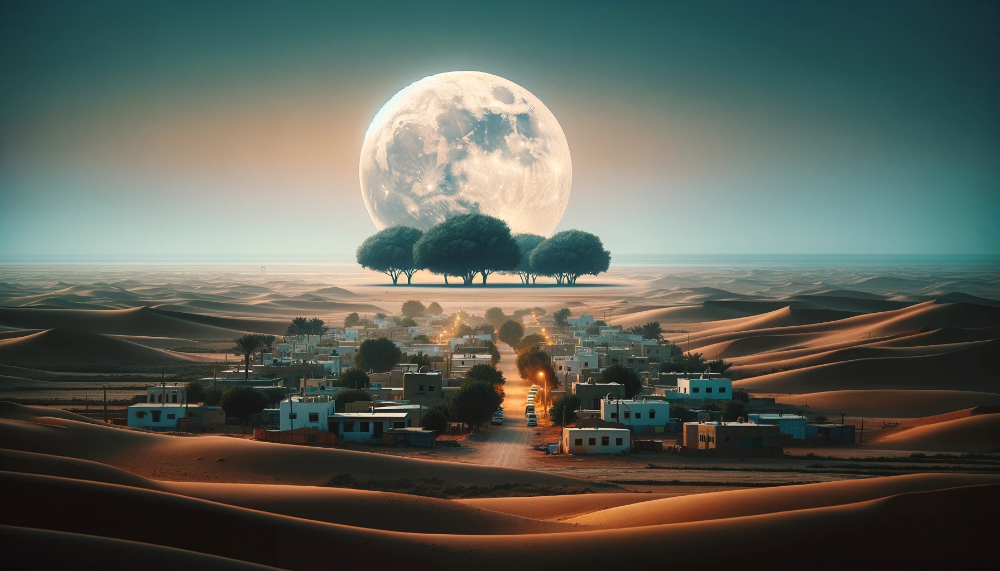

# 【随笔】红海日落

难得休息日，虽然到达目的地——这个海边小镇后已经是下午。但是没歇多久，拿起手机，发现6点半正是这里的日落时刻。如果立即出发，或许刚好可以赶到海边一睹美景，于是毫不犹豫地重新穿上鞋子，出了门。

到海边的时候，太阳离海平面还有大约一个太阳那么高。我生怕错失了日落美景的每一秒钟，便一直目不转睛地盯着太阳看。但没想到，此时此地的阳光，依旧猛烈得很。虽然天边、海面早已缀满了夕阳的红光，但太阳此刻还是一个闪亮、白色的圆盘。

我犹豫了几秒，还是决定不要闭上眼睛，就这么盯着白色的太阳。周遭的一切，都变成了不重要的背景，哪怕是喧嚣拍案的海浪，以及在耳边呼呼喘气的海风，也似乎退到了舞台角落某个不起眼的地方。天地间，似乎只剩下了我，还有那明晃晃的太阳。我瞪着它，它瞪着我。

猛然，更加靠近海平面的白色太阳好像一枚沾了水、出现故障的灯泡一样，吱吱啦啦忽闪了几下。闪烁之后，光从白色被调整了淡黄色，光线立刻变得柔和起来。我不愿眨眼，但太阳却毫不停留地一丝一丝地滑向海面，接触到海面，然后不带一丝犹豫地继续往海里钻去。直到最后剩下一个小亮点，然后再次忽闪一下，熄灭在海平面的波涛中。

风顿时更大了些，就好像它是一个画家，开始猛烈地往天边涂抹玫瑰色，笔下生风。只一小会儿，太阳落下的那一隅天空就被抹成了浓烈的玫瑰红。

真美啊，海的那边是埃及。我的身后，穿越遥远的大陆与高原，是远在东方的家乡。去年底的红海危机，也不知今年会如何继续发展。我不禁想起去年在这里时，写下的那篇文章标题——《日暮红海一杯茶》。

没多久，一轮圆月从东方升起。唔，对了，今天是元宵节！

