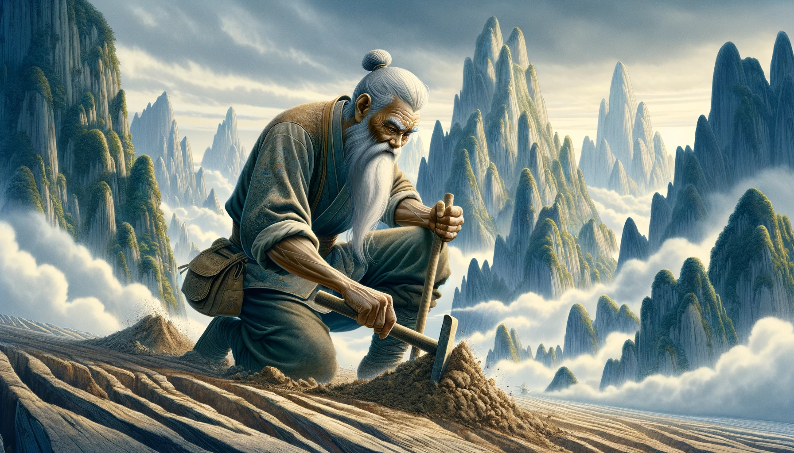

# 【生命⋅修行】十百千之道

那天在飞机上读《写出我心》，看到娜塔莉•戈德堡讲起她朋友与片桐老师的一个故事。他朋友想要搬到洛杉矶，希望能进入音乐界。他觉得也许到了他跟着感觉走到时候了，片桐老师让他讲讲他对此的态度。他说：

> 呃，我会尽力而为，我觉得应该要试试看。如果没成功，也没关系，我会坦然接受。

片桐老师回答：

> 这个态度是不对的。**要是有人把你打倒了，你得站起来。要是他们再一次打倒了你，你要再站起来。不管你被人打倒多少次，都得再站起来！**这才是你应有的态度。

看到这段，我颇为触动。我对于自己喜欢的、想要做的事情，想要承担的责任，似乎少了这么百折不挠的气势。中庸里也有这么一句：

> 人一能之，己百之；人十能之，己千之。果能此道矣，雖愚必明，雖柔必強！

自己远远没有付出十倍、百倍、千倍的努力，还常常忧心愁苦，觉得世事不遂己愿，实在是太弱了。最近不时还会会发愁，自己那控制不住玩手机、晚睡的坏习惯。回想到书中这段，惊觉虽然自控真的不易，但解药其实也就在那里——远离一切对自己不好的东西——把时间与注意力十倍、百倍、千倍地砸在那些对自己好的东西上就是了！

总要破除些什么，才能建设些什么新的东西。但若只管一心去建设，旧的自然也就破了！

> 大圣，此去欲何？

> 踏南天，随凌霄！

> 若一去不回？

> 便一去不回！

