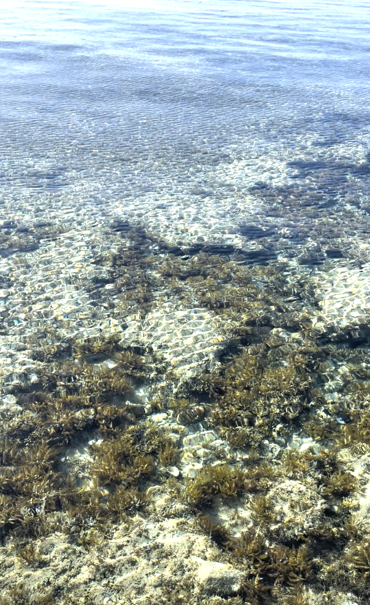

#  【随笔】红海的颜色

虽然红海的名字叫做「红海」，但我它其实是蓝色。在我印象中是蓝色，这一次到红海边去看日落，它也是蓝色。

到海边的公路是一个长长的下坡，然后大海就好像是湛蓝湛蓝的宝石镶嵌出来的一面墙，横梗在公路的尽头。之上，则是浅蓝色的天空。那种深邃的蓝色，简直太迷人了，有一种特别的，摄人心魄的魅力。现在只是想到它，就觉得心脏又砰砰地跳动起来。

我以为，它会一直是这样的蓝色。直到前天早上，我跑步到了海边，却发现蓝色的大海不见了。海水变成有一些灰蒙蒙地灰绿色。我原以为，只要是晴天，有浅蓝色的天空就一定会有深蓝色的海水。但是我错了，天空依旧是朗朗的蓝色，但海水却是灰绿灰绿的。我一直跑到海边，站在防波堤上往下望。近岸的海水清澈见底，能一眼看见海底的鹅卵石，毛绒绒的海藻，还有在海藻间游来游去的小鱼。

阳光透过凌凌波动的海水，闪耀着彩虹般的光芒，就好像闪烁的宝石一样。

每当有这种美景的时刻，就觉得不管是什么手机、相机，都是弱爆了！

或许，红海的颜色，本来就是这么五彩斑斓吧……