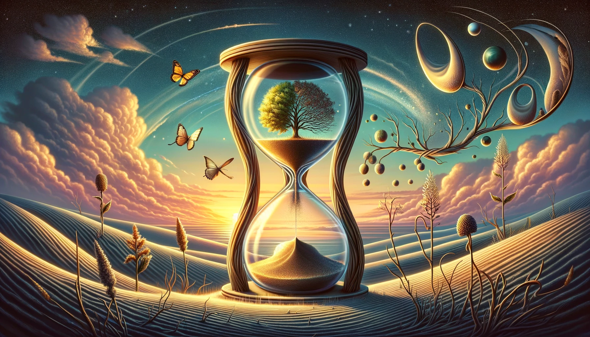

# 【生命⋅修行】名者实之宾也

早上折腾完一些手边的事情，拿起手机来想要学一会儿Duolingo，却发现已经过了12点。也就是说，那个夜猫子宝箱肯定是领不到了。而且，也不可能解锁早起鸟宝箱了。没有时间宝的双倍经验加持，我能冲上黑曜石等级的前五名吗？

打开排行榜，看到第五名与我的之间的差距已经拉开到了1300多分，如果要保险一点，瞄着第四名，那更是差1600多分。意味着我要在剩下10多个小时里，拿到和之前6天几乎一样多的经验点数。呼呼～想必，应该是不可能了吧。这时，我觉察到这时多么奇怪又有趣的念头。用多邻国的初衷，不过是保持自己继续学习法语的热度而已。仅凭这个软件的每天10多分钟到半小时，已经很难再让自己的法语上一个台阶了，但确实他又有些用处。

但，夺得排行榜的前五名，继续升级，却完完全全是另外一件事情啊。学习法语——用多邻国软件——持续用多领国软件——保持连胜、排行榜升级，这一层又一层的目标转移，离初衷偏离了可不止一点点。

最近很热门的一种说法——「多巴胺劫持」，恐怕说的就是这由实到名，初心一点点被歪曲、乃至完全被遗忘、被篡权替代的事情吧。许由对想要让天下给他的尧说：

> 名者，实之宾也，吾将为宾乎？

呜呼！我有多少次都是奉宾为主啊，以至于，「主」在何方，都已经模糊不清了。

人这一生，从一个小小的受精卵，分裂成两个细胞、再变成四个、八个，直到变成有心跳的胎儿，变成能哭、能笑，能把父母萌化了的婴儿；再变成既淘气又可爱的小孩子；然后是青春洋溢的少年少女；意气风发的年轻人，或成功、或油腻、或坚韧、或颓废，终究有些灰头土脸的中年人；然后终于变老，或者固执、或者智慧，但终有一死。或成灰、或成泥。

从虚空中来，又到虚空中去。

生命短暂，能干的事情实在太有限了，而其中真正有意义的事情更是少之又少。想起前段时间从曼谷离开，收拾行李时颇多苦恼。若是到了要离开这世界的时候，又哪有机会收拾自己的行李呢？或许那时，真正的行李，是在漫漫一生的无数个片段中，攫取一二，再把它们炼化成无法忘却的一点执念而已吧。

想再多也无用。此时此刻所能做的，还是默默静下心来，把有限的精力与时间，投入在那些真正能让自己内心欢呼、撼动的事情上吧。

