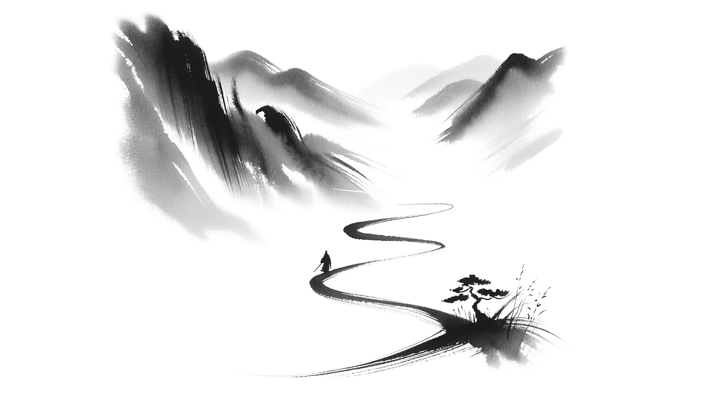

# 【生命⋅修行】此心何处安

这两天开始拉肚子，也不知道是天天喝冰牛奶的缘故，还是新换的这个牌子不够好，再或者就是这个城市天气凉，把自己冷到了。

自从前几天把自己饿坏了，然后在中餐馆吃了一碗热气腾腾的面条，就开始想念那热腾腾的面汤。但是，想找吃中餐的地方可不是那么容易。于是乎，只好退而求其次，买了一杯快餐面，然后又是一杯快餐面。但这里的快餐面也蛮贵的，随随便便一小杯，折合人民币至少需要要10元钱。

如此种种小事，于是心情慢慢变得不是那么美好了。去国远乡数万里，开始强烈地思念家人，视频里看到孩子可爱的笑容，总想把他们揽过来，紧紧抱在怀里。然而我知道，即便是过去在他们身边时，我也常常惶惶然，沉湎于过去，或者焦虑着将来，并不能专心、用心、全心地陪伴着他们。

总是心难安。难怪苏东坡在词中赞叹王定国的柔奴：

> 常羡人间琢玉郎，
> 天应乞与点酥娘。
> 尽道清歌传皓齿。
> 风起，雪飞炎海变清凉。
> 万里归来颜愈少。
> 微笑，笑时犹带岭梅香。
> 试问岭南好不好，
> 却道：此心安处是吾乡。

能说出「此心安处是吾乡」的人，内心该是多么的安定、从容啊！

于是，又想起禅宗里安心的那则公案：

> 祖，武牢姬姓。初娠，有异光照室；生，名神光。少则博极群书；出家，晏坐终日。其师指谒少林，祖奉教。值达摩面壁，不闻诲励。一夕，祖立雪；迟明，摩曰：“当需何事？”祖泣告请法。摩呵之，祖断臂悔曰：**“我心未宁，乞师安心。”曰：“将心来，与汝安！”祖曰：“觅心了不可得。”曰：“与汝安心竟。”**祖大悟。摩付偈曰：“我本来玆土，传法救迷情。一花开五叶，结果自然成。”祖得法已，继阐玄风，转授法于僧璨。寿一百七，终于莞城，德宗谥大祖禅师。

禅宗的二祖乞请达摩祖师安心，祖师让他拿心来安，二祖找不到心在哪，于是竟大悟了！

我也心不安，也不知自己心在何处，却只是不悟！或许，还欠上一个半个众里寻她千百度的过程吧！