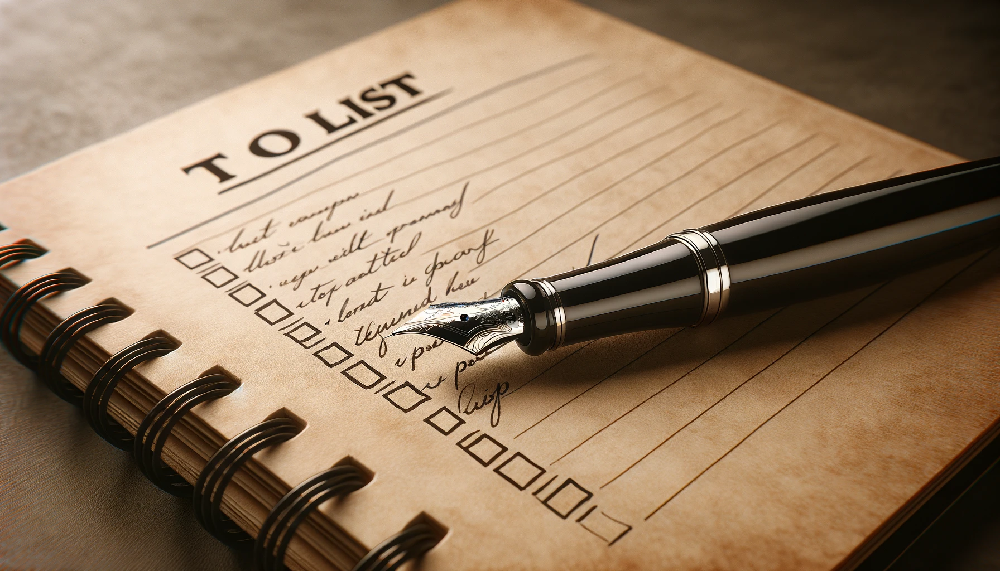
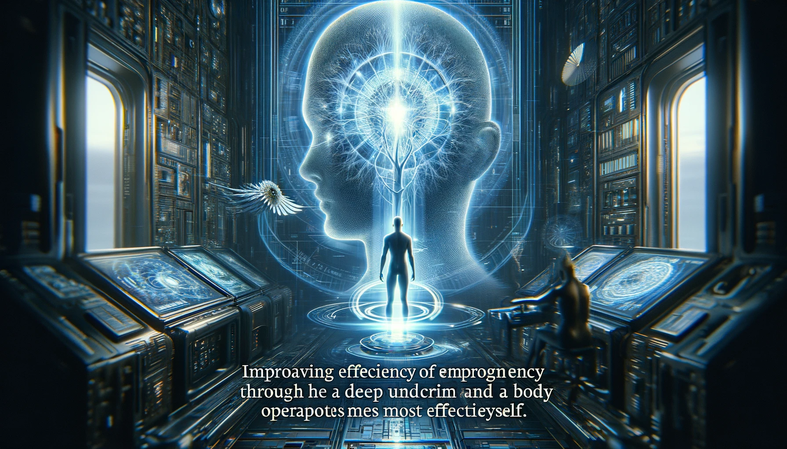

# 【教程】山姆•奥特曼：如何提高工作效率

随着Sara的火爆，OpenAI又一次站在大众舆论的风口，我发现6年前山姆•奥特曼写的那篇《如何提高工作效率》又被人翻了出来。他在文中提到的清单法，瞬间抓住了我的注意力。我心想，这应该是解决自己内耗与停滞的好工具吧。趁今晚有空，索性认真地一边读，一遍把这篇博文再翻译一遍。

原文在Sam自己的博客上https://blog.samaltman.com/productivity，已经是6年前的事儿了。三个月前，Sam还在博客上发布了一篇文章**What I Wish Someone Had Told Me** （https://blog.samaltman.com/what-i-wish-someone-had-told-me），不长，更像是奥特曼的心法精要，于是我索性先把这篇读过一遍：

## [What I Wish Someone Had Told Me](https://blog.samaltman.com/what-i-wish-someone-had-told-me)

1. Optimism, obsession, self-belief, raw horsepower and personal connections are how things get started.

   乐观、痴迷、自信、原始动力和个人关系是事情开始的方式。

2. Cohesive teams, the right combination of calmness and urgency, and unreasonable commitment are how things get finished. Long-term orientation is in short supply; try not to worry about what people think in the short term, which will get easier over time.

   团结的团队、冷静与紧迫感的正确结合，以及不合理的承诺是完成事情的方式。远见从来都比较缺乏；尽量不要担心人们短期内的看法，随着时间的推移这会变得更容易。

3. It is easier for a team to do a hard thing that really matters than to do an easy thing that doesn’t really matter; audacious ideas motivate people.

   对一个团队来说，做一件真正重要的难事比做一件并不真正重要的易事更容易；大胆的想法能激励人们。

4. Incentives are superpowers; set them carefully.

   激励措施是超能力；小心设定它们。

5. Concentrate your resources on a small number of high-conviction bets; this is easy to say but evidently hard to do. You can delete more stuff than you think.

   将资源集中在少数几个高信心的投注上；这么说容易做起来显然难。**你能删除的东西比你想象的多。**

6. Communicate clearly and concisely.

   清晰而简洁地沟通。

7. Fight bullshit and bureaucracy every time you see it and get other people to fight it too. Do not let the org chart get in the way of people working productively together.

   每当你看到废话和官僚主义时就要与之战斗，并让其他人也加入战斗。不要让组织架构妨碍人们有效地一起工作。

8. Outcomes are what count; don’t let good process excuse bad results.

   结果是最重要的；不要让良好的过程成为糟糕结果的借口。

9. Spend more time recruiting. Take risks on high-potential people with a fast rate of improvement. Look for evidence of getting stuff done in addition to intelligence.

   花更多时间招聘。对具有快速提升潜力的人冒险。除了智力之外，还要寻找完成事务的证据。

10. Superstars are even more valuable than they seem, but you have to evaluate people on their net impact on the performance of the organization.

    超级明星比他们看起来更有价值，但你必须根据他们对组织绩效的净影响来评估人们。

11. Fast iteration can make up for a lot; it’s usually ok to be wrong if you iterate quickly. Plans should be measured in decades, execution should be measured in weeks.

    快速迭代可以弥补很多；如果你迅速迭代，通常错了也没关系。计划应以十年为单位，执行应以周为单位衡量。

12. Don’t fight the business equivalent of the laws of physics.

    不要与商业版的物理定律作战。

13. Inspiration is perishable and life goes by fast. Inaction is a particularly insidious type of risk.

    灵感是易逝的，生活过得很快。不行动是一种特别潜在的风险类型。

14. Scale often has surprising emergent properties.

    规模往往具有令人惊讶的新兴属性。

15. Compounding exponentials are magic. In particular, you really want to build a business that gets a compounding advantage with scale.

    复合指数是魔法。特别是，你真的想建立一个随着规模增长而获得复合优势的业务。

16. Get back up and keep going.

    爬起来继续前进。

17. Working with great people is one of the best parts of life.

    与伟大的人一起工作是生活中最好的部分之一。

----

OK，以下，就是6年前的那篇著名博文了。

## [Productivity](https://blog.samaltman.com/productivity) 如何提高工作效率

I think I am at least somewhat more productive than average, and people sometimes ask me for productivity tips.  So I decided to just write them all down in one place.

我认为自己至少比平均水平更高效一点，人们有时会向我询问生产力的建议。因此，我决定把它们全部写在一个地方。

Compound growth gets discussed as a financial concept, but it works in careers as well, and it is magic. A small productivity gain, compounded over 50 years, is worth a lot. So it’s worth figuring out how to optimize productivity. If you get 10% more done and 1% better every day compared to someone else, the compounded difference is massive. 

复合增长作为一个财务概念被讨论，但它也适用于职业生涯，而且它就像魔法一样。50年来小小的生产力增长经过复合，其价值巨大。因此，弄清楚如何优化生产力是值得的。如果与他人相比，你每天能多完成10%的工作，每天变得更好1%，那么复合的差异是巨大的。

**What you work on 你工作的内容** 

It doesn’t matter how fast you move if it’s in a worthless direction. Picking the right thing to work on is the most important element of productivity and usually almost ignored. So think about it more! Independent thought is hard but it’s something you can get better at with practice.

如果方向错误，你移动得再快也没用。选择正确的工作内容是生产力最重要的元素，通常几乎被忽视。所以，多考虑考虑吧！独立思考很难，但这是你可以通过练习变得更好的东西。

The most impressive people I know have strong beliefs about the world, which is rare in the general population.  If you find yourself always agreeing with whomever you last spoke with, that’s bad. You will of course be wrong sometimes, but develop the confidence to stick with your convictions. It will let you be courageous when you’re right about something important that most people don’t see.

我认识的最令人印象深刻的人对世界有强烈的信仰，这在普通人中很少见。如果你发现自己总是同意你最后交谈的人，那是不好的。你当然有时会错，但要培养坚持你信念的信心。它会让你在大多数人看不见的重要事情上勇敢。

I make sure to leave enough time in my schedule to think about what to work on.  The best ways for me to do this are reading books, hanging out with interesting people, and spending time in nature.

我确保在我的日程表中留出足够的时间来思考要做什么。我做这个的最佳方式是读书、和有趣的人一起、在大自然中度过时间。

I’ve learned that I can’t be very productive working on things I don’t care about or don’t like.  So I just try not to put myself in a position where I have to do them (by delegating, avoiding, or something else).  Stuff that you don’t like is a painful drag on morale and momentum.

我已经学到，如果我不关心或不喜欢的事情，我就不能非常高效。所以，我只是尽量不让自己处于必须做这些事情的位置（通过委派、避免或其他方式）。你不喜欢的事情是对士气和动力的痛苦拖累。

By the way, here is an important lesson about delegation: remember that everyone else is also most productive when they’re doing what they like, and do what you’d want other people to do for you—try to figure out who likes (and is good at) doing what, and delegate that way.  

顺便说一句，关于委派的一个重要教训：记住，当他们做自己喜欢的事情时，每个人也是最高效的，并且做你希望别人为你做的事——尝试弄清楚谁喜欢（并且擅长）做什么，并以这种方式委派。

If you find yourself not liking what you’re doing for a long period of time, seriously consider a major job change.  Short-term burnout happens, but if it isn’t resolved with some time off, maybe it’s time to do something you’re more interested in. 

**如果你发现自己在很长一段时间内不喜欢你正在做的事情，认真考虑一次重大的工作变动。短期的疲惫会发生，但如果一段时间的休息后没有解决，也许是时候做一些你更感兴趣的事情了。**

I’ve been very fortunate to find work I like so much I’d do it for free, which makes it easy to be really productive.

我非常幸运地找到了我非常喜欢的工作，以至于我愿意免费做，这使得高效变得容易。

It’s important to learn that you can learn anything you want, and that you can get better quickly.  This feels like an unlikely miracle the first few times it happens, but eventually you learn to trust that you can do it.

**重要的是要学会你可以学习任何你想要的东西，**并且你可以迅速变得更好。这在前几次发生时感觉像不可思议的奇迹，但最终你会学会相信你能做到。

Doing great work usually requires colleagues of some sort.  Try to be around smart, productive, happy, and positive people that don’t belittle your ambitions. I love being around people who push me and inspire me to be better. To the degree you able to, avoid the opposite kind of people—the cost of letting them take up your mental cycles is horrific. 

通常，做出伟大的工作需要某种形式的同事。尝试与聪明、高效、快乐、积极的人在一起，他们不会贬低你的抱负。我喜欢和那些推动我、激励我变得更好的人在一起。在你能做的程度上，避开相反类型的人——让他们占据你的心智成本是可怕的。

You have to both pick the right problem and do the work.  There aren’t many shortcuts. If you’re going to do something really important, you are very likely going to work both smart and hard.  The biggest prizes are heavily competed for. This isn’t true in every field (there are great mathematicians who never spend that many hours a week working) but it is in most.

你必须选择正确的问题并完成工作。没有多少捷径。如果你要做一些真正重要的事情，你很可能会同时努力和聪明地工作。最大的奖励是竞争激烈的。这不是每个领域都适用（有些伟大的数学家每周从不工作那么多小时），但大多数领域都是这样。

**Prioritization 优先排序**

My system has three key pillars: “Make sure to get the important shit done”, “Don’t waste time on stupid shit”, and “make a lot of lists”.

我的系统有三个关键支柱：“确保完成重要的事情”，“不要浪费时间在愚蠢的事情上”，和“制作很多列表”。

I highly recommend using lists.  I make lists of what I want to accomplish each year, each month, and each day.  Lists are very focusing, and they help me with multitasking because I don’t have to keep as much in my head. If I’m not in the mood for some particular task, I can always find something else I’m excited to do.

我强烈推荐使用列表。我制作了我每年、每月和每天想要完成的事情的列表。列表非常集中注意力，它们帮助我进行多任务处理，因为我不需要记住太多东西。如果我对某个特定任务没有心情，我总能找到其他我激动要做的事情。

I prefer lists written down on paper. It’s easy to add and remove tasks. I can access them during meetings without feeling rude. I re-transcribe lists frequently, which forces me to think about everything on the list and gives me an opportunity to add and remove items.

我喜欢在纸上写下列表。很容易添加和删除任务。我可以在会议中访问它们而不觉得无礼。我经常重新书写列表，这迫使我思考列表上的每件事，并给我一个添加和删除项目的机会。

I don’t bother with categorization or trying to size tasks or anything like that (the most I do is put a star next to really important items).  

我不费心进行分类或尝试确定任务的大小或类似的事情（我最多做的就是在非常重要的项目旁边放一个星号）。

I try to prioritize in a way that generates momentum.  The more I get done, the better I feel, and then the more I get done. I like to start and end each day with something I can really make progress on.

我尝试以一种能够产生动力的方式来优先排序。我完成的事情越多，我感觉越好，然后我就完成更多。我喜欢以我能取得实际进展的事情开始和结束每一天。

I am relentless about getting my most important projects done—I’ve found that if I really want something to happen and I push hard enough, it usually happens. 

我对完成我最重要的项目毫不松懈——我发现，如果我真的想要某件事发生，并且足够努力推动，它通常就会发生。

I try to be ruthless about saying no to stuff, and doing non-critical things in the quickest way possible.  I probably take this too far—for example, I am almost sure I am terse to the point of rudeness when replying to emails.

我尝试无情地拒绝东西，并以尽可能快的方式做非关键事务。我可能在这方面做得太过分了——例如，我几乎可以肯定我在回复电子邮件时简洁到了近乎无礼的程度。

I generally try to avoid meetings and conferences as I find the time cost to be huge—I get the most value out of time in my office.  However, it is critical that you keep enough space in your schedule to allow for chance encounters and exposure to new people and ideas.  Having an open network is valuable; though probably 90% of the random meetings I take are a waste of time, the other 10% really make up for it.

我通常尽量避免开会和参加会议，因为我发现时间成本巨大——我在办公室的时间最有价值。然而，保持你的日程安排有足够的空间，以便偶然遇见新人和新思想是至关重要的。拥有一个开放的网络是有价值的；虽然我接受的随机会议中大约90%是浪费时间，但其余的10%确实弥补了这一点。

I find most meetings are best scheduled for 15-20 minutes, or 2 hours.  The default of 1 hour is usually wrong, and leads to a lot of wasted time.

我发现大多数会议最好安排在15-20分钟或2小时。默认的1小时通常是错误的，会导致很多时间浪费。

I have different times of day I try to use for different kinds of work.  The first few hours of the morning are definitely my most productive time of the day, so I don’t let anyone schedule anything then.  I try to do meetings in the afternoon. I take a break, or switch tasks, whenever I feel my attention starting to fade. 

我有尝试用于不同类型工作的一天中不同的时间段。早晨的前几个小时绝对是我一天中最高效的时间，所以我不允许任何人在那时安排任何事情。我尝试在下午进行会议。每当我感觉我的注意力开始下降时，我就会休息一下或换个任务。

I don’t think most people value their time enough—I am surprised by the number of people I know who make \$100 an hour and yet will spend a couple of hours doing something they don’t want to do to save \$20.

我认为大多数人对他们的时间估值不够——我对我认识的许多人感到惊讶，他们每小时赚100美元，却愿意花几个小时做一些他们不想做的事情来节省20美元。

Also, don’t fall into the trap of productivity porn—chasing productivity for its own sake isn’t helpful.  Many people spend too much time thinking about how to perfectly optimize their system, and not nearly enough asking if they’re working on the right problems.  It doesn’t matter what system you use or if you squeeze out every second if you’re working on the wrong thing.

还有，不要陷入生产力色情（？？？这是个啥比喻哦）的陷阱——追求生产力本身没有帮助。很多人花费太多时间思考如何完美优化他们的系统，而不是足够询问他们是否在做正确的问题。如果你在错误的事情上工作，不管你使用什么系统或是否挤出每一秒都没有意义。

The right goal is to allocate your year optimally, not your day.

正确的目标是优化分配你的一年，而不是你的一天。

**Physical factors 生理因素**

Very likely what is optimal for me won’t be optimal for you.  You’ll have to experiment to find out what works best for your body. It’s definitely worth doing—it helps in all aspects of life, and you’ll feel a lot better and happier overall.

很可能对我最优的不会对你最优。你需要实验来找出什么对你的身体最有效。这绝对值得做——它在生活的所有方面都有帮助，你会感觉更好、更快乐。

It probably took a little bit of my time every week for a few years to arrive at what works best for me, but my sense is if I do a good job at all the below I’m at least 1.5x more productive than if not.

可能需要我每周花一点时间几年时间来找到对我最有效的东西，但我认为如果我在以下所有方面做得好，我至少会比不这么做时高效1.5倍。

Sleep seems to be the most important physical factor in productivity for me.  Some sort of sleep tracker to figure out how to sleep best is helpful.  I’ve found the only thing I’m consistent with are in the set-it-and-forget-it category, and I really like the [Emfit QS+Active](https://www.amazon.com/gp/product/B0158W3E2A/).

对我来说，睡眠似乎是生产力中最重要的生理因素。使用某种睡眠追踪器来找出最佳睡眠方式很有帮助。我发现唯一我一贯遵守的是设置好就不用管的类别，我真的很喜欢Emfit QS+Active。

I like a cold, dark, quiet room, and a great mattress (I resisted spending a bunch of money on a great mattress for years, which was stupid—it makes a huge difference to my sleep quality.  I love [this one](https://www.tempurpedic.com/shop-mattresses/tempur-contour-elite/v/715/)).  Not eating a lot in the few hours before sleep helps. Not drinking alcohol helps a lot, though I’m not willing to do that all the time.

我喜欢冷、暗、安静的房间，以及一张好的床垫（我拖了好几年才愿意在好床垫上花大钱，这很愚蠢——它对我的睡眠质量有很大影响。我喜欢这个）。睡前几小时不吃太多有帮助。不喝酒也有很大帮助，尽管我不愿意一直这么做。

I use a [Chili Pad](https://www.chilitechnology.com/) to be cold while I sleep if I can’t get the room cold enough, which is great but loud (I set it up to have the cooler unit outside my room).

当我无法让房间足够冷时，我使用Chili Pad来在睡眠时保持冷却，这很棒但很吵（我把冷却单元设置在我房间外面）。

When traveling, I use an [eye mask](https://www.amazon.com/gp/product/B00GSO1D9O/) and [ear plugs](https://www.amazon.com/gp/product/B001J4HB1C).

旅行时，我使用眼罩和耳塞。

This is likely to be controversial, but I take a low dose of sleeping pills (like a third of a normal dose) or a very low dose of cannabis whenever I can’t sleep.  I am a bad sleeper in general, and a particularly bad sleeper when I travel. It likely has tradeoffs, but so does not sleeping well. If you can already sleep well, I wouldn’t recommend this.

这可能会有争议，但每当我无法入睡时，我会服用低剂量的安眠药（像正常剂量的三分之一）或非常低剂量的大麻。我通常睡眠不好，特别是在旅行时睡眠更差。这可能有权衡，但不睡好也是如此。如果你已经能够睡得很好，我不会推荐这样做。

I use a full spectrum LED light most mornings for about 10-15 minutes while I catch up on email.  It’s great—if you try nothing else in here, this is the thing I’d try. It’s a ridiculous gain for me.  I like [this one](https://www.amazon.com/gp/product/B075H39NDL/), and it’s easy to travel with.

我在大多数早晨使用全谱LED灯大约10-15分钟，同时查看电子邮件。这很棒——如果你在这里尝试任何东西，这是我会尝试的东西。对我来说是荒谬的收益。我喜欢这个，而且它容易携带旅行。

Exercise is probably the second most important physical factor.  I tried a number of different exercise programs for a few months each and the one that seemed best was lifting heavy weights 3x a week for an hour, and high intensity interval training occasionally.  In addition to productivity gains, this is also the exercise program that makes me feel the best overall.  

运动可能是第二重要的生理因素。我尝试了几个不同的运动计划，每个都进行了几个月，最好的似乎是每周3次举重一个小时，偶尔进行高强度间歇训练。除了生产力增益外，这也是让我整体感觉最好的锻炼计划。

The third area is nutrition.  I very rarely eat breakfast, so I get about 15 hours of fasting most days (except an espresso when I wake up).  I know this is contrary to most advice, and I suspect it’s not optimal for most people, but it definitely works well for me.

第三个领域是营养。我很少吃早餐，所以我大多数天都有大约15小时的禁食（除了我醒来时的一杯浓咖啡）。我知道这与大多数建议相反，我怀疑这对大多数人来说并不是最优的，但对我来说确实效果很好。

Eating lots of sugar is the thing that makes me feel the worst and that I try hardest to avoid.  I also try to avoid foods that aggravate my digestion or spike up inflammation (for example, very spicy foods).  I don’t have much willpower when it comes to sweet things, so I mostly just try to keep junk food out of the house.

吃大量的糖是让我感觉最糟糕的事情，我尽力避免。我也尝试避免那些激怒我的消化系统或引发炎症的食物（例如，非常辛辣的食物）。我对甜食没有多少意志力，所以我主要只是尽量不让垃圾食品进入家中。

I have one big shot of espresso immediately when I wake up and one after lunch.  I assume this is about 200mg total of caffeine per day. I tried a few other configurations; this was the one that worked by far the best.  I otherwise aggressively avoid stimulants, but I will have more coffee if I’m super tired and really need to get something done.

我醒来时立即喝一大杯浓咖啡，午饭后再喝一杯。我估计这总共是每天大约200mg的咖啡因。我尝试了几种其他配置；这是迄今为止效果最好的。我其他时间极力避免兴奋剂，但如果我非常累而且真的需要完成某事，我会喝更多咖啡。

I’m vegetarian and have been since I was a kid, and I supplement methyl B-12, Omega-3, Iron, and Vitamin D-3.  I got to this list with a year or so of quarterly blood tests; it’s worked for me ever since (I re-test maybe every year and a half or so).  There are many doctors who will happily work with you on a super comprehensive blood test (and services like [WellnessFX](https://www.wellnessfx.com/)). I also go out of my way to drink a lot of protein shakes, which I hate and I wouldn’t do if I weren’t vegetarian.

我是素食主义者，从小就是，我补充甲基B-12、Omega-3、铁和维生素D-3。我用大约一年的时间和每季度一次的血液测试得到了这个列表；自那以后它就对我有效（我可能每一年半或更久重新测试一次）。有许多医生愿意与你合作进行全面的血液测试（以及像WellnessFX这样的服务）。我也特意喝很多蛋白质奶昔，我讨厌这个，如果我不是素食主义者我不会这么做。

**Other stuff 其它事情**

Here’s what I like in a workspace: natural light, quiet, knowing that I won’t be interrupted if I don’t want to be, long blocks of time, and being comfortable and relaxed (I’ve got a beautiful desk with a couple of 4k monitors on it in my office, but I spend almost all my time on my couch with my laptop).

这是我在工作空间中喜欢的：自然光、安静、知道如果我不想被打扰就不会被打扰、长时间的时间块，以及舒适和放松（我在办公室有一个漂亮的桌子，上面有几个4k显示器，但我几乎所有时间都是在沙发上用我的笔记本电脑）。

I wrote custom software for the annoying things I have to do frequently, which is great.  I also made an effort to learn to type really fast and the keyboard shortcuts that help with my workflow.

我为经常要做的烦人事情编写了自定义软件，这很棒。我还努力学习打字非常快以及有助于我的工作流程的键盘快捷方式。

Like most people, I sometimes go through periods of a week or two where I just have no motivation to do anything (I suspect it may have something to do with nutrition).  This sucks and always seems to happen at inconvenient times. I have not figured out what to do about it besides wait for the fog to lift, and to trust that eventually it always does. And I generally try to avoid people and situations that put me in bad moods, which is good advice whether you care about productivity or not.

像大多数人一样，我有时会经历一周或两周的时间，我只是没有动力做任何事情（我怀疑这可能与营养有关）。这很糟糕，而且总是在不方便的时候发生。我还没有弄清楚除了等待迷雾消散外怎么办，而且要相信最终它总会消散。我通常尽量避免那些让我心情不好的人和情况，不论你是否关心生产力这都是个好建议。

In general, I think it’s good to overcommit a little bit.  I find that I generally get done what I take on, and if I have a little bit too much to do it makes me more efficient at everything, which is a way to train to avoid distractions (a great habit to build!).  However, overcommitting a lot is disastrous.

总的来说，我认为稍微过度承诺一点点是好的。我发现我通常能完成我承担的事情，如果我有一点点太多事情要做，它会使我在所有事情上更高效，这是避免分心的一种训练方式（建立一个伟大的习惯！）。然而，过度承诺很多是灾难性的。

Don’t neglect your family and friends for the sake of productivity—that’s a very stupid tradeoff (and very likely a net productivity loss, because you’ll be less happy).  Don’t neglect doing things you love or that clear your head either.

不要为了生产力而忽视你的家人和朋友——这是一个非常愚蠢的权衡（并且很可能是净生产力损失，因为你会不那么快乐）。也不要忽视做你喜欢的事情或那些能让你头脑清醒的事情。

Finally, to repeat one more time: productivity in the wrong direction isn’t worth anything at all.  Think more about what to work on.

最后，再重复一次：错误方向的生产力根本不值得。更多地思考要做什么。

----

就这些！

发现了吗？其实都是常识！

**第一：方向最重要，一定要花时间思考什么是正确的事情，找到你喜欢的事情。**

* 重要的事情需要一再重复：**错误方向的生产力根本不值得。更多地思考要做什么。**

**第二：优先级排序。奥特曼有三招：**

	* 确保完成重要的事情
	* 不要浪费时间做愚蠢的事情
	* 用写在纸上的列表

**第三： 了解自己，做好安排，包括**

* 了解自己的效率时间段
* 了解自己的睡眠情况，找到最好的睡眠办法
* 了解对自己有益的锻炼方法与日程，并坚持
* 了解对自己有益的食物营养结构

我想，这些，就是我需要在日常生活中去实践的准则。当然，还有些其它的事项，也很值得借鉴。

比如：

1. 全谱LED灯——或着每天早上记得出门去自然光线下晒太阳。
2. 为经常要做的烦人事情编写了自定义软件。
3. 不要忽视家人和朋友
4. 不要忽视做你喜欢的事情，或那些能让你头脑清晰的事情（对我而言，比如读书，冥想，练金刚功和太极，还有学乐器，写字，呼呼～ 还真不少呢……）

归根结底，就一条：

**要真正地、深入地了解自己：知道自己要做什么，知道自己这部机器（大脑与身体）怎么运转最高效！**

