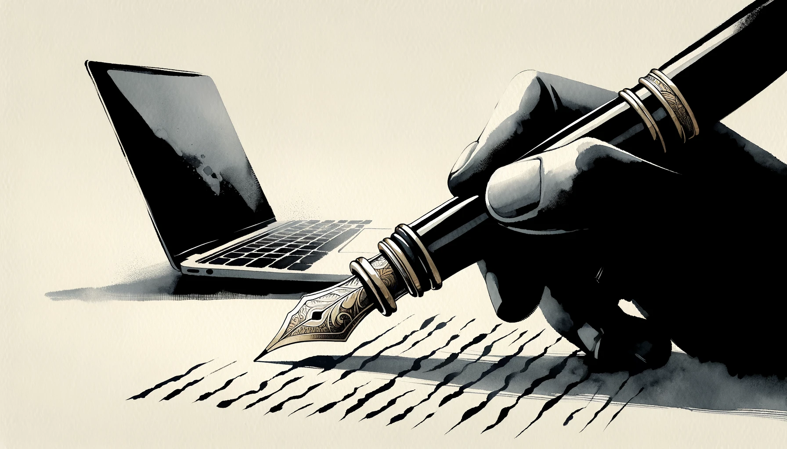
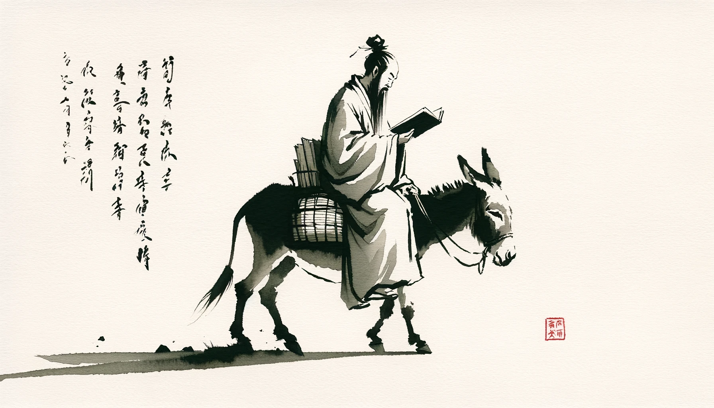

# 【随笔】书写的快乐

最近发掘了一项新的「小确幸」——那就是给大宝写信。

早在几个月前，看大宝和她的好朋友用纸笔写信，就觉得颇为羡慕。看着她在某个周末早起，把在电脑上起草好的信件一笔一划、一个字一个字儿的誊写在纸上。然后扫描下来，再用电子邮件发送给对方。接着就等待着某一天，对方会再次回一封手写，然后扫描过来的信件。很喜欢这样一种：慢下来，静下来，为远方的某个人书写；然后再默默期待着对方也同样为自己书写的感觉。

于是，这次出差，终于逮到了名正言顺的理由，于是我也可以拿出纸笔来，给大宝好好写写信了。

上一次用纸笔写信，已记不清是什么时候了。从2月22日起到昨天，已经给大宝写了三封信。每次回信前，内心里常常已经酝酿了许多想要说的话。然而，由于第一封信洋洋洒洒写了5张A4纸，被大宝吐槽太啰嗦，说看起来好累，再不敢多写。动笔之前，总会再次打开大宝的最后一封回信，仔仔细细再读一遍。虽然之前已经读过多遍，然后才着手在电脑上开始打草稿。

以前写信，都是提笔就在纸上开始写。但这次不同，因为我们大宝想用古文来写信。我还专门为自己创建了一个GPTS，把苏轼的《前、后赤壁赋》都输入进去，好让它用苏轼的文风来把我的草稿改写为古文。虽然GPT并不太能够准确把握苏轼的文风，但至少它的古文水平比我要好太多。我在电脑上啰哩啰嗦700多字，被它一动手裁减修改，就变成了300多字精简漂亮的古文。再修修补补，最后估摸着有差不多两页纸的长度，我就开始动手誊抄到白纸上。

我拿出两张A4打印纸，把他们折上个4、5次，再打开，然后在折痕的空档书写，以便写得整齐一点。对了，大宝还让我不要用行草，免得潦草的繁体字太难辨认，我便尽量用正楷，心中一边默念着文字，一边一笔一划地写开来。有时遇到不常见的繁体字，还要放大了细看，才知道那复杂的笔画究竟是如何构成。然后看着被GPT4修改过的那些朗朗上口，铿锵有力的古汉语文字，从钢笔尖流淌下来，慢慢写满一张、又一张白纸，颇有些自得。

最后，用苹果手机的备忘录里扫描文档的功能，把这两张手写的白纸弄成PDF文件。再打开Gmail把这文件当作附件，写一封Email给大宝的电子邮箱发过去。

再想想，不久之后，几千里之外，大宝同样坐在桌前，一个字一个字儿给我回信时的情景，更是觉得温馨而快乐！

快有快的好处，慢有慢的快乐。

况且用了GPT，虽然离东坡先生这样的大文豪还颇有差距，但当一个普通的书生，怕是足够了呢。