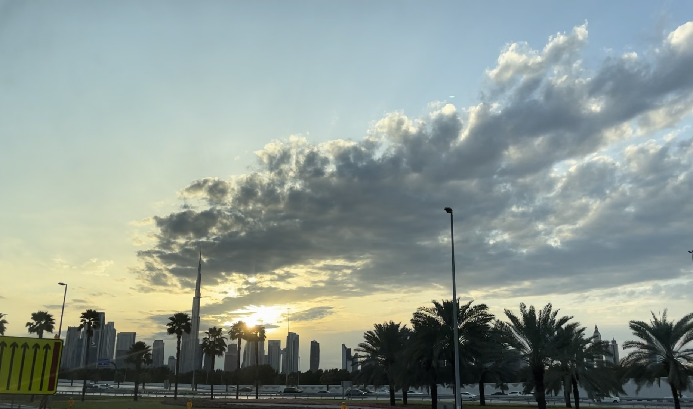
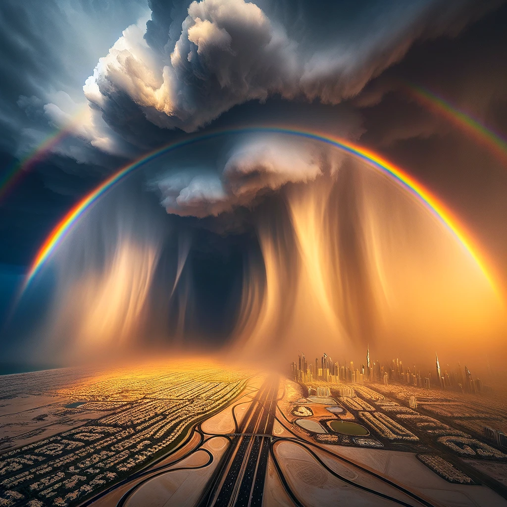

# 【随笔】迪拜的雨

飞机落地迪拜时，着实让我惊讶到了。从廊桥的窗户看出去，机场地面竟然湿漉漉的，而且不是前两天在沙特见到的那种一点点雨滴，大致上被润湿的地面。是一场真正的大雨洗礼后的地面，机场的飞机、各种车辆也挂着闪闪发光的水珠，在水灵灵的路面上缓缓地穿梭。

记得前两天沙特略略下雨时，就收到沙特国防部发出的短信：

> God make it rain of goodness and blessings and spread it to benefit all parts of the country.
>
> 真主降下恩惠和祝福的雨，让它普惠国家的每一个角落。

看起来，迪拜这次得到了更多的恩惠与祝福，谁让它更靠近大海一些呢：）

迪拜人民，包括建设迪拜的人民显然没想到过这座城市会遭遇这种量级的雨水（虽然，这在我们看来，仅仅是一场普普通通的大雨而已）。我们在机场等了近一个多小时，也没能等到出租车，据说到处积水，交通堵塞得厉害。无奈，我们只好转头去租车，终于找到一家公司，它们的汽车就停在机场，办好手续就可以立即出发。

出机场的好几段路都有不少积水，眼见那些本地的司机们小心翼翼地开着车沿着路边挪动，或者干脆停下来。我们一面哈哈笑他们没见过雨，一面降低速度，从积水中稳稳地超了过去。

这时，雨已经停了。天空如同被洗过了一般，格外清澈。太阳刚好开始西沉，在高楼大厦的缝隙里，一闪一闪地发出着金色的光芒。还未散去的云层，在夕阳的照耀下，把天空布置得格外美丽。呼～，远处城市里，那座尖尖的建筑，就是著名的[哈利法塔](https://zh.wikipedia.org/zh-hans/哈利法塔)吧。

> 看！彩虹！！！

听到朋友的呼喊，我连忙转头看向车窗的另一边。果然，一抹浓艳的彩虹🌈出现在天地交接处，或许是因为云层只有那么高吧，彩虹只显出一段段段的弧线，但是特别宽。除了在动画片里，我还从来没见过这么宽的彩虹，就好像是一片七彩的幕布一般。铅灰色镶着金边的云层，被雨水洗过清凉闪光天与地，再装饰上这片幻彩的幕布，真的不禁开始怀疑，有那么一个神，正在赐福这片大地，正在赐福我们这些此时此刻、身处此地的渺小人类。

只可惜，拿着手机怎么拍照也捕捉不到这明明肉眼清晰可见的美景，而自己的文字功夫更是捉急，怎么使力也不能把那时的感觉，表达出百分之一。

想到这一年下不了几次雨的地方，也能遭遇这样的大雨与彩虹。或许一切早已变化，未来百年，这个地球绝不再是那上一个百年的地球了！

