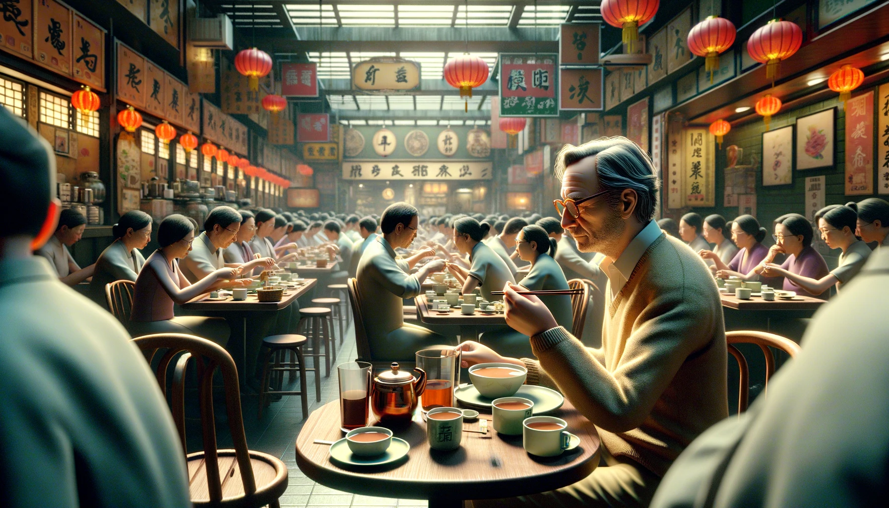

# 春天到了，香港又变得寒冷起来

有时想不起应该写些什么，更不知道应该为这篇文字起个什么题目。于是对着空白的电脑屏幕，不知不觉就发了5分钟呆。记得白天曾有那么一瞬间，在脑子里构思今天应该写的题目。当时正在香港的地铁上，地铁上嗖嗖的空调冷风吹着。我不由得拉上连帽衫的拉链，然后又带上了帽子。身上的汗水似乎还没干，更觉得凉飕飕的，忍不住咳嗽了几声。脑海里不禁蹦出了这么一句话：

> 春天的太阳出来了，天气才刚刚转暖一点，香港就又变得严寒起来。

出了地铁，看到路边一个茶餐厅，外墙正在装修，还立着一面大大的牌子，上面写着：

「外墙装修，XX茶餐厅正在营业」。

走过去，还没进门，就有个阿姨迎了上来，问明白我几个人，便把我引到里面靠墙的卡座上。座位对面还坐着一个女人，正吃着东西。桌子正中竖着一块透明塑料板，把我们两人隔开。想必是疫情时期留下的东西，塑料板上方印着一些文字，正好挡住眼睛，不至于两人近距离干瞪眼，太过尴尬。

我点了份公仔面，一份菠萝油烤面包。还在等着的时候，对面就已经换了一个人。她叫的是一份带奶茶的套餐，奶茶很快就被端了上来。隔着塑料板，我默默地看着她一会儿刷刷手机，一会儿拿起奶茶的杯子喝一口，直到我的烤面包和公仔面被端上来。面包烤得喷香酥脆，金黄诱人，抹着炼乳，看起来颇为爽口，一口咬下去，嘁哩喀喳地直掉渣。要不是桌子和地面看起来不那么干净，我都很不得把掉落桌子和地面的面包渣捡起来吃掉。沙爹牛肉公仔面也挺香的，虽说就是方便面的味道，但那一勺沙爹牛肉为整碗面增色不少。

只可惜，这里的氛围不适合久坐。吃完了还坐在这小角落，再看着来往热闹的客人，热情张罗的阿姨，总觉得欠店家点什么，于是连忙起身结账。或许还是只有麦当劳、星巴克这样的地方，适合坐下来，慢慢写点东西吧。

