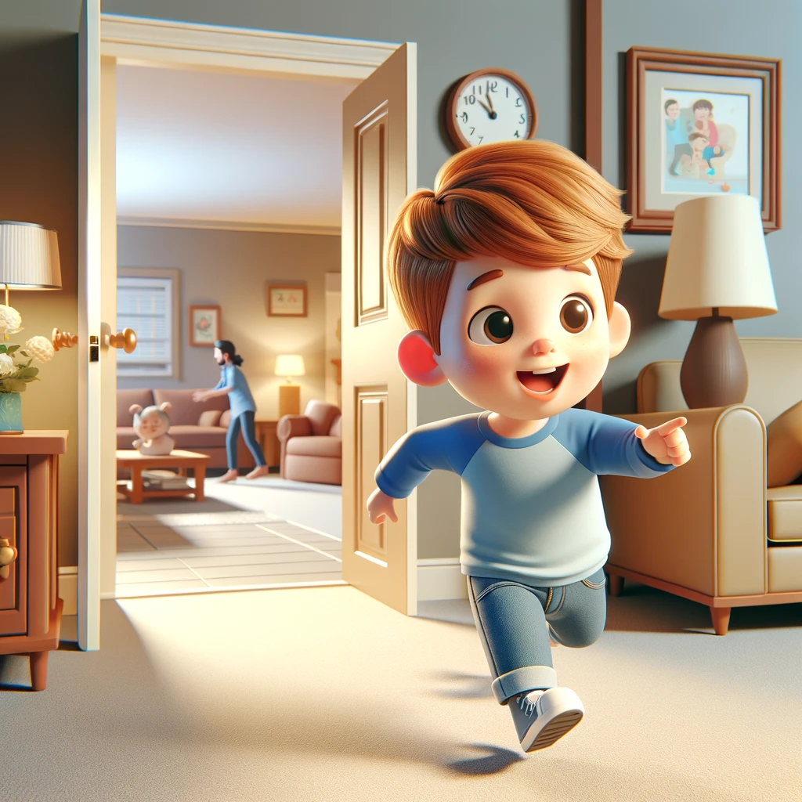
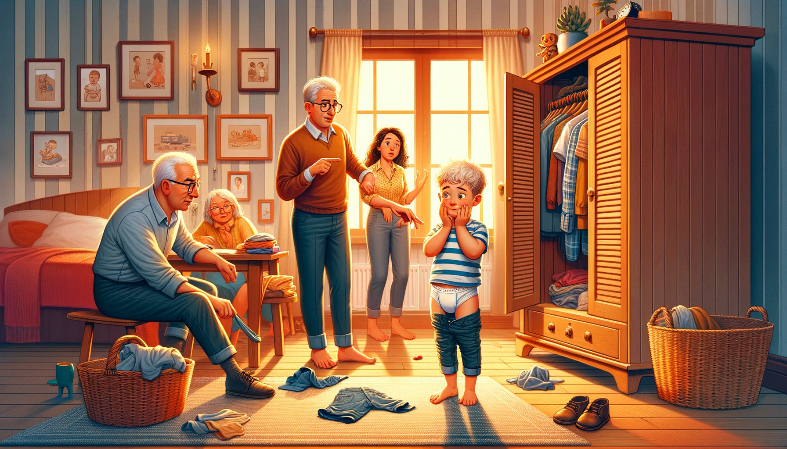

# 【随笔】明天不洗澡——大鱼趣事儿

晚上，我正躲在卧室角落里企图赶紧把工作处理完，大鱼从外面屁颠屁颠儿地跑了进来：

> 我的裤子尿湿了！我要把他换掉……

爷爷跟在后面问：

> 谁给你找裤子啊？

大鱼说：

> 我呀，我要把他换掉……

他一遍说着，一遍在衣柜里翻找起来。大宝在一边指点着：

> 这些是衣服，都不是裤子……

最后，实在忍不住，一把将裤子已经脱到脚踝，光着屁股的大鱼抱了起来：

> 你的裤子尿湿了，要不要打屁股？

大鱼认真地说：

> 不要！

大宝说：

> 裤子都尿湿了，赶紧让爸爸给你刷牙洗脸睡觉吧？

大鱼大声说：

> 不要，我还要玩……
>
> 但是，我要洗澡！

我问他：

> 妈妈不是说了，今天不用洗澡吗？昨天洗过了的。

大鱼有点困惑地问我：

> 今天是什么天？
>
> 今天是不是明天？

我笑了：

> 今天就是今天啊，今天不是明天，明天是明天。

大鱼释然：

> 明天不洗澡，
>
> 今天要洗澡！

哈哈～ 昨天就是这么和他说的，昨天给他洗澡的时候，妈妈说：

> 今天洗澡了，那明天就不用洗澡了。

他可是答应得好好的。闹了半天，他根本就没弄明白今天、明天到底是什么意思。

难怪刚刚要和我仔细确认：**今天是什么天？今天是不是不是明天？**既然今天不是明天，那么今天就又可以洗澡咯。毕竟答应妈妈的是，「明天不洗澡」，不是吗？