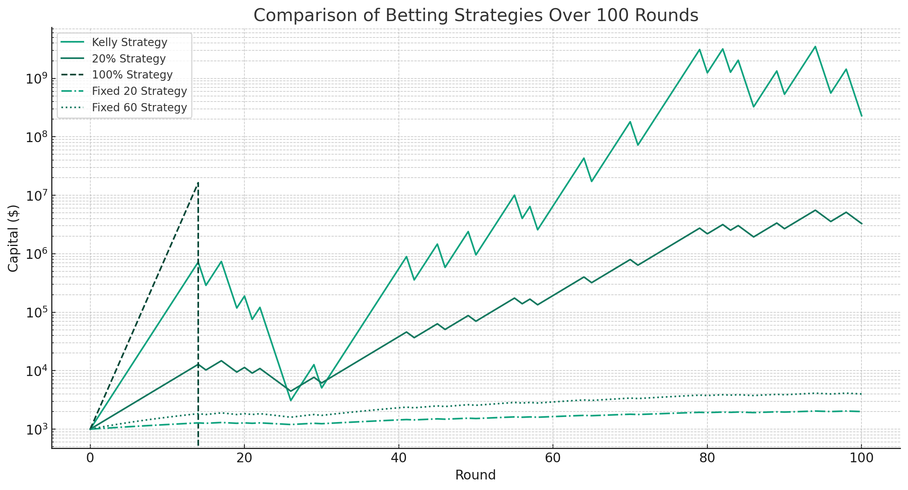

# 【教程】再详细聊聊史上最重要的财富公式（一）

财富也有公式吗？还真有的！那就是著名的「凯利公式」，它又被叫做凯利准则、凯利策略、凯利方程（Kelly criterion、Kelly strategy、Kelly bet……）。如果想要真正**科学地**进行投资或者投机——这是你需要掌握的第一个，也是最重要的一个公式。

就在前两天的文章里，我在使用凯利公式来计算投资仓位时，出现了一个简单但是严重的错误。不知你发现了没有，具体怎么错了，容我先卖关子。这件事儿说明：

哪怕是像凯利公式这么简单的数学公式，想要实际应用时，还是需要：

1. **深刻的理解** 
2. **相对扎实的数学功底**
3. **足够的仔细与小心**

索性，我试着从源头再好好捋一下，这个被誉为「财富公式」的数学公式是怎么一会事儿。说到这儿，先插播一段忠告，如果有人和你说：

> 我们背后有数学团队，已经用**「凯利公式」**研究了一套必赢的方法。
>
> 跟着我，一起赚大钱！

**拉黑他/她/它**，这是谋财害命的骗子！重要的话说三遍，拉黑！拉黑！！拉黑！！！

好了，说回正事儿，让我从最初的源头讲起……

## 1. 源起——男神克劳德•香农

**克劳德·艾尔伍德·香农**（英语：**Claude Elwood Shannon**，1916年4月30日—2001年2月24日），美国数学家、电子工程师和密码学家，被誉为[信息论](https://zh.wikipedia.org/wiki/信息论)的创始人。

这段从维基百科[克劳德·香农](https://zh.wikipedia.org/wiki/%E5%85%8B%E5%8A%B3%E5%BE%B7%C2%B7%E9%A6%99%E5%86%9C)条目的开头看似平平无奇，却是至高的评价：

* 没有香农这个人，很可能就没有「信息论」
* 没有「信息论」，很可能就没有现代通信网络，没有手机、没有互联网，没有iPhone，没有微信，没有抖音……

你能想象这样一个没有**克劳德·艾尔伍德·香农**世界吗？

## 2. 德州野人——约翰·拉里·凯利

二战期间，香农加入了贝尔实验室。1948年，香农发表了《信息论》。

大约1953年左右吧，在贝尔实验室的香农给自己招了个助手——[约翰·拉里·凯利](https://zh.wikipedia.org/wiki/約翰·拉里·凱利)。

这位凯利，他在得克萨斯州出生，二战期间当了四年飞行员。加入贝尔实验室时凯利大约30岁。很快，他就被同事称为是贝尔实验室第二聪明的人（第一聪明当然是香农了），也有人称他作"野人"，也许是因为他的得克萨斯口音，也许是因为他的疯狂与不务正业。比如，他是个老烟枪；比如他喜欢超爱玩枪，家里除了各种枪，甚至有制造子弹的设备；传说他总是聚会的灵魂人物；他和妻子是桥牌锦标赛的灵魂玩家；他还曾经开着飞机，疯狂地从华盛顿大桥下面钻过去。

就在凯利研究电视信号压缩算法时，他又开始不务正业了。当时，正好有一档名为《$64,000 问题》的电视答题节目特别火，以至于有人拿这个节目开了赌局，赌最终哪个选手能够获得最终的胜利。因为美国东西海岸有时差的缘故，这档节目在东海岸是实况播出，在西海岸则是3小时后播放录像。于是，他异想天开地想到，香农《信息论》中关于信噪比一些理论和方程式，可以用来在这种赌局中作弊，并最大化收益。

一番研究之后，凯利公式出炉了……

## 3. 凯利公式讲了什么

我们可以尝试简化一下这个赌局，来理解一下上面这个看来不算复杂的凯利公式到底讲了什么？

假设这是一个猜硬币的赌局。赌注是一块钱，赔率是2，猜对了赢一块钱，猜错了输掉赌注，也就是一块钱。

但由于时差，可以打长途电话作弊提前透露结果，所以猜对的概率不是50%，而是80%（考虑长途电话通话效果，也就是所谓信噪比，可能有20%的概率听错了导致还是会输）。

那么，在这种情况下。每次应该怎么下注呢？

每次都压上全副身家肯定不行，赢的时候虽然爽，但只要输一次（而且因为要持续参与，迟早会输的），就血本无归。那么保险起见，每次少少压一点，又赢得太慢？

**一个已知赔率和输赢概率的长期赌局，每次要怎么下注，才能保证长期收益最大化？**这，就是凯利公式要回答的问题。

- *f*∗ 是每次投注的最优比例（即应该投入总资金的比例）。
- *b* 是每次赌注的净赢率（赔率减1）。上面这个例子里，b=1
- *p* 是获胜的概率。上面这个例子里，p=0.8
- *q* 是失败的概率，也就是1-p，上面这个例子里，q=0.2

所以，想要最大化收益， *f*∗ = （1*0.8 - 0.2 ）/ 1 = 0.6，也就是，每次应该拿出全部资金的60%来下注。

上图，是用计算机模拟了100轮不同策略的投资结果。显然凯利策略是收益最大化的。而更加激进的孤注一掷策略，早早就归零出局了。

香农对凯利的这个不务正业的研究大加赞赏，在他的鼓励下。这篇[论文](https://web.archive.org/web/20130805154314/http://www.lucent.com/bstj/vol35-1956/articles/bstj35-4-917.pdf)在1956年的《贝尔系统技术期刊》发表了。当然，发表时，为了不太惊世骇俗，编辑把论文的题目从原来的《Information Theory and Gambling 信息论与赌博》改成了《A New Interpretation of Information Rate 信息率的一种新解释》。如编辑所愿，这篇论文果然没引起什么人的注意。

虽然发明了这个神奇的财富公式，凯利自己却无缘用它来发大财。他在1965年就因为脑溢血去世了，去世时才41岁。

真正把这个公式加以应用并带入大众视野的，是另一个人。

## 4. 横扫赌场的科学家赌徒——爱德华·索普

<待续>