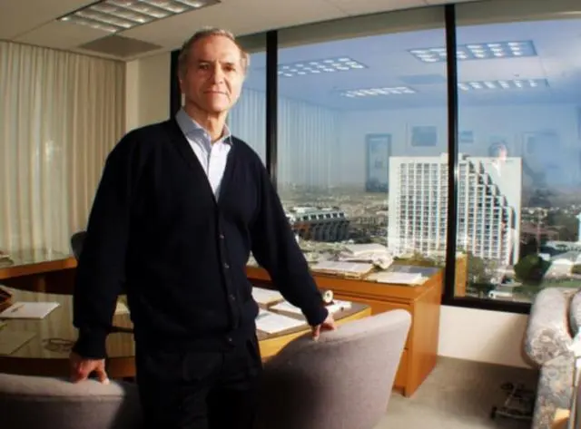
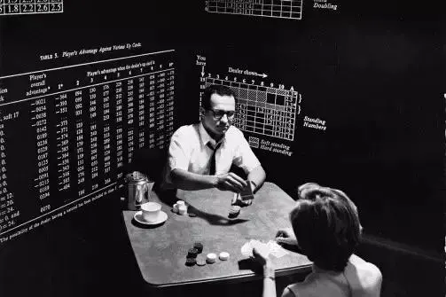
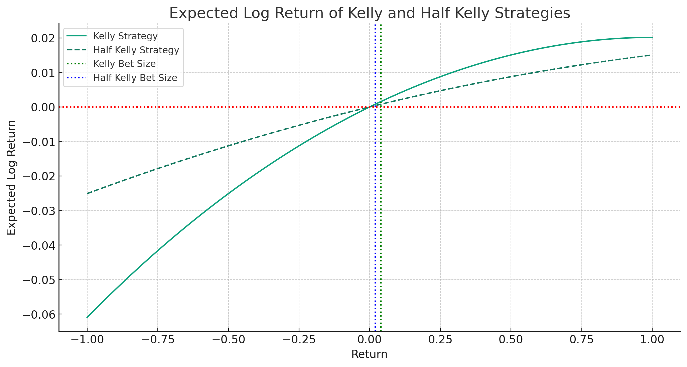

# 【教程】再详细聊聊史上最重要的财富公式（二）

接着上次继续聊，这个把凯利公式带入大众视野，并真正用它赚足财富的人。

## 4. 横扫赌场的科学家赌徒——爱德华·索普

[爱德华·索普](https://zh.wikipedia.org/wiki/%E6%84%9B%E5%BE%B7%E8%8F%AF%C2%B7%E7%B4%A2%E6%99%AE)在量化投资领域的名头，可谓是如雷贯耳。就好像香农在通信、信息领域的地位一样，索普也被人称为量化投资之父。他出生在1932年美国大萧条时期，并且，显然是那种天才、神童级别的聪明人。还在读高中时就因为入围西屋科学天才奖的40人名单，受到了杜鲁门总统的接见。 

后来博士毕业，大约1959年-1961年期间，索普在麻省理工学院当客座教授。也就是在这里，他认识了贝尔实验室的香农。香农大约是和他臭味相投，听说他在利用职务之便，研究怎么用学校的IBM 704计算机写Fortran程序玩21点，便把凯利的那篇[《信息论与赌博》](https://web.archive.org/web/20130805154314/http://www.lucent.com/bstj/vol35-1956/articles/bstj35-4-917.pdf)推荐给他。

然后，香农甚至还和他一起合作，制造出一台小型计算机，用来计算21点的概率。这估计是最早的可穿戴设备吧。于是，凭着凯利公式与计算机的威力。索普找了个职业赌徒做合伙人，据说只拿着1万美金，仅用一个周末，就横扫了拉斯维加斯的各大赌场，赚了1万1千多美金回来（搁现在按黄金价格折算，这可是至少价值50万美金的大钱啊）。

薅赌场羊毛赚钱也就算了，索普回头就写了一本畅销书——**《战胜庄家》**，把自己的研究成果和薅羊毛经历全都发表了出来。一时间，被众多赌徒奉为「葵花宝典」。这可把各赌场老板气坏了，一边着手改变21点的规则，一边对索普进行肉身封杀，不许他进赌场赌博。

索普一开始还继续乔装打扮去赌场过过赌瘾，后来猫捉老鼠的游戏玩腻了。他索性投身更广大的舞台——「华尔街」，开始研究金融市场，一面研究，一面写书，一面赚钱。凯利公式，始终是索普的赚钱体系中，最基础也是最重要的一环。

据说，香农和他的妻子也和索普一起，用凯利公式，在投资市场赚了个盆满钵满。

## 5. 凯利公式我们要怎么用

凯利公式来源于博彩，其中有几个关键假设：

1. 无限次博弈。
2. 赔率已知，输赢概率已知。

而在真实世界里，这两个条件，都不是那么容易满足。巴菲特和芒格，都被人询问过用不用凯利公式。巴菲特每次都顾左右而言他，芒格倒是正经回答过这个问题：

> 我们不会使用任何会计公式来决定投资的规模。凯利公式只是在你不断重复投资的情况下有效，因为我们很少出手，所以这个公式不适用。凯利公式在赌博中行得通，但对我们这种风格的投资无效。凯利公式是一个正确的公式，但只针对某些类型。

但仔细研究巴菲特与芒格的讲话、文章，你会发现，他们其实还是在用凯利公式背后那最核心的理念：

1. **现金流为王，始终保有可投资的现金。**
2. **1美元的彩票也不会买。**
3. **真正的机会来临时，要下重注。**

为什么芒格说不用凯利公式呢？我想那是因为，他的观点一向是——模糊的正确好过精确的错误！他可能觉得，需要把主要精力放在怎么做出正确的价值判断上，而不是精确判断仓位上吧。

至于量化之父爱德华·索普。他明确地说过，自己在用的是半凯利准则，也就是说，当凯利公式算出来要投50%的资金时，他只投资25%而已。我想，这也是一种安全边际吧。通过下图能看出来，半凯利策略能显著下降亏损波动，但整体回报只是有所下降而已。

所以，如果不想做过多的计算，凯利公式的用法很简单，参考芒格的做法，这里再重复一下：

1. **永远不要孤注一掷，要一直有钱投资。**
2. **不赚钱的事儿，1分钱也不投。**
3. **等待好机会，机会来临下重注。**

至于什么是好机会，需要投入主要精力学习！

至于重注是多重，凭感觉吧，不违背**规则1** 就行。

如果想要用上凯利公式来计算投资仓位，那么可以参考索普的「半凯利准则」。或者，接下来等我探讨一下我自己把凯利公式用于金融证券投资的思考和做法。

<待续>