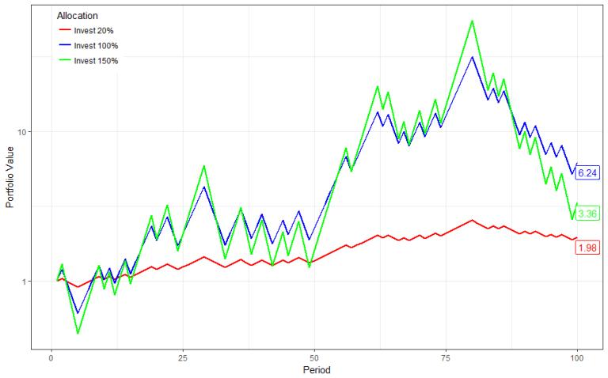
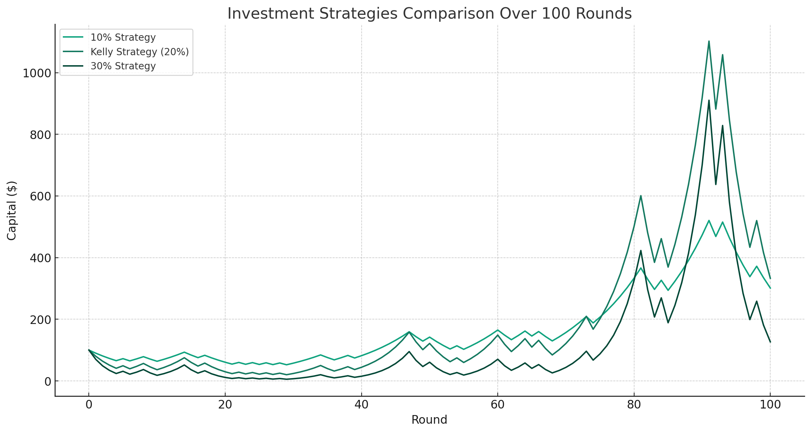
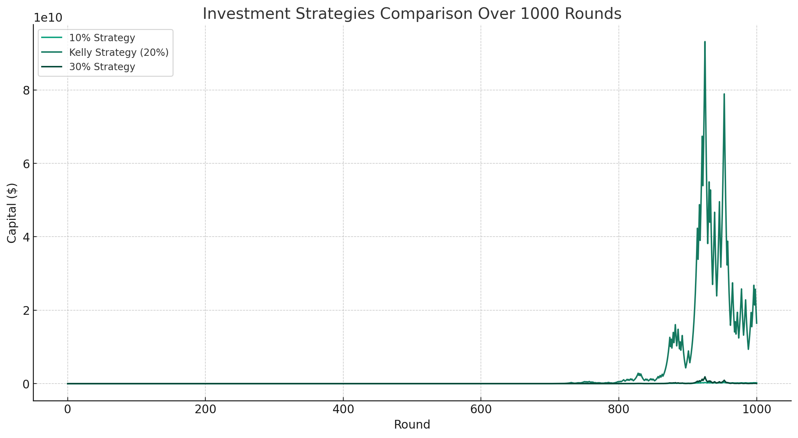

# 【教程】再详细聊聊史上最重要的财富公式（三）

上次聊到了任何普通人，甚至无需计算就可以使用凯利公式的最简单用法：

1. **永远不要孤注一掷，要一直有钱投资。**
2. **不赚钱的事儿，1分钱也不投。**
3. **等待好机会，机会来临下重注。**

至于什么是好机会，需要投入主要精力学习！至于重注是多重，凭感觉吧，不违背**规则1** 就行。

## 6. 应用凯利公式的常见错误

但许多人（包括我在内），都忍不住地会想像索普那样，用凯利公式计算一下自己的投资仓位。遗憾的是，我的数学并不好，一不小心就会用错。这几天在网上随意翻看了一些有关凯利公式的文章，发现大量的「普通人类」和我一样，会犯类似的，或者其他的错误。

### 错误一：公式搞错，忘记除以净盈率了

比如，今天在公众号上翻到一篇名为《神奇的凯利公式》的文章，说凯利公式是：

`f* = p/c - q/b `

在它这个版本的公式里，引入了一个新的变量c。

`c：如果失败的话，损失相对于本金的比率`

原版的凯利公式是在简单的赌局规则中推导出来的，输了就损失所有下注的本金，并不存在只输百分比的概念。为了套用股市规则，直接引入这个变量，然后套用凯利公式，会导致结论完全错误。比如文章里这么说：

> 但假如是这个结果，比方说，f=80%\*10-20%\*1=700%呢？
>
> 也就是80%的概率能赢，赢了人家给你10块；只有20%的概率会输，输了只输1块，算出来下注比例应该是7，也就是700%。
>
> 这是什么意思？仓位可以大于100%吗？
>
> 当然可以，这个意思就是说，这个生意太好了，值得借钱融资来下注。

这当然是错的！凯利公式的基本模式是这样的：

根据文章里假设的这个概率，f* 计算如下：

`f* = (80% * 10 - 1) / 9 = 7 / 9 = 88% `

错在哪里了呢？显然，文章中那个公式的变体忘记除以净赢率了。

其实，只要记得凯利公式的来源，或者哪怕是那个基本结论——**永远不要孤注一掷**，就能一眼发现这个错误。但，遗憾的是，大多数人不能，包括我自己。记得在教程刚开始时，我提到自己使用凯利公式来计算英伟达股票投资仓位时所犯的错误吧？

放在股票投资上，凯利公式的变体其实应该是这样的：

***f*∗=  (*b1p1*+*b2p2*+...+bnpn) /  *b~max~***

* bn 是每种情况下的收益
* pn 是每种情况发生的概率
* b~max~是最大收益

最后，记住！最后要除以b~max~，但我在之前文章里进行计算时，却把这么重要的一步给忘记了。 我错误地算成：

`f∗ = 1.92 * 50% * 80% + 0.46 * 50% * 20% + 0.46 * 50% * 80% - 0.27 * 50% * 20% = 0.768 + 0.046 + 0.184 - 0.027 = 97.1% `

但实际上，应该是

` f* = (1.92 * 50% * 80% + 0.46 * 50% * 20% + 0.46 * 50% * 80% - 0.27 * 50% * 20%) / 1.92 = （0.768 + 0.046 + 0.184 - 0.027 ) / 1.92 = 50.6% `

### 错误二：把融资的情况混为一谈

其实，上面那篇文章里，还隐藏了一个大家常犯错的地方，就是把融资的情况考虑进去了，并且是错误地混淆了进去。最典型的，就是澎拜新闻的一篇文章里这么说：

> 凯利公式在很多实际投资中并不是必赢的，甚至也不是收益最大的。
>
> 有学者做了一个简单的投资模拟，假设有一个投资有60%的概率涨20%，同时有40%的概率跌20%，总体的期望收益率达到4%，算是不错的投资。
>
> 套用凯利公式后，得出最佳的投资比例为资金的20%，进行100轮模拟交易后，所得为初始资金的1.98倍，而投资100%和拉了150%杠杆的模型分别为6.24倍和3.36倍。

很唬人，是吗？**但他是错的！凯利公式是对的！**

我们注意看，按照假设，用凯利公式计算出来，最佳投资比例为20%。但是，凯利公式的假设其实是不考虑融资情况。如果可以融资，且融资成本为零。那么上面这个假设可以等价于这样的变体：

* 融资400%：60%的概率赢每次下注金额的20%，40%的概率输掉下注金额的20%。用凯利公式计算，F* = 0.6 * 0.2 - 0.4 * 0.2 / 0.2 = 20% —— 注意，结论依然是20%，但是这是融资400%后，5倍本金的20%。相当于原始本金的100%。
* 融资900%：60%的概率赢每次下注金额的20%，40%的概率输掉下注金额的20%。用凯利公式计算，F* = 0.6 * 0.2 - 0.4 * 0.2 / 0.2 = 20% —— 注意，结论依然是20%，但是这是融资900%后，10倍本金的20%。相当于原始本金的200%。

可以无限推导下去，无论你可以融资多少，F* 都是融资后金额的20%。事实上问题在于——你融资后，最多允许向下波动多少，才能不爆仓呢？

所以，上面这张图，对比的根本不是凯利策略与其他仓位策略的投资收益期望。

假设，我们每次融资规则上限的是400%（这样跌20%后本金全输光）。那么，这个假设相当于60%的概率赚100%，40%的概率亏100%。基于这个条件，初始资金100元，用计算机模拟100轮，对比一下不同的投资仓位策略：

* 10% 策略：每次投入当前资金的10%；
* 凯利策略（20%）：每次投入当前资金的20%；
* 30%策略：每次投入当前资金的30%；

以下是100次的模拟结果：

我们看到，10%策略非常稳健，但是增长率略低低。而凯利策略波动虽大，最终还是获得了最高的增长率。而且，我们会留意到，其实30%的策略曾经一度非常接近归零。

索性再模拟1000次，这样更接近凯利公式假设条件中的「无限次博弈」：

图上几乎看不清10% 和 30%的投资曲线了，假设初始投资是100元，我们把最终结果打印出来看一看：

- **10% 策略**：约1.87亿
- **凯利策略（20%）**：约164.61亿
- **30% 策略**：约3.97亿

好彩30% 策略并没有归零，但在复利的威力下，凯利策略的投资增长遥遥领先！

所以，凯利策略确实有不适用的条件，但并非不适用于融资，千万不要像澎拜新闻的那篇文章一样，把这些概念混淆到一起了。不管你融资还是不融资，凯利公式给出的比例都是一样的！

而如果你有零成本（或足够低成本），长期（10年、20年接近无限期）的融资杠杆，当然是杠杆越大，赚钱越多了！只不过，现实世界，这是几乎不存在的事情（也许伯克希尔从自己投资的保险公司那儿拿到的现金除外吧……）

<待续>
