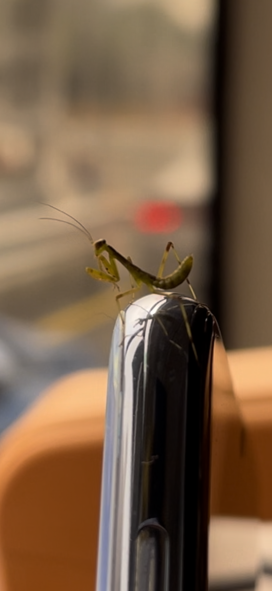
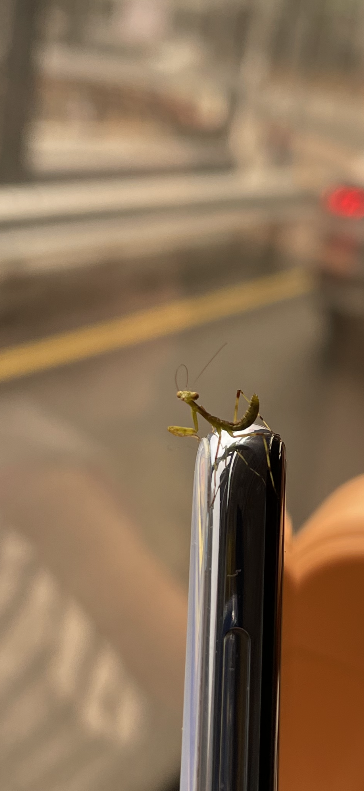

# 【随笔】一只蚊子大小的螳螂

那天早上，陪着大宝和大鱼去了一趟荔香公园，回来时坐上公交。大宝找了个靠窗的座位抱着大鱼坐下，我把背包放在他们脚边的地板上，站在一边。车开动了，我忽然发现大宝的头发上沾着一点绿色的草屑，便伸手想把它弄下来。谁知道，我手刚一靠近，那草屑就自己动了，敏捷地蹦到了我的手指上。

是只虫子！我正想把它捏死，举起手来，却发现它也正转过头来，警惕地看着我。四只脚张开，有力地抓住我的皮肤，手里两把镰刀，交叠着，一前一后收在自己怀里，侧身对着我，一副随时要出招的武林高手模样。竟然是一只螳螂，只有蚊子大小的，绿色的小螳螂！于是，我瞬间心软了。不但放弃了想要捏死它的打算，甚至也不放心把这小家伙扔在公交车里，或者车窗外的马路上。这么小的家伙，虽然一副《功夫熊猫》里螳螂师兄那武力值拉满的架势，但个子实在太小了，看上去比蚊子还要脆弱。在公交车上，或者马路上，怕是活不了多久呢。

于是，我由着它从我手指一路爬行到胳膊。担心它爬到我看不见的地方受伤，我又用另一只手拦住了它的去路。它也毫不犹豫地爬上了我另一只手，然后再次一路往胳膊上狂奔。这时，大宝背后的座位空了出来，我趁机坐下。换用手机拦住它前进的方向。它依然毫不犹豫地爬上了我的手机。

这次，在手机的顶端，它停留了好一会儿，转着三角脑袋，四处打量了好一番。也不知以它的视力，能否观察清楚车窗外车流滚滚的马路，以及车厢里这个奇怪的人类。然后，它再一次顺着手机往我的手上，胳膊上爬了过来。然后，再一次被手机拦住，再一次爬上手机。

如此这番，至少3、4次之后，它终于对手机产生了巨大的困惑。当手机再一次拦在它面前时，它犹豫了。它可能在想，这条路好像来过，怎么又到这里了，大概率是迷路了！它掉头想寻找别的通路，但是没有，不论往哪个方向，都是这个触感奇怪的玩意儿挡住去路。它只好犹犹豫豫地再次爬上了手机。站在手机的顶端，它惶惑无比。

但没过太久，它又开始缓慢、但是坚定地往手机下方、有我手的方向爬起来。直到又一次回到手机的顶端。然后歇了歇，开始下一次跋涉。

终于，到下车的时候了。

我一手拎起背包，一手举着手机顶端的螳螂，三步并作两步下了公共汽车。开始环顾四周，看看有没有合适的放生环境。公交站旁边是绿化带，然后是人行道，人行道的另一侧有着更密集的树丛。

> 就是这里了！

我心里想。大宝也说道：

> 嗯。在这里，它应该能好好活下去吧！

小螳螂发现了手机尽头的树叶，欢快地爬了上去。然后停在那里，左顾右盼地，让大宝给她拍了好几张照片。接着，就爬到了树叶后面、树丛深处！

我们一面离开，一面忍不住好奇了好一会儿——这只小家伙接下来的生命中，又会有些什么样的历险呢？