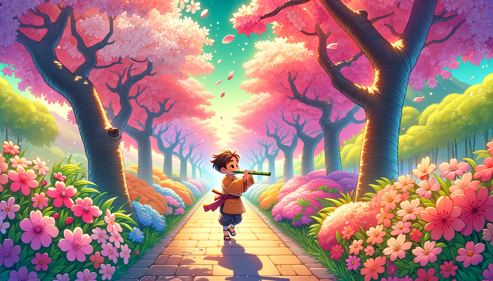

# 【生命•故事】（112）生命中第一支笛子

不记得是小学还是初中了，有一年春天，母亲特意带我去武汉大学玩。正是樱花绽放的季节，我依稀记得，走在樱花灿烂的校园大道上，我小小的，两旁是高大的樱花数，路显得特别宽。妈妈对我说：

> 要好好学习，以后可以上这样的大学。

我认真的点头。

母亲有一个同学住在那边，我们就到那个阿姨家里玩。在她家翻箱倒柜捣蛋的时候，我发现柜子上方，有一支淡黄的竹笛。我颇为好奇，拿起来爱不释手。阿姨逗我：

> 你会吹笛子吗？

我摇了摇头。她继续说：

> 试试看，你要是能吹响，我就把这个笛子送给你。

于是乎，我学着《射雕英雄传》电视里黄药师的模样，把笛子横过来放在嘴边，轻轻吹了一下。那气流震动的感觉和吹瓶子好像也差不太多。于是，我又调整了一下方向，使劲一吹，笛子竟然就发出了悦耳的声音。阿姨很高兴，发现我竟然真的能吹响。

问了我才知道，这是我第一次吹真正的竹笛。于是，她大方的表示，这只笛子送给我了。然后，还给了我几张笛膜，教会我怎么贴笛膜。我开心坏了，后来捧着那支竹笛蹦蹦跳跳地回家。

母亲给我买了一本吹笛子的书，我也心血来潮地照着书练习了好一阵子。可是，始终没学会吹完整的歌曲。慢慢兴致也就没了。只不过，那笛子一直放在我住的阁楼上的五斗柜上。偶尔大扫除，我还会把它再次擦拭干净，贴上笛膜，然后吹个Do Re Mi。

接着，再想象一下，假如我学会了吹笛子，就像「东邪」黄药师那样帅，该有多好！

