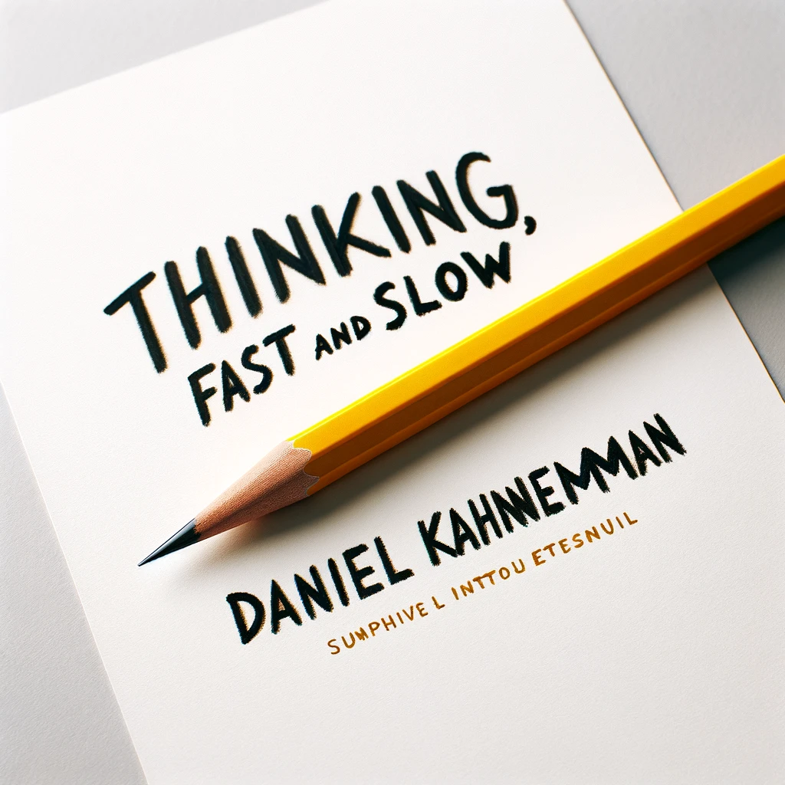

# 【随笔】缅怀丹尼尔•卡尼曼

前几天在网上看到丹尼尔•卡尼曼去世的消息时，只觉得这个名字怎么这么眼熟。今天才意识到，原来是《思考，快与慢》的作者，2002年诺贝尔经济学奖获得者[**丹尼尔·卡尼曼** 教授](https://zh.wikipedia.org/wiki/%E4%B8%B9%E5%B0%BC%E5%B0%94%C2%B7%E5%8D%A1%E5%B0%BC%E6%9B%BC)去世了。

我使劲开始回忆关于教授的点点滴滴。进入脑海的画面，却只是《思考，快与慢》封面上那一支铅笔。读这本书的时候，应该还是买的纸质版。当时应该有在豆瓣上写读书笔记的习惯，也不知道为这本书写过些什么。到豆瓣上搜索，才发现自己原来是2007年的时候注册的豆瓣用户。可是，搜索自己发表过的内容，竟然还需要一个奇怪的什么「豆」，只好暂时放弃。

_(cropped).jpg)

最近才越发觉得，有很多经典的书，应该反复多读才是。《思考，快与慢》正是其中一本。人类大脑中一快、一慢两套思考系统总是互相配合，同步运转着。但是，我们往往觉察不到，自己当下究竟是被哪一套系统所指使着。了解自己真的不容易，但了解自己真的很重要。

也许是自己的脑子和身体都开始不那么利索了，才恍然发觉应该好好再弄明白「自己」赖以游玩于这世间的这个「交通工具」。

身体是，心也是。

然而，正如丹尼尔•卡尼曼在《思考，快与慢》中所说：

> 我们对自己认为熟知的事物确信不疑，我们显然无法了解自己的无知程度，无法确切了解自己所生活的这个世界的不确定性。

了解自己——这或许是个无法完成的任务。

但是，进一寸或有进一寸的欢喜呢？还是应该找个时间，重读一下《思考，快与慢》，以此真正地缅怀一下丹尼尔•卡尼曼教授吧。

