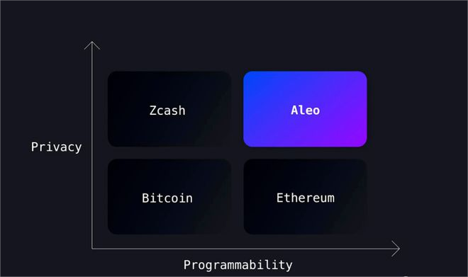

# 【区块链】Preplexity请回答：Aleo是什么？

一个朋友从马来西亚回来，颇为兴奋地和我安利 Aleo，并提到这可能是比当年Filecoin更NB的项目。很久没去了解区块链世界的新项目了，上次发现那个莫名火爆的Solana生态就已经让我困惑许久，这又冒出来的Aleo是啥呢？

我忽然想起Preplexity来，一直都习惯于用GPT学习新知识，还没怎么用过Preplexity呢。这不正好是让Preplexity派上用场的好时机吗？于是，我打开 https://www.perplexity.ai/ 问道：

> 我需要从零开始了解一下Aleo项目，帮我了解一下

说实在话，感觉因为AI的理解能力太强，最近说话退化到不清不楚的状态了——毕竟那些含混不清，有些车轱辘的话语并不影响AI理解我的意图。这次也一样，Perplexity很快在搜索后给出了答案：

> ## Aleo项目概述
>
> Aleo是一个新兴的第一层公链项目,旨在通过零知识证明技术实现隐私保护和可编程性。
>
> 它采用了独特的共识机制AleoBFT,结合了权益证明(PoS)和实用拜占庭容错(PBFT)。
>
> ## 主要特点
>
> - 第一个使用零知识证明解决隐私问题的公链项目,为用户提供完全私有的应用环境。
> - 采用创新的AleoBFT共识机制,兼顾安全性和可扩展性。
> - 支持智能合约,具有可编程特性。
>
> ## 背景和融资
>
> Aleo由前Facebook工程师Michael Vines创立,拥有硅谷顶级投资机构的支持,种子轮融资1400万美元,估值14.5亿美元。不过也有负面消息称Michael曾大量抛售私募股权。
>
> ## 挖矿和算力
>
> Aleo支持GPU、FPGA、ASIC等多种算力设备挖矿。
>
>  挖矿需要关注矿机配置以获取头矿奖励。目前尚不清楚哪种设备在Aleo上具有优势。
>
> 综上所述,Aleo是一个雄心勃勃的隐私公链项目,具有创新的技术方案,但仍处于较早期阶段,其长期发展前景有待时间检验。

基本信息还蛮清楚的，Perplexity不仅仅在答案后面给出了引用链接，还给出了我可能感兴趣的扩展问题，比如：

> Aleo项目的技术背景是什么？

我点了一下 + 号，立刻就又得到了答案：

> Aleo项目的核心技术背景是零知识证明(Zero-Knowledge Proofs, ZKP)。
>
> ## 零知识证明技术
>
> 零知识证明是一种密码学原语,允许一方(证明者)在不透露任何额外信息的情况下,向另一方(验证者)证明某个陈述是正确的。这使得Aleo能够在保护用户隐私的同时,提供可编程性和可扩展性。Aleo采用了SNARK(Succinct Non-interactive ARgument of Knowledge)这种高效的零知识证明构造,并基于此设计了自己的编程语言Leo。通过Leo编写的程序可以生成高效的零知识证明,从而实现链上的隐私计算。
>
> ## 共识机制
>
> Aleo采用了创新的PoSW(Proof of Succinct Work)共识机制,这是一种基于SNARK的PoW算法变种。PoSW通过证明工作量来达成共识,但底层计算不是哈希运算,而是生成零知识证明,从而保证了系统安全性。
>
> ## 总结
>
> Aleo项目的核心技术背景是零知识证明,尤其是SNARK这种高效的零知识证明构造。通过自主设计的Leo语言,Aleo实现了链上隐私计算。同时创新的PoSW共识机制也依赖于零知识证明技术。这些创新使Aleo在保护隐私的同时,也具备了良好的可编程性和可扩展性。

我意识到自己很可能会随着兴趣一路去了解他的技术细节，于是赶紧停下来，问了一个本应该问ChatGPT的问题：

> 我需要从哪几个角度，客观地了解Aleo项目

Perplexity 回答到：

> 要全面客观地了解Aleo项目,可以从以下几个角度进行分析:
>
> ## 技术架构
>
> 1. 零知识证明技术原理及Aleo在此基础上的创新之处。^[1][2][3]^
> 2. AleoBFT共识机制的设计理念和特点。^[5]^
> 3. Leo编程语言的功能和应用场景。^[1]^
>
> ## 经济模型 
>
> 1. 通胀模型和代币发行机制。^[1]^
> 2. 代币分配和持有人结构。^[1]^
> 3. 挖矿机制和算力需求。^[4][5]^
>
> ## 路线图和进展
>
> 1. 已完成的阶段性目标和当前所处阶段。^[1][2]^
> 2. 未来的发展计划和预期时间线。^[1]^
>
> ## 团队背景
>
> 1. 创始人和核心团队成员的从业经历。^[3]^
> 2. 投资者和支持者情况。^[1][3]^
>
> ## 行业格局
>
> 1. 在隐私计算和Layer1公链领域的竞争对手。^[3]^
> 2. Aleo项目的竞争优势和挑战。^[1][3][4]^
>
> 通过对上述几个方面的全面了解和分析,可以比较客观地评估Aleo项目的技术实力、发展潜力、风险等因素,做出是否值得投资的判断。^[1][2][3][4][5]^
>
> Citations:
> [1] https://www.chaincatcher.com/article/2091867
> [2] https://www.zhihu.com/question/546513478
> [3] https://foresightnews.pro/article/detail/44087
> [4] https://www.binance.com/zh-CN/square/post/2374513808737
> [5] https://www.fx168news.com/article/286190

这个框架还算不错，然而，顺藤摸瓜了解下去，却发现自己对于零知识证明，隐私计算领域的背景知识实在太过缺乏，然后以太坊最新关于OP Rollup和ZK Rollup的情况也不太了解，以至于依旧无法弄清楚Aleo和ETH的生态相比，优劣势如何。

一路研究下去，我终于在一篇相关链接里找到了这么一幅图，瞬间理解了Aleo的定位：

像Zcash一样解决隐私问题，像以太坊一样可编程扩展，原来如此啊！

关于Aleo，我可以试着用一长句总结一下：这是一个类Filecoin的项目，即将主网上线；核心创新点就是把零知识证明的能力，作为了公链底层能力，同时提供可编程的语言Leo及其平台环境；本质上是用一定程度上有用的计算（隐私计算）来做工作量证明（PoW）。

我想让Perplexity按时间线好好总结一下相关知识：

> 把所有这些相关信息，用时间线串讲一下

可是它只能列出一个简单的列表：

> 好的,我将按照时间线的顺序,串讲一下Aleo项目的相关信息:
>
> 2019年 - Aleo项目由前Facebook工程师Michael Vines创立,着手研发基于零知识证明的隐私计算公链。
>
> 2020年8月 - Aleo发布首个开发者预览版,包括Leo编程语言、Aleo Studio IDE等工具,为开发者提供编写零知识证明应用的环境。
>
> 2021年10月 - Aleo推出第三个公开测试网Testnet3,用于测试AleoBFT共识机制、零知识证明生成等核心功能,同时开放代币挖矿。
>
> 2022年6月 - Aleo完成14亿美元融资,由知名投资机构Kora Management、SoftBank Vision Fund 2等领投,体现了资本市场对其技术前景的认可。
>
> 2023年3月 - Aleo宣布Testnet3进入第二阶段,开放750万Aleo积分的挖矿奖励,这是主网上线前的最后一次大规模公测。
>
> 2024年计划 - 根据官方路线图,Aleo计划在2024年内上线主网,实现去中心化、隐私保护的智能合约平台。
>
> 在技术层面上,Aleo采用了创新的PoSW共识机制、自主设计的Leo编程语言等,实现了隐私保护和可编程性的结合。
>
> 在经济模型上,Aleo采用通胀模式发行代币,前期较高通胀激励早期采用,后期保持适度通胀。
>
> 在应用场景上,Aleo凭借隐私保护优势,可在DeFi、医疗健康、身份认证、隐私社交等领域发力,为Web3时代的隐私计算奠定基础。
>
> 总的来说,Aleo作为隐私计算和Layer1两个领域的创新者,目前在技术上保持领先,经过多年发展已初见成效,但要真正获得成功,还需在生态建设、用户拓展等方面取得突破。行业格局仍在快速演进中,Aleo能否最终胜出,还有待时间检验。

想要真正按照人类擅长理解的时间线来讲述一个新东西，目前还得靠人类，比如还说还是得点开[这篇Aleo社区里的万字长文](http://www.aleo.asia/cn/3180.html)。

说回到Perplexity，现阶段，它所犯的那些错误也很让人恼火：比如，Aleo的创始人里，根本就没有Michael Vines，打开其中几个索引链接，也同样搜索不到这个人名。也不知道是不是Michael Beller之误。毕竟，在币安的那篇引用文章里https://www.binance.com/en-IN/square/post/2686147106369 ，所提到的重要成员主要也就是两个人：

Howard Wu——2014年起就在加密圈共享代码的零知识证明领域专家；

Alex Pruden——当过兵，在伊拉克和叙利亚干过的前CEO，现在基金会的执行董事；

但是，我想，像Perplexity这样的AI搜索工具，它真的会逐步在我的日常工作中替代掉Google。毕竟，这已经是一个完全不一样的使用逻辑了。

----

PS. 说实话，Aleo应该还没到当年Filecoin那么火的程度。