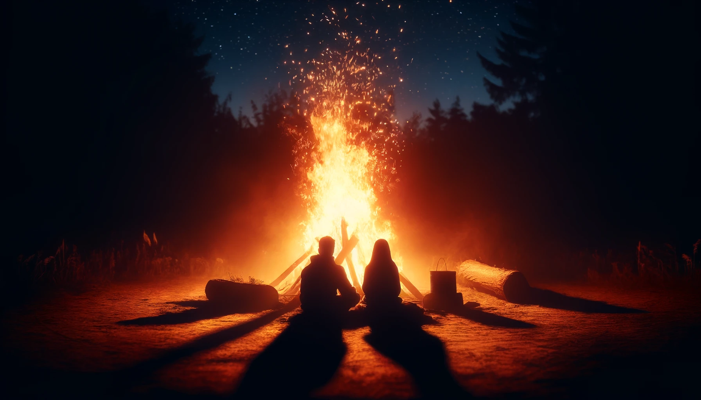

# 【生命⋅修行】大宝变了

前段时间，有一天，不知道因为什么原因，大宝忽然陷入了沉思。她说，她现在遇到了一个问题，一时想不出答案来：

> 以前，我一直是这么认为的：
>
> 如果你的精神状态，或者说抑郁症变严重，到了好不了——也就是说变成我完全无法接受的那种情况了——我就离开你，免得受你影响。
>
> 现在我忽然在想，这样是不是太冷酷绝情了？

我问她是不是需要我的建议，她点了点头。于是我说：

> 我试着尽量站在客观的第三方角度给你些建议：
>
> 1. 就像是投资一样，忘记沉没成本。只考虑这个人，此时此刻之后的整个未来对你有多少价值，当然，不仅仅经济价值，要综合考虑各方面的价值。
> 2. 遵循内心的指引，做你觉得正确的决定。
> 3. 要是既算不清价值，也不知道内心里什么是正确的决定，那就做你当下喜欢的选择。

大宝听完后，表示我的建议没什么帮助，一整夜都在继续思考。

过了几天，她告诉我说，她想好了。她说现在觉得，就算是我不好了，完全没有行动力了，也不应该离开我。

又过了几天，大宝告诉我，她又有一个想法变了。她说，她以前觉得，就算我先死了，她也可以一个人养大两个孩子，也还是可以照样好好生活。现在却是这么想的：

> 亲爱的，你还是好好注意身体，别熬夜。
>
> 一定要活久一点，家里没了你，就少了一个人。我替代不了你，谁都替代不了你。
>
> 孩子没有了爸爸，我可没法回答和面对：他们整天在念叨的「爸爸呢？」这句话。
>
> 嗯，你至少要活到他们有了自己爱的人，和爱他们的人，有了自己的家庭。
>
> 一家人，整整齐齐的才最好。

我也不知道，大宝为什么最近这两个想法会发生变化，我甚至也不知道这是更正确的想法还是错误的想法。我只知道，她这么想，我内心里有那么一点暖暖的。

