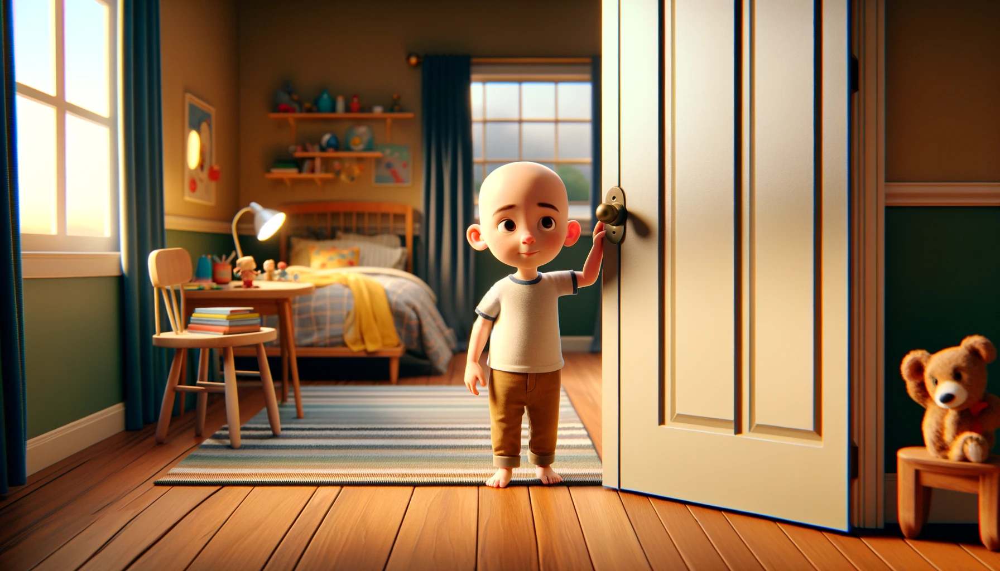

# 【随笔】爸爸，给妈妈姐姐打个电话吧——大鱼趣事儿

最近大鱼变得对妈妈颇有些依赖，也不知是啥引起的，或者是成长进入了什么新阶段。

这天早上，因为前一晚上晚睡了两小时，我实在不想起床，便偷懒和大鱼躺在卧室里，由着大宝一个人起来在外面忙活、张罗早餐等等各种家务。但是，大鱼还是醒了。他从床上坐起来，环顾四周，却没有看见妈妈。于是，立刻变成了哭腔：

> 我要妈妈！

我假装还在睡觉，想看看他会有什么反应，他却直接爬下了床。来到门口，抓着门把手使劲儿地想打开卧室门，却没能得逞。一时急得又哭了起来：

> 我要妈妈！

我赶紧坐起来告诉他：

> 用力，往下拉……

几乎在他打开门的同一时间，我听见外面也传来关门声，然后屋子里安静了下来。大鱼站在卧室门口，悄悄观察了一会儿走廊，然后走出去，四处寻找了一圈。显然，大宝和阿宝正好出门上学去了。大鱼找不见妈妈，大哭着跑回来：

> 妈妈呢？
>
> 我要妈妈！！！

我想要安慰他，却引来更大的哭声：

> 不要你！
>
> 不要爸爸！
>
> 我要妈妈！！！

他跑回卧室，然后又转身对着站在卧室门口走廊的我说：

> 爸爸，你去姐姐房间！

> 啊？

我有点纳闷，以为自己听错了。他又坚定地吩咐了一声：

> 爸爸，你去姐姐房间！
>
> 你去姐姐房间睡觉。

说完，他看我走进姐姐房间，转头咚咚咚进了卧室，继续大哭起来：

> 我要妈妈！！！

哭着、哭着，只不过一两声，就听见哭声越来越小……难道他又睡着咯？

我想起之前也有一次，他醒来发现只有我在家里陪他，妈妈出门锻炼去了。也是大哭哄不好，把我赶到卧室外面，然后自己在床上哭了一会儿就睡着了。等大约睡了一个回笼觉再次醒来，就笑嘻嘻地找我玩了。那乐呵呵的表情，就好像之前没哭过一样。

我正想着，这次是不是又要睡一个小时回笼觉呢，于是在姐姐房间的床上弄了个枕头垫上，打算静坐冥想一会儿。这还没坐稳呢。却见门口出现一个笑吟吟的小毛头。

> 爸爸，给妈妈、姐姐打个电话吧！

我赶紧拿了手机，拨通了大宝的微信。一面让大鱼看手机屏幕里的妈妈，一面笑着告诉大宝刚刚发生的事情。大鱼看见妈妈也很开心，听说妈妈给自己准备了各种早餐，挂了电话，穿上拖鞋，就自己跑到餐桌边，选了个白水煮鸡蛋，自顾自地开始剥起来。

等他吃饱喝足，我问大鱼：

> 要爸爸带你去找妈妈么？

他却回答：

> 爸爸，你先陪我玩10分钟，然后再带我去找妈妈……

哈哈，这眼看就要三岁的小家伙，现在怎么这么能耐了呢？！