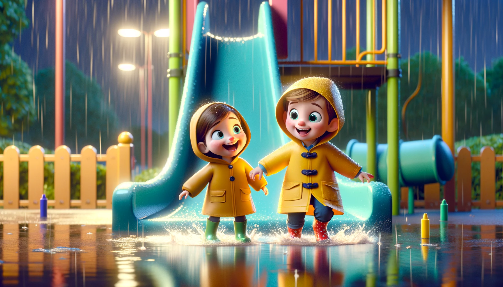

# 【随笔】清明时节雨纷纷

> #### 清明
>
> 唐 • 杜牧
>
> 清明时节雨纷纷
>
> 路上行人欲断魂
>
> 借问酒家何处有
>
> 牧童遥指杏花村

凌晨醒来，想起清明节期间纷纷不断的雨水，又想起这首诗，忽然觉得这首诗画面感太强了，简直就像是分镜头脚本一样：

> ##### 镜头1
>
> 特写，画面：雨中的小草。字幕：「清明」。音乐，音响：「雨纷纷」
>
> ##### 镜头2
>
> 远景，画面：清幽山间，雨中的小路。字幕：「清明」。音乐，音响：「雨纷纷」
>
> ##### 镜头3
>
> 中景，画面：「路上行人」，从路边的小草到泥泞的小路，再到「行人」的脚，再到雨中带着蓑衣、斗笠行路的上半身。音乐，音响：风雨声，泥泞路上走路的声音。
>
> ##### 镜头4
>
> 近景，画面：行人斗笠下，滴答雨水中的面部表情，「欲断魂」。
>
> ##### 镜头5
>
> 近景，画面：行人停下，抬头问话。人声（凄迷烦闷欲断魂）：「借问，酒家何处有？」
>
> ##### 镜头6
>
> 近景，画面：牛背上的「牧童」，快乐地抬手遥「遥指」向身后的远方。音乐，音响：雨声，偶尔的鸟叫声
>
> ##### 镜头7
>
> 远景，画面：逐渐拉远，看到雨中的山村，若隐若现的酒旗。字幕：「杏花村」。人声（童声、爽朗快乐）：「杏花村」。音乐，音响：雨声，偶尔的鸟鸣，最终响起牧童欢快的笛声……

短短七言绝句，就有这样生动的画面感，这样想想，文字真是很有意思。

----

清明假期的第二天，依然还在下雨。我站在窗前，看着雨水扯天扯地，模糊着远处的实现，把街边树丛嫩绿的新枝新叶敲打得抬不起头来。凉风从窗口吹进来，带着雨水的清新，格外凉爽。我正想泡杯茶，在这里好好享受一下雨中的景致。阿宝却说：

> 这么大的雨，二楼儿童游乐场一定可以踩水了！

雨才刚小一点，阿宝和大鱼就迫不及待穿上雨衣、雨靴，拉着我想要下楼去。我赶紧脱掉袜子，穿着拖鞋跟上，临出门忽然想起什么，一边接过大宝递来的雨伞，一边随手把放在门口的尺八也拿在手里。

果然，儿童游乐场已经有了不少积水。看着阿宝带着大鱼扑向滑梯，我举着伞环顾一圈，找了个淋不到雨的地方，站定了准备一边看着他们玩，一边吹吹尺八。刚放下雨伞，还没举起尺八，就见阿宝穿着雨衣，从滑梯上嗖地滑下，然后紧跟着是弟弟大鱼。但大鱼显然没掌握好雨天变得更加滑溜的话题，他直接一屁股坐到滑梯下面的水里，哇哇大哭起来。

我问：

> 摔痛了吗？要不要爸爸抱抱？

大鱼只是哭。我便叫阿宝：

> 阿宝，帮忙看看弟弟摔得咋样，需不需要帮助。

阿宝立刻开启了暖心姐姐哄弟模式：

> 摔痛了吗？
>
> 你看，这些可爱的小水珠……

只两三句话，弟弟就又开心地跟着姐姐在水里玩起来。

不一会儿，他们脱掉了雨靴和袜子，拿雨靴当作装水的玩具，光着脚在水里玩起来。一个比阿宝高一个头的小男孩打着伞，骑着自行车也来到了这里。看起来是非常想加入游戏，就一直骑着车围着他们打转。阿宝和弟弟发明了雨靴水炸弹之后，玩得更是开心，一遍遍跑上滑梯，把装满水的雨靴扔下来，听「咚」的一声响，然后开心得哈哈大笑。

接着，阿宝会尖叫着从滑梯滑下来，大鱼则转头从楼梯走下滑梯，继续在积水处用雨靴舀水。

积水越来越少，小男孩也终于停下自行车，加入了他们的玩水行列。他贡献出了自己的雨伞，三个人一起努力地把所剩不多的积水用雨伞、雨靴、废矿泉水瓶这些奇怪的工具运来运去。开心地在场地里来回跑。

春天的雨水其实还是挺凉的，估摸着已经过了半个多小时。我便叫上阿宝和大鱼，告别了小男孩，准备回家。可他们临走还要灌上满满一雨靴水，穿在脚上，呱唧呱唧地继续享受踩水的感觉。

我只好嘱咐他们小心不要把雨靴里的水洒到其它地方，回家后直接去卫生间脱衣服洗热水澡……

……

第二天，阿宝开始流鼻涕了，但弟弟的感冒却好了。

哎，清明时节雨纷纷……稚子踏水笑㖗㖗。

