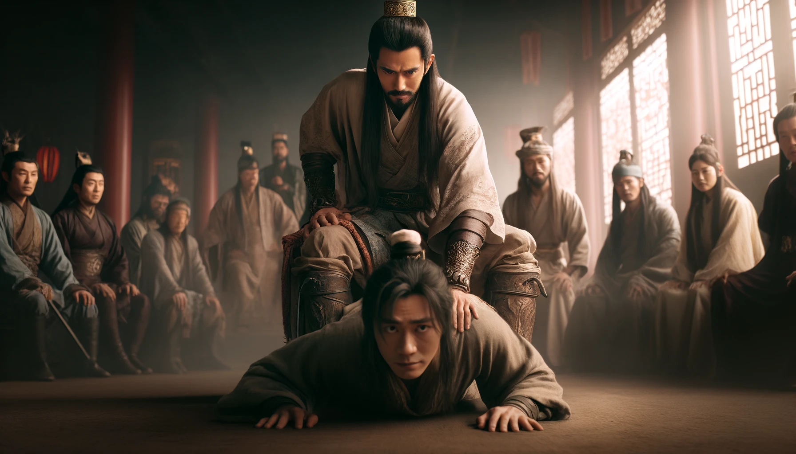
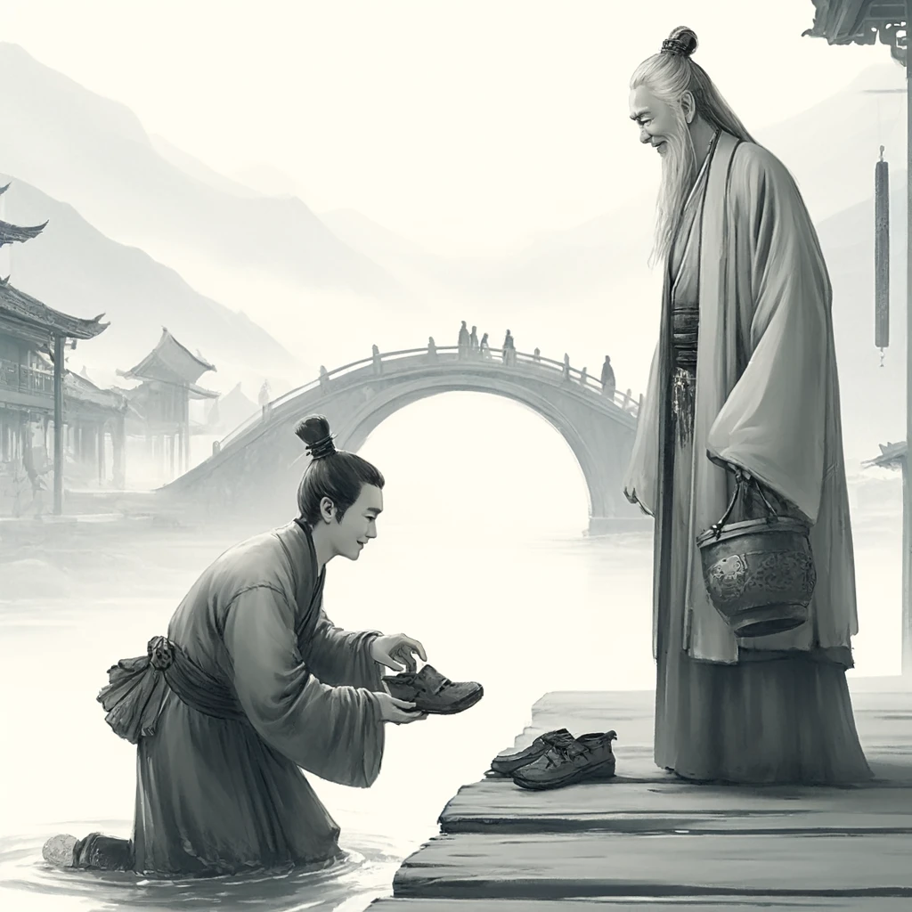

# 【随笔】张良与韩信

有一天夜里睡不着觉，不知怎么在凌晨四点多醒来，窗外一辆飞机轰鸣过后，又是另一阵隆隆巨响。不像是飞机，但声音巨大又能是什么呢？我爬起来扒开窗帘往外看，原来是一辆垃圾车从楼下经过。

这才凌晨四点多啊，怎么外面会这么忙碌呢？远远地，有一只早起的鸟儿叫了两声，我一时难以再次入睡，竟然想起韩信与张良来。韩信死前说：

> 吾悔不用蒯彻之计，乃为儿女子所诈，岂非天哉！

蒯彻给他出主意的是什么时候呢？先是刘邦派韩信、张耳带着一群老弱攻赵，这边韩信拿下赵国，站稳脚跟，那边刘邦却被项羽打得只剩孤家寡人。但刘邦厉害，夜入军营，轻轻松松解除了韩信、张耳兵权，把大军全带走了。韩信领命再去攻齐，但是在郦食其用三寸不烂之舌拿下齐国后，他听了蒯彻的话，不肯收手。结果生生害死了郦食其，但兵仙就是兵仙，他又生生战且胜之，拿下齐国。

这时，刘邦听了张良的话，封韩信为齐王，让他带兵来打项羽；项羽也派武涉来找韩信，试图拉拢未遂。蒯彻再次发声：

> 仆相君之面，不过封侯，又危不安；相君之背，贵乃不可言。

韩信被这话头吸引住，问为啥，蒯彻继续说：

> 天下初发难也，忧在亡秦而已。今楚、汉分争，使天下之人肝胆涂地，父子暴骸骨于中野，不可胜数。楚人起彭城，转斗逐北，乘利席卷，威震天下；然兵困于京、索之间，迫西山而不能进者，三年于此矣。汉王将数十万之众，距巩、雒，阻山河之险，一日数战，无尺寸之功，折北不救。此所谓智勇俱困者也。百姓罢极怨望，无所归倚。以臣料之，其势非天下之贤圣固不能息天下之祸。当今两主之命，县于足下，足下为汉则汉胜，与楚则楚胜。诚能听臣之计，莫若两利而俱存之，参分天下，鼎足而居，其势莫敢先动。夫以足下之贤圣，有甲兵之聚，据强齐，从赵、燕，出空虚之地而制其后，因民之欲，西乡为百姓请命，则天下风走而响应矣，孰敢不听！割大弱强以立诸侯，诸侯已立，天下服听，而归德于齐。案齐之故，有胶、泗之地，深拱揖让，则天下之君王相率而朝于齐矣。盖闻「天与弗取，反受其咎；时至不行，反受其殃」。 愿足下熟虑之！

这意思简单来说，就是到了这个刘项之争的关键时刻，谁胜谁其实负取决韩信一人。韩信此时若能独立，则天下三分了。蒯彻当然是为自己考虑，本来韩信继续攻齐，造成这即将三分的局面，也是他撺掇成的。可惜，这次韩信没继续听他的。韩信终究念着刘邦封他做大将军的「知遇之恩」，心软了一下。于是，韩信错过了这唯一的，走向「贵不可言」的机会。或许，以韩信这「兵仙」一般的谋略与判断，以及刘邦从未放松过警惕的布局，他自己内心也未见得有那么大的把握，在这个时候三分天下而立吧。

真是「士为知己者死」啊！以韩信的能力和眼光，他能看清纷繁复杂的战局，却并不能看清刘邦，更控制不住自己的贪欲和骄傲。虽然，当年他能忍胯下之辱，但如今，他就是忍不住要杀伐战取，立大功，封大王。在天下人，甚至是刘邦面前得瑟自己用兵如神，多多益善的能力。哪怕后来被贬，还要骄傲地不屑与樊哙为伍……

他如果有张良的战略眼光，早早把平齐国的功劳让给郦食其，天下平定之后再找个机会和张良一样功成身退，寻个小地方好地方，当个万户侯，或许就不会有「兔死狗烹、鸟尽弓藏」的感慨和被屠灭三族的境遇了。

真是可惜了，他和项羽一样，一个「战神」，一个「兵仙」，老天爷把天下端到他们面前，他们终究不懂收下。项羽是战略眼光太差，自己作死一盘好棋，而韩信则真是应了这句话——「天与弗取，反受其咎；时至不行，反受其殃」。

还是张良厉害，年轻时血勇，敢于率众狙击秦始皇。之后遇到刘邦，又能一路出谋划策，帮着他一步一步走过各种险境，成就伟业。最后竟然还能安然无恙地功成身退。

**兴周八百年的姜子牙，望汉四百年的张子房，五百年前诸葛亮，五百年后刘伯温。**

这些古时著名的谋臣良将，我自小佩服，现在想想，抛开遥远的姜太公不说，还是张良张子房更胜一筹啊！

哎，还是认真做一个属于自己家的「张良」吧，休谈安天下，能安身立命，养家糊口，再求一心安就万全了！