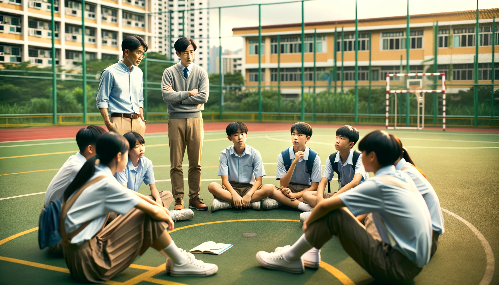
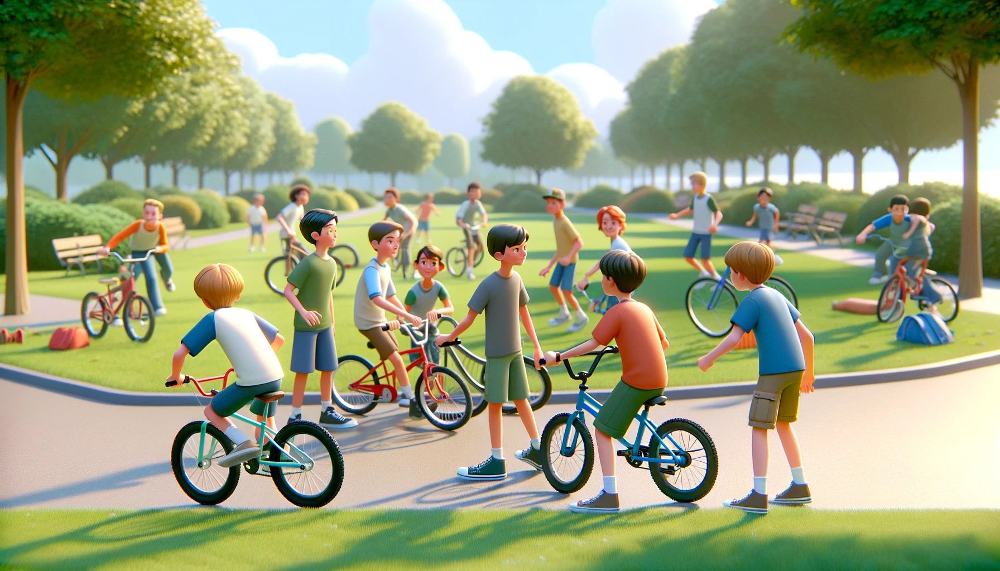

#  【生命•故事】（113）轮值班长

到了初二，那位刚毕业的年轻班主任被换掉了。换上来的新班主任是我们的物理老师，叫做俞亚起。据说他是清华毕业的高材生，那年教我们时三十多岁，正当年。

当时我们班变成了全年级，乃至全校著名的差班。我们也好奇，这个班主任会给我们带来什么新的变化。结果，让我们大吃一惊的是，他竟然双手一摊，表示不管我们了。大部分同学为此羞愧不已，也愤慨不已，于是大家自发聚在操场上讨论——「我们应该怎么办」？就在我们围坐一圈，讨论得热火朝天的时候，他悄悄地来了。在我们背后听了一会儿，又悄悄地走开。我看到了他，还特意趁他在，努力表现了一下——勇敢地发表了自己的观点，应该也有其它同学看到。但有些同学却完全没有意识到，他来到过我们身边。

之后没多久。他宣布了一项新政策——「轮值班长」。

规则也很简单，每个同学都可以参加竞选，然后全体同学投票。任期是一周还是两周，然后就进行下一次竞选。就好像大洋彼岸每隔几年就会热闹好一阵子的美国总统竞选一样。于是，我的好朋友K 第一个成为了轮值班长。有趣的是，那时的K，就知道责权利对等，他特意找我们的班主任老师要来了一样重要的权利：**请家长。**

于是，这场轰轰烈烈地、革命性的制度实验就在我们班开始了。说实话，最开始所有同学的积极性都被调动了起来。班级的纪律、成绩等等各方面全都有了显著的好转。除了我的好友K，不少人都当过轮值班长。甚至包括班上一位著名的「差生」，那是真正在外面混黑社会的小Y。

不过，到了后来，似乎大家对这个制度的新鲜劲过去了，后来不再有人热衷于竞选班长。慢慢，一切都恢复了原样。或许也没有恢复原样，因为到初三，就要忙着准备中考了。

记得有一次周四下午，学校不上课，我们去到东湖玩。有K，Y等等一帮人。他们躲到那里抽烟，然后互相打趣说：

> 看呀，班长，前班长带着一帮人跑到东湖抽烟。团支部书记还在一旁看着……

----

惭愧的是，毕业后几乎就没有回过学校，也不知道俞亚起老师后来遭遇了女儿生病的变故和窘迫，更没有伸出过援手。