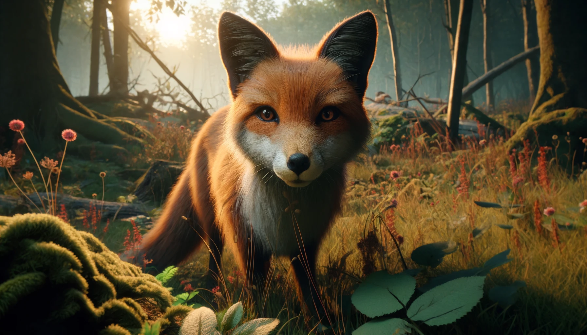
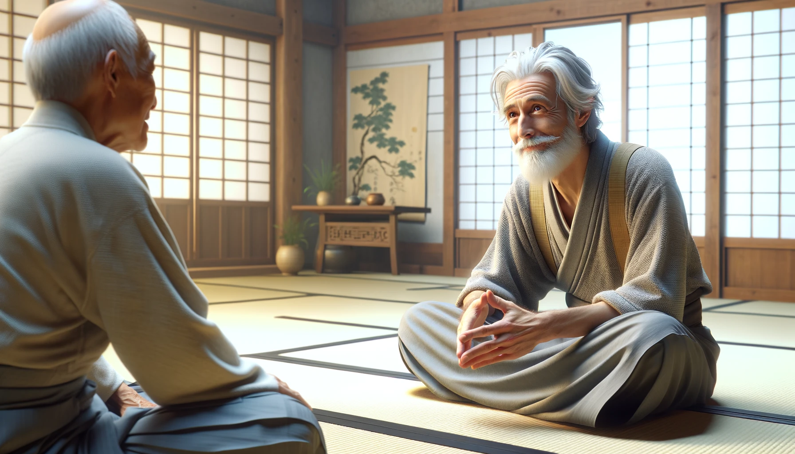
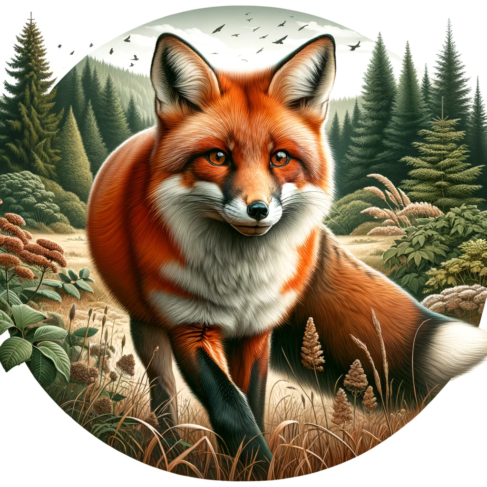

#  【生命⋅修行】不昧因果

想起视频号常常给我推一位赵姓博士，他在短视频中讲到自己的一次濒死体验。

那时他出了车祸，车飞到半空时，他有了一种灵魂出窍的感觉，时间似乎静止，然后像放电影一般，以旁观者视角开始回顾自己的一生。并且，回顾中的那些关键时刻，都是一些很小的事情。其中有一个是在他小时候读书时候的经历，他放学路过一家门口，看见个子不高的一个小女孩因为够不着门把手，正在费力地锁门，然后小时候的他酷酷地过去，帮小女孩锁上门，头也不回地走开了。而正在以第三者视角旁观的「他」却惊出一身冷汗，如果那个小女孩是正在费力地刚刚打开门呢？那不是自以为做好事，但结果却害了别人么？幸运地是，「他」以第三者视角看到，这次是实实在在地帮助到了小女孩。于是乎，就像这样，以过电影一般地方式，他审视了自己过往的一生，那许许多多关乎「善」、「恶」的关键瞬间……

他忽然明白，这就是生命结束前的「审判」，如果一生「作恶多端」，在那最后的「审判」时刻，将会陷入怎么样痛苦心境呢？

死亡不是结束，但濒死前、「审判」后，最后那强烈的唯一念头，将是下一世往生何处的核心动力。

《五元会灯》里有一则百丈禅师的「野狐禅」公案：

> 百丈禅师每日上堂。有一老人随众听法。一日，众退，惟老人不去。师乃问：“汝是何人？”老人云：“某非人也，于过去迦叶佛时曾住此山，因学人问，大修行人还落因果也无？”某对云：“不落因果。”遂五百生堕野狐身。今请和尚代一转语，贵脱野身。师曰：“汝问？”老人曰：“大修行人还落因果也无？”师曰：“不昧因果。”老人于言下大悟，作礼曰：“某已脱野狐身。”

大修行人，能做到的，正是「不昧因果」而已——如是因、如是果——清楚了然。

所以才有「菩萨畏因，凡夫畏果」一说。可惜，像我这样的凡夫，总是智慧不够，定力也不够。

于是乎，熬夜晚睡，第二日就得面临情绪低落的果报；吃多生冷，没过多久就得面对肚子难受的果报；贪利则为利伤；贪慕虚荣则为虚名吞噬……这些还是能看到的现世果报，只是定力不够执行不到位，还有那许多智慧不够，看不清因果，而被自己「招」来的「现世遭遇」，果报现前了，才知道自己当初的愚蠢。

最近关于借贷的一桩惨痛遭遇，深深地提醒了大宝和我：

* **任何时候，都不要轻易借钱——不论是找别人借还是借给别人——一旦出意外，害人害己**

* 无论是为利，还是为情（其实情的背后还是虚荣心）
* 向银行借贷更是要小心
* 借钱，无论多少，一定要做好「还不上怎么办」的万全准备

人生在世，仍需善良，但愚蠢则大可不必咯！

