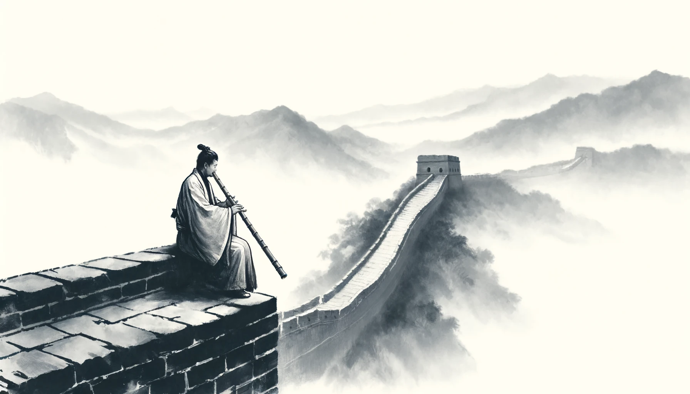

# 【生命⋅修行】是谁在吹尺八

尺八放在箱子里积尘许久，终于又被我想起它来。那天晚上，只觉得一股闷气在胸中盘恒，憋得慌。便想：

> 总之是有气不顺，不如拿了尺八来，用这气来吹尺八好了……

虽然尺八还没入门，但好歹自己能吹响。于是乎从箱子里取出尺八，搬了一张小凳在客厅端坐好，认认真真吹了起来。传说普化宗的僧人能一音入定，那么我也就只吹这一音好了。我深深吸一口气，闭上眼睛，缓缓将尺八举起，搁在唇边，让歌口对准自己嘴唇的缝隙，腹部略略用力，将气流缓缓地从胸腔逼出来，冲击在在薄薄的吹口上。气流震动着，发出「呜」的声响，在尺八管中来回震荡着，撞击过我紧紧按着尺八孔的手指腹，回旋着，带着强烈地共鸣訇然而出，再穿回我的耳膜，轰击着我的大脑。

我感受着内心那憋闷的气息似乎依旧在盘恒，不由得加大了力量，气流更猛烈地冲出来，带来更强烈的共鸣声，似乎有什么东西终于冲破了壁垒，奔涌而出

> 呜～～～

一声、一声、又一声……

我专注地一次又一次深呼吸，再把这气息与心中莫名的情绪一起化作那或长、或短的尺八筒音轰鸣。渐渐地，沉浸在这只有呼吸与尺八声音的气息之中。不知怎么的，我觉察到自己的情绪已经经历了一些微妙的变化，我不由自主地松开了按着尺八孔的右手无名指

> 呜呜——

声音的起伏变化，让心气更加舒畅。我重复地吹着这两个音，不禁赞叹起这种「音」、「气」相合的奇妙感觉来。

我忍不住又动了动另一个手指，但遗憾地是，这次没有出现那感觉和谐的变奏，却发出嘶嘶的破了音。这一变故，让我从那近乎「天人合一」的境地瞬间跌落了下来。我放下尺八，睁开眼睛，窗外嫩绿的树叶在微风中轻轻摇曳，一只黑色翅膀的小鸟从枝头一跃而下，无声无息消失在视线之外。远处，传来一两声悠悠地鸟叫。

> 子游曰：“地籁则众窍是已，人籁则比竹是已，敢问天籁。”
>
> 子綦曰：“夫吹万不同，而使其自己也，咸其自取，怒者其谁邪？

回想那吹尺八时，冥冥之中竟不是自己在吹的感觉。身而为人，不过也是上天的一件乐器吧。放空自己，参与上天的演奏吧……

