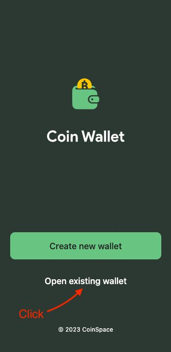
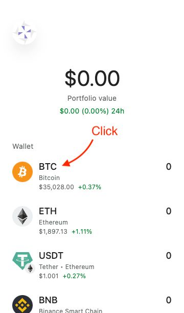
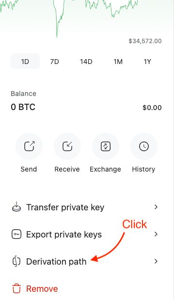
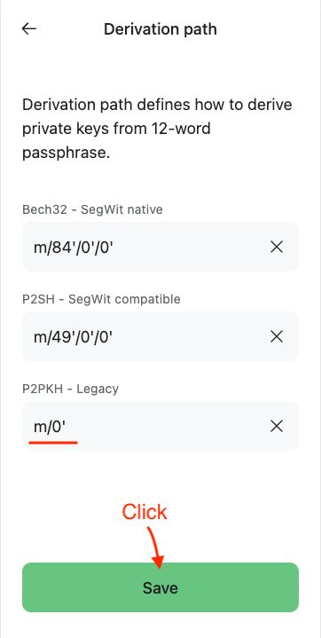

# 【教程】找回消失的比特币

那天和老同学H聊天，说起当年帮他买的一点点数字货币还在我这里。H想了想，说让我自己处理，说最近既然我家里许多麻烦事儿，万一有用得上的地方就自己用了。这样的关心和慷慨，很让人感激，我决定，无论如何也要想办法把这点数字货币为他留下来，不要随便动用它们。

然而，这时一个重要的问题浮上水面：

> 我用来给他保存比特币的钱包叫做BRD，这个钱包被美国的Coinbase 收购了，然后停止服务了。
>
> 官方倒是提供了迁移的方法，但Coinbase不支持中国人注册使用，而且Coinbase的钱包不支持BCH。
>
> 而且，我在BRD使用的助记词是中文！

怎么办呢？我之前也简单研究过，但每次把助记词导入其它钱包，都看不到原本存在BRD里的比特币，以太坊，更别提BCH等其它小币了。我心想，搞不好得写程序搞定这件事了。好在，BRD是开源钱包。想到这里，我赶紧把钱包代码的地址找到，https://github.com/breadwallet/brd-mobile，存了下来。

不过，显然不止我一个人遇到了类似的问题。我又研究了一会儿，顺着几篇讨论帖子的线索，我终于把所有的比特币、以太坊、BCH都找了回来。这几个重要的帖子分别是：

1. https://www.reddit.com/r/Bitcoincash/comments/11pqwzr/restoring_old_brd_wallet_where_is_my_bch_how_and/ Reddit 上的讨论
2. https://coin.space/how-to-restore-a-brd-wallet/ coin.space 的指导
3. https://bitcointalk.org/index.php?topic=5474289.0 恢复中文助记词的讨论

我把最重要的关键点整理在这里，以便将来有需要的同学（或者我自己）参考。

## 0. 最重要的事情：不要向任何人，或任何在线系统里透露你的助记词

记住，助记词🟰你的数字货币，一旦泄露，就意味着**丢失**！哪怕是在其它钱包导入助记词，也要小心，最好是找回数字货币后，立刻把它们全都转移到一个更安全、没有泄露风险的钱包中。 

## 1. 如果是英文助记词

基本上可以参考Coin Space的那篇[指导](https://coin.space/how-to-restore-a-brd-wallet/)。注意，Coin Space 不是Coinbase，有点小众。是否选择这个钱包导入你的助记词，请自己斟酌。

### 第一步：导入BRD钱包的助记词

### 第二步：选择钱包中的比特币 / 以太坊

### 第三步：修改比特币 / 以太坊的Derivation path

### 第四步：保存修改过的Derivation Path

如果是比特币，在 "P2PKH - Legacy" 部分输入 **m/0'**，然后保存。

如果是BCH，输入 **m/0'/0**

如果是以太坊，输入 **m/44'/60'/0'/0/0**

使用其它钱包恢复应该也类似，关键是这个钱包能支持配置不同的 Derivation Path ，来找回对应数字货币。

## 2. 如果是中文助记词

如果是中文助记词，直接用上面的方法就不灵了。实话说，我也不知道为什么。不过，我们依然有办法。

### 1. 打开BRD钱包，导出转账记录，确认数字货币所在的钱包地址

这是为了保险起见。可以通过转账记录找到各数字货币实际上的钱包地址。

以BCH为例，你在转账记录中发现，最后你的BCH都是存在这个地址中的：`bch:przz6uvvnafpee7hetpgaw5rykunv6smfu2ejdpfcp`

可以通过Block Explorer https://blockchair.com/bitcoin-cash/address/przz6uvvnafpee7hetpgaw5rykunv6smfu2ejdpfcp 查看一下这个地址，是不是余额正确。

如果不是，可以顺着交易记录，比如：`088544ac9eb817ab27a3ccb4544eeca55b08ff819a12030bd6518064764928b6`，在Block Explorer https://blockchair.com/bitcoin-cash/transaction/088544ac9eb817ab27a3ccb4544eeca55b08ff819a12030bd6518064764928b6 上继续查看相关的交易和地址，直到最后确认找到数字货币当前所在的钱包地址。

### 2. 使用神器 https://github.com/iancoleman/bip39

大神 iancoleman整了一个非常好用的工具（我就动了一下念头，觉得需要写个程序，然后这位大神早就整出来了！）在Github的这个地址https://github.com/iancoleman/bip39，你可以把bip39-standalone.html 这个文件下载下来。

1. 首先，用SHA256 检查一下 Checksum，确保是原版没有更改过。
2. 用浏览器打开这个html文件（安全起见，此时可以断开电脑的网络，在Offline情况下操作）。
3. 在浏览器里输入助记词（这个工具支持 English 日本語 Español 中文(简体) 中文(繁體)  Français Italiano 한국어 Čeština Português 10种语言的助记词）。
4. 选择对应的币种（BTC，ETH等等）
5. 在Deriviation Path，BIP32中输入对应的 Derivation Path（比如比特币用m/0'/0，m/0'/1）。
6. 检查出现的Derived Addresses 中，是否有之前确认过的钱包地址。记下私钥。

### 3. 使用相关钱包，导入私钥

有了私钥，就有了一切。

于是，我用imToken 导入了以太坊和ETH链上的那些小币，用Electrum Wallet导入了比特币，用Electron Cash导入了BCH。至此，所有丢失的数字货币。

## 总结，本地私钥 + 开源 是数字货币安全的根本源头

这一场虚惊，最终靠着这三条找回了那些「消失」了的比特币

1. BRD是一个靠谱的本地存储私钥的开源钱包
2. 有大神写了好用的工具
3. 有其它开源钱包遵循同样的标准

我再一次坚定了一个认知：**本地私钥 + 开源是数字货币安全的根本源头**