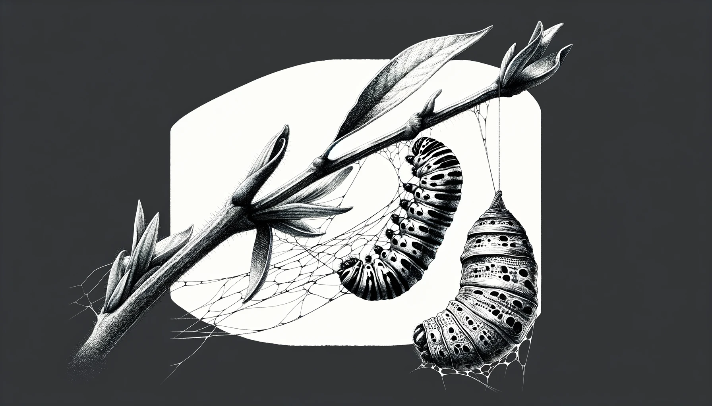
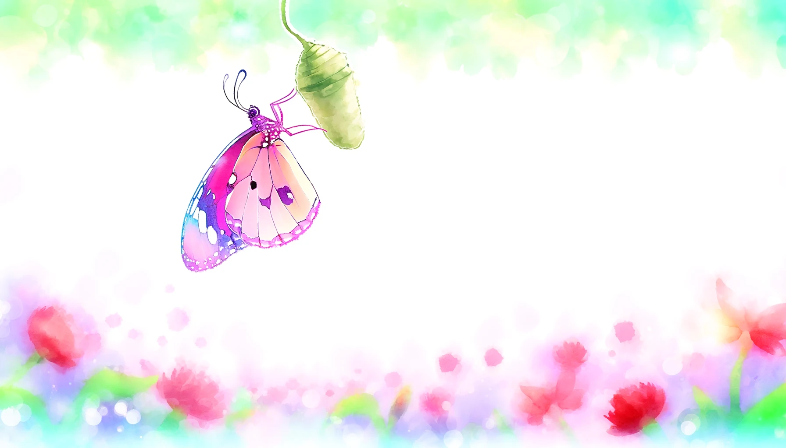

# 【生命⋅修行】每个人都是在自己的茧房里挣扎

昨天把找回比特币的经历记录成文，花了不老少时间，却总觉得差许多意思：

1. 文章写得很不耐看，既不够清晰，也不够有吸引力。属于那种写完自己读着都不痛快的文章。
2. 关于数字货币钱包，尤其是BIP32之后引入的多钱包，助记词等等关键，我了解得也不够。或许专门研究清楚了，再写一篇文章？

于是乎，早上翻开 BIP39 的Wiki https://github.com/bitcoin/bips/blob/b1791c24aa163eb6578d0bfaadcf44997484eeaf/bip-0039.mediawiki 看了一眼，两眼，确定自己没法在30分钟到1个小时之内把这些概念完全理清楚，更不用说写清楚了。这让我想起自己之前动笔，但已经搁浅在Meme币概念附近的系列科普文章——《什么是区块链》。信笔由缰已经写不下去了，钱包对于小白来说，是一个绕不过去的概念，但怎么写下去呢，可能还是得捋一个提纲出来才行。

然而，接下来的问题出现了——值得在这上面继续画时间和精力吗？究竟什么才值得画时间和精力呢？传说马斯克每天把自己的时间，按照5分钟切片，分为288个单位来进行管理。然后把所有需要做的事情按照重要、紧急程度排序，安排进这288个时间切片，一个一个地去完成它们——每一个都是有Deadline，有预期结果的小型任务。完成后还要反思回顾，看时间安排、预期结果有多大误差，以便之后更准确地计划和安排。

光是这么想想，就能感觉到钢铁超人那如陀螺一般疯转的呼呼风声。

这篇文章，来自李笑来某个课程的同学的公众号。然后，另一个我主要关注、阅读的公众号作者——和菜头最近也再一次提到了李笑来——他买了新显示器后，忍不住继续折腾，然后和李笑来一顿研究，[搞定了Macbook 和Windows 下黑底白字显示文字的方法](https://mp.weixin.qq.com/s/EOgNuzFOibJb-JzwOWrSSg)。

又是李笑来！

我忽然意识到，自己似乎在慢慢地陷入一个自己构筑的信息茧房里——自己获取的信息来源，信息质量都在收窄——就那么几个人，就那么几本书，就那么点与我趋同的价值观。而与之相应的，自己的行动也在渐渐固化成一些简单的模式。

有些无奈，又觉得这也是必然。毛毛虫有结茧化蝶的过程，人想来也是一样吧。有时候，就是需要屏蔽外在的变化，专注于内在的转化；待内在转化完成时，又需要破茧而出，用新的姿态去面对那依旧变化不停的世界。

这就是生命吧！

话说回来，和菜头找到的「黑底白字」显示法还蛮不错的。Mac OS下，在辅助功能里，打开色彩滤镜（用灰度），再打开颜色反转，就能让我的Typro变成黑底白字。Mac下还可以用快捷键：

> 若要打开“辅助功能快捷键”面板，请按下 Fn-Option-Command-F5。或者，如果 Mac 或妙控键盘配备了触控 ID，请快速按下触控 ID 三次。
>
> 据说，Windows 的快捷键是 win+Ctrl+C 快捷键组合

我以前曾把手机设置成灰色，想借此减少使用手机使用的时间。似乎管用，但是不知为什么，自己并没有坚持下去。也把手机和电脑屏幕都设置成了夜晚模式，这样大部分窗口，比如微信就变成深色窗口，浅色字体。但网站的显示不会跟着我的主题设置变化，所以为了能从Typro直接拷贝文字到微信公众号编辑后台，我一直没有修改Typro的Theme，还是让他和微信公众号后台保持一致的白底黑字。

然后，刚刚比较了一下，继续使用Github的Theme，然后反转，相比调成Night的Theme，但是不反转的显示效果好像还要更舒服那么一些些。看来，距离找到自己觉得最舒服合适的状态，再继续折腾几下差不多了呢。

