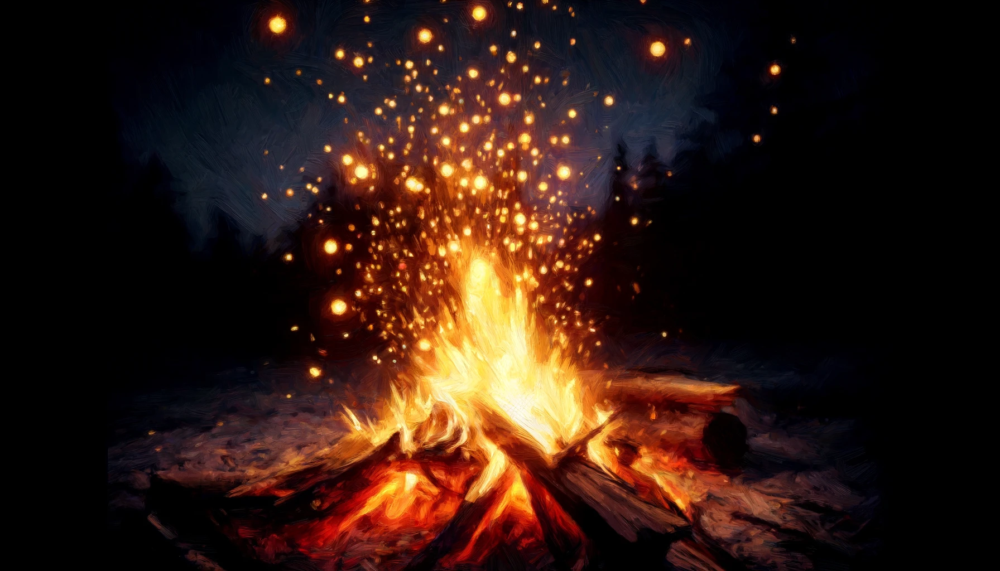
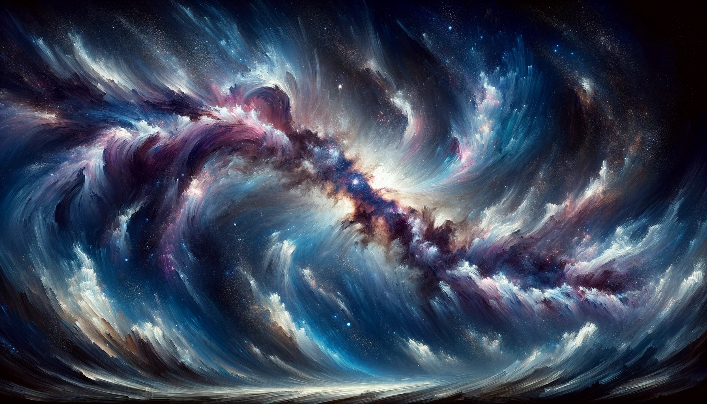

# 【生命⋅修行】人如何做到视死如归

今天看到李银河的一篇文章[《人如何做到视死如归》](https://mp.weixin.qq.com/s/IcAWqItvns5cI9vDPnwHMw)，说实话，被这个标题震撼到了。让我不由得跟着李银河的思路，从活着的当下，想到了10年后，几十年后自己即将老去的未来。甚至不知道什么时候将会到来的死亡。

死亡之后会发生什么呢？谁也不知道。东方的哲学让我们相信，生命不止是这一世而已。但这也只是一种信仰而已，或许有灵魂，或许是别的什么东西。或许只是如水滴回到大海，水滴就是消失了，但水一只都在。似乎在延续的，是曾经作为水滴的，那越来越模糊的记忆。也许，记忆永不会消失。但我们却能明确地感觉到，遗忘却是一直在发生……

这也许正是我看《你的名字》时，那抓不住、无比珍视、却正在消失的记忆，让我泪流满面的原因吧。

但一个生命个体的结束，放在恢弘的地球生物圈而言，却是那么微不足道的，生命能量循环的一小个环节。能量与物质消散而去，更大的生命结构却从未停止生长与演化。一个生命，乃至一个甚至无数物种的消亡，对整个地球而言，或许只不过是随着年岁增长，退掉乳牙，长出一颗新的恒牙而已。

而行星，太阳，无数个太阳系、银河系，乃至无数不同维度的宇宙的生命历程，又是怎样的恢宏。我们的生命个体，我们人类的历史，在其中毕竟只如同篝火上方伴随着噼啪声，飘出的一粒火星，忽闪地明亮起来，又忽闪着没入黑暗之中。

李银河说：

> 人只要这么一想，就会一点也不怕死了，我的生命化作一股青烟，徐徐飘散。如此而已，岂有他哉？……
>
> 重要的是生活质量：人活着的时候是快乐的还是痛苦的？是享受的还是煎熬的？是明朗的还是抑郁的？是压抑的还是自由自在的？在生活质量的光谱上，每一个人落在不同的点上。惟愿自己的生命落在质量较高的一端，快乐超过痛苦，享受超过煎熬，明朗超过抑郁，自由超过压抑。只要这样活过一生，在死亡到来之时就能无所畏惧，从容不迫，视死如归，欣然离去。挥一挥衣袖，不带走一片云彩。

重要的真的只是这些吗？生活的质量到底意味着什么呢？生命本身又有质量吗？生活和生命，有什么区别与联系吗？

在《庄子•至乐》中，庄子回答来吊唁的惠子诘问时说道：

> 是其始死也，我独何能无概然！察其始而本无生，非徒无生也，而本无形，非徒无形也，而本无气。杂乎芒芴之间，变而有气，气变而有形，形变而有生，今又变而之死，是相与为春秋冬夏四时行也。人且偃然寝于巨室，而我噭噭然随而哭之，自以为不通乎命，故止也。

身为普通人，怎么会不悲慨于生命的无常；然而，既生而为人，又总有机会体察到生命恢宏乐章的本质，便也没什么好悲的了……至于活着的时候要怎么活，且随心随缘吧！

