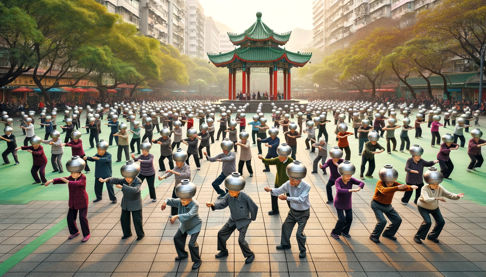

# 【生命•故事】（114）爱好气功的少年时代

除了武侠小说是我成长那个年代的潮流，气功似乎也是。还在读小学时，转学过来的好友H就教我他舅舅教给他的放松大法：

> 想象着一朵白云从远处飘过来，从眉心处进到脑袋里。然后从脑袋开始，感觉身体一点一点地像蛋糕一样放松开来。从头，到脖子，到肩膀，到身体，胳膊，腿，一直到脚板心。
>
> 就这样，从头到脚，重复三次。

这是我第一次听说完整的练功方法。后来，我从父母，还有他们同事订的武术、气功杂志上看到了基本的气功练法。包括最简单的意守丹田，还有「松」、「静」、「空」的口诀，以及「嘘、呵、呼、呬、吹、嘻」六字诀，还有小周天，大周天等练法。我也默默地照着书练了许久。书上说，意守丹田久了，气会自动从脊柱升起，从阖闾，过命门，一直上升到后脑的玉枕穴。过了这一关，就到百会，然后顺着任脉回到丹田。这就算打通了小周天！在武侠小说中，打通了小周天，那可是厉害非常的武林高手了。可惜那时的我并未能体会打通小周天的感受。

那时候，我还练过八段锦，包括床上八段锦。后来，父亲的一个老乡到我们家，说他练气功的故事。他告诉我们，他可以坐在那里，不需要接触，就能感应到旁边的人有没有生病，甚至哪个内脏有病都一清二楚。他拿爸爸妈妈做了实验，似乎还蛮灵的。后来，有一次他来告诉我们，最近新学了一种内功，叫做——「**少林内劲一指禅**」。这功法名字听起来就很酷，于是我便跟着这位伯伯学。

这个练法也其实也简单，就是蹲马步，而且和其它气功不同，它不需要，而且不允许用任何意念。所以，我可以一边练功，一边看电视。后来，我竟然可以每天站一个小时马步（也就是说，我可以借此机会可以看一个小时电视）。据说，这种气功还会「自发动」，不像其他「自发动」的气功只是乱动，「**少林内劲一指禅**」自发动起来，那可是一套「少林罗汉拳」呢。不过，遗憾的时，我从来没有练到能「自发动」的境界。

后来，我在公园里找了一位练硬气功的师傅，跟着他学硬气功和螳螂拳，那已经是我读高中时候的事情了。虽然从未练到和师傅一样能头顶开砖、击断碗口粗的木棒。但也曾经给同学炫耀过，用两只手指击断瓷砖。不过，有个同学没练过，见我可以做到，竟然尝试了几次也成功了。看来，硬气功本身也都是普通人类可以做到的普通事情之一罢了。

读大学前，我还学了另外一个当时颇为著名，后来被禁止了的气功。等大学时，发现竟然还有同学练过中功、香功、藏秘气功等等。于是，我又了解了更多的气功练法。

但最终，「气功」的神秘光环渐渐退去。我也渐渐了解到，这各种气功不过是古人传下来的许多修炼方法中的一部分罢了。

