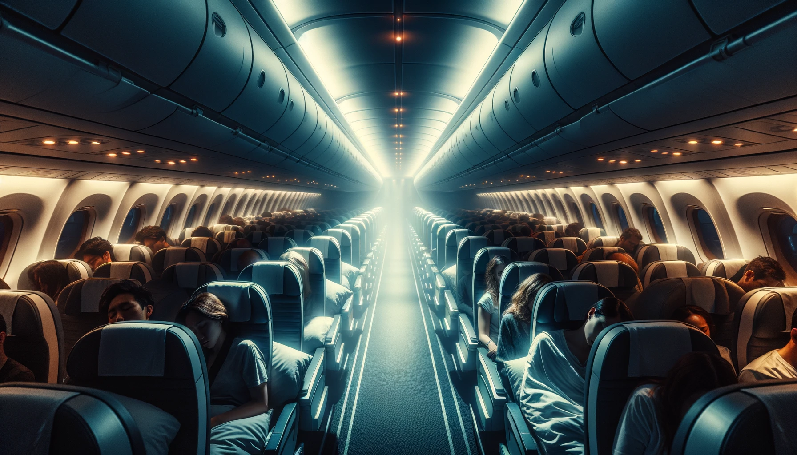

# 【生命⋅修行】在飞机上修行

原以为自己只是陷入了间歇性3～5天的中断状态，等打开Typora才发现，上一篇文章竟然已经是10天前的事情。10天弹指一挥间！话说回来，10年都是弹指之间的事儿，更何况10天呢。

这次5.1 假期，网上关于「调休」吵吵个没完，于我却几乎没什么关系——因为，5.1号我就要出差了。为了寻找一个相对便宜的机票，我得从香港飞到上海，再从上海飞到利雅得。前一程大约需要接近3小时，然后在浦东机场歇不到俩小时之后就要再飞10多个小时。

结果也没歇成，因为一落地浦东就看到大宝给我的若干未接电话，以及微信上的留言：

> **你把我们的港澳通行证全都拿走了！！！ 我们在香港怎么回去？？？**

航空公司的人拒绝帮我把证件带回香港，我只好先出了海关，找到顺丰小哥把证件给大宝寄过去。一路上，焦虑急躁得不行，乃至于对着顺丰客服的AI语音都骂上了。但好歹在起飞口附近的星巴克顺利找到了收件的小哥，寄出去后又紧赶慢赶，及时赶上了下一班飞机。

飞机晚点了几十分钟，终于起飞。我关上手机，心想：

> 这个由我惹出来的麻烦，接下来需要大宝独自面对了。

10多个小时，我盘算着是看书还是静坐冥想。最后决定把主要的时间花在冥想上，于是披上毛毯，调直座椅靠背，闭上了眼睛。之前的焦躁心情渐渐放下，只感觉飞机上的空调越来越凉，听到许多人都在咳嗽。一会儿在前面，一会儿在后面，一会儿是身边的姑娘。我忽然开始思念起大宝，然后意识到自己有一种特别特别想要拥抱的感觉。然而，我只能使劲抱了一下自己，然后放下手，静静地体会这种想要却得不到的感觉。

我意识到，这种「想要却得不到的不甘」感受实在是太过熟悉了。想要拥抱却无人可以拥抱的时候是这样，想静坐得到一丝轻安却没有的时候依然是这样，还有很多很多时候，我都是陷入这种状态之中。于是乎，在这种状态下，自己常常会忍不住勉强！因为太过强烈地想要，执着地勉强，却全然没有收到那「是时候停止了」的信号。

需求与欲望本来没什么，但到了这种时候，却能感受到一种强烈地被扭曲的意味。正在这时，客舱里灯光忽然闪亮，喇叭里传来乘务员的问候，送餐的时候到了。我睁开了眼睛，搓了搓脸，开始整理面前的小桌板。

就这样，近12个小时的飞行，用了两次餐，期间还看了一部半电影，有两个小时特别困曾试着放下椅子睡觉（但浑身酸痛，并未能睡着），剩下的时间里断断续续冥想了3、5次。

难得有这么长的时间，只与自己相处，与自己纷乱的内心相处，与自己的身体相处。但下飞机后发现，我一直清鼻涕哗哗，貌似被空调吹感冒了！

