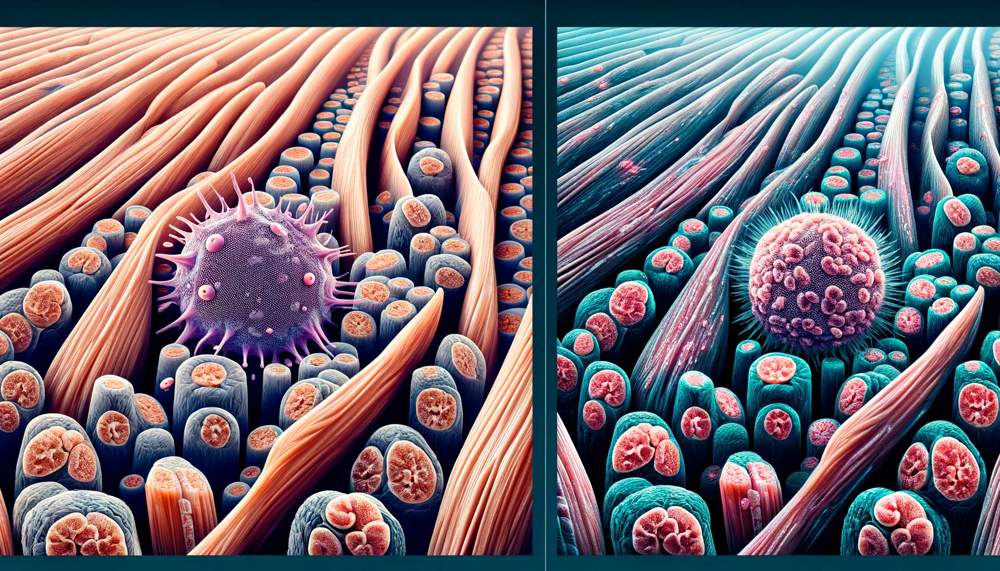
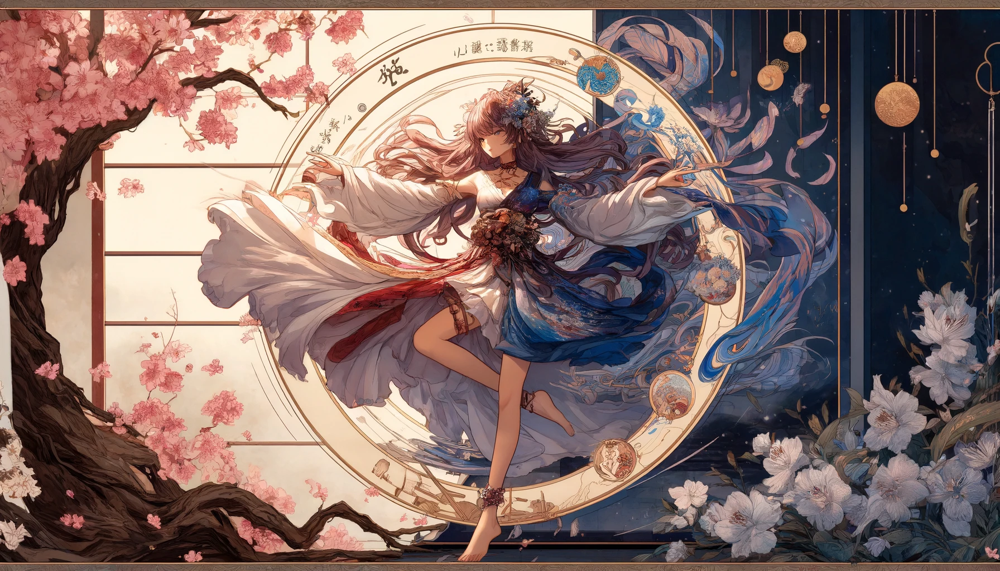

# 【生命⋅修行】在疼痛中修行

原以为昨天开始变严重的右肩疼痛会在睡一觉之后好转，没有想到的是，今天早上静坐完，活动胳膊时，发现痛得更加厉害了。那是一种阴沉沉的，关节骨缝里透出来的痛感，只不过稍微抬手，就会加剧。

不明白这疼痛是怎么来的。记得前几个月在沙特因为暴晒的天气里，坐在副驾驶吹了空调曾引发类似的痛感，还以为之后完全好了呢。肩关节的疼痛，是最剧烈的，但与此同时，自己身体各处的韧带，似乎都有着难受的酸痛感。奇怪了，昨天也没做什么特别的运动啊，除了金刚功，再就是练了一会儿太极的基本功，打了几趟十三式，跳了会儿绳。像什么俯卧撑啊，走矮步啊，还有踢腿啊，这些更剧烈、需要力量的训练统统没有做。可是，为什么连腹肌都有些酸痛呢？

即便如此，我还是跑到了租住公寓附近的小公园，那可是方圆几里黄沙地之中的唯一一块儿绿地。准备继续像昨天一样，好好舒展地运动一下。

结果，只是那个最简单的弯腰拉伸，然后举高手臂起身再向上拉伸的动作，就痛得自己呲牙咧嘴。坚持把常规的三十六次做完，竟然已经痛出汗来。接下来练金刚功的时候，肩关节更是用强烈的疼痛来刷着存在感，我索性一边嗷嗷怪叫着，一边练完。最后悲哀的发现，几乎所有的运动都会牵动到肩关节，哪怕像跳绳这样本不用特别触动肩关节的运动，也同样受到了影响。于是，原本期待的运动后由多巴胺和内啡肽带来的快感并未出现，反而被一疼痛困住的沮丧席卷了。

据最新的研究，运动之后的肌肉酸痛并不是来源于无法完全代谢的乳酸，而是相关肌肉细胞被撕裂、筋膜细胞被损伤造成的。我脑海中甚至出现了这样的画面：身体里许多细胞因为我的这次运动，粉身碎骨。但，这确实让我的身体变得更健康的必由之路。它们的成批死亡，却应对着我身体的一次小小新生。

果然，生和死，就是一体两面的事情啊。一生二，二生三，三生万物。混沌一动分阴阳，于是有了生，有了死，也有了从生到死，从死到生的成长、衰老的生命历程。于是万物生啊！

对于疼痛的本能恐惧，也和对于死亡的本能恐惧是一样的吧。可是，这疼痛意味着许多细胞的死亡，意味着生命经络的堵塞，却也意味着生命本身的刷新呢。

写到这里，我终于想起早上感动疼痛时曾想到的两个人：

一个好像是鬼脚七点奶奶，他说她每天早上醒来，就会乐呵呵地检查自己身上又多了哪个新的，会疼痛的地方；

一个是多年前18摸的同事，他本就比我年轻，而且那还是10多年前的事情。他说他本来很在意自己的身体，有什么不适就会想法尽量恢复，结果终于有一天他发现，有些病痛和损伤，自己再也不能完全恢复如初。为此，他沮丧了很久才终于接受这个现实。

所以，每一次疼痛，每一个细微的疼痛袭来、持续与消散的过程，都是一个机会，让我们可以真真切切地倾听生命的声音！

