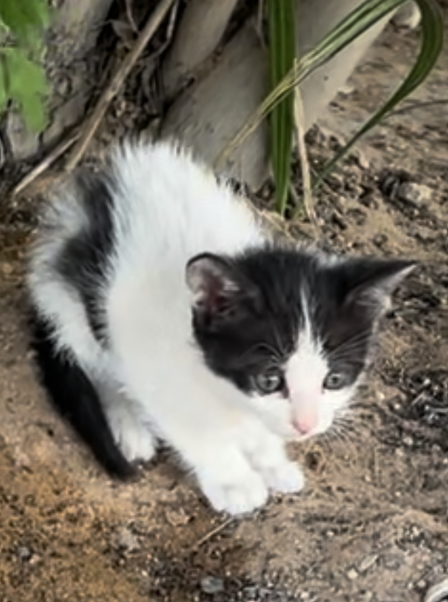
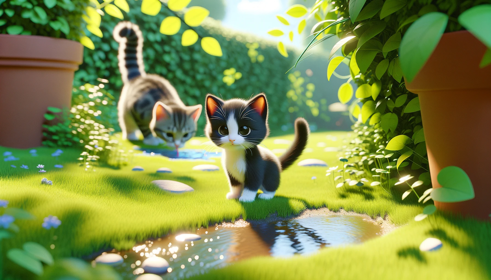
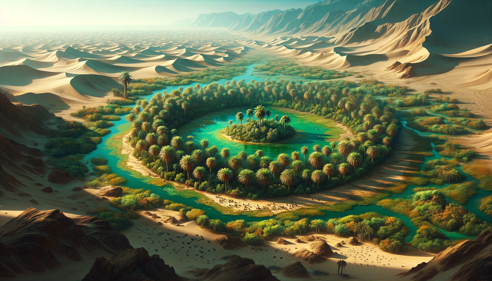

# 【随笔】曾经的沙漠绿洲

早上去锻炼的小公园里有一个公共厕所，那天从厕所出来，差点踩到半个手掌大，毛绒绒的小东西。低头一看，原来是一只小奶猫。显然，它也被我吓了一跳，一边扭头看我，一边快步从厕所门口跑出来，往几步开外的树丛跑过去。

这种毛绒绒的小生命，最能勾起那潜藏的泛滥爱心，我忍不住蹲下来，跟了过去。谁知道，一只大猫从树丛里蹭地蹿了过来，轻轻地拦在了我和小奶猫中间。原来猫妈妈在这里啊！那是一只三花猫，它警惕地打量了我一下，不知是它凭啥做出了判断，大约是料定我是个没啥威胁的家伙，只竖起尾巴从我身前蹭了过去，然后径直走开，到另一边的树丛里去观察草坪上的鸽子去了。

这小奶猫也不理我，三步并作两步，自己跑到水坑边去埋头喝水。树丛中却还有另一只小奶牛猫，好奇地冲我走了过来。见它竖着尾巴示好，我也轻轻地伸出两根手指，摸了摸它的小脑袋，小奶牛猫舒服地在我手上蹭着。这么小的猫咪，可能才不到一个月大吧，毛真软啊！

这里的草坪和大树都有灌溉的水管，一早就有工作人员来放水打理。所以才能在地图上满目的黄色中保有这一小片绿色出来。除了三花猫一家，还有几只鸽子似乎也常住在这附近，大树上还有许多只啾啾叫着其它鸟儿。我想起前几天看一篇公众号推荐周作人的书，就是提到不同的鸟儿有着不同的叫声。

早上还有两只鸽子造访我的窗台呢，它们个子小，我一开始没弄明白是什么鸟。直到它们一边「咕咕咕咕咕咕咕……」，一边探头探脑一直打探我房间里的情况时，我才意识到：

咕咕咕咕，这不是鸽子嘛！

我想，利雅得之所以能够成为阿拉伯的首都，在当年一定是这沙漠中最最大的一片绿洲吧！

