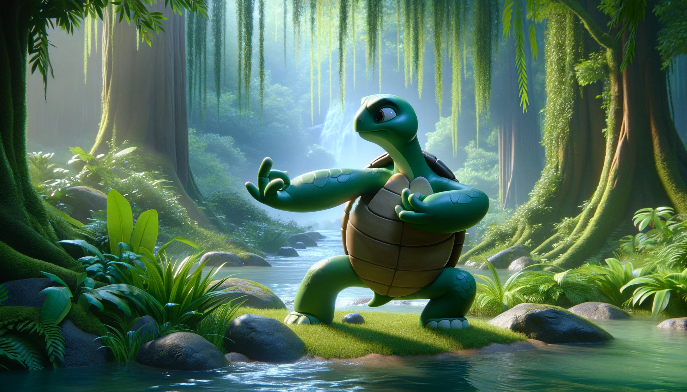

# 【生命⋅修行】时间拳击、吃青蛙与随心所欲

最近又开始琢磨时间管理的方法，当然了，逝者如斯夫——时间未曾偏袒过任何人，也不曾为任何人停留过——所谓管理时间，本质上还是管理这个用时间的人而已。

特斯拉創辦人馬一龍有个時間拳擊法（Time Boxing），前几天给大宝写信，我把它用古文翻译了一遍：

1. 確立具體可達之目標，分解為細目；
2. 一日劃為二百八十八期，依目標重要性排程，設截止時限；
3. 擇一細目，以倒計時之法，全力以赴，力求圓滿；
4. 達每一細目，審視進度是否如期，若有偏差，須復核時表或調整流程；
5. 終細目，目標成，則總結評估所得所失。

这个安排的核心，是利用Dead line对潜意识的强大影响。**Dead line**——截止时间的力量，我深有体会。我常常给自己安排许多任务，当距离真正的Dead line还远时，我总是磨磨蹭蹭不能开始，而且还常常很受折磨。眼看着剩余的时间从一个月、变成一周、然后三天、然后是最后一天。我终于从不能完成计划的痛苦中蹦起来，真正地开始着手处理。然后，几个小时通常是不够用的，一旦动手，这件事儿可能要一做就是10个小时，甚至10多个小时，然后熬夜赶在凌晨，天明之前把任务交出去。

接着会大喘气好几天，同时开始自责——同样是10多个小时可以完成的工作，为什么不能每天两小时，用一周来完成呢？

只因为Deadline 的重拳还没有砸在自己脸上！

马一龙先生的厉害就在于，他把Deadline的强大驱动力，用到了每一个细小的任务里，最小的任务有可能只是一个5分钟就能完成的事情——回复几封电子邮件、及时消息。这个相当难做到。反正，我给自己设立的截止时间，通常不会发挥那么大的心理作用。但很可能，只是自己从来没有这么去持续练习罢了。

当然，除了时间拳击法，马一龙还分享过几个相关的技巧：

* 非同步沟通
* 批量处理
* 帕累托法则（80/20）
* 一次只做一件事
* 固定作息时间

这里最重要的，可能就是帕累托法则了。他会用最好、最多的时间，通常是上午，去处理那些最重要，最需要脑力，最高价值的事情。低价值的事情尽量少做、或者委托出去、或者干脆不做。

这让我想起一个我以前就听说过的技巧，现在又被一本畅销书包装出来，叫做《吃掉那只青蛙》：

这个原则本质上就是，每天找到三个最最重要的目标，先集中精力把他们一一完成。当然了，在畅销书里还罗列了不少相关的技巧，不然这一句话，怎么能写出一本书来呢？但，大部分也都是有用的经验，我还是把它们也列下来，供自己参考吧：

- 1.定义目标并记下来
- 2.制定工作计划
- 3.专注于 20% 的任务
- 4.着眼长远，做出更好的短期决策
- 5.故意拖延
- 6.使用 ABCDE 方法
- 7.确切了解自己负责的工作
- 8.该工作的时候，就工作
- 9.开始工作之前先做好准备
- 10.一次只专注于一项任务
- 11.提升技能
- 12.发挥优势
- 13.找出阻碍前进的因子
- 14.找出动力
- 15.发掘最旺盛的精力
- 16.成为乐观主义者
- 17.远离技术困扰
- 18.将任务分解为尽可能小的组件
- 19.在日历上安排“吃青蛙”的时间
- 20.找到心流状态
- 21.处理任务，直到完成

在这里，他提到了「心流」，这可是我引以为「人类使用指南」的那本书——《跨越不可能》里提到的核心奥义。可是，真正进入心流，在那随之而来的「无时间感」中，哪里还需要什么时间管理技巧呢。

林世儒老师教我们按摩时，每当提及什么时候停止，开始下一个动作，常常说的就是：「跟着自己内心的感觉，当你觉得要停时就停，要开始下一个动作时，就开始下一个。」

随心所欲而不逾矩——这是我内心里真正想要追寻的境界啊。可要怎么达到呢？想起油麻菜在推广张致顺道长的《金刚功》时所说的窍门：

1. 开始时，每个动作练3、5、7次，最多9次。
2. 如果忘记了，那么就当刚刚练了3次。
3. 熟练了，想练几次练几次，跟着感觉走。

想要达到随心所欲，还是要从规规矩矩开始练习吧。时间管理想必依旧如此——虽然目前看来，这已经成为贯穿我生命的重要课题。

