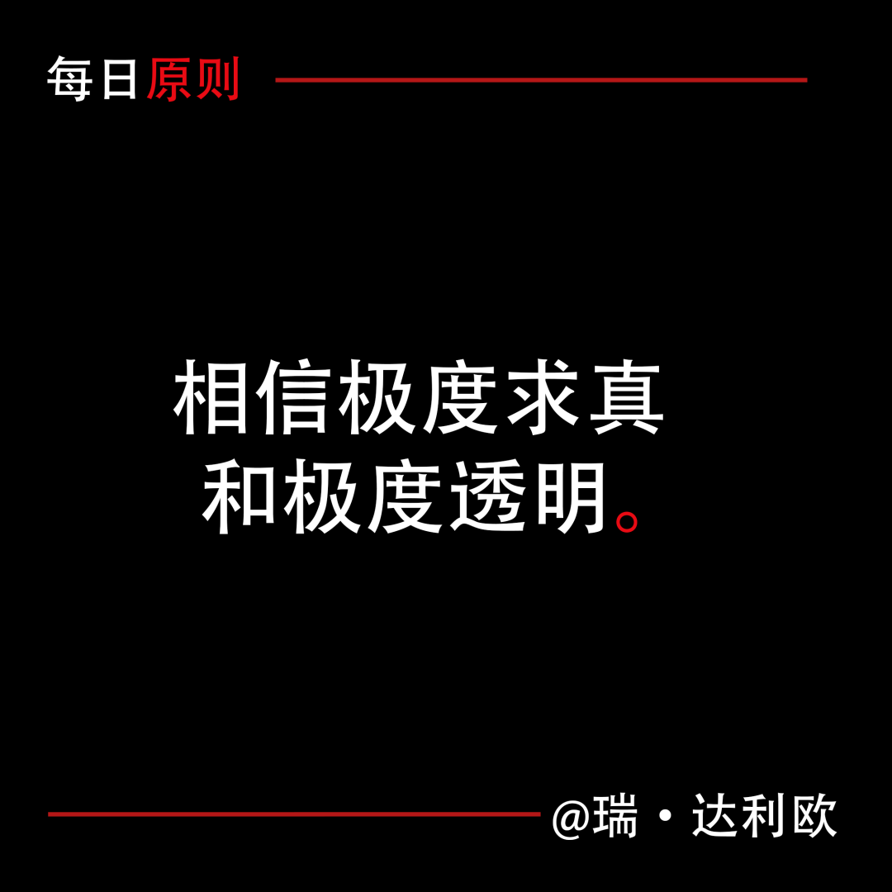
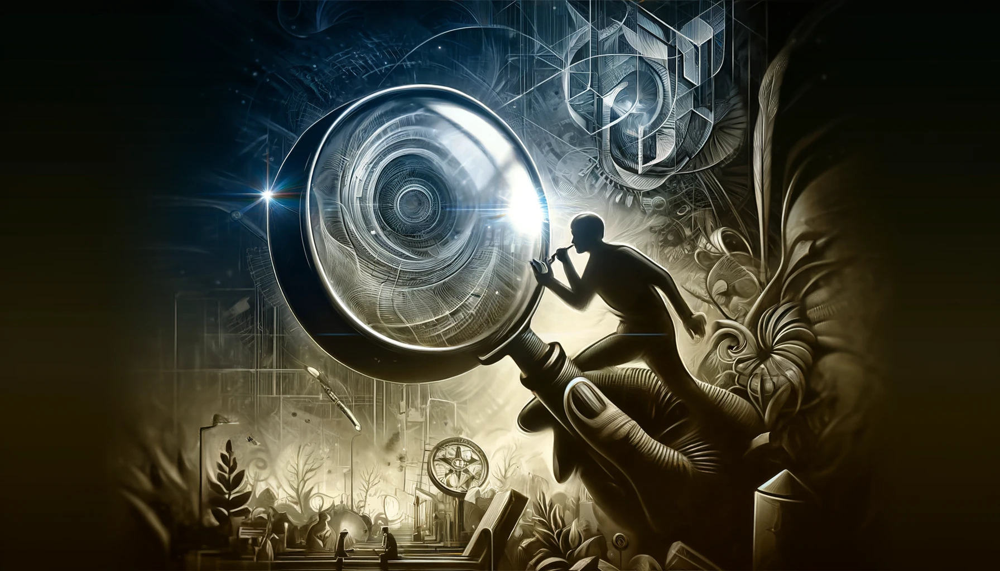

# 【生命⋅修行】相信极度求真和极度透明

达利欧在他的《原则》这本书里，一再强调「极度求真和极度透明」这一条。他说：

> 了解真相是成功的关键，而对任何事（包括错误和弱点）都保持完全透明则有助于加强理解、不断改进。这不仅仅是理论，我们在桥水已经实践了40多年，所以我们知道起所起的作用。但这与生活中的很多事情一样，坚持极度求真和极度透明，既有利，也有弊。我将尽可能准确地对此加以阐述。

遗憾的是，关于利——我觉得他讲的我听明白了，具体可以看《[每日原则：相信极度求真和极度透明](https://mp.weixin.qq.com/s/apquY74kY-K7XoN5wgikJg)》这篇公众号文章。然而，关于弊，他在这篇文章里并没有提及。

我非常相信这条原则，或许是因为这与我在《中庸》中学到的——要「**至诚**」的原则不谋而合：

> 唯天下至诚，为能尽其性。能尽其性，则能尽人之性。能尽人之性，则能尽物之性。能尽物之性，则可以赞天地之化育。可以赞天地之化育，则可以与天地叁矣。

或许，只是因为这贴合我内心的价值观吧。在家里和大宝相处，我一直秉承这这条原则。然而，在与其它人相处时，我的这个习惯却常常把人吓到甚至冒犯到。想来，这也是正常的事情。然而，像达利欧所说，在一起做事的伙伴和组织中，要不要追求这条原则呢？显然，不同人的有不同的看法。

我依然信奉并追求这条标准，但我也知道——「极度求真和极度透明」是一个可以无限逼近，但却可能永远无法抵达的终极目标。但即便如此，还是值得在生活与工作的过程中，对「世界的真相」孜孜以求。

然而，之前与S姐曾多次讨论过这条原则。每一次她都会说，她过去习惯于自己扛事儿，不去麻烦那些帮不上自己的人。她还说，在中国真实的商业环境中，你把真相袒露出来，并不合适。甚至面对伙伴和亲密的朋友，她也有说法，她认为需要有所取舍，或者，需要考虑对方的承受能力。

我一直在试图理解她的观点。虽然我坚决相信，在我的家庭与亲密关系的原则中，「极度求真和极度透明」是必须遵循与追求的首要原则，与「爱」排在同等重要的地位。但在与其它人的相处中，是否依然要坚守这个原则呢？我甚至一度认同她的部分说法，就是要考虑对方的承受能力。但现在，我忽然意识到，其实本质上。我和S姐根本就是价值观不同的两种人：我信真，她信假。如此而已……

那么，要不要考虑对方的承受能力呢？前两天在一次结束与大宝的视频通话后，我忽然悟到：不需要传递和代人承担的，仅仅是情绪而已。真相的部分，无需隐瞒。庄子在《人间世》中，早就给出了答案：

> 故法言曰：「传其常情，无传其溢言，则几乎全。」

作为使者，无论是好的情绪，还是坏的情绪，都不需要传递。同理，与至亲至朋，乃至其他工作伙伴交往，关于自己或他人情绪这部分信息，完全不需要传递或者接受。只有事实的那一部分需要传递，需要求真，需要透明。

至此，我总算更近一步，捋明白了这个「求真」原则在应用中的一些小小注意事项。且先记录在这里，供自己将来乃至其他有需要的朋友参考。

