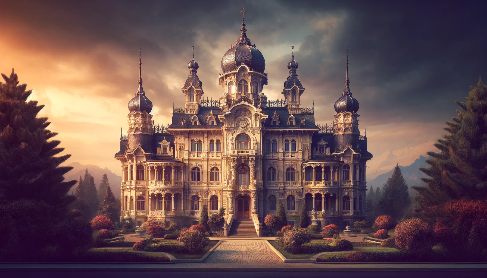
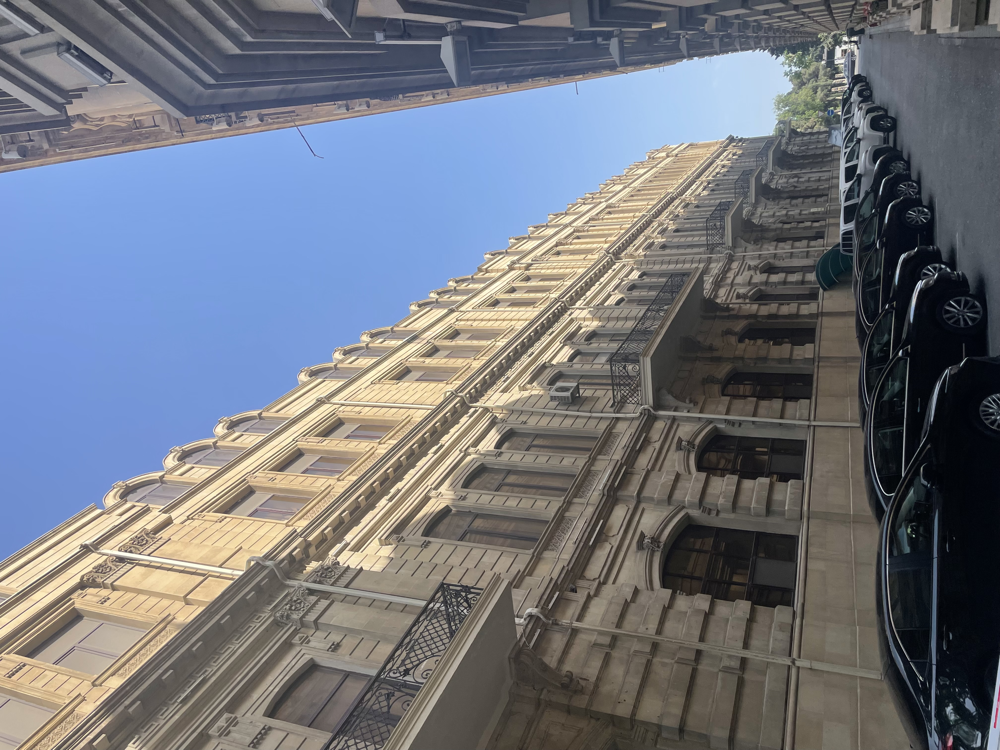
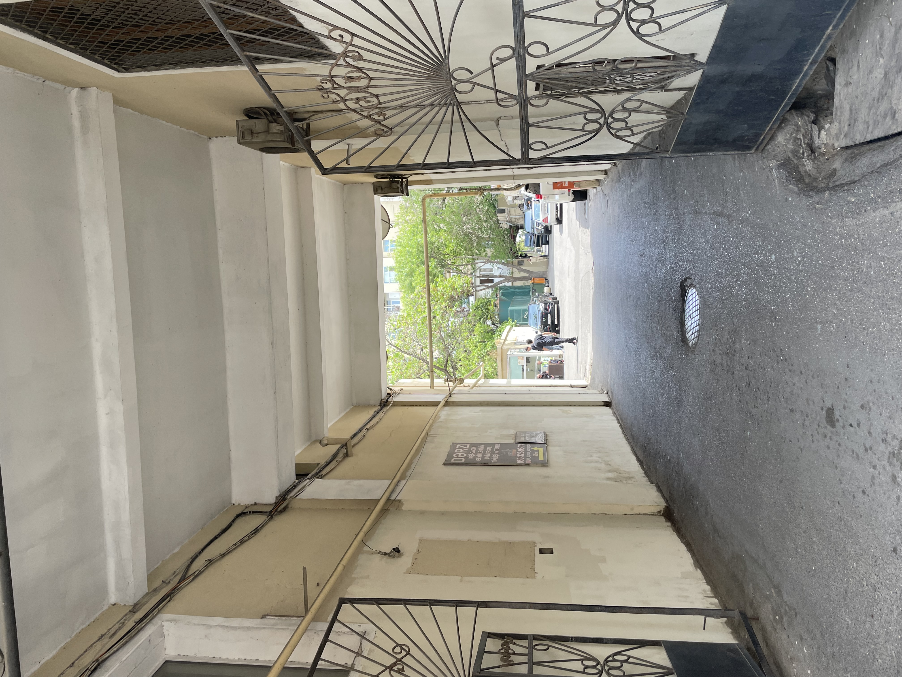
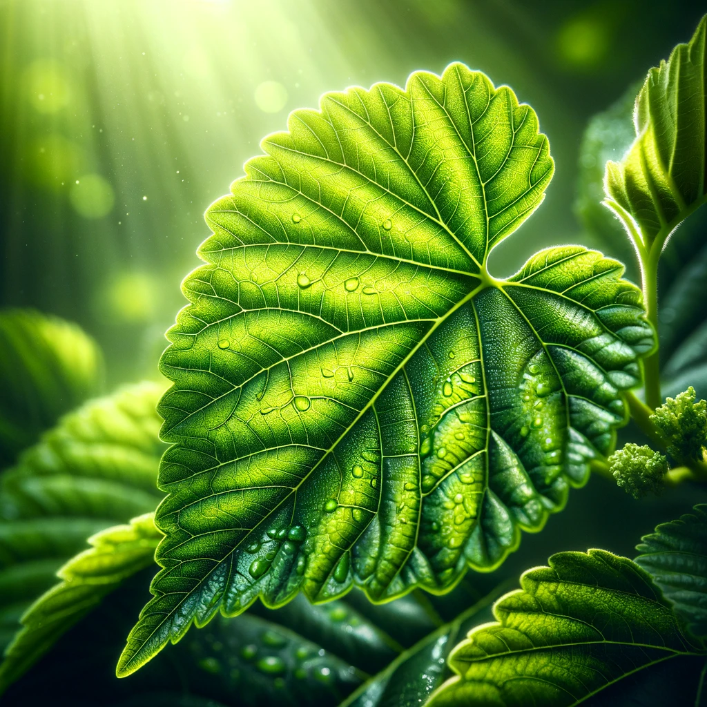

# 【随笔】一定是错觉

阿塞拜疆这个国家，或者准确的说——巴库这个城市很有意思。明明是穆斯林国家，但除了国旗上的星月标志，感受不到特别的宗教氛围。不仅没有中东国家特有的每天五次唱诵声，就连典型穆斯林风格的圆顶教堂也不多见。

更多的建筑风格，都是那种在哈尔滨常常能见到的厚重得像城堡一样的大房子。或许，这都是因为苏联的影响吧。更有意思的是，那些大房子外面看着巍峨雄伟。走进这些院子的大门，却是一股子北京大院的气息扑面而来。随意停满的车辆，简单的水泥墙，各种看上去像违建的棚屋，以及许多高大的树木，有年份的水泥地和红砖地。再加上五月初的巴库，天气乍暖还寒，太阳出来晒着就暖融融的，阴凉处风一吹又凉嗖嗖的。树上的枝叶大多还是嫩嫩的新绿色，在阳光下，看着那一枝枝新绿，被风吹着摇来摆去，简直和北京的春天没什么两样。

几个小孩子操着我听不懂的语言在大院的滑梯处玩耍，角落里不知什么地方有一只猫，拼了命地喵喵大叫——那声音我熟悉，不是小猫，而是一只大猫，估计是被关着或被困在什么地方了。鸟叫声铺天盖地，叽叽喳喳，似乎所有的树上、天上都是各种不知名的鸟儿在歌唱。

对了，那滑梯边的大树，还是一棵桑树呢，看着嫩绿的桑叶，真的是非常亲切。这种感觉和氛围，实在太过熟悉。既像我曾经呆过的北京，也像我小时候生活的武汉。

这天气，这氛围，真是舒服极了。甚至有那么点故乡的感觉，我想，这一定是错觉吧！