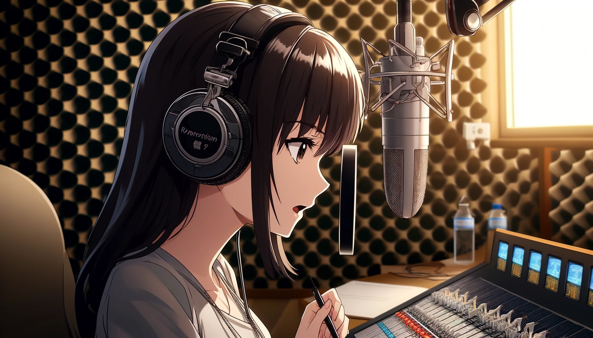
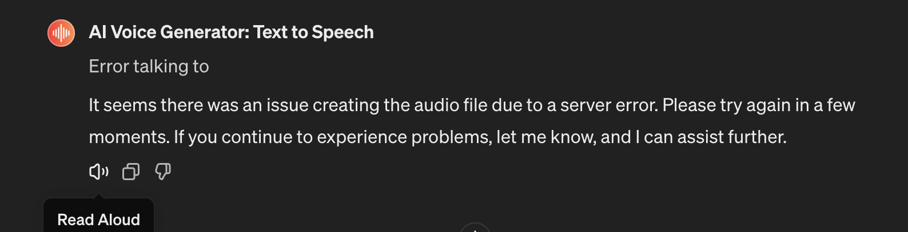
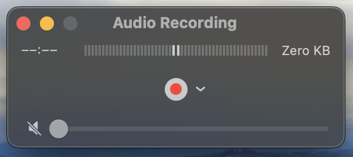
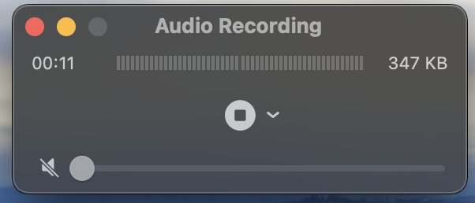

# 【教程】一个生成英文语音的简单方法

李笑来最近一直在推广每天3小时，强化学习英语。甚至他还为此写了一个程序，叫做[Enjoy](https://1000h.org/enjoy-app/)，https://1000h.org/enjoy-app/ 正好我着急需要为一个会议的发言做准备。讲解词已经弄好了，最好是找个语音再跟着练习练习。于是乎，赶紧找到Mac版，下载安装完毕。

但是很遗憾，Enjoy需要配置Open AI的API Key才能使用文本转语音，可我目前还没把API Key这个问题解决呢。想了想，现在先解决这个问题，未免有点来不及了。还是先绕路吧！

曾经使用过Murf AI https://www.murf.ai 来生成视频的英文配音，说实话，效果非常不错，可选择的声音、腔调也非常多。但是，它给我这个新用户10分钟免费时长上次就已经用完。而此时，我只是想找个标准的语音来进行跟读练习，每个月花上23美刀，可实在是有点心疼舍不得。

之前还有用过另外几个免费方案：

1. 其一是微软的Clipchamp，https://app.clipchamp.com/。但是它本来的用途是创建视频的，虽然可以有免费调用微软TTS为视频配音，但最后还得专门从视频里再把音频扣出来，未免太麻烦。

2. 另一个是Speechify，https://app.speechify.com/。通过上传文件生成音频倒是轻松容易，但是想要下载，对不起，一个月29美刀。而且，它生成的语音，总有些词读得怪怪的，听起来不是那么自然。

3. 我想起了GPTs。在GPTs里，曾经用过最好用的服务就是elevenlabs 服务了，https://chatgpt.com/g/g-h0lbLuFF1-elevenlabs-text-to-speech。但是，它有长度限制，并且最开始免费白嫖还行，后来服务不可用的情况就越来越多。

4. 但是，我现在重新再换一个GPTs总是可行的吧？再次搜索Text to Voice，有25K+对话记录的叫做AI Voice Generator，https://chatgpt.com/g/g-MJYELDDFg-ai-voice-generator-text-to-speech。用法倒也简单，把文本扔过去，它就会请你确认需要转换的脚本。然后就会尝试调用它自己的服务来生成音频文件。但是，第一次就失败了！

但是，当我把鼠标移到回答下方时，屏幕上赫然出现了一个小喇叭的图标，以及Read Aloud的提示。咦？这是GPT的官方功能吗？我点了一下……我去！这声音完美啊！和GPT 手机版的效果可以说一模一样。

 [Read-Aloud.m4a](Read-Aloud.m4a) 

得，既然如此，只是应急的话，我又何必需要AI Voice Generator 为我生成音频文件呢。现在解决方案变得非常简单了：

1. 首先，我打开QuickTime，在文件菜单中选择「New Audio Recording」

2. 然后在新弹出的Audio Recording窗口上点击那个红红的录音按钮

3. 接着，回到ChatGPT 与AI Voice Generator的对话中，在它确认语音文本的那个回答里，点击播放按钮，让它「Read Aloud」。

4. 然后，耐心等待ChatGPT朗读完毕，回到Audio Recording窗口，点击停止按钮。

   

5. 最后，起个好名字，把音频保存「Save As」吧。

就这样，只需要ChatGPT（最多找一个合适的GPTs，比如这个会重复你说话内容的AI Voice Generator）和QuickTime，就可以简单地生成英语音频用来学习了。