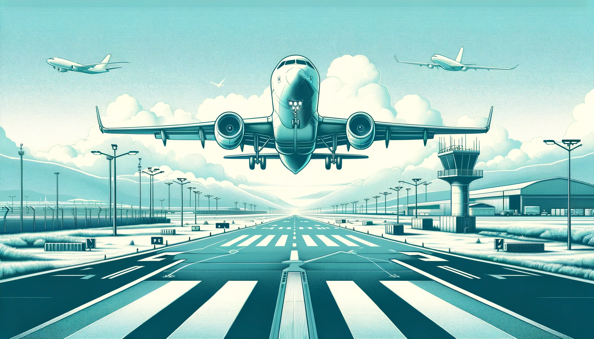
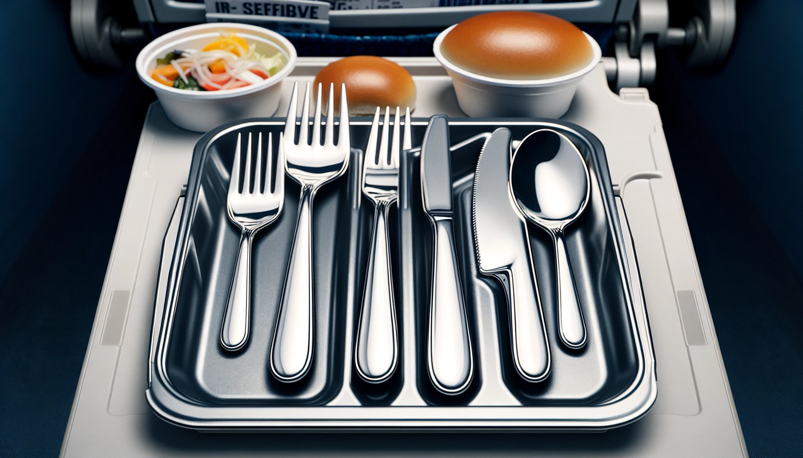

# 【随笔】廉航的「头等舱」

Flynas 是总部在利雅得的一家廉航，最近在中东跑来跑去，每次按照价格筛选时，大概率都会选中它家的航班。那天，因为要拖着我那超过20公斤的行李箱出行，却没有25公斤行李额度的票卖了，于是乎只好选了30公斤行李额度的一张票。

没曾想，到机场换票时，直接拿到了第一排靠走道的座位。起初我还以为只是自己运气好，等坐下才发现，它们家第一排的座位被改造了一下。中间的座位上安装了一个餐桌，不再坐人，只剩下靠窗、靠走道的四个位置安排乘客。然后座位后面还拉上了帘子，将这四个座位与其它座位隔开。

这？这？这？难道是Flynas的「头等舱」？

平飞后，空姐起身把帘子拉上，还阻止了一位后排过来的乘客使用前面的洗手间。我这才得以确认，这四个座位看来是不太一样，之前给我发的那一小瓶矿泉水，原来也是部分才有的小特权。闹了半天，这次我无意间多花了一点钱，竟然买到了这家廉航的头等舱啊。然后，等到用餐时刻，更有趣的事情来了。本来早已经习惯了，坐廉航是既没有水，也没有食物。但这次，空姐早早就来客气地询问，我想要吃什么东西。当然，选择并不多，无非是牛肉、鸡肉二选一而已。

等餐盒端上来，却让我哭笑不得起来。原来，它的餐具没有像一般的航空公司那样，用普通的，装在塑料袋里的一次性餐具。而是煞有介事地用餐巾包裹起来，里面还透出闪闪的银光。我内心不由得赞叹了一下，咦？竟然没有用一次性餐具，还真有点高级呢！可是，等我按照拿一堆不锈钢刀叉的力气，抓起包裹着餐巾的餐具时，差点闪了手。出乎意料、根本就是轻飘飘的一把！仔细一看，原来餐巾是一次性的纸巾，只是纹路有点像纺织品，而刀叉则是镀银的塑料货，关键还是那种质量及其普通，模具线都清晰可见，又薄又脆的廉价塑料货。只不过镀上了银色的漆而已。

这种反差，实在是太让人难忘了。至于餐食味道如何，我已经完全忘记了。真不明白，这家航空公司是怎么想，怎么设计出这样的四个位置来的。那些坐惯头等舱、商务舱的旅客，因为航班原因不得不选择这家航空公司的航班时，秘书们或许会贴心地选择这最贵、最宽敞的座位。可是这镀银的廉价塑料餐具，未免就太减分了吧。真还不如塑料袋装的一次性餐具，来得更货真价实呢。

