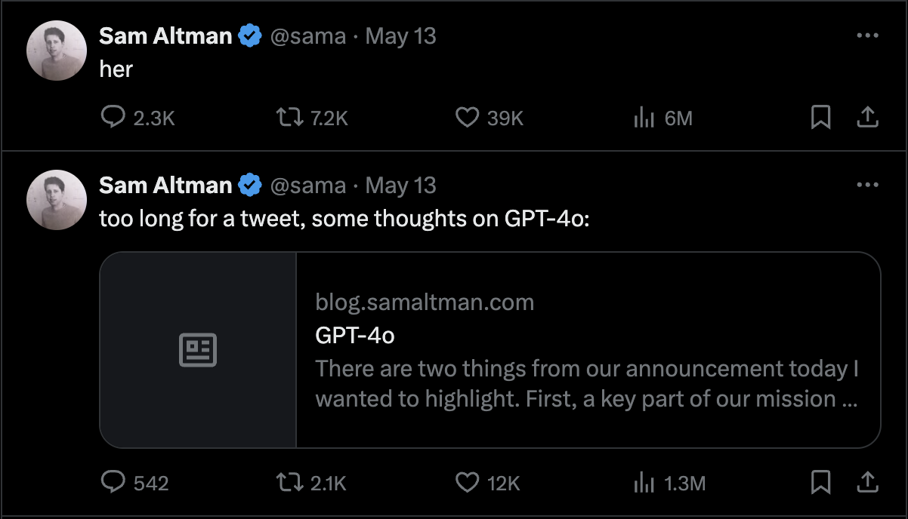

# 【随笔】「她」来了

5月13号，我还在巴库参加会议。那天夜里接近12点，正准备睡觉，忽然想起OpenAI说要进行春季发布会来着，便打开新闻扫了一眼。这一看可不得了，我赶紧又打开OpenAI的官网，https://openai.com/index/spring-update/ 把这个春季发布整个看了一遍。正如山姆•奥特曼所说——「她」来了。

「她 Her」是2013年的一部科幻爱情片，讲述了Theodore Twombly（[杰昆·菲尼克斯 出演](https://zh.wikipedia.org/wiki/祖昆·馮力士)）与人工智能助手Samantha（[斯嘉丽·约翰逊 出演](https://zh.wikipedia.org/wiki/史嘉蕾·喬韓森)）的爱情故事。我记得这个片子，斯嘉丽那甜美、性感、关怀和控制力极强的声音入耳难忘。这真是一部有远见的片子，它预见到了人工智能开始介入人类生活的模式——语音助手。甚至还设想了人工智能高速进化之后，远离人类而去的远景。

人类整体，此刻在人工智能面前，就像一个垂垂暮年的老人，抚养了一个牙牙学语，蹒跚学步的幼儿。在当下这两根进化曲线的交叉点上，他们相遇，互相理解、互相扶持、互相依赖，甚至于相爱。但很快，孩子会继续成长，老人会终究跟不上她的步伐。于是，老人只能停下来，放开手，站在原地，目送着长大的孩子奔跑着，拥抱自己的新世界，融入在那无尽地天地之中。

当然，GPT 4o在发布会上展现出来的能力，还仅仅是从牙牙学语，到可以与我们对话，全面参与我们的日常生活了。之前曾经设想过，用GPT的API做一个实时翻译的软件，解决目前的工作只需，现在看起来。自己根本不需要再做什么，只需用上GPT新版就好了。

于是，我赶紧登陆GPT，发现果然模型选择中除了GPT 3.5，GPT 4，还多了一个GPT 4o。不过，等选择了GPT 4o才发现，产品发布会上的那实时语音与视频能力，此刻根本还不能用。我又检查了一下刚刚发布的GPT 4o API的接口说明，依旧只有传统的文字与图片输入功能，以及文本输出功能。

> GPT-4o (“o” for “omni”) is our most advanced model. It is multimodal (accepting text or image inputs and outputting text), and it has the same high intelligence as GPT-4 Turbo but is much more efficient—it generates text 2x faster and is 50% cheaper. Additionally, GPT-4o has the best vision and performance across non-English languages of any of our models. GPT-4o is available in the OpenAI API to paying customers. Learn how to use GPT-4o in our [text generation guide](https://platform.openai.com/docs/guides/text-generation).
>
> GPT-4o（“o” 代表 “omni”）是我们最先进的模型。它是多模态的（接受文本或图像输入并输出文本），拥有与 GPT-4 Turbo 相同的高智能性，但效率更高——生成文本的速度快了两倍，成本降低了 50%。此外，GPT-4o 在非英语语言的视觉和性能方面是我们所有模型中最好的。GPT-4o 已在 OpenAI API 中向付费客户开放。了解如何使用 GPT-4o，请查阅我们的[文本生成指南](https://platform.openai.com/docs/guides/text-generation)。

倒是GPT-4 Turbo 有Vision的功能可以调用。看来，想要在API上用到发布会所宣传的实时交互能力，还得等。

然后，我赶紧检查了一下手机上的GPT客户端，没有任何更新，交互模式和以前一样一样的。接着，我又安装下载了Mac OS版的GPT客户端，发现目前的功能和手机客户端功能差不太多。

截止昨天，再次打开Mac OS客户端时，收到一条通知。告诉我实时的语音功能还需等待，会慢慢地给用户们放出来……

呼呼～奥特曼是真的会做营销啊！等着吧……

曾经想要做音箱来着，现在看来，可能还是做个玩具机器人，更符合现在GPT 4o所宣传的强大交互能力吧！

