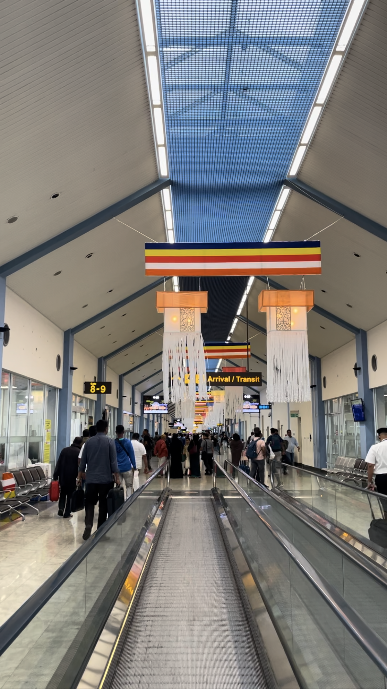

# 【随笔】神秘的孔雀蓝

我想，这应该是我第一次乘坐斯里兰卡航空，也是第一次到达这个被称作「印度洋上的泪滴」的地方。还在候机时，我就被空姐身上那神秘的孔雀蓝色传统制服吸引住了目光，我还从来没见过哪家航空公司的制服是这么干脆、完全地使用民族服饰。真是辨识度太强了，一眼难忘。

听说，这套衣服每个部分还都有自己的名字，上半身的短衣叫Jim Poole，长裙叫Beidigeer，再就是那条孔雀花纹标志性的纱丽。配合斯里兰卡空姐那深深的五官，真的很好看。

飞机上的座椅也被装饰成同色系的孔雀蓝，以致于一上飞机，就感受到一种浓烈的异域风情感。飞机餐和餐具都蛮精致，还配了一个玻璃杯给乘客倒水喝，再加上一杯经典的锡兰红茶，还真有点特色感觉。正巧赶上日出，看着阳光一点一点勾勒出云海的轮廓于形状，看着磅礴的云雾蒸腾翻滚，看着大海尽头的陆地一点点展现，觉得美极了。想到这满满一飞机，从肤色到语言，都无比陌生的人们，大多都是在这个地方出生、成长、生活，我们共享着这同一个美丽的星球，却有着完全不同的生活经历与细节，不禁特别感慨。

到了科伦坡机场的时候，外面好像正在下雨，走在廊桥上，回忆起几个小时前利雅得火烤一般的炙热，顿时有一种被从烤箱捞出来之后，直接扔进蒸笼的感觉。空气明明是湿漉漉的，但嘴唇却快干裂了。科伦坡机场感觉并不大，设施也颇为老旧。走廊上挂着奇怪的蔓布。这里虽然有免费WiFi，却慢得和蜗牛一样。我试着给大宝视频，几乎只能是静止画面，然后过了一会儿就断了，再也连不上。我实在是太困太累了，可是坐在登机口的椅子边，却睡不着。只迷迷糊糊地听见广播一次又一次地宣布，我的航班推迟一个小时，又推迟一个小时……

终于再次坐上飞机，又给自己来了一杯锡兰红茶。这一程，更加是迷迷糊糊地，不知不觉就到了吉隆坡。

然而，拿行李时发现，我那Tumi的大箱子，轮子少了一个！呼～ 一定是在斯里兰卡机场转运时被摔掉的吧？我这么想着，对斯里兰卡一路以来的神秘好感，顿时烟消云散！