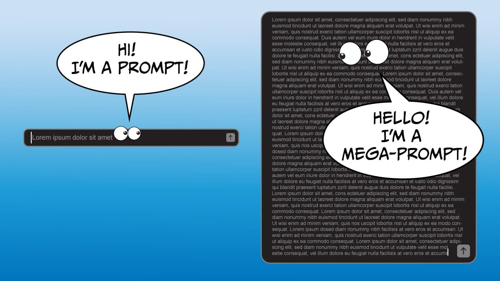

#  【教程】Prompt还要怎么学

想做和想学的事情，真的会像滚雪球一样越来越多。那天翻看了一下吴恩达在10多天前发布的一篇文章后，意识到关于Prompt还值得再好好学习、研究一下。

吴恩达的这篇文章发表在这里：https://www.deeplearning.ai/the-batch/issue-249/，其中提到了Mega Prompt的概念。他的原文是这样的：

> Dear friends,
>
> In the last couple of days, Google announced a doubling of Gemini Pro 1.5's input context window from 1 million to 2 million tokens, and OpenAI released GPT-4o, which generates tokens 2x faster and 50% cheaper than GPT-4 Turbo and natively accepts and generates multimodal tokens. I view these developments as the latest in an 18-month trend. Given the improvements we've seen, best practices for developers have changed as well.
>
> Since the launch of ChatGPT in November 2022, with key milestones that include the releases of GPT-4, Gemini 1.5 Pro, Claude 3 Opus, and Llama 3-70B, many model providers have improved their capabilities in two important ways: (i) reasoning, which allows LLMs to think through complex concepts and and follow complex instructions; and (ii) longer input context windows. 
>
> The reasoning capability of GPT-4 and other advanced models makes them quite good at interpreting complex prompts with detailed instructions. Many people are used to dashing off a quick, 1- to 2-sentence query to an LLM. In contrast, when building applications, I see sophisticated teams frequently writing prompts that might be 1 to 2 pages long (my teams call them “mega-prompts”) that provide complex instructions to specify in detail how we’d like an LLM to perform a task. I still see teams not going far enough in terms of writing detailed instructions. For an example of a moderately lengthy prompt, check out [Claude 3’s system prompt](https://twitter.com/AmandaAskell/status/1765207842993434880?utm_campaign=The Batch&utm_source=hs_email&utm_medium=email&_hsenc=p2ANqtz-_PU4gmbfJN9_gBrzLMkZheDB1ROQnQWYv9cSxeMK53CO9ix0aYRLcabOd6v3xmmbHcM7HE). It’s detailed and gives clear guidance on how Claude should behave. 
>
> 
>
> This is a very different style of prompting than we typically use with LLMs’ web user interfaces, where we might dash off a quick query and, if the response is unsatisfactory, clarify what we want through repeated conversational turns with the chatbot.
>
> Further, the increasing length of input context windows has added another technique to the developer’s toolkit. GPT-3 kicked off a lot of research on few-shot in-context learning. For example, if you’re using an LLM for text classification, you might give a handful — say 1 to 5 examples — of text snippets and their class labels, so that it can use those examples to generalize to additional texts. However, with longer input context windows — GPT-4o accepts 128,000 input tokens, Claude 3 Opus 200,000 tokens, and Gemini 1.5 Pro 1 million tokens (2 million just announced in a limited preview) — LLMs aren’t limited to a handful of examples. With [many-shot learning](https://arxiv.org/abs/2404.11018?utm_campaign=The Batch&utm_source=hs_email&utm_medium=email&_hsenc=p2ANqtz-_PU4gmbfJN9_gBrzLMkZheDB1ROQnQWYv9cSxeMK53CO9ix0aYRLcabOd6v3xmmbHcM7HE), developers can give dozens, even hundreds of examples in the prompt, and this works better than few-shot learning. 
>
> When building complex workflows, I see developers getting good results with this process: 
>
> - Write quick, simple prompts and see how it does.
> - Based on where the output falls short, flesh out the prompt iteratively. This often leads to a longer, more detailed, prompt, perhaps even a mega-prompt.
> - If that’s still insufficient, consider few-shot or many-shot learning (if applicable) or, less frequently, fine-tuning.
> - If that still doesn’t yield the results you need, break down the task into subtasks and apply an agentic workflow.
>
> I hope a process like this will help you build applications more easily. If you’re interested in taking a deeper dive into prompting strategies, I recommend the Medprompt [paper](https://arxiv.org/abs/2311.16452?utm_campaign=The Batch&utm_source=hs_email&utm_medium=email&_hsenc=p2ANqtz-_PU4gmbfJN9_gBrzLMkZheDB1ROQnQWYv9cSxeMK53CO9ix0aYRLcabOd6v3xmmbHcM7HE), which lays out a complex set of prompting strategies that can lead to very good results.
>
> Keep learning!
>
> Andrew 
>
> 亲爱的朋友们，
>
> 在过去的几天里，谷歌宣布将Gemini Pro 1.5的输入上下文窗口从100万令牌增加到200万令牌，OpenAI发布了GPT-4o，这个模型的生成速度比GPT-4 Turbo快2倍，成本降低50%，并且可以本地接受和生成多模态令牌。我认为这些发展是过去18个月趋势的最新体现。鉴于我们已经看到的改进，开发人员的最佳实践也发生了变化。
>
> 自2022年11月ChatGPT发布以来，经历了包括GPT-4、Gemini 1.5 Pro、Claude 3 Opus和Llama 3-70B的发布，许多模型提供商在两个重要方面提高了他们的能力：（一）推理能力，使大语言模型能够思考复杂概念并执行复杂指令；（二）更长的输入上下文窗口。
>
> GPT-4和其他高级模型的推理能力使它们在解释带有详细指令的复杂提示方面表现得非常出色。许多人习惯于向大语言模型快速发送1到2句的查询。相比之下，在构建应用程序时，我看到一些高级团队经常编写可能长达1到2页的提示（我的团队称之为“巨型提示”），其中包含复杂的指令，详细说明我们希望大语言模型如何执行任务。我仍然看到有些团队在编写详细指令方面做得不够。一个中等长度提示的例子可以参考[Claude 3的系统提示](https://twitter.com/AmandaAskell/status/1765207842993434880?utm_campaign=The Batch&utm_source=hs_email&utm_medium=email&_hsenc=p2ANqtz-_PU4gmbfJN9_gBrzLMkZheDB1ROQnQWYv9cSxeMK53CO9ix0aYRLcabOd6v3xmmbHcM7HE)。它详细且明确地指导了Claude应如何表现。这种提示方式与我们通常在大语言模型的网页用户界面中使用的方式非常不同，在那里我们可能快速提出查询，如果响应不满意，可以通过与聊天机器人反复对话来澄清我们的需求。
>
> 此外，输入上下文窗口的长度增加为开发人员提供了另一种工具。GPT-3引发了大量关于少样本上下文学习的研究。例如，如果你使用大语言模型进行文本分类，你可能会提供少量——比如1到5个——文本片段及其类别标签，以便它可以使用这些示例来推广到更多的文本。然而，随着输入上下文窗口的长度增加——GPT-4o接受128,000个输入令牌，Claude 3 Opus接受200,000个令牌，Gemini 1.5 Pro接受100万个令牌（最新宣布的有限预览中增加到200万个）——大语言模型不再局限于少量示例。使用[多样本学习](https://arxiv.org/abs/2404.11018?utm_campaign=The Batch&utm_source=hs_email&utm_medium=email&_hsenc=p2ANqtz-_PU4gmbfJN9_gBrzLMkZheDB1ROQnQWYv9cSxeMK53CO9ix0aYRLcabOd6v3xmmbHcM7HE)，开发人员可以在提示中提供几十甚至上百个示例，这比少样本学习效果更好。
>
> 在构建复杂的工作流程时，我看到开发人员通过以下过程获得了良好的结果：
>
> - 编写简单的快速提示，看看效果如何。
> - 根据输出的不足之处，迭代地充实提示。这通常会导致更长、更详细的提示，甚至可能是巨型提示。
> - 如果这仍然不够，考虑使用少样本或多样本学习（如果适用）或较少使用的微调。
> - 如果仍然无法获得所需结果，则将任务分解为子任务并应用代理工作流程。
>
> 我希望这样的过程能帮助你更轻松地构建应用程序。如果你有兴趣深入了解提示策略，我推荐Medprompt [论文](https://arxiv.org/abs/2311.16452?utm_campaign=The Batch&utm_source=hs_email&utm_medium=email&_hsenc=p2ANqtz-_PU4gmbfJN9_gBrzLMkZheDB1ROQnQWYv9cSxeMK53CO9ix0aYRLcabOd6v3xmmbHcM7HE)，其中列出了复杂的提示策略，可以带来非常好的结果。
>
> 继续学习！
>
> Andrew

我们看到，吴恩达总结的关键流程是这样的：

1. 编写简单的快速提示，看看效果如何。
2. 根据输出的不足之处，迭代地充实提示。这通常会导致更长、更详细的提示，甚至可能是巨型提示。
3. 如果这仍然不够，考虑使用少样本或多样本学习（如果适用）或较少使用的微调。
4. 如果仍然无法获得所需结果，则将任务分解为子任务并应用代理工作流程。

这让我想起冯唐总结的金线原理：

**解决一切问题的实质就是追求以假设为驱动、以事实为基础、符合逻辑的真知灼见（Hypothesis driven, fact-based, logical insights）**

然后，在这个追求过程中，是那被金线串起的，一个个符合金字塔原理的结构化思维、结构化表达的**金字塔**们。

归根结底还是思维啊，只有更深入的思考才能更逼近真理。与AI交互的Prompt也是这样：先来个简单的提示试着直奔结果，然后反复地进行结构化的迭代。甚至将这结构扩充到Prompt之外，所谓少样本、多样本学习以及应用代理。

所以，接下来的时间，我想先依次学习一下这几篇PDF和课程，并真正试着在我自己的工作、学习场景中应用一下。

1. 吴恩达教授推荐的关于复杂提示策略的Medprompt论文 https://arxiv.org/pdf/2311.16452。
2. Google的 Gemini Prompting Guide 101 https://services.google.com/fh/files/misc/gemini-for-google-workspace-prompting-guide-101.pdf
3. 关于多样本学习的论文 https://arxiv.org/pdf/2404.11018。
4. 吴恩达推荐的，关于Agent 与RAG的两个短课程：
   * [Multi AI Agent Systems with crewAI](https://www.deeplearning.ai/short-courses/ai-agent-workflows-with-crewai/?utm_campaign=The%20Batch&utm_source=hs_email&utm_medium=email&_hsenc=p2ANqtz-_PU4gmbfJN9_gBrzLMkZheDB1ROQnQWYv9cSxeMK53CO9ix0aYRLcabOd6v3xmmbHcM7HE)
   * [Building Multimodal Search and RAG](https://www.deeplearning.ai/short-courses/building-multimodal-search-and-rag/?utm_campaign=The%20Batch&utm_source=hs_email&utm_medium=email&_hsenc=p2ANqtz-_PU4gmbfJN9_gBrzLMkZheDB1ROQnQWYv9cSxeMK53CO9ix0aYRLcabOd6v3xmmbHcM7HE)

对了，前面那三个PDF我都下载了，想一起学习需要这三个文件的可以找我。