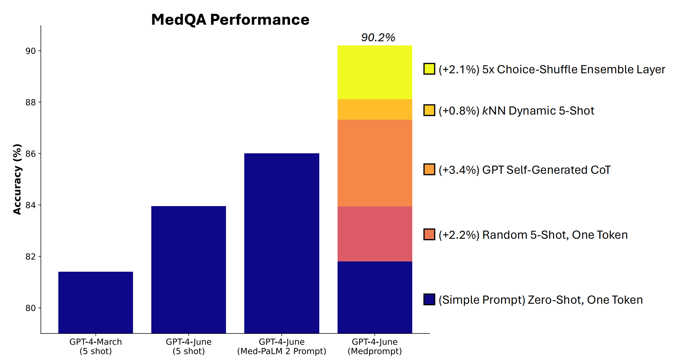

# 【教程】跟着微软论文学高级Prompt能力（一）

决定仔细读吴恩达教授推荐的《Can Generalist Foundation Models Outcompete Special-Purpose Tuning? Case Study in Medicine 通用基础模型能否超越特定用途的微调？医学案例研究》这篇简称为MedPrompt的论文 https://arxiv.org/pdf/2311.16452 之后。我先简单咨询了一下 ChatGPT：

> 我打算在你的帮助下学一篇21页左右的论文，可以吗？你建议怎么开始？

它迅速给出了一个看起来中规中矩的建议：

> 当然可以，我很高兴能帮你学习论文。学习论文可以分成几个步骤，这样可以更有效率地理解和掌握内容。以下是一个推荐的步骤：
>
> ### 1. 获取论文并初步了解
>
> - **获取全文**：确保你有论文的完整电子版或纸质版。
> - **快速浏览**：先快速浏览一遍论文，了解其大致结构和主要内容，注意论文的标题、摘要、引言、结论、以及各个章节的标题和副标题。
>
> ### 2. 详细阅读并做笔记
>
> - **分段阅读**：将论文分成几部分，每天阅读几页，不要一次性读完21页，这样可以更好地吸收信息。
> - **做笔记**：在阅读过程中，随时做笔记。记录下重要的概念、数据、结论，以及你不理解或有疑问的地方。
>
> ### 3. 深入理解与讨论
>
> - **查找背景信息**：对于不理解的概念，先尝试在网上或其他书籍中查找相关背景信息。
> - **讨论与提问**：如果有不理解的地方，可以随时问我或者与同事、导师讨论，讨论是加深理解的好方法。
>
> ### 4. 总结与回顾
>
> - **总结**：在完成阅读后，尝试总结论文的主要内容、贡献、和你的理解。可以写一个简短的总结或复述主要观点。
> - **回顾**：定期回顾之前的笔记和总结，确保你真正掌握了论文的内容。
>
> ### 5. 应用与扩展
>
> - **应用知识**：尝试将论文中的理论或方法应用到实际工作中，或与自己当前的项目结合。
> - **扩展阅读**：根据论文的参考文献列表，选择几篇相关的文献进行进一步阅读，这有助于你深入了解该领域。
>
> ### 具体学习计划示例
>
> - **第一天**：获取论文，快速浏览全文，了解大致结构。
> - **第二天到第五天**：每天阅读5页，做详细笔记。
> - **第六天**：查找背景信息，解答疑惑。
> - **第七天**：总结全文，写出自己的理解。
> - **之后**：定期回顾，应用知识，并扩展阅读相关文献。
>
> 如果你有具体的论文或需要更详细的帮助，可以随时告诉我。我可以根据论文的具体内容提供更详细的指导。

说实话，这段建议太长了，请你先略过，之后我可能会试着结合学到的MedPrompt技巧，再一次重新提问，看看能得到什么样更好的答案。

先回到这篇论文吧，先问自己三个重要的问题：

1. 这篇文章讲了什么？
2. 通过这篇文章我可以学到什么，学会了、用起来之后能得到什么价值？
3. 具体一步一步怎么学，怎么用呢？

接下来，我就试着一步一步回到这三个问题。

## 1. MedPrompt这篇论文讲了什么？

其实，文章的标题说得很明白了：通用基础模型能否超越特定用途的微调？医学案例研究。文章用一个医学案例的研究，回答了这个问题：「**通用基础模型能否超越特定用途的微调？**」

那么答案是什么呢？

短一点的答案是：**能！**

长一点的答案是：**能！通过引入MedPrompt，通用基础模型GPT4取得了超过最先进的专业模型如Med-PaLM的成绩，不论是在模型调用次数上，还是在专业考试的回答得分上，都大幅领先。并且，除了医学专业考试，这套MedPrompt方法，还可以引申推广到其他领域，比如电气工程、机器学习、哲学、会计、法律、护理和临床心理学……**

是不是让人动心？只用一套所谓MedPrompt，就能够让GPT4超过目前最先进的专业模型。想想看：人人拥有一个这样的超强助手，世界将会怎样？

看到这里，第二个问题的答案也就呼之欲出了：

## 2. 通过这篇文章我可以学到什么，学会了、用起来之后能得到什么价值？

论文中有大量篇幅，都是在用数据论证这个结论的。我不是这个领域的专业人士，显然不必去自己也推敲、论证一遍。再考虑到 Dr. Andrew 吴恩达博士的背书，以及浏览这篇文章的过程中所感受到的逻辑与严谨，我决定直接先相信这个结论。

既然如此，要学、要用的东西是什么就很简单了，那就是——**MedPrompt**。让我先来试着把这篇论文里关于MedPrompt 的内容搬运一下。

### 2.1 MedPrompt 有什么价值？

在详细研究MedPrompt之前，让我们先看看论文里的这张图：



柱状图上第三条86.5分，是GPT4 经过专业调教训练（Med-PaLM 2 Prompt）之后的考试得分。第四条90.2分，则是未经专业训练，通用GPT4使用MedPrompt的考试得分。其中不同颜色，是MedPrompt中各种策略的得分加成。

也就是说，如果你在学习和工作中，把GPT4来当作一个专家系统寻求咨询与帮助，一旦使用了MedPrompt策略，你会得到一个比不使用MedPrompt 高出10分之多的90分专家来帮助你。

其中，不同颜色的色块代表了组成MedPrompt的各种不同策略，他们对分数提高所起的作用大致相当（2分～3分左右），其中以Self-Generated COT效果最为突出。先记住结果——然后，接下来我们就好好学习一下，到底什么是MedPrompt时，里面这些五颜六色的东西又都代表了些什么吧。

### 2.2 什么是MedPrompt？

**定义**：**MedPrompt是基于多种提示策略的组合。**这多种提示策略具体又是哪些呢？接下来，需要再介绍关于这些提示策略的基础概念：

* **上下文学习（*In-Context Learning ICL*）**是基础模型的一项关键能力，允许模型通过几个任务演示来解决新任务。
* **思维链（*Chain of Thought CoT*）**是一种在引入样本答案之前采用中间推理步骤的提示方法。
* **集成（*Ensembling*）**是一种结合多个模型运行输出以获得更稳健或更准确结果的技术，通过平均、共识或多数投票等函数来合并单独的输出。

具体而言，MedPrompt是怎么把上面这些策略组合起来的呢？其中最重要的又是哪个部分呢？让我们一起继续仔细研究论文的第四章： **Power of Prompting: Exploration and Results 提示的力量：探索与结果**

在整个MedPrompt策略中，最主要的是这三个部分： **Dynamic few-shot selection 动态小样本学习**，**Self-generated chain of thought 自生成思维链**，以及**Choice shuffle ensembling 选项洗牌集成**。 

#### 2.2.1 **Dynamic few-shot selection 动态小样本学习**

论文中关于Dynamic few-shot 这个策略只讲了一页纸，却涉及了好几个相关、层层递进的策略：

1. 首先，Few-shot这个或许是公认最有效的上下文学习方法到底是什么 
2. 其次，什么是固定 Few-shot
3. 然后，固定 Few-shot的局限性是什么
4. 最后，Dynamic few-shot 是什么
5. 怎样用所谓k-NN技术，来做动态Few-shot选择

让我们一个一个来：

##### 1. Few-shot Learning 和 Few-shot Prompting

Few-shot Learning是机器学习与深度学习范畴中的一个细分领域。它为了让模型能够学会从少量标记过的训练数据中进行学习、并执行任务。目标是让模型从有限数据中归纳和应用已学模式，创建出新的没见过的数据集来。

而 Few-shot Prompting 则是应用大模型的Few-shot Learning能力来写Prompt的技术。Few-shot Prompting会包括两个关键部分内容：

* Prompt模版：通常是一个可以有变量的字符串
* 例子：一些实际数据的例子来指导模型

具体怎么用呢？首先，我们要准备些例子，比如像下面这样格式化过的：

```
例子 = [
	{
	"问题":"谁是李白？",
	"答案":"李白（701年5月19日—762年11月30日），字太白，号青莲居士，中国唐朝诗人。"
	},
	{
	"问题":"1+1=多少？",
	"答案":"1+1=2"
	},
	{
	"问题":"中华人民共和国的首都是哪里？",
	"答案":"北京"
	}
]
```

然后，我们可以连同这个例子，和真实的问题一起扔给GPT4。比如：

> 请根据以下例子来回答问题：例子 = [ { "问题":"谁是李白？", "答案":"李白（701年5月19日—762年11月30日），字太白，号青莲居士，中国唐朝诗人。" }, { "问题":"1+1=多少？", "答案":"1+1=2" }, { "问题":"中华人民共和国的首都是哪里？", "答案":"北京" } ] 问题:谁是杜甫？

GPT4会照着例子简单干脆地给出这样一段答案：

> 杜甫（712年—770年），字子美，自号少陵野老，唐朝著名诗人。杜甫被誉为“诗圣”，其诗作内容广泛，风格多样，具有很高的文学价值和历史价值。他的作品主要反映了唐代社会的现实生活，被后人称为“诗史”。他与李白并称为“李杜”，在中国文学史上具有重要地位。

当然了，如果问题负责，需要一步一步来，我们还可以在例子里告诉大模型按照什么样的解题步骤来思考、回答。这里就不展开说了。

继续之前，顺便再讲讲所谓 zero-shot prompting，one-shot prompting 和 few-shot prompting 有什么区别吧。其实就是字面意思：zero-shot prompting就是不给例子，直接开问，适合那些简单直白的问题。one-shot prompting 就是给一个例子，然后开问；而few-shot prompting 就是多给几个例子啦。那么，

##### 什么是固定 Few-shot呢 ?

在传统的few-shot learning中，提供给模型的示例是固定的，在不同的问题过程中并不会变化。这意味着，同样的几个示例会被反复使用，来帮助模型理解并执行任务。所以，**选择这些示例至关重要**，它们必须能够广泛代表模型可能遇到的查询类型。**通常，这些示例由领域专家精心设计，以确保它们覆盖各种可能的输入。**但是，显然

##### 固定 Few-shot是有局限的

即便是领域专家精心挑选的示例，也很难确保这固定的一组few-shot示例能够很好地代表每一个可能向模型提出的问题。如果问题正好偏离了所给出的例子，那么模型给出的答案就不是那么回事儿了。比如，我想问问「浩然」是谁，虽然我内心里并不指望模型知道「浩然」是我的笔名，但我想，他至少知道，这是一个中国人常用的名字，比如孟浩然，而且这个名字是来自于《孟子》文章，有典故出处的。

但是，由于我之前的提示用了维基百科词条里的内容做例子，GPT是这么回答我这个新问题的：

> 浩然（1932年12月—2008年2月20日），原名梁金广，中国当代作家，出生于河北省唐山市丰润区。他的代表作包括长篇小说《艳阳天》和《金光大道》，这些作品以反映中国农村的变革和农民的生活为主。浩然的作品充满了浓厚的现实主义色彩，对中国文学发展有着重要的影响。

这就是固定 Few-shot的局限性。那么，怎么办呢？当然是：

##### Dynamic few-shot

简单来说，也就是根据具体的问题，来挑选最相关的几个例子来扔给大模型。论文里是这么做的，利用任务的训练集作为few-shot示例的来源，为每个具体的测试输入提供多样且相关的示例。相似性通常通过在嵌入空间中使用k近邻（k-NN）技术来度量，其中文本表示为向量。也就是用

##### 所谓k-NN技术，来做动态Few-shot选择 

* **嵌入**：使用嵌入模型（例如`text-embedding-ada-002`）将训练和测试问题转换为向量表示。

* **相似度搜索**：对于给定的测试问题，使用k-NN聚类在嵌入空间中检索最相似的k个训练示例。

* **按相似度排序**：根据与测试问题的相似性度量（如余弦相似度），对检索到的邻居进行排序。

当然了，这Dynamic 只能用程序实现，不可能人肉操作了。但毕竟不需要用给模型参数调整，消耗许多算力做Fine-Tuning，这个方法还是很值的。

在之前那张图里我们看到，只是随机选5个例子给GPT4，成绩就能提高2.2分，如果再用上k-NN选择最相关的5个例子，成绩还能再提高0.8分，加起来就是3分咯！

----

关于上面这部分知识，我是在GPT4的帮助下，参考了下面这些文章写成，主要是第一篇和第二篇，和Prompt密切相关，特别值得推荐。后面几篇则更多是在讲few-shot-learning这个机器学习概念本身：

1. https://cheatsheet.md/prompt-engineering/few-shot-prompting.en
2. https://datasciencedojo.com/blog/dynamic-few-shot-prompting/
3. https://blog.paperspace.com/few-shot-learning/
4. https://www.v7labs.com/blog/few-shot-learning-guide
5. https://builtin.com/machine-learning/few-shot-learning

另外还有这篇我虽然点开了，但其实并没有看进去的论文：《Dynamic Few-Shot Visual Learning without Forgettinghttps://arxiv.org/pdf/1804.09458》


说实话，真没想到，MedPrompt的这第一个组成部分，就花了我好几个小时来学习、消化，今天先到这里吧，下次继续。

----

<待续>


### 2.3 MedPrompt 怎么用？

### 