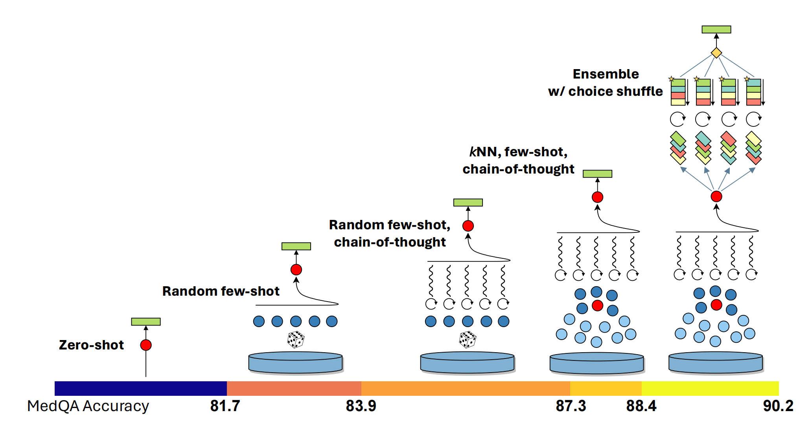

# 【教程】跟着微软论文学高级Prompt能力（三）

MedPrompt（论文见 https://arxiv.org/pdf/2311.16452）策略中有三个主要部分：**Dynamic few-shot selection 动态小样本学习**，**Self-generated chain of thought 自生成思维链**，以及**Choice shuffle ensembling 选项洗牌集成** 。

上次把**Self-generated chain of thought 自生成思维链**好好研究了一下，接下来，就该学习这最后一个了：

#### 2.2.3 Choice shuffle ensembling 选项洗牌集成


说实话，每个单词看着都认识，放一块儿让我确确实实的迷糊了，这一段原文并不长

> While less severe than other foundation models, GPT-4 can exhibit a propensity to favor certain
>
> options in multiple choice answers over others (regardless of the option content), i.e., the model
>
> can show position bias [1, 16, 40]. To reduce this bias, we propose shuffling the choices and then
>
> checking consistency of the answers for the different sort orders of the multiple choice. As a result,
>
> we perform choice shuffle and self-consistency prompting. Self-consistency [32] replaces the naive
>
> single-path or *greedy* decoding with a diverse set of reasoning paths when prompted multiple times
>
> at some temperature*>* 0, a setting that introduces a degree of randomness in generations. With
>
> choice shuffling, we shuffle the relative order of the answer choices before generating each reasoning
>
> path. We then select the most consistent answer, i.e., the one that is least sensitive to choice shuffling.
>
> Choice shuffling has an additional benefit of increasing the diversity of each reasoning path beyond
>
> temperature sampling, thereby also improving the quality of the final ensemble [5]. We also apply
>
> this technique in generating intermediate CoT steps for training examples. For each example, we
>
> shuffle the choices some number of times and generate a CoT for each variant. We only keep the
>
> examples with the correct answer

仔细研究之后，我终于弄明白了。原来是担心大模型在做选择题时，有**position bias** 位置偏好（或许实际上也是如此）。比如，当年我们读书时就听说的著名选择题大法：

> 三短一长选长，三长一短选短；两长两短选择B，长短不齐就选C。

研究人员担心，万一大模型总是特喜欢选C怎么办。所以有了这样一个叫做Choice shuffle ensembling的解决办法：

1. 首先进行温度设置（Temperature Setting）

   温度是控制模型生成多样性的一个超参数。较高的温度（temperature > 0）引入更多随机性，使得模型在生成每一步时不仅仅选择概率最高的词，而是从一个较宽松的概率分布中抽样。

2. 然后多次生成答案（Multiple Generations）

   在不同的温度设置下，模型会多次生成同一个问题的答案。这些生成的答案称为不同的推理路径。每条推理路径代表了从问题到答案的不同推理过程。

3. 做答案一致性检查（Consistency Check）

   通过多次生成的推理路径，可以检查不同路径之间的一致性。如果多个独立生成的答案一致性高，这个答案可能更可靠。选择最一致的答案，作为最终答案。

论文中说，他们在生成思维链 CoT时，也应用了这种打乱选项的方法，最终只保留那些能做出正确答案的思维链提示。

最后，真正的MedPrompt，其实是把这三个策略有机地结合起来，形成一个系统化地整体策略。

#### 2.2.4 Putting it all together: Medprompt



这张图形象地展示了 Medprompt 怎么把这几个策略有机结合起来，以及用上相关策略之后测试分数的提升情况。论文中有一段详细的算法描述，我试着翻译解读一下。

Medprompt包含两个阶段：预处理阶段和推理步骤。在预处理阶段，训练数据集中的每个问题通过轻量级嵌入模型生成嵌入向量（算法1的第4行）。他们用了OpenAI的text-embedding-ada-002创建嵌入向量。对于每个问题，利用GPT-4创建思维链和最终答案的预测（第5行）。如果生成的答案正确且与真实标签匹配，我们存储相关问题、其嵌入向量、思维链和答案。否则，我们完全丢弃该问题，因为如果模型最终得出了错误答案，我们无法信任其推理（第6-7行）。

在推理阶段，给定一个测试问题，我们使用预处理时相同的嵌入模型重新嵌入测试样本，并利用kNN从预处理池中检索相似示例（第12-13行）。这些示例及其相应的GPT-4生成的推理链被结构化为GPT-4的上下文（第14行）。然后在最后附上测试问题和相应的答案选项，作为最终提示（第17行）。模型在遵循few-shot示例后，生成思维链和候选答案。最后，我们执行一个集成过程，多次重复上述步骤。通过打乱测试问题的答案选项来增加多样性（第15-16行），如4.3节和图4中详细描述的那样。为了确定最终预测答案，我们选择最频繁的答案（第20行）。

以下是这段算法描述的伪代码：

``` Algorithm 1 Algorithmic specification of Medprompt, corresponding to the visual representationof the strategy in Figure 4
1: Input: Development data D, Test question Q
2: Preprocessing:
3: for each question q in D do
4: 		Get an embedding vector vq for q.
5: 		Generate a chain-of-thought Cq and an answer Aq with the LLM.
6: 		if Answer Aq is correct then
7: 			Store the embedding vector vq, chain-of-thought Cq, and answer Aq.
8: 		end if
9: end for
10:
11: Inference Time:
12: Compute the embedding vQ for the test question Q.
13: Select the 5 most similar examples {(vQi, CQi, AQi)}5 i=1 from the preprocessed training data using
KNN, with the distance function as the cosine similarity: dist(vq, vQ) = 1 −⟨vq,vQ⟩ / ∥vq∥∥vQ∥
14: Format the 5 examples as context C for the LLM
15: for 5 times do
16: 	Shuffle the answer choices of the test question.
17: 	Generate a chain-of-thought Cqk and an answer Akq with the LLM and context C.
18:	end for
19: Compute the majority vote of the generated answers {Akq}K k=1:
			AFinal = mode({Akq}Kk=1)
			where mode(X) denotes the most common element in the set X
20: Output: Final answer AFinal
```

### 2.3 MedPrompt 怎么用？

对于我们来说，要怎么使用MedPrompt呢？

一种最直接的套用模式，就是参考上面的算法伪代码，配合GPT-4的API，生成一个可以帮忙回答领域问题的专家系统。按照论文的说法，不仅仅是医疗领域，在电气工程、机器学习、哲学、专业会计、专业法律和专业心理学这些方面，MedPrompt方法都取得了类似的好成绩。

另一种呢，就算不写程序，哪怕直接用GPT 网页版和客户端时，我们也可以系统地用上Ramdom Few Shot + Chain of Thought 这两个套路。简单来说，就是多收集一些有价值的例子，同时用上思维链的提示模版就好了。关于这个用法，下次找时间我好好实验一下再来分享吧。
