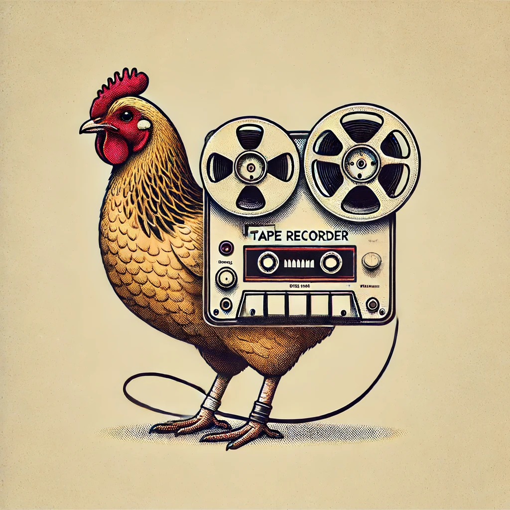

# 【教程】用一小段程序把会议记录转成文本



虽然现在会议记录转文本已经成了各种会议软件的标配功能，比如Teams，腾讯会议等等。但还是会遇到线下会议需要录音、转录加上翻译的需求。

虽然讯飞出了一款耳机主打这个场景，但遗憾的是，或许由于服务器的原因，在海外用起来效果差强人意。那天听朋友说他写了一小段程序干这个，我便把程序源码要了过来。程序不大，几行代码而已，运行的时候遇到些问题，大约是因为Openai 的API调用格式改了，好在有ChatGPT帮忙，很快就解决并成功运行了起来。

```python
import os
import openai
import argparse

# 设置OpenAI API密钥
openai.api_key = "这里需要替换成你自己的Openai API KEY"

def transcribe_audio(input_file, output_file):
    try:
        with open(input_file, "rb") as audio_file:
            response = openai.audio.transcriptions.create(
                model="whisper-1",
                file=audio_file
            )
            transcript_text = response.text
            print(transcript_text)
            
            # 将结果写入指定的输出文件
            with open(output_file, 'a') as f:
                f.write(transcript_text)
            print(f"Transcription saved to {output_file}")
    except Exception as e:
        print(f"Error: {e}")

def main():
    parser = argparse.ArgumentParser(description="Transcribe audio files using OpenAI's Whisper model.")
    parser.add_argument('-i', '--input', type=str, help="Path to the input audio file.")
    parser.add_argument('-o', '--output', type=str, help="Path to the output text file.")

    args = parser.parse_args()

    if args.input and args.output:
        transcribe_audio(args.input, args.output)
    else:
        parser.print_help()

if __name__ == "__main__":
    main()

```

使用时很简单，把上面的程序存成transcribe.py，然后打开一个Terminal 窗口，输入以下命令就好了：

``` shell
python3 transcribe.py -i ./input.mp3 -o output.txt
```

不过呢，还有一个小问题就是Whisper 每次处理的音频文件大小有限制，我需要处理的录音有一个小时之多，只好先分割一下。同样请GPT写一段小程序搞定：

``` python
from pydub import AudioSegment
import math

# 载入M4A文件
file_path = 'meeting20240501-all.m4a'  # 替换为你的M4A文件路径
audio = AudioSegment.from_file(file_path, format="m4a")

# 设置分割长度：8分钟
split_length = 8 * 60 * 1000  # 8分钟转换为毫秒

# 计算需要分割的段数
num_parts = math.ceil(len(audio) / split_length)

# 分割并保存
for i in range(num_parts):
    # 计算当前段的开始和结束时间
    start_time = i * split_length
    end_time = min((i + 1) * split_length, len(audio))

    # 分割音频
    part = audio[start_time:end_time]

    # 保存分割后的音频文件
    part.export(f'part_{i + 1}.mp3', format='mp3')

print(f'音频被分割成了{num_parts}部分。')

```

虽然很粗糙，但是就这样解决了我的原始需求。说句实在话，用GPT帮忙写这么一段小程序，加上调试解决问题的时间，以我这很久没动手写程序的人，也就大约一个多小时吧。和上网找别人现成的工具，再一个一个试用花的时间差不太多。

接下来，有了会议记录，用GPT生成会议纪要什么的就没啥难度咯。

这样下去，自己的一些日常工作流可能会从

> 有需求-> 找工具-> 试用 -> 解决问题

变成

> 有需求-> 写几行代码-> 试用 -> 解决问题

呢。

对了，吴恩达博士一直在推广Agentic的概念，甚至还花一个周末写了一个翻译的小程序。翻译也是我的工作刚需，接下来要花点时间学习一下他弄出来的好东西。上面会议转录的工作流，基于Agentic的概念，应该也能优化得更好些才对。

