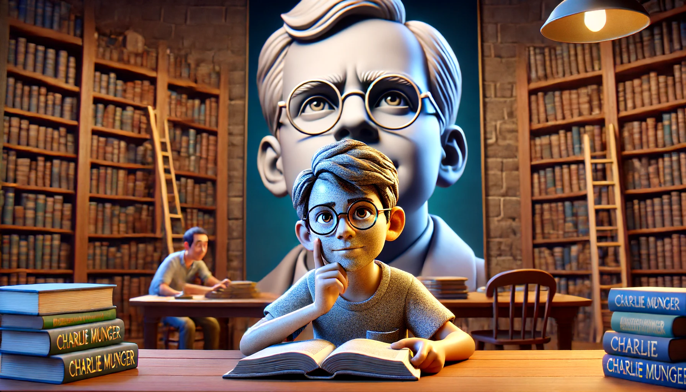
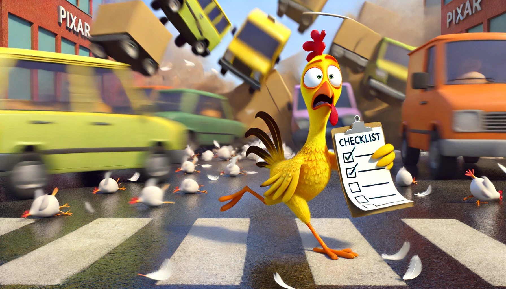

# 【生命⋅修行】重温长者的智慧——再读芒格的《穷查理年鉴》（一）

距离第一次读芒格的《穷查理年鉴》并在豆瓣写下这篇书评《[一个智慧老头的谆谆教诲](https://book.douban.com/review/1576416/)》已经过去了快16年。智慧并且长寿的芒格，也在不久前（2023年11月28日）距离他百岁生日的前一个月，离开了我们。回顾这16年来自己的生活，再想想芒格书中那句话：

> 我的剑，传给能够挥舞他的人。
>
> My sword I leave to him who can wear it。

不禁赧然……哎，此时的感觉，就像在自己那篇书评下有个网友评论写的那句话一摸一样：

> **觉得自己脑袋像花岗岩！**

在16年前就自己就似乎握住过这剑柄，但显然自己并未能挥舞它。看到冯凯文写的《[原来世界不是我想的那样 —— 我的人生总结 & 我学英语的弯路史](https://mp.weixin.qq.com/s/olziLmC7lELsnjLlocr6Hw)》这篇文章之后，我意识到自己虽然早就读过（而且不止一次读过）这本书，却错失了很多东西。

于是，我决定好好再读一次，用长者的智慧再来刷新一下自己那错漏百出的思维框架与生存系统。手边没有纸质书，Kindle里也没有电子书。自己多年前读的版本，是《VALUE》杂志社翻译的版本——《投资大家芒格》。好在网上资源也很多，不费力就找到了中文和英文两个PDF版本。

## 过去的书评

总结这次阅读的收获之前，我先把之前那篇书评再次贴在这里，其中摘录的书单应该是特别有价值的部分：

> 看完了《VALUE》杂志社翻译的《Poor Charlie’s Almanack》，也就是《投资大家芒格》（一）。
>
> 真的是一个很智慧的老头，难得的是，他还乐于将自己的人生智慧传授、讲解给别人。不过，他时而旁敲侧击、时而正话反说，有些讲演倒过去看两遍还是不太好理解。不过，读一本书哪怕有一点收获都是物超所值，何况从中学到了不止一点。
>
> 摘录一些对我很有启发的只言片语以及非常有用的一些知识：
>
> 每个人都会犯的错误：
>
> 1. 高估有数据支撑的材料。
> 2. 不会把那些可能更重要的难以权衡的材料列入全盘考虑。
>
> 
> 我们大量的阅读。我不知道有哪个聪明的人不进行大量阅读，但这还不够：还必须拥有能抓住想法和采取明智行动的能力。
>
> 如何才能效仿他的足迹？每天都试着让自己在起床的时候比以前更聪明一点，虔诚并且出色的履行自己的职责，一步一个脚印往前走，没必要跑得太快。但你希望自己能跑得更快。每次都努力争取，天天如此。最后，如果活得足够长，大多数人都将得到他们应得的东西。
>
> 人生每个阶段都将面临考验，我认为有三点将有助于你应对这些挑战： (1). 期望值要低 (2). 富有幽默感 (3). 把自己置身与友情和亲情中
>
> 人类的25个心理误判倾向：
>
> 1. 奖赏/惩罚的超级反应倾向
> 2. 喜欢/爱的倾向
> 3. 讨厌/恨的倾向
> 4. 回避疑虑的倾向
> 5. 回避不一致性的倾向
> 6. 好奇倾向
> 7. 康德式公平倾向
> 8. 羡慕/嫉妒的倾向
> 9. 回报倾向
> 10. 从简单的联系中受到影响的倾向
> 11. 简单的、回避痛苦的心理否定
> 12. 过度自我关注的倾向
> 13. 过度乐观的倾向
> 14. 对损失过度反应的倾向
> 15. 社会证据的倾向
> 16. 对比误判反应的倾向
> 17. 压力影响的倾向
> 18. 易得性误判的倾向
> 19. 不用就忘的倾向
> 20. 受药物错误影响的倾向
> 21. 受衰老错误影响的倾向
> 22. 受权威错误影响的倾向
> 23. 讲废话的倾向
> 24. 重视理由的倾向
> 25. 极端倾向——在偏向某一特定结果的几个心理倾向共同作用下出现极端性的倾向
>
> 
> 一般而言，如果你试图运用你对心理倾向的只是来对你需要赢得其信任的人进行巧妙的操纵的话，你是同时在道德和稳妥性上面犯了错误。
>
> 查理.芒格推荐的书籍列表也非常有价值：
>
> * 《深奥的简洁：让混沌和复杂归于有序》（Deep Simplicity: Bringing Order to Chaos and Complexity），作者约翰.葛瑞宾（John Gribbin），兰登书屋（Random House）2005年出版。
> * 《泥鸽靶：华尔街高等金融实录》（FIASCO: The Inside Story of a Wall Street Trader），企鹅图书出版社（Penguin Books）1999年出版。
> * 《冰河世纪》（Ice Age），作者约翰.葛瑞宾和玛丽.葛瑞宾（John & Mary Gribbin），巴诺出版社（Barnes& Noble）2002年出版。
> * 《苏格兰人如何发明现代世界：西欧最穷的国家如何创造了世界》（How the Scots Invented the Modern World: The True Story of How Western Europe’s Poorest Nation Created Our World and everything in It），作者亚瑟.赫尔曼（Arthur Herman），三河出版社（Three Rivers Press）2002年出版。
> * 《我的生活方式》（Models of My Life）,作者郝柏特.A.西蒙（Herbert A. Simon），麻省理工学院出版社（MIT Press）1996年出版。
> * 《温度，决定一切》（A Matter of Degree: What Temperature Reveals About the Past and Future of Our Species, Planet, and Universe），作者基诺.沙格瑞（Gino Segre），北欧海盗图书出版社（Viking Books）2002年出版。
> * 《安德鲁.卡耐基》（Andrew Carnegie），作者约瑟夫.弗雷泽.沃（Joseph Frazier Wall）,牛津大学出版社（Oxford University Press）1970年出版
> * 《枪炮、病菌与钢铁：人类社会的命运》（Guns，Germs, and Steel：The Fates of Human Societies），作者贾德.M.戴蒙（Jared M Diamond），四季出版社（Perennial）1992年出版
> * 《影响力》（Influence：The Psychology of Persuasion），作者罗伯特.B.西奥迪尼（Robert B.Cialdini），四季现代出版社（Perennial Currents）1998年出版
> * 《本.富兰克林自传》（The Autobiography of Ben Franklin），作者本杰明.富兰克林（Benjamin Franklin），耶鲁大学出版社，“注意耶鲁”平装书系列，2003年出版
> * 《生活在极限之内：生态学、经济学和人口禁忌》（Living within Limits: Ecology, Economics, and Population Taboos），作者加勒特.哈丁（Garrett Hardin），牛津大学出版社1995年出版。
> * 《自私的基因》（The Selfish Gene），作者理查德.道金斯（Richard Dawkins），牛津大学出版社1990年出版。
> * 《巨人：洛克菲勒传》（Titan: The Life of John D. Rockefeller, Sr.），作者罗恩.彻诺（Ron Chernow），美酒出版社（Vintage）2004年出版。
> * 《国家的穷与富》（The Wealth and Poverty of Nations: Why Some Are So Rich and Some So Poor），作者大卫.兰德斯（David Landes）,W.W.诺顿公司（W.W. Norton & Company）1998年出版。
> * 《沃伦.巴菲特的投资组合：集中投资策略》（The Warren Buffett Portfolio: Mastering the Power of the Focus Investment Strategy），作者罗伯特.G.海格斯状（Robert G.Hagstrom），威莱出版社（Wiley）2000年出版。
> * 《基因组：一个物种的23章自传》（Genome: the Autobiography of a Species in 23 Chapters），作者马特.里德雷（Matt Ridley）,哈珀出版社（Harper Collins）2000年出版。
> * 《毫不退让地赢得谈判——哈佛谈判法》（Getting to Yes：Negotiating Agreement Without Giving In），作者罗杰.费雪（Roger Fisher），威廉.尤里（William Ury）和布鲁斯.帕顿（Bruce Patton），企鹅图书出版社1991年出版。
> * 《三个科学家和他们各自的上帝：在信息时代寻找生命的意义》（Three Scientists and Their Gods: Looking For Meaning in An Age of Information），作者罗伯特.怀特（Robert Wright）,哈珀出版社1989年出版。
> * 《只有偏执狂才能生存》（Only the Paranoid Survive），作者安迪.格鲁夫（Andy Grove），货币出版社（Currency）1996年出版。
>
> —— 2008-12-06 21:03:23 
>
> © 本文版权归作者 [浩然](https://www.douban.com/people/hooman118/) 所有，任何形式转载请联系作者。

## 今天的体悟

这次读的版本，不管是中文版还是英文版。前面都多了两章，介绍了芒格的生平，并试图用芒格的话来总结他的生活、学习和决策方法。其中第二章开篇那句话，就让我触动颇多：

> 凡事往简单处想，往认真处行。
>
> Take a simple idea and take it seriously.

我依稀感觉到，自己「中断」、或者说没能真正开始并坚持践行芒格的思维框架，就是被那种畏惧复杂加上企图过度简化的心理双重影响了。芒格的多元思维模型 / 思维格栅理论让我清晰地感受到，那是一个非常复杂的系统（据他估计大概有100种之多）。

我想要仿照芒格的体系，建立一个自己的多元思维模型，但这个庞大而复杂的目标，把我吓住了，以至于望而却步10多年，也没有实质上明显的进展。

然后，我掉头想要找的最最简化的生活模型——《道德经》是我一度试图想要抓住的救命稻草。但可惜，5000言虽然不多，要但悟起来则更难。

现在我才明白，「简化」这个应对世界的思维模型本身，就是一件严肃、复杂、需要十分耐心去做的事情。想要逻辑而理性的建立一个可用的思维模型框架，像芒格这样做，已经是简化到不能再简化到程度了。

或者，只能像《道德经》或者《曾国藩嘉言钞》那样，絮絮叨叨地从各个角度，来稍微揭示一下那「不可道」的究极真理在我们这个世界的投影而已。所以：

### Take a simple idea and take it seriously 是构建出芒格这样的多元思维模型所要遵循的核心原则

与此同时，我意识到其实芒格早已给出了如何达到这个究极目标具体指导方针。他在回答一个年轻人如何变得像他一样有钱时是这么回答的：

>  It's a very intelligent question; You look at some old guy who's rich and you ask, "How can I become like you, except faster?" Spend each day trying to be a little wiser than you were when you woke up. Discharge your duties faithfully and well. Step by step you get ahead, but not necessarily in fast spurts. But you build discipline by preparing for fast spurts.... Slug it out one inch at a time, day by day. At the end of the day-if you live long enough-most people get what they deserve.
>
> 这是一个聪明的问题：你看见某个有钱的老头，然后问他：“我要怎样才能变得像你一样呢？” 每天起床的时候，争取变得比你从前更聪明一点。认真地、出色地完成你的任务。慢慢地，你会有所进步，但这种进步不一定很快。但你这样能够为快速进步打好基础……每天慢慢向前挪一点。到最后——如果你足够长寿的话——大多数人得到了他们应得的东西。

显然，16年前我就注意到了这句话，但遗憾的是，这么多年其中有很长一段时间，我忘记了继续践行这句话。这可就是**为学日益、为道日损**啊！能像颜夫子那样做到得一善而拳拳服膺，不失之矣还真是圣人才能达到的境界呀！悄悄感叹一下，这方面，大宝比我强！！！

此时，再对照着芒格的一篇篇，反思最近几年所犯过的最大错误，源头都来自于一个词——傲慢。所以：

### Intellectual humility-Acknowledging what you don't know is the dawning of wisdom 谦虚——承认自己的无知是智慧的开端

关于这一点，除了我骨子里的傲慢让我一再犯错以外，我还发现了两个经常走入的盲区。其一是关于能力圈：

虽然我一直致力于挖掘、聚焦并发挥自己的优势能力，但看到芒格说的这句话：

> 没有边界的能力，不能称之为能力。

我才意识到，自己对自己的能力圈，认识有多么的不清晰！在界定自己的能力边界这件事情上，其实我一直不够清晰。这背后应该也有傲慢的原因，我总是不能接受自己真的在某方面「其实很差」。

其二，芒格说他常用的双规方法：首先是理性分析做决策判断，其次筛选那些潜意识造成的误判（参考人类误判心理学清单）。

而我，在想要纠正自己过去常常「分析到瘫痪」，以及自以为聪明的毛病时，却走到了直接相信「潜意识」的另一个极端，竟然完全忘记了人类有心理学误判这会事儿。也就是在学习、实践「遵循良知」这条原则的时候，走错了路！

基于对自己能力圈的认知，接下来这样的方法是非常值得参考与实践的：

> 迅速歼灭不该做的事情，对该做的事情发起熟练地、跨学科的攻击。当且仅当合适的机会来临时，果断行动。

当然，还有就是检查清单，不要去做那些不应该做的事情。比如当有人问芒格如何过上幸福生活时，芒格简单干脆地回答：

> 别吸毒，别乱穿马路，避免染上艾滋病。

关于幸福生活，芒格在1986年的演讲中，提出了更完整的「不幸福」清单。

### 1986 哈佛学校毕业演讲 Harvard School Commencement Speech

如何获得不幸福生活的清单

1. 为了好心情和体验而使用化学药品 Ingesting chemicals in an effort to alter mood or perception
2. 嫉妒 Envy
3. 怨恨 Resentment
4. 反复无常 Be Unreliable
5. 尽可能从你们自身的经验获得知识，尽量别从其他人成功或失败的经验中广泛地吸取教训，不管他们是古人还是今人。To learn everything you possibly can from your own experiences minimizing what you learn vicariously from the good and bad experience of others, living and dead.
6. 当你们在人生的战场上遭遇第一、第二或者第三次严重的失败时，就请意志消沉，从此一蹶不振吧。To go down and stay down when you get your first, second, or third severe reverse in the battle of life.
7. 请忽略小时候人们告诉我的那个乡下人故事。曾经有个乡下人说：“要是知道我会死在哪里就好啦，那我将永远不去那个地方。” To ignore a story they told me when I was very young about a rustic who said, "I wish I knew where I was going to die, and then I'd never go there."——也就是不考虑这个不幸福清单，不反过来思考，不以终为始的考虑问题
8. 最后，尽可能地减少客观性。Finally, minimizing objectivity。忠实于自己就是永远不改变你们年轻时的所有观念。You interpret being true to yourself as requiring that you retain every notion of your youth.

2006年，芒格重读了这篇演讲稿，他说，没有什么需要修改的地方。他补充道：

> 如果说我产生了新想法的话，我现在更加坚定地认为：
>
> 1.在生活中，**可靠是至关重要的**；
>
> 2.虽然量子力学对于绝大多数人而言是学不会的，但可靠却是几乎每个人都能很好地掌握的。

> If anything, I now believe even more strongly that 
>
> (1) **reliability is essential for progress in life and** 
>
> (2) while quantum mechanics is unlearnable for a vast majority, reliability can be learned to great advantage by almost Anyone.

<待续>