# 【教程】如何诵念玫瑰经——为信奉天主教的亲人祈祷

亲爱的外婆于北京时间6.16日6点56分离开了这个世界。此时相隔万里，黄沙间，碧海边，想她，也怀念从小到大那些点点滴滴有她照顾我、陪伴我、关爱我的时光！

嫁嫁（我小时候一直这么叫她）是虔诚的天主教徒，小时候在九江，看我捧着圣经故事读得津津有味时，她那开心的样子还历历在目…

我想，为她送行，应该遵循天主教的方式，所以把读诵《玫瑰经》的方式在这里记录下来，主要内容来自于https://zh.wikihow.com/[吟诵《玫瑰经》](https://zh.wikihow.com/吟诵《玫瑰经》)和https://zh.wikipedia.org/wiki/[玫瑰经](https://zh.wikipedia.org/wiki/%E7%8E%AB%E7%91%B0%E7%BB%8F)，根据我自己的需要作了些许裁剪。

>玛利亚良善的圣心，我这样做是主要是为了我亲爱的外婆，请您为她祈求天主。主啊，请您带领她的灵魂，前往天国，进入永生的光明！
>
>因父及子及圣灵之名，阿们！

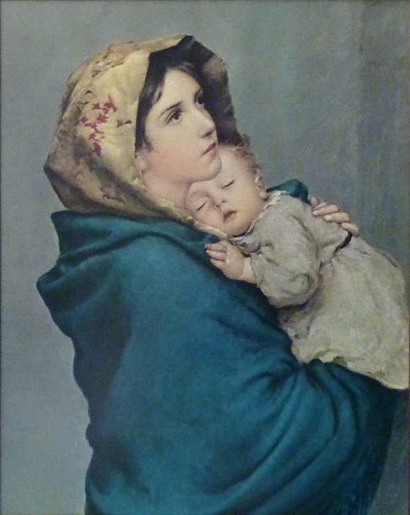

## 《**玫瑰经**》（[拉丁语](https://zh.wikipedia.org/wiki/拉丁語)：Rosarium Virginis Mariae）

于[15世纪](https://zh.wikipedia.org/wiki/15世纪)由[圣座](https://zh.wikipedia.org/wiki/聖座)正式颁布是天主教徒用于[敬礼](https://zh.wikipedia.org/wiki/敬礼)[圣母玛利亚](https://zh.wikipedia.org/wiki/馬利亞_(耶穌的母親))的祷文。“玫瑰经”一词来源于[拉丁语](https://zh.wikipedia.org/wiki/拉丁语)“Rosarium”，意为“玫瑰花冠”或“一束玫瑰”。“Rosa”意为[玫瑰](https://zh.wikipedia.org/wiki/玫瑰)。此名是比喻连串的祷文如玫瑰馨香，敬献于[天主](https://zh.wikipedia.org/wiki/基督教的神)与圣母身前。

## 如何诵念玫瑰经

.JPG)

如上面这张图，整体过程分成这么几大部分：

1. 开始
   1. 划十字
   2. 诵《信经》
   3. 诵《天主经》
   4. 诵《圣母经》三遍
   5. 诵《圣三光荣颂》
2. 5组《圣母经》
   1. 读或默想一段玫瑰经奥迹
   2. 诵《天主经》一遍
   3. 诵《圣母经》十遍
   4. 诵《圣三光荣颂》和《蒂玛圣母祷词》
3. 结束
   1. 诵《又圣母经》及
      1. 诵《最后读玫瑰经》（可选）
      2. 诵《依靠圣母颂》（可选）
      3. 诵《圣母德叙祷文》（可选）
   2. 为逝者祈祷
      1. 《天主经》
      2. 《圣母经》
      3. 《圣三光荣颂》及祷文
   3. 划十字

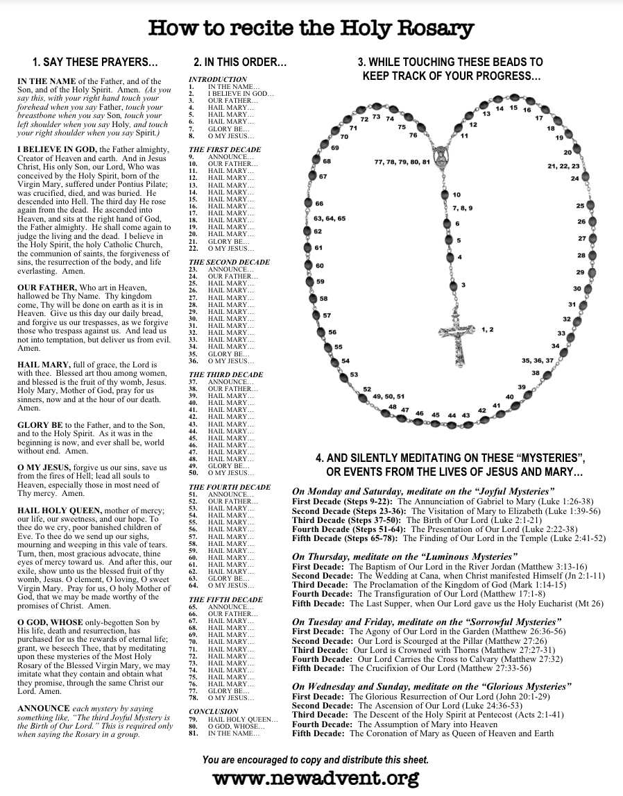

这张图上用英文标识了整个流程，下面我按照我的需要，一步一步讲解这个详细的过程。像我一样对仪式不熟悉的人，拿这这篇文章，一点点往下翻，照着做、照着诵念就可以了。

## 1. 开始诵念玫瑰经

### 1.1 划十字

**以手持十字架，划十字手势开始祈祷。**划十字时用右手轻触额头，随后到胸口，然后从左肩到右肩。如果你没有手持玫瑰念珠也无妨，亦可在心中进行。在你划十字的时候，请口念：

- 中文： 因父，及子，及圣灵之名，阿们。
- 拉丁文： In nomine Patris et Filii et Spiritus Sancti. Amen.
- 英文：In the name of the Father, the Son, and the Holy Spirit. Amen.

> 当说“父”时，手轻触前额；当说“子”时，手轻触胸部；当说“圣”时，手轻触左肩；当说“神”时，手轻触右肩。

### 1.2 诵《信经》

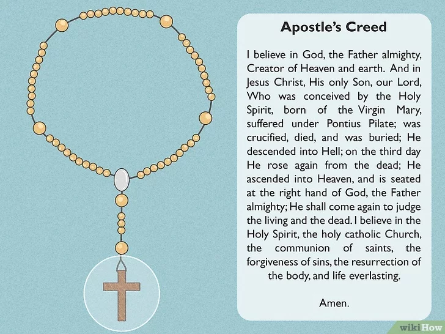

如果你有玫瑰念珠，请手持十字架部位。以低头冥思的姿势默念：

- 中文：我信天主，全能的圣父，天地万物的创造者。我信耶稣，天主独子，我们的救世主；他孕于圣灵，生于圣母；他曾受彼拉多折磨，钉于十字架，焚烧至死；他又于三日后死而复生，升天坐于全能的天主之右；他将返还审判生者与死者。我信圣灵，我信圣善教会，我信诸神共融，我信罪之饶恕，我信体之复活，我信永世长生。阿们。
- 拉丁文： Credo in Deum Patrem omnipotentem, Creatorem caeli et terrae. Et in Iesum Christum, Filium eius unicum, Dominum nostrum, qui conceptus est de Spiritu Sancto, natus ex Maria Virgine, passus sub Pontio Pilato, crucifixus, mortuus, et sepultus, descendit ad inferos, tertia die resurrexit a mortuis, ascendit ad caelos, sedet ad dexteram Dei Patris omnipotentis, inde venturus est iudicare vivos et mortuos. Credo in Spiritum Sanctum, sanctam Ecclesiam catholicam, sanctorum communionem, remissionem peccatorum, carnis resurrectionem, vitam aeternam. Amen.
- 英文：I believe in God, the Father almighty, Creator of Heaven and earth. And in Jesus Christ, His only Son, our Lord, Who was conceived by the Holy Spirit, born of the Virgin Mary, suffered under Pontius Pilate; was crucified, died, and was buried; He descended into Hell; on the third day He rose again from the dead; He ascended into Heaven, and is seated at the right hand of God, the Father almighty; He shall come again to judge the living and the dead. I believe in the Holy Spirit, the holy catholic Church, the communion of saints, the forgiveness of sins, the resurrection of the body, and life everlasting. Amen.

### 1.3 诵《天主经》

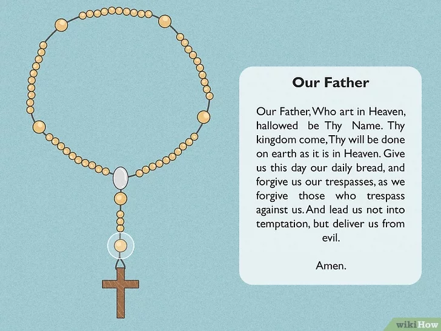

在第一颗大玫瑰念珠上，诵念《天主经》，如下：

- 中文：我们的天父，愿你的名受显扬，愿你的国来临，愿你的旨意奉行人间犹如在天上。求你今日赏赐我们日用的食粮，求你宽恕我们的罪过如同我们宽恕他人一样，不要让我们陷于诱惑，但救我们免于凶恶。阿们。
- 拉丁文：Pater noster, qui es in caelis, sanctificetur nomen tuum. Adveniat regnum tuum. Fiat voluntas tua, sicut in caelo et in terra. Panem nostrum quotidianum da nobis hodie, et dimitte nobis debita nostra sicut et nos dimittimus debitoribus nostris. Et ne nos inducas in tentationem, sed libera nos a malo. Amen.
- 英文：Our Father, Who art in Heaven, hallowed be Thy Name. Thy kingdom come, Thy will be done on earth as it is in Heaven. Give us this day our daily bread, and forgive us our trespasses, as we forgive those who trespass against us. And lead us not into temptation, but deliver us from evil. Amen.

### 1.4 诵《圣母经》三遍

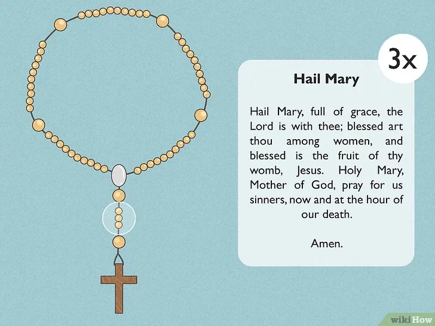

在接下来的三颗玫瑰念珠上，诵念《圣母经》三遍：

- 中文：大慈大悲的万福玛利亚，主与你同在；你在妇女中深受赞颂，你之子耶稣同受赞颂。圣母玛利亚，耶稣之母，此刻及在我们临终之时，愿你为我们的罪人所祈祷。阿们。
- 拉丁文：Ave Maria, gratia plena, Dominus tecum. Benedicta tu in mulieribus, et benedictus fructus ventris tui, Jesus. Sancta Maria, Mater Dei, ora pro nobis peccatoribus, nunc, et in hora mortis nostrae. Amen.
- 英文：Hail Mary, full of grace, the Lord is with thee; blessed art thou among women, and blessed is the fruit of thy womb, Jesus. Holy Mary, Mother of God, pray for us sinners, now and at the hour of our death. Amen.

### 1.5 诵《圣三光荣颂》

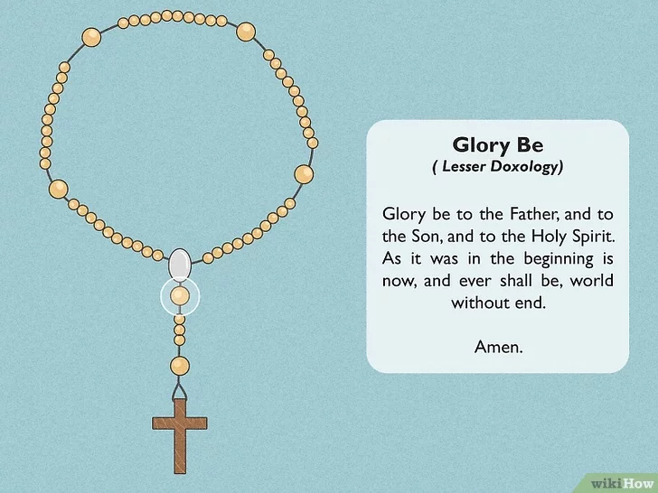

**在下一颗大玫瑰念珠上，诵念《圣三光荣颂》。**从专业上讲，在三颗小珠与大珠之间会有间隔，大的代表着我们的天主。

- 中文：愿光荣及父、及子、及圣灵。起初如何，今日亦然，直至永远。阿们。
- 拉丁文：Gloria Patri et Filio et Spiritui Sancto. Sicut erat in principio, et nunc et semper et in saecula saeculorum. Amen.
- 英文：Glory be to the Father, and to the Son, and to the Holy Spirit. As it was in the beginning is now, and ever shall be, world without end. Amen.

## 2.诵念5组《圣母经》

## 2.1 第一组《圣母经》

### 2.1.1  宣读或默想第一端玫瑰奥迹

如果是集体进行，只能选择宣读。如果是个人，就可选择默想的方式。当然，不同的人会选择不同的方式来叙说奥迹。选择适合你的方式吧：

- 根据星期几，选择与之相对应的奥迹：
  - 欢喜一端：圣母领报（路加福音 1:26-38）
  - 光明一端：耶稣约旦河受洗（马太福音3:13-16)
  - 痛苦一端：耶稣山园祈祷 (马太福音26:36-56)
  - 荣福一端：耶稣复活 (约翰福音20:1-29)

我照着http://www.newadvent.org/images/rosary.pdf 这个做了一张表

| 周一                                   | 周二                                      | 周三                                 | 周四                                       | 周五                                      | 周六                                   | 周日                                 |
| -------------------------------------- | ----------------------------------------- | ------------------------------------ | ------------------------------------------ | ----------------------------------------- | -------------------------------------- | ------------------------------------ |
| 欢喜一端：圣母领报（路加福音 1:26-38） | 痛苦一端：耶稣山园祈祷 (马太福音26:36-56) | 荣福一端：耶稣复活 (约翰福音20:1-29) | 光明一端：耶稣约旦河受洗（马太福音3:13-16) | 痛苦一端：耶稣山园祈祷 (马太福音26:36-56) | 欢喜一端：圣母领报（路加福音 1:26-38） | 荣福一端：耶稣复活 (约翰福音20:1-29) |

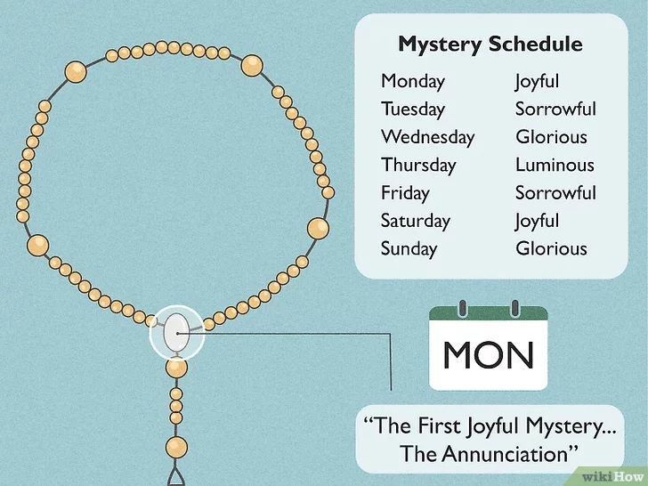

#### 2.1.1.1 欢喜一端：圣母领报（路加福音 1:26-38）

* 中文：
  - 26 到了第六個月，天使加百列奉　神差遣，往加利利的拿撒勒城去， 
  - 27 到了一個童貞女那裡，她已經和大衛家一個名叫約瑟的人訂了婚，童貞女的名字是馬利亞。 
  - 28 天使進去，對她說：“恭喜！蒙大恩的女子，主與你同在！” 
  - 29 她卻因這話驚慌起來，反覆思想這樣祝賀是甚麼意思。 
  - 30 天使說：“馬利亞，不要怕！因你已從神那裡蒙了恩。 
  - 31 你將懷孕生子，要給他起名叫耶穌。 
  - 32 他將要被尊為大，稱為至高者的兒子，主神要把他祖大衛的王位賜給他， 
  - 33 他要作王統治雅各家，直到永遠，他的國沒有窮盡。” 
  - 34 馬利亞對天使說：“我還沒有出嫁（“我還沒有出嫁”原文作“我不認識男人”），怎能有這事呢？” 
  - 35 天使回答：“聖靈要臨到你，至高者的能力要覆庇你，因此那將要出生的聖者，必稱為神的兒子。 
  - 36 你看，你親戚以利沙伯，被稱為不生育的，在老年也懷了男胎，現在已是第六個月了， 
  - 37 因為在　神沒有一件事是不可能的。” 
  - 38 馬利亞說：“我是主的婢女，願照你的話成就在我身上！”天使就離開她去了。
* 英文：
  * 26 In the sixth month of Elizabeth’s pregnancy, God sent the angel Gabriel to Nazareth, a town in Galilee, 
  * 27 to a virgin pledged to be married to a man named Joseph, a descendant of David. The virgin’s name was Mary. 
  * 28 The angel went to her and said, “Greetings, you who are highly favored! The Lord is with you.”
  * 29 Mary was greatly troubled at his words and wondered what kind of greeting this might be. 
  * 30 But the angel said to her, “Do not be afraid, Mary; you have found favor with God. 
  * 31 You will conceive and give birth to a son, and you are to call him Jesus. 
  * 32 He will be great and will be called the Son of the Most High. The Lord God will give him the throne of his father David,
  * 33 and he will reign over Jacob’s descendants forever; his kingdom will never end.”
  * 34 “How will this be,” Mary asked the angel, “since I am a virgin?”
  * 35 The angel answered, “The Holy Spirit will come on you, and the power of the Most High will overshadow you. So the holy one to be born will be called[[a](https://www.biblegateway.com/passage/?search=Luke 1%3A26-38%2C路 加 福 音 1%3A26-38&version=NIV;CUV#fen-NIV-24929a)] the Son of God. 
  * 36 Even Elizabeth your relative is going to have a child in her old age, and she who was said to be unable to conceive is in her sixth month. 
  * 37 For no word from God will ever fail.”
  * 38 “I am the Lord’s servant,” Mary answered. “May your word to me be fulfilled.” Then the angel left her.

#### 2.1.1.2 光明一端：耶稣约旦河受洗（马太福音3:13-16)

* 中文：
  * 13 當下耶穌從加利利來到約旦河，見了約翰，要受他的洗。 
  * 14 約翰想要攔住他，說：「我當受你的洗，你反倒上我這裡來嗎？」 
  * 15 耶穌回答說：「你暫且許我，因為我們理當這樣盡諸般的義[[a](https://www.biblegateway.com/passage/?search=馬太福音 3%2CMatthew 3&version=CUVMPT;NIV#fzh-CUVMPT-23156a)]。」於是約翰許了他。 
  * 16 耶穌受了洗，隨即從水裡上來。天忽然為他開了，他就看見神的靈彷彿鴿子降下，落在他身上；
* 英文：
  * 13 Then Jesus came from Galilee to the Jordan to be baptized by John. 
  * 14 But John tried to deter him, saying, “I need to be baptized by you, and do you come to me?”
  * 15 Jesus replied, “Let it be so now; it is proper for us to do this to fulfill all righteousness.” Then John consented.
  * 16 As soon as Jesus was baptized, he went up out of the water. At that moment heaven was opened, and he saw the Spirit of God descending like a dove and alighting on him. 

#### 2.1.1.3 痛苦一端：耶稣山园祈祷 (马太福音26:36-56)

* 中文：
  * 36 耶穌同門徒來到一個地方，名叫客西馬尼，就對他們說：你們坐在這裡，等我到那邊去禱告。
  * 37 於是帶著彼得和西庇太的兩個兒子同去，就憂愁起來，極其難過，
  * 38 便對他們說：我心裡甚是憂傷，幾乎要死；你們在這裡等候，和我一同儆醒。
  * 39 他就稍往前走，俯伏在地，禱告說：我父阿，倘若可行，求你叫這杯離開我。然而，不要照我的意思，只要照你的意思。
  * 40 來到門徒那裡，見他們睡著了，就對彼得說：怎麼樣？你們不能同我儆醒片時麼？
  * 41 總要儆醒禱告，免得入了迷惑。你們心靈固然願意，肉體卻軟弱了。
  * 42 第二次又去禱告說：我父阿，這杯若不能離開我，必要我喝，就願你的旨意成全。
  * 43 又來，見他們睡著了，因為他們的眼睛困倦。
  * 44 耶穌又離開他們去了。第三次禱告，說的話還是與先前一樣。
  * 45 於是來到門徒那裡，對他們說：現在你們仍然睡覺安歇罷（罷：或作麼？）！時候到了，人子被賣在罪人手裡了。
  * 46 起來！我們走罷。看哪，賣我的人近了。
  * 47 說話之間，那十二個門徒裡的猶大來了，並有許多人帶著刀棒，從祭司長和民間的長老那裡與他同來。
  * 48 那賣耶穌的給了他們一個暗號，說：我與誰親嘴，誰就是他。你們可以拿住他。
  * 49 猶大隨即到耶穌跟前，說：請拉比安，就與他親嘴。
  * 50 耶穌對他說：朋友，你來要做的事，就做罷。於是那些人上前，下手拿住耶穌。
  * 51 有跟隨耶穌的一個人伸手拔出刀來，將大祭司的僕人砍了一刀，削掉了他一個耳朵。
  * 52 耶穌對他說：收刀入鞘罷！凡動刀的，必死在刀下。
  * 53 你想，我不能求我父現在為我差遣十二營多天使來麼？
  * 54 若是這樣，經上所說，事情必須如此的話怎麼應驗呢？
  * 55 當時，耶穌對眾人說：你們帶著刀棒出來拿我，如同拿強盜麼？我天天坐在殿裡教訓人，你們並沒有拿我。
  * 56 但這一切的事成就了，為要應驗先知書上的話。當下，門徒都離開他逃走了。
* 英文：
  * 36 Then Jesus went with his disciples to a place called Gethsemane, and he said to them, “Sit here while I go over there and pray.” 
  * 37 He took Peter and the two sons of Zebedee along with him, and he began to be sorrowful and troubled. 
  * 38 Then he said to them, “My soul is overwhelmed with sorrow to the point of death. Stay here and keep watch with me.”
  * 39 Going a little farther, he fell with his face to the ground and prayed, “My Father, if it is possible, may this cup be taken from me. Yet not as I will, but as you will.”
  * 40 Then he returned to his disciples and found them sleeping. “Couldn’t you men keep watch with me for one hour?” he asked Peter. 
  * 41 “Watch and pray so that you will not fall into temptation. The spirit is willing, but the flesh is weak.”
  * 42 He went away a second time and prayed, “My Father, if it is not possible for this cup to be taken away unless I drink it, may your will be done.”
  * 43 When he came back, he again found them sleeping, because their eyes were heavy. 
  * 44 So he left them and went away once more and prayed the third time, saying the same thing.
  * 45 Then he returned to the disciples and said to them, “Are you still sleeping and resting? Look, the hour has come, and the Son of Man is delivered into the hands of sinners. 
  * 46 Rise! Let us go! Here comes my betrayer!”
  * 47 While he was still speaking, Judas, one of the Twelve, arrived. With him was a large crowd armed with swords and clubs, sent from the chief priests and the elders of the people.
  * 48 Now the betrayer had arranged a signal with them: “The one I kiss is the man; arrest him.” 
  * 49 Going at once to Jesus, Judas said, “Greetings, Rabbi!” and kissed him.
  * 50 Jesus replied, “Do what you came for, friend.”[[a](https://www.biblegateway.com/passage/?search=Matthew+26%3A36-56%2C馬+太+福+音+26%3A36-56&version=NIV;CUV#fen-NIV-24105a)] Then the men stepped forward, seized Jesus and arrested him. 
  * 51 With that, one of Jesus’ companions reached for his sword, drew it out and struck the servant of the high priest, cutting off his ear.
  * 52 “Put your sword back in its place,” Jesus said to him, “for all who draw the sword will die by the sword. 
  * 53 Do you think I cannot call on my Father, and he will at once put at my disposal more than twelve legions of angels? 
  * 54 But how then would the Scriptures be fulfilled that say it must happen in this way?”
  * 55 In that hour Jesus said to the crowd, “Am I leading a rebellion, that you have come out with swords and clubs to capture me? Every day I sat in the temple courts teaching, and you did not arrest me. 
  * 56 But this has all taken place that the writings of the prophets might be fulfilled.” Then all the disciples deserted him and fled.

#### 2.1.1.4 荣福一端：耶稣复活 (约翰福音20:1-29)

* 中文
  * 1 週日清晨，天還未亮，抹大拉的瑪麗亞就來到墳墓前，發現封住墓口的石頭已經挪開了。 
  * 2 她趕快跑去告訴西門·彼得和耶穌所愛的那個門徒，說：「有人把主從墳墓裡搬走了，不知放到哪裡去了。」
  * 3 彼得和那個門徒聽了就出去，往墳墓那邊跑。 
  * 4 兩個人一起跑，但那個門徒比彼得跑得快，所以先到了墳墓。 
  * 5 他並沒有進去，只是探頭往裡看，看見細麻布還在那裡。 
  * 6 西門·彼得隨後也來了，他進到裡邊，看到細麻布放在那裡， 
  * 7 耶穌的裹頭巾則捲著放在另一處，沒有和細麻布放在一起。 
  * 8 先到的那個門徒也進來了，看見這種情形，就信了。 
  * 9 因為他們還不明白聖經上有關耶穌必要從死裡復活的話。 
  * 10 然後，他們各自回家去了。
  * 11 瑪麗亞卻站在墳墓外面哭泣，邊哭邊往墳墓裡面看， 
  * 12 看見兩個穿著白衣的天使分別坐在原來安放耶穌遺體的頭腳兩端。
  * 13 天使對她說：「婦人，你為什麼哭呢？」她說：「有人把我的主搬走了，不知道放在什麼地方。」 
  * 14 說完，她轉過身來，看見耶穌站在那裡，但她不知道那就是耶穌。
  * 15 耶穌問她：「婦人，你為什麼哭？你在找誰？」瑪麗亞還以為祂是園丁，就說：「先生，如果是你把祂搬走了，請告訴我放在哪裡了，我好搬回來。」
  * 16 耶穌說：「瑪麗亞。」瑪麗亞立即轉過頭來用希伯來話對祂說：「拉波尼！」拉波尼的意思是老師。
  * 17 耶穌說：「不要拉著我，我還沒有升到父那裡。你先去找我的眾弟兄，告訴他們我要升天去見我的父，也是你們的父；去見我的上帝，也是你們的上帝。」
  * 18 抹大拉的瑪麗亞就去向門徒報訊，說：「我看見主了！」又把主對她說的話告訴門徒。
  * 19 當天晚上，即週日晚上，門徒因為害怕猶太人，把房門都關上了。忽然，耶穌來了，站在他們當中，對他們說：「願你們平安！」
  * 20 說完，讓他們看祂的手和肋旁。門徒看見主，十分歡喜。
  * 21 耶穌又說：「願你們平安。父怎樣差遣我，我也照樣差遣你們。」 
  * 22 然後祂向他們吹了一口氣，說：「你們領受聖靈吧！ 
  * 23 你們赦免誰的罪，誰的罪就得到赦免；你們不赦免誰的罪，誰的罪就得不到赦免。」
  * 24 耶穌顯現的時候，十二個門徒中綽號「雙胞胎」的多馬不在場。 
  * 25 其他門徒告訴他：「我們看見主了！」可是多馬說：「除非我親眼看見祂手上的釘痕，用手摸到祂手上的釘痕和祂的肋旁，否則我決不信。」
  * 26 過了八天，門徒又聚在一起，多馬也在，門都關著。突然耶穌來了，站在他們當中說：「願你們平安！」 27 然後對多馬說：「把你的指頭放在我手上摸摸看，伸出手來摸摸我的肋旁。不要懷疑，要信！」
  * 28 多馬回答說：「我的主，我的上帝！」
  * 29 耶穌說：「你看見我才信，那些沒有看見就信的人有福了。」
* 英文
  * 1 Early on the first day of the week, while it was still dark, Mary Magdalene went to the tomb and saw that the stone had been removed from the entrance. 
  * 2 So she came running to Simon Peter and the other disciple, the one Jesus loved, and said, “They have taken the Lord out of the tomb, and we don’t know where they have put him!”
  * 3 So Peter and the other disciple started for the tomb. 
  * 4 Both were running, but the other disciple outran Peter and reached the tomb first. 
  * 5 He bent over and looked in at the strips of linen lying there but did not go in. 
  * 6 Then Simon Peter came along behind him and went straight into the tomb. He saw the strips of linen lying there, 
  * 7 as well as the cloth that had been wrapped around Jesus’ head. The cloth was still lying in its place, separate from the linen. 
  * 8 Finally the other disciple, who had reached the tomb first, also went inside. He saw and believed. 
  * 9 (They still did not understand from Scripture that Jesus had to rise from the dead.) 
  * 10 Then the disciples went back to where they were staying.
  * 11 Now Mary stood outside the tomb crying. As she wept, she bent over to look into the tomb 
  * 12 and saw two angels in white, seated where Jesus’ body had been, one at the head and the other at the foot.
  * 13 They asked her, “Woman, why are you crying?” “They have taken my Lord away,” she said, “and I don’t know where they have put him.” 
  * 14 At this, she turned around and saw Jesus standing there, but she did not realize that it was Jesus.
  * 15 He asked her, “Woman, why are you crying? Who is it you are looking for?” Thinking he was the gardener, she said, “Sir, if you have carried him away, tell me where you have put him, and I will get him.”
  * 16 Jesus said to her, “Mary.” She turned toward him and cried out in Aramaic, “Rabboni!” (which means “Teacher”).
  * 17 Jesus said, “Do not hold on to me, for I have not yet ascended to the Father. Go instead to my brothers and tell them, ‘I am ascending to my Father and your Father, to my God and your God.’”
  * 18 Mary Magdalene went to the disciples with the news: “I have seen the Lord!” And she told them that he had said these things to her.
  * 19 On the evening of that first day of the week, when the disciples were together, with the doors locked for fear of the Jewish leaders, Jesus came and stood among them and said, “Peace be with you!” 
  * 20 After he said this, he showed them his hands and side. The disciples were overjoyed when they saw the Lord.
  * 21 Again Jesus said, “Peace be with you! As the Father has sent me, I am sending you.” 
  * 22 And with that he breathed on them and said, “Receive the Holy Spirit. 
  * 23 If you forgive anyone’s sins, their sins are forgiven; if you do not forgive them, they are not forgiven.”
  * 24 Now Thomas (also known as Didymus[[a](https://www.biblegateway.com/passage/?search=John 20%3A1-29&version=NIV#fen-NIV-26892a)]), one of the Twelve, was not with the disciples when Jesus came. 
  * 25 So the other disciples told him, “We have seen the Lord!” But he said to them, “Unless I see the nail marks in his hands and put my finger where the nails were, and put my hand into his side, I will not believe.”
  * 26 A week later his disciples were in the house again, and Thomas was with them. Though the doors were locked, Jesus came and stood among them and said, “Peace be with you!” 
  * 27 Then he said to Thomas, “Put your finger here; see my hands. Reach out your hand and put it into my side. Stop doubting and believe.”
  * 28 Thomas said to him, “My Lord and my God!”
  * 29 Then Jesus told him, “Because you have seen me, you have believed; blessed are those who have not seen and yet have believed.”

### 2.1.2 诵《天主经》

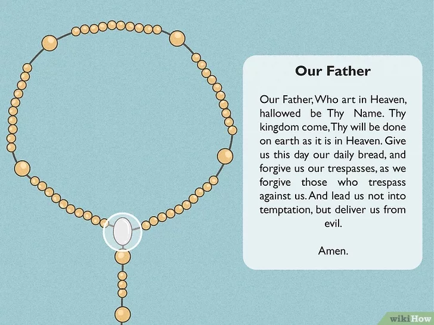

**在第一颗玫瑰念珠上，诵念《天主经》。**此刻你拨动的应是吊有垂饰的那个大玫瑰念珠。如下：

- 中文：我们的天父，愿你的名受显扬，愿你的国来临，愿你的旨意奉行人间犹如在天上。求你今日赏赐我们日用的食粮，求你宽恕我们的罪过如同我们宽恕他人一样，不要让我们陷于诱惑，但救我们免于凶恶。阿们。
- 拉丁文：Pater noster, qui es in caelis, sanctificetur nomen tuum. Adveniat regnum tuum. Fiat voluntas tua, sicut in caelo et in terra. Panem nostrum quotidianum da nobis hodie, et dimitte nobis debita nostra sicut et nos dimittimus debitoribus nostris. Et ne nos inducas in tentationem, sed libera nos a malo. Amen.
- 英文：Our Father, Who art in Heaven, hallowed be Thy Name. Thy kingdom come, Thy will be done on earth as it is in Heaven. Give us this day our daily bread, and forgive us our trespasses, as we forgive those who trespass against us. And lead us not into temptation, but deliver us from evil. Amen.

### 2.1.3 诵《圣母经》10遍

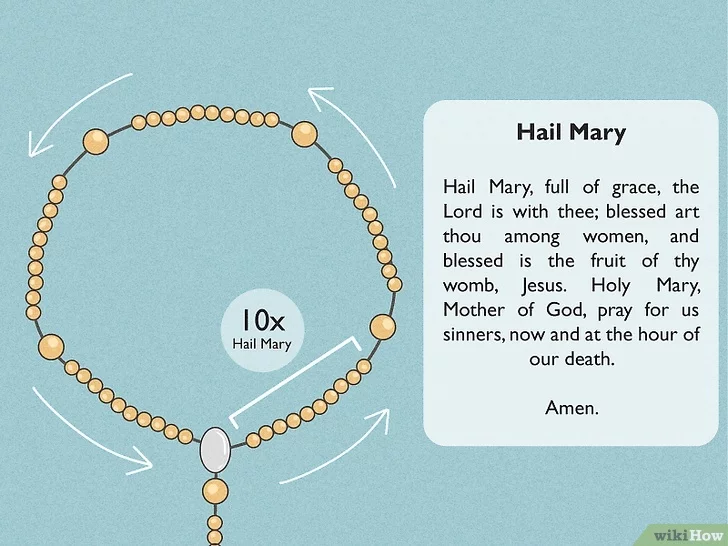

**在接下来的十颗念珠里，诵念《圣母经》。**一颗念珠诵念一遍。朝垂饰右方，以逆指针的方式拨动。

- 中文：大慈大悲的万福玛利亚，主与你同在；你在妇女中深受赞颂，你之子耶稣同受赞颂。圣母玛利亚，耶稣之母，此刻及在我们临终之时，愿你为我们的罪人所祈祷。阿们。
- 拉丁文：Ave Maria, gratia plena, Dominus tecum. Benedicta tu in mulieribus, et benedictus fructus ventris tui, Jesus. Sancta Maria, Mater Dei, ora pro nobis peccatoribus, nunc, et in hora mortis nostrae. Amen.
- 英文：Hail Mary, full of grace, the Lord is with thee; blessed art thou among women, and blessed is the fruit of thy womb, Jesus. Holy Mary, Mother of God, pray for us sinners, now and at the hour of our death. Amen.

### 2.1.4 诵《圣三光荣颂》和《法蒂玛圣母祷词》

#### 2.1.4.1 诵《圣三光荣颂》

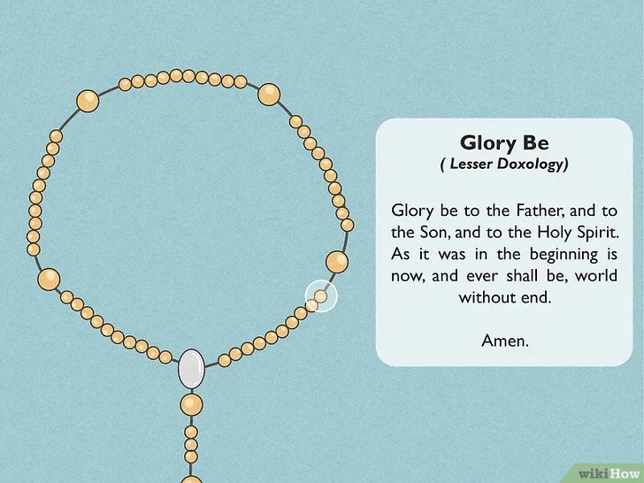

**在移向下颗大玫瑰念珠之前，向天主诵念《圣三光荣颂》。** 如下：

- 中文：愿光荣及父、及子、及圣灵。起初如何，今日亦然，直至永远。阿们。
- 拉丁文：Gloria Patri et Filio et Spiritui Sancto. Sicut erat in principio, et nunc et semper et in saecula saeculorum. Amen.
- 英文：Glory be to the Father, and to the Son, and to the Holy Spirit. As it was in the beginning is now, and ever shall be, world without end. Amen.

#### 2.1.4.2 诵《法蒂玛圣母祷词》

之后，你可以选择诵念《法蒂玛圣母祷词》，如下：

- 中文：我的主耶稣，请宽赦我们的罪过，拯救我们于地狱之火；请把我们的灵魂，尤其是那些需要你怜悯的灵魂，引去天国。阿们。
- 拉丁文： (法蒂玛圣母悼词没有正式的拉丁译本。): *Domine Iesu, dimitte nobis debita nostra, salva nos ab igne inferiori, perduc in caelum omnes animas, praesertim eas, quae misericordiae tuae maxime indigent.*
- 英文：O my Jesus, forgive us our sins, save us from the fires of hell, lead all souls to Heaven, especially those who have most need of your mercy.

## 2.2 第二组《圣母经》

### 2.2.1  宣读或默想第二端玫瑰奥迹

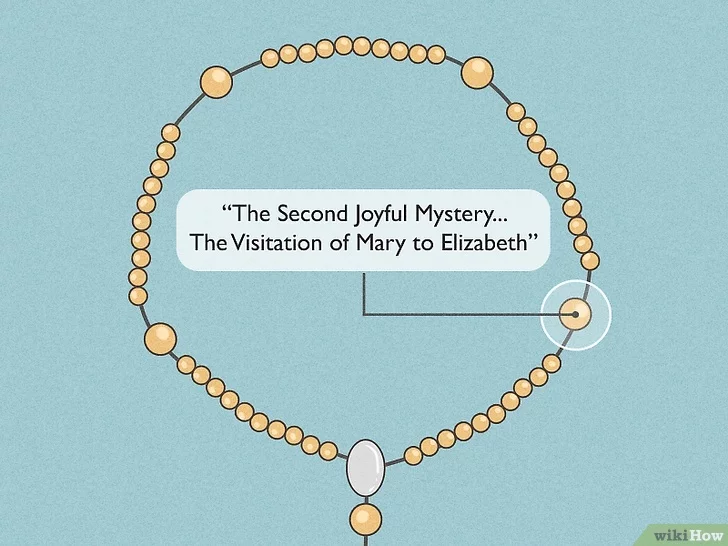

根据星期几，从以下中选取：

- 欢喜二端：圣母往见圣妇依撒伯尔（路加福音 1:39-56）
- 光明二端：耶稣参加加纳婚宴（约翰福音2:1-11）
- 痛苦二端：耶稣受鞭打之刑（马太福音27:26）
- 荣福二端：耶稣升天（路加福音24:36-53）

| 周一                                               | 周二                                      | 周三                                   | 周四                                         | 周五                                      | 周六                                               | 周日                                   |
| -------------------------------------------------- | ----------------------------------------- | -------------------------------------- | -------------------------------------------- | ----------------------------------------- | -------------------------------------------------- | -------------------------------------- |
| 欢喜二端：圣母往见圣妇依撒伯尔（路加福音 1:39-56） | 痛苦二端：耶稣受鞭打之刑（马太福音27:26） | 荣福二端：耶稣升天（路加福音24:36-53） | 光明二端：耶稣参加加纳婚宴（约翰福音2:1-11） | 痛苦二端：耶稣受鞭打之刑（马太福音27:26） | 欢喜二端：圣母往见圣妇依撒伯尔（路加福音 1:39-56） | 荣福二端：耶稣升天（路加福音24:36-53） |

#### 2.2.1.1 欢喜二端：圣母往见圣妇依撒伯尔（路加福音 1:39-56）

* 中文：
  * 39 不久，瑪麗亞便動身趕到猶太山區的一座城， 
  * 40 進了撒迦利亞的家，向伊莉莎白請安。 
  * 41 伊莉莎白一聽見瑪麗亞的問安，腹中的胎兒便跳動起來，伊莉莎白被聖靈充滿， 
  * 42 高聲喊著說：「在婦女中你是最蒙福的！你腹中的孩子也是蒙福的！ 
  * 43 我主的母親來探望我，我怎麼敢當呢？ 
  * 44 我一聽到你問安的聲音，腹中的孩子就歡喜跳動。 
  * 45 相信主所說的話必實現的女子有福了！」
  * 46 瑪麗亞說：「我的心尊主為大，
  * 47 我的靈因我的救主上帝而歡喜，
  * 48 因祂眷顧我這卑微的婢女，從今以後，世世代代都要稱我是有福的。
  * 49 全能者在我身上行了奇事，祂的名是神聖的。
  * 50 祂憐憫敬畏祂的人，直到世世代代。
  * 51 祂伸出臂膀，施展大能，驅散心驕氣傲的人。
  * 52 祂使當權者失勢，叫謙卑的人升高。
  * 53 祂使饑餓的得飽足，叫富足的空手而去。
  * 54 祂扶助了自己的僕人以色列，
  * 55 祂要施憐憫給亞伯拉罕和他的子孫，直到永遠，正如祂對我們祖先的應許。」
  * 56 瑪麗亞和伊莉莎白同住了約三個月，便回家去了。
* 英文：
  * 39 At that time Mary got ready and hurried to a town in the hill country of Judea, 
  * 40 where she entered Zechariah’s home and greeted Elizabeth. 
  * 41 When Elizabeth heard Mary’s greeting, the baby leaped in her womb, and Elizabeth was filled with the Holy Spirit. 
  * 42 In a loud voice she exclaimed: “Blessed are you among women, and blessed is the child you will bear! 
  * 43 But why am I so favored, that the mother of my Lord should come to me? 
  * 44 As soon as the sound of your greeting reached my ears, the baby in my womb leaped for joy. 
  * 45 Blessed is she who has believed that the Lord would fulfill his promises to her!”
  * 46 And Mary said: “My soul glorifies the Lord
  * 47   and my spirit rejoices in God my Savior,
  * 48 for he has been mindful of the humble state of his servant. From now on all generations will call me blessed,
  * 49 for the Mighty One has done great things for me — holy is his name.
  * 50 His mercy extends to those who fear him, from generation to generation.
  * 51 He has performed mighty deeds with his arm; he has scattered those who are proud in their inmost thoughts.
  * 52 He has brought down rulers from their thrones but has lifted up the humble.
  * 53 He has filled the hungry with good things but has sent the rich away empty.
  * 54 He has helped his servant Israel, remembering to be merciful
  * 55 to Abraham and his descendants forever, just as he promised our ancestors.”
  * 56 Mary stayed with Elizabeth for about three months and then returned home.

#### 2.2.1.2 光明二端：耶稣参加加纳婚宴（约翰福音2:1-11）

* 中文：
  * 1 第三天，在加利利的迦拿有人舉辦婚宴，耶穌的母親在那裡。 
  * 2 耶穌和門徒也被邀請去赴宴。 
  * 3 酒喝完了，耶穌的母親就對祂說：「他們沒有酒了。」 
  * 4 耶穌說：「婦人，這跟你我有什麼相干[[a](https://www.biblegateway.com/passage/?search=约翰福音2%3A1-11&version=CCB;CCBT;NIV#fzh-CCBT-25985a)]？我的時候還沒有到。」 
  * 5 祂母親對僕人說：「祂叫你們做什麼，你們就做什麼。」 
  * 6 那裡有六口猶太人用來行潔淨禮儀的石缸，每口可以盛約一百升水。
  * 7 耶穌對僕人說：「把缸倒滿水！」他們就往缸裡倒水，一直滿到缸口。 
  * 8 耶穌又說：「現在可以舀些出來，送給宴席總管。」他們就送了去。
  *  9 那些僕人知道這酒是怎樣來的，宴席總管卻不知道。他嚐過那水變的酒後，便把新郎叫來，
  *  10 對他說：「人們都是先拿好酒款待客人，等客人喝夠了，才把次等的拿出來，你卻把好酒留到現在！」
  *  11 這是耶穌第一次行神蹟，是在加利利的迦拿行的，彰顯了祂的榮耀，門徒都信了祂。
* 英文：
  * 1 On the third day a wedding took place at Cana in Galilee. Jesus’ mother was there, 
  * 2 and Jesus and his disciples had also been invited to the wedding. 
  * 3 When the wine was gone, Jesus’ mother said to him, “They have no more wine.”
  * 4 “Woman,[[a](https://www.biblegateway.com/passage/?search=约翰福音2%3A1-11&version=CCB;CCBT;NIV#fen-NIV-26100a)] why do you involve me?” Jesus replied. “My hour has not yet come.”
  * 5 His mother said to the servants, “Do whatever he tells you.”
  * 6 Nearby stood six stone water jars, the kind used by the Jews for ceremonial washing, each holding from twenty to thirty gallons.[[b](https://www.biblegateway.com/passage/?search=约翰福音2%3A1-11&version=CCB;CCBT;NIV#fen-NIV-26102b)]
  * 7 Jesus said to the servants, “Fill the jars with water”; so they filled them to the brim.
  * 8 Then he told them, “Now draw some out and take it to the master of the banquet.” They did so, 
  * 9 and the master of the banquet tasted the water that had been turned into wine. He did not realize where it had come from, though the servants who had drawn the water knew. Then he called the bridegroom aside 
  * 10 and said, “Everyone brings out the choice wine first and then the cheaper wine after the guests have had too much to drink; but you have saved the best till now.”
  * 11 What Jesus did here in Cana of Galilee was the first of the signs through which he revealed his glory; and his disciples believed in him.

#### 2.2.1.3 痛苦二端：耶稣受鞭打之刑（马太福音27:26）

* 中文：
  * 26 於是，彼拉多為他們釋放了巴拉巴，下令將耶穌鞭打後，帶出去釘十字架。
* 英文：
  * 26 Then he released Barabbas to them. But he had Jesus flogged, and handed him over to be crucified.

#### 2.2.1.4 荣福二端：耶稣升天（路加福音24:36-53）

* 中文：
  * 36 正說的時候，耶穌出現在他們中間，說：「願你們平安！」 
  * 37 他們又驚又怕，以為是看見了鬼魂。
  * 38 耶穌說：「你們為什麼憂心忡忡？為什麼心存疑惑呢？ 
  * 39 你們看我的手和腳，就知道真的是我。來摸摸看，鬼魂沒有骨和肉，你們看！我有。」 
  * 40 說完，便伸出手和腳給他們看。
  * 41 門徒又驚又喜，半信半疑。耶穌問：「你們這裡有吃的嗎？」 
  * 42 他們便給祂一片烤魚， 
  * 43 祂接過魚來在他們面前吃了。
  * 44 耶穌對他們說：「我跟你們在一起的時候曾經說過，摩西的律法書、先知的書以及詩篇裡有關我的記載都要應驗。」 
  * 45 於是，耶穌開啟了他們的心竅，使他們明白這些經文， 
  * 46 又對他們說：「聖經上說，基督必受害，然後在第三天從死裡復活， 
  * 47 人們要奉祂的名傳揚悔改、赦罪的福音，從耶路撒冷一直傳遍萬國。
  * 48 「你們是這些事的見證人， 
  * 49 我要把我父所應許的賜給你們。不過，你們要留在城裡，直到你們得到天上來的能力。」
  * 50 耶穌帶著門徒來到伯大尼附近，舉起雙手為他們祝福。 
  * 51 正祝福的時候，祂就離開了他們，被接到天上去了。 
  * 52 門徒都敬拜祂，然後歡歡喜喜地回到耶路撒冷。 
  * 53 他們常在聖殿裡讚美上帝。
* 英文：
  * 36 While they were still talking about this, Jesus himself stood among them and said to them, “Peace be with you.”
  * 37 They were startled and frightened, thinking they saw a ghost. 
  * 38 He said to them, “Why are you troubled, and why do doubts rise in your minds? 
  * 39 Look at my hands and my feet. It is I myself! Touch me and see; a ghost does not have flesh and bones, as you see I have.”
  * 40 When he had said this, he showed them his hands and feet. 
  * 41 And while they still did not believe it because of joy and amazement, he asked them, “Do you have anything here to eat?” 
  * 42 They gave him a piece of broiled fish, 
  * 43 and he took it and ate it in their presence.
  * 44 He said to them, “This is what I told you while I was still with you: Everything must be fulfilled that is written about me in the Law of Moses, the Prophets and the Psalms.”
  * 45 Then he opened their minds so they could understand the Scriptures. 
  * 46 He told them, “This is what is written: The Messiah will suffer and rise from the dead on the third day, 
  * 47 and repentance for the forgiveness of sins will be preached in his name to all nations, beginning at Jerusalem. 
  * 48 You are witnesses of these things. 
  * 49 I am going to send you what my Father has promised; but stay in the city until you have been clothed with power from on high.”
  * 50 When he had led them out to the vicinity of Bethany, he lifted up his hands and blessed them. 
  * 51 While he was blessing them, he left them and was taken up into heaven. 
  * 52 Then they worshiped him and returned to Jerusalem with great joy. 
  * 53 And they stayed continually at the temple, praising God.

### 2.2.2 诵《天主经》

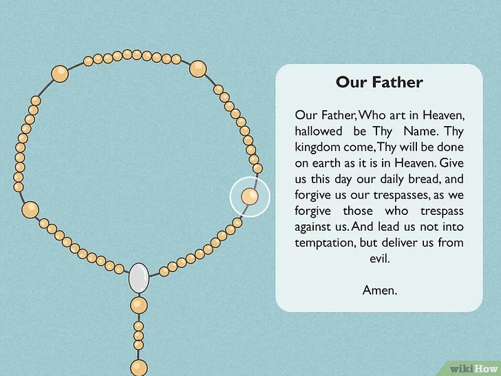

**在与其他分离，大的那颗念珠上，诵念《天主经》** ：

- 中文：我们的天父，愿你的名受显扬，愿你的国来临，愿你的旨意奉行人间犹如在天上。求你今日赏赐我们日用的食粮，求你宽恕我们的罪过如同我们宽恕他人一样，不要让我们陷于诱惑，但救我们免于凶恶。阿们。
- 拉丁文：Pater noster, qui es in caelis, sanctificetur nomen tuum. Adveniat regnum tuum. Fiat voluntas tua, sicut in caelo et in terra. Panem nostrum quotidianum da nobis hodie, et dimitte nobis debita nostra sicut et nos dimittimus debitoribus nostris. Et ne nos inducas in tentationem, sed libera nos a malo. Amen.
- 英文：Our Father, Who art in Heaven, hallowed be Thy Name. Thy kingdom come, Thy will be done on earth as it is in Heaven. Give us this day our daily bread, and forgive us our trespasses, as we forgive those who trespass against us. And lead us not into temptation, but deliver us from evil. Amen.

### 2.2.3 诵《圣母经》10遍

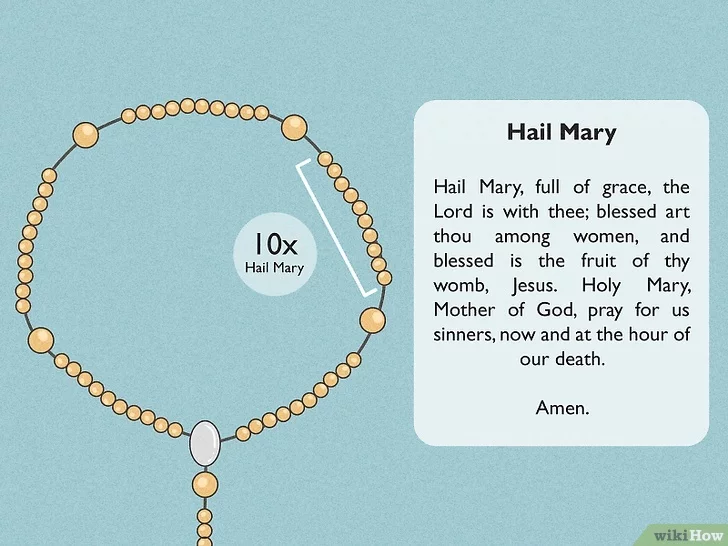

**诵念第二组十颗念珠。**即每颗念珠诵念一遍《圣母经》，共十遍：

- 中文：大慈大悲的万福玛利亚，主与你同在；你在妇女中深受赞颂，你之子耶稣同受赞颂。圣母玛利亚，耶稣之母，此刻及在我们临终之时，愿你为我们的罪人所祈祷。阿们。
- 拉丁文：Ave Maria, gratia plena, Dominus tecum. Benedicta tu in mulieribus, et benedictus fructus ventris tui, Jesus. Sancta Maria, Mater Dei, ora pro nobis peccatoribus, nunc, et in hora mortis nostrae. Amen.
- 英文：Hail Mary, full of grace, the Lord is with thee; blessed art thou among women, and blessed is the fruit of thy womb, Jesus. Holy Mary, Mother of God, pray for us sinners, now and at the hour of our death. Amen.

### 2.2.4 诵《圣三光荣颂》和《法蒂玛圣母祷词》

#### 2.2.4.1 诵《圣三光荣颂》

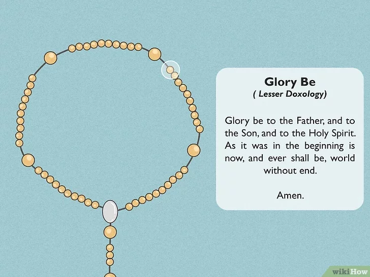

**在移向下颗大玫瑰念珠之前，向天主诵念《圣三光荣颂》。** 如下：

- 中文：愿光荣及父、及子、及圣灵。起初如何，今日亦然，直至永远。阿们。
- 拉丁文：Gloria Patri et Filio et Spiritui Sancto. Sicut erat in principio, et nunc et semper et in saecula saeculorum. Amen.
- 英文：Glory be to the Father, and to the Son, and to the Holy Spirit. As it was in the beginning is now, and ever shall be, world without end. Amen.

#### 2.2.4.2 诵《法蒂玛圣母祷词》

之后，你可以选择诵念《法蒂玛圣母祷词》，如下：

- 中文：我的主耶稣，请宽赦我们的罪过，拯救我们于地狱之火；请把我们的灵魂，尤其是那些需要你怜悯的灵魂，引去天国。阿们。
- 拉丁文： (法蒂玛圣母悼词没有正式的拉丁译本。): *Domine Iesu, dimitte nobis debita nostra, salva nos ab igne inferiori, perduc in caelum omnes animas, praesertim eas, quae misericordiae tuae maxime indigent.*
- 英文：O my Jesus, forgive us our sins, save us from the fires of hell, lead all souls to Heaven, especially those who have most need of your mercy.

## 2.3 第三组《圣母经》

### 2.3.1  宣读或默想第三端玫瑰奥迹

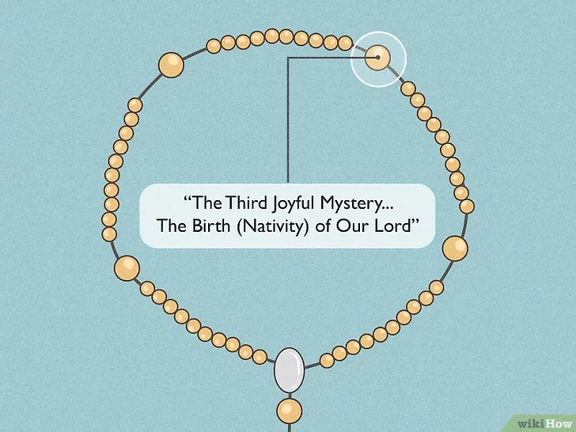

根据星期几，从以下中选取：

- 欢喜三端：耶稣基督诞生（路加福音2:1-21）
- 光明三端：耶稣宣讲天国福音（马可福音 1:14-15）
- 痛苦三端：耶稣受茨冠之苦辱（马太福音27:27-31）
- 荣福三端：圣灵降临（使徒行传2:1-41）

| 周一                                     | 周二                                           | 周三                                 | 周四                                           | 周五                                           | 周六                                     | 周日                                 |
| ---------------------------------------- | ---------------------------------------------- | ------------------------------------ | ---------------------------------------------- | ---------------------------------------------- | ---------------------------------------- | ------------------------------------ |
| 欢喜三端：耶稣基督诞生（路加福音2:1-21） | 痛苦三端：耶稣受茨冠之苦辱（马太福音27:27-31） | 荣福三端：圣灵降临（使徒行传2:1-41） | 光明三端：耶稣宣讲天国福音（马可福音 1:14-15） | 痛苦三端：耶稣受茨冠之苦辱（马太福音27:27-31） | 欢喜三端：耶稣基督诞生（路加福音2:1-21） | 荣福三端：圣灵降临（使徒行传2:1-41） |

#### 2.3.1.1 欢喜三端：耶稣基督诞生（路加福音2:1-21）

* 中文：
  * 1 那時，凱撒奧古斯都頒下諭旨，命羅馬帝國的人民都辦理戶口登記。 
  * 2 這是第一次戶口登記，正值居里紐任敘利亞總督。 
  * 3 大家都回到本鄉辦理戶口登記。 
  * 4 約瑟因為是大衛家族的人，就從加利利的拿撒勒鎮趕到猶太地區大衛的故鄉伯利恆， 
  * 5 要和已許配給他、懷著身孕的瑪麗亞一起登記。 
  * 6 他們抵達目的地時，瑪麗亞產期到了， 
  * 7 便生下第一胎，是個兒子。她用布把孩子裹好，安放在馬槽裡，因為旅店沒有房間了。
  * 8 當晚，伯利恆郊外有一群牧羊人正在看守羊群。 
  * 9 忽然，主的天使向他們顯現，主的榮光四面照著他們，他們非常害怕。 
  * 10 天使對他們說：「不要怕！我告訴你們一個有關萬民的大喜訊， 
  * 11 今天在大衛的城裡有一位救主為你們降生了，祂就是主基督！ 
  * 12 你們將看見一個嬰孩包著布躺在馬槽裡，這就是給你們的記號。」
  * 13 忽然，有一大隊天軍出現，與那天使一同讚美上帝說：
  * 14 「在至高之處，願榮耀歸於上帝！在地上，願平安臨到祂所喜悅的人！」
  * 15 眾天使離開他們升回天上之後，牧羊人便商議說：「我們現在去伯利恆，察看一下主剛才告訴我們的那件事吧！」 
  * 16 他們就連忙進城，找到了瑪麗亞和約瑟以及躺在馬槽裡的嬰孩。 
  * 17 他們看過之後，就把天使告訴他們有關這嬰孩的事傳開了。 
  * 18 聽見的人都對牧羊人的話感到驚訝。
  * 19 但瑪麗亞把這些事牢記在心裡，反覆思想。 
  * 20 牧羊人在歸途中不斷地將榮耀歸於上帝，讚美祂，因為他們的所見所聞跟天使告訴他們的一樣。
  * 21 在第八天，嬰孩接受了割禮，祂的名字叫耶穌，是瑪麗亞懷孕前天使取的。
* 英文：
  * 1 In those days Caesar Augustus issued a decree that a census should be taken of the entire Roman world. 
  * 2 (This was the first census that took place while[[a](https://www.biblegateway.com/passage/?search=路加福音2%3A1-21&version=CCB;CCBT;NIV#fen-NIV-24976a)] Quirinius was governor of Syria.) 
  * 3 And everyone went to their own town to register.
  * 4 So Joseph also went up from the town of Nazareth in Galilee to Judea, to Bethlehem the town of David, because he belonged to the house and line of David. 
  * 5 He went there to register with Mary, who was pledged to be married to him and was expecting a child. 
  * 6 While they were there, the time came for the baby to be born, 
  * 7 and she gave birth to her firstborn, a son. She wrapped him in cloths and placed him in a manger, because there was no guest room available for them.
  * 8 And there were shepherds living out in the fields nearby, keeping watch over their flocks at night. 
  * 9 An angel of the Lord appeared to them, and the glory of the Lord shone around them, and they were terrified. 
  * 10 But the angel said to them, “Do not be afraid. I bring you good news that will cause great joy for all the people. 
  * 11 Today in the town of David a Savior has been born to you; he is the Messiah, the Lord. 
  * 12 This will be a sign to you: You will find a baby wrapped in cloths and lying in a manger.”
  * 13 Suddenly a great company of the heavenly host appeared with the angel, praising God and saying,
  * 14 “Glory to God in the highest heaven, and on earth peace to those on whom his favor rests.”
  * 15 When the angels had left them and gone into heaven, the shepherds said to one another, “Let’s go to Bethlehem and see this thing that has happened, which the Lord has told us about.”
  * 16 So they hurried off and found Mary and Joseph, and the baby, who was lying in the manger. 
  * 17 When they had seen him, they spread the word concerning what had been told them about this child, 
  * 18 and all who heard it were amazed at what the shepherds said to them. 
  * 19 But Mary treasured up all these things and pondered them in her heart. 
  * 20 The shepherds returned, glorifying and praising God for all the things they had heard and seen, which were just as they had been told.
  * 21 On the eighth day, when it was time to circumcise the child, he was named Jesus, the name the angel had given him before he was conceived.

#### 2.3.1.2 光明三端：耶稣宣讲天国福音（马可福音 1:14-15）

* 中文：
  * 14 約翰被捕後，耶穌來到加利利宣講上帝的福音，說： 
  * 15 「時候到了，上帝的國臨近了，你們要悔改，相信福音。」
* 英文：
  * 14 After John was put in prison, Jesus went into Galilee, proclaiming the good news of God. 
  * 15 “The time has come,” he said. “The kingdom of God has come near. Repent and believe the good news!”

#### 2.3.1.3 痛苦三端：耶稣受茨冠之苦辱（马太福音27:27-31）

* 中文：
  * 27 士兵把耶穌押進總督府，叫全營的士兵都聚集在祂周圍。 
  * 28 他們剝下耶穌的衣服，替祂披上一件朱紅色的長袍， 
  * 29 用荊棘編成冠冕，戴在祂頭上，又拿一根葦稈放在祂右手裡，跪在祂跟前戲弄祂，說：「猶太人的王萬歲！」 
  * 30 然後向祂吐唾沫，拿過葦稈打祂的頭。 
  * 31 他們戲弄完了，就脫去祂的袍子，給祂穿上原來的衣服，把祂押出去釘十字架。
* 英文：
  * 27 Then the governor’s soldiers took Jesus into the Praetorium and gathered the whole company of soldiers around him.
  * 28 They stripped him and put a scarlet robe on him, 
  * 29 and then twisted together a crown of thorns and set it on his head. They put a staff in his right hand. Then they knelt in front of him and mocked him. “Hail, king of the Jews!” they said. 
  * 30 They spit on him, and took the staff and struck him on the head again and again. 
  * 31 After they had mocked him, they took off the robe and put his own clothes on him. Then they led him away to crucify him.

#### 2.3.1.4 荣福三端：圣灵降临（使徒行传2:1-41）

* 中文：
  * 1 五旬節那天，門徒聚集在一起。 
  * 2 忽然，天上發出一陣響聲，好像狂風呼嘯而過，充滿了他們所在的房子， 
  * 3 又有火焰般的舌頭顯現出來，分別落在各人的頭上。 
  * 4 大家都被聖靈充滿，得到聖靈所賜的才能，說起別的語言來。
  * 5 當時耶路撒冷住著從各國回來的虔誠的猶太人。 
  * 6 眾人聽見這陣響聲便趕過來，聽見門徒在說他們各自的語言，都十分納悶， 
  * 7 驚詫地說：「看啊！這些說話的不都是加利利人嗎？ 
  * 8 怎麼會說我們各自的語言呢？ 
  * 9 我們這裡有帕提亞人、瑪代人、以攔人，以及住在美索不達米亞、猶太、加帕多迦、本都、亞細亞、 
  * 10 弗呂迦、旁非利亞、埃及和靠近古利奈的利比亞的人，還有從羅馬來的猶太人和改信猶太教的人、 
  * 11 克里特人和阿拉伯人。我們都聽見他們在用我們各自的語言訴說上帝的偉大！」 
  * 12 他們都大感驚奇和困惑，彼此議論說：「這到底是怎麼回事？」
  * 13 有些人就譏笑說：「他們不過是被新酒灌醉了！」
  * 14 彼得和其他十一位使徒都站起來，他大聲對眾人說：「各位猶太同胞和住在耶路撒冷的人啊，請留心聽！我告訴你們這是怎麼回事。 
  * 15 你們以為這些人是醉了，其實不是，因為現在才早上九點鐘。 
  * 16 你們眼前看見的正是先知約珥所說的，
  * 17 『上帝說，在末後的日子，我要將我的靈澆灌所有的人，你們的兒女要說預言，青年要見異象，老人要做異夢。
  * 18 那時，我要將我的靈澆灌我的奴僕和婢女，他們都要說預言。
  * 19 在天上，我要顯異兆；在地上，我要行神蹟，有血、有火、有濃煙。
  * 20 太陽要變得昏暗，月亮要變得血紅。這都要發生在主偉大榮耀的日子來臨以前。
  * 21 那時，凡求告主名的，都必得救。』
  * 22 「各位以色列人啊，請留心聽。上帝藉著拿撒勒人耶穌在你們中間行了異能、奇事和神蹟，以證明拿撒勒人耶穌是祂派來的。這是你們都知道的。 
  * 23 上帝照著自己的計劃和預知把耶穌交在你們手裡，你們藉著邪惡之人的手把祂釘死在十字架上了。 
  * 24 但上帝為祂解除了死亡的痛苦，使祂從死裡復活，因為祂不可能被死亡拘禁。 
  * 25 論到耶穌，大衛曾說，『我看見主常在我面前，祂在我右邊，我必不動搖。
  * 26 因此我的心歡喜，我的口頌讚，我的身體也要活在盼望中。
  * 27 因為你不會把我的靈魂撇在陰間，也不會讓你的聖者身體朽壞。
  * 28 你已把生命之路指示我，叫我在你面前充滿喜樂。』
  * 29 「弟兄們，我肯定地對你們說，先祖大衛死了，埋葬了，他的墳墓至今還在這裡。 
  * 30 大衛是先知，知道上帝曾起誓要從他的後裔中選立一人繼承他的王位。 
  * 31 他預先知道這事，講到基督的復活，說，『祂的靈魂不會被撇在陰間，祂的身體也不會朽壞』。 
  * 32 上帝已經使這位耶穌復活了！我們都是這件事的見證人。 
  * 33 現在祂升到上帝的右邊，從天父領受了所應許的聖靈，並將聖靈澆灌下來，你們今天也耳聞目睹了。 
  * 34 大衛並沒有升到天上，但他曾說，『主對我主說，你坐在我的右邊，
  * 35 等我使你的仇敵成為你的腳凳。』
  * 36 「所以，全體以色列人啊！你們應當確實地知道，上帝已經立這位被你們釘在十字架上的耶穌為主，為基督了。」
  * 37 他們聽了彼得的話，覺得扎心，就對彼得和其他使徒說：「弟兄們，我們該怎麼辦呢？」 
  * 38 彼得說：「你們每一個人都要悔改，奉耶穌基督的名受洗，使你們的罪得到赦免，你們就必領受上帝所賜的聖靈。 
  * 39 因為這應許是給你們和你們的兒女，以及遠方的人，就是所有被主——我們的上帝呼召的人。」
  * 40 然後，彼得還講了許多話警戒、勸勉他們，說：「你們要保守自己脫離這邪惡的世代。」
  * 41 結果，那天約有三千人相信了他傳的道，接受了洗禮。
* 英文：
  * 1When the day of Pentecost came, they were all together in one place. 
  * 2 Suddenly a sound like the blowing of a violent wind came from heaven and filled the whole house where they were sitting. 
  * 3 They saw what seemed to be tongues of fire that separated and came to rest on each of them. 
  * 4 All of them were filled with the Holy Spirit and began to speak in other tongues[[a](https://www.biblegateway.com/passage/?search=使徒行传2%3A1-41&version=CCB;CCBT;NIV#fen-NIV-26954a)] as the Spirit enabled them.
  * 5 Now there were staying in Jerusalem God-fearing Jews from every nation under heaven. 
  * 6 When they heard this sound, a crowd came together in bewilderment, because each one heard their own language being spoken. 
  * 7 Utterly amazed, they asked: “Aren’t all these who are speaking Galileans? 
  * 8 Then how is it that each of us hears them in our native language? 
  * 9 Parthians, Medes and Elamites; residents of Mesopotamia, Judea and Cappadocia, Pontus and Asia,[[b](https://www.biblegateway.com/passage/?search=使徒行传2%3A1-41&version=CCB;CCBT;NIV#fen-NIV-26959b)] 
  * 10 Phrygia and Pamphylia, Egypt and the parts of Libya near Cyrene; visitors from Rome 
  * 11 (both Jews and converts to Judaism); Cretans and Arabs—we hear them declaring the wonders of God in our own tongues!” 
  * 12 Amazed and perplexed, they asked one another, “What does this mean?”
  * 13 Some, however, made fun of them and said, “They have had too much wine.”
  * 14 Then Peter stood up with the Eleven, raised his voice and addressed the crowd: “Fellow Jews and all of you who live in Jerusalem, let me explain this to you; listen carefully to what I say. 
  * 15 These people are not drunk, as you suppose. It’s only nine in the morning! 
  * 16 No, this is what was spoken by the prophet Joel:
  * 17 “‘In the last days, God says, I will pour out my Spirit on all people. Your sons and daughters will prophesy, your young men will see visions, your old men will dream dreams.
  * 18 Even on my servants, both men and women, I will pour out my Spirit in those days, and they will prophesy.
  * 19 I will show wonders in the heavens above and signs on the earth below, blood and fire and billows of smoke.
  * 20 The sun will be turned to darkness and the moon to blood before the coming of the great and glorious day of the Lord.
  * 21 And everyone who calls on the name of the Lord will be saved.’[[c](https://www.biblegateway.com/passage/?search=使徒行传2%3A1-41&version=CCB;CCBT;NIV#fen-NIV-26971c)]
  * 22 “Fellow Israelites, listen to this: Jesus of Nazareth was a man accredited by God to you by miracles, wonders and signs, which God did among you through him, as you yourselves know. 
  * 23 This man was handed over to you by God’s deliberate plan and foreknowledge; and you, with the help of wicked men,[[d](https://www.biblegateway.com/passage/?search=使徒行传2%3A1-41&version=CCB;CCBT;NIV#fen-NIV-26973d)] put him to death by nailing him to the cross. 
  * 24 But God raised him from the dead, freeing him from the agony of death, because it was impossible for death to keep its hold on him. 
  * 25 David said about him: “‘I saw the Lord always before me. Because he is at my right hand, I will not be shaken.
  * 26 Therefore my heart is glad and my tongue rejoices; my body also will rest in hope,
  * 27 because you will not abandon me to the realm of the dead, you will not let your holy one see decay.
  * 28 You have made known to me the paths of life; you will fill me with joy in your presence.’[[e](https://www.biblegateway.com/passage/?search=使徒行传2%3A1-41&version=CCB;CCBT;NIV#fen-NIV-26978e)]
  * 29 “Fellow Israelites, I can tell you confidently that the patriarch David died and was buried, and his tomb is here to this day. 
  * 30 But he was a prophet and knew that God had promised him on oath that he would place one of his descendants on his throne. 
  * 31 Seeing what was to come, he spoke of the resurrection of the Messiah, that he was not abandoned to the realm of the dead, nor did his body see decay. 
  * 32 God has raised this Jesus to life, and we are all witnesses of it. 
  * 33 Exalted to the right hand of God, he has received from the Father the promised Holy Spirit and has poured out what you now see and hear. 
  * 34 For David did not ascend to heaven, and yet he said,“‘The Lord said to my Lord: “Sit at my right hand
  * 35 until I make your enemies a footstool for your feet.”’[[f](https://www.biblegateway.com/passage/?search=使徒行传2%3A1-41&version=CCB;CCBT;NIV#fen-NIV-26985f)]
  * 36 “Therefore let all Israel be assured of this: God has made this Jesus, whom you crucified, both Lord and Messiah.”
  * 37 When the people heard this, they were cut to the heart and said to Peter and the other apostles, “Brothers, what shall we do?” 
  * 38 Peter replied, “Repent and be baptized, every one of you, in the name of Jesus Christ for the forgiveness of your sins. And you will receive the gift of the Holy Spirit. 
  * 39 The promise is for you and your children and for all who are far off—for all whom the Lord our God will call.”
  * 40 With many other words he warned them; and he pleaded with them, “Save yourselves from this corrupt generation.”
  * 41 Those who accepted his message were baptized, and about three thousand were added to their number that day.

### 2.3.2 诵《天主经》

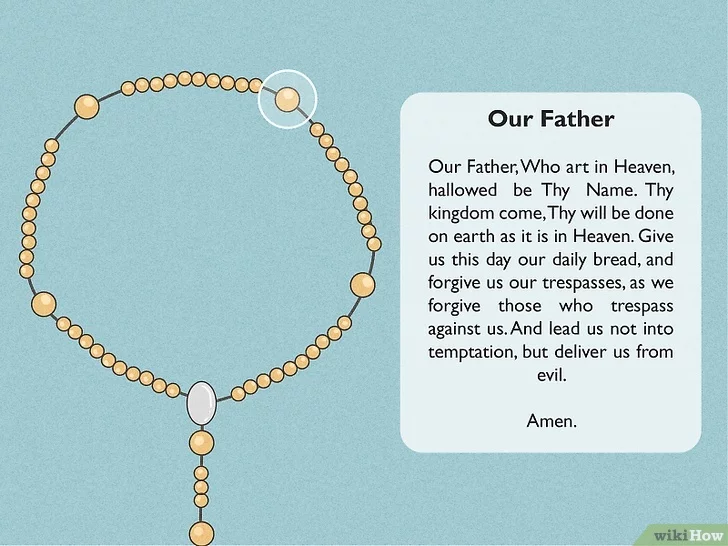

**在第三组的第一颗大念珠上诵念《天主经》。**虽然要一直重复经文，但请尽力保持默想的状态。集中精力诵念才会得到主的帮助。你是在为抱恙的朋友祈祷？还是为力量所祈祷？要一心想着祈祷的目的。如下：

- 中文：我们的天父，愿你的名受显扬，愿你的国来临，愿你的旨意奉行人间犹如在天上。求你今日赏赐我们日用的食粮，求你宽恕我们的罪过如同我们宽恕他人一样，不要让我们陷于诱惑，但救我们免于凶恶。阿们。
- 拉丁文：Pater noster, qui es in caelis, sanctificetur nomen tuum. Adveniat regnum tuum. Fiat voluntas tua, sicut in caelo et in terra. Panem nostrum quotidianum da nobis hodie, et dimitte nobis debita nostra sicut et nos dimittimus debitoribus nostris. Et ne nos inducas in tentationem, sed libera nos a malo. Amen.
- 英文：Our Father, Who art in Heaven, hallowed be Thy Name. Thy kingdom come, Thy will be done on earth as it is in Heaven. Give us this day our daily bread, and forgive us our trespasses, as we forgive those who trespass against us. And lead us not into temptation, but deliver us from evil. Amen.

### 2.3.3 诵《圣母经》10遍

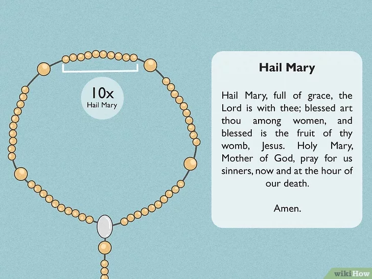

**接下来诵念《圣母经》十遍。**在你每诵完一遍的后，拨向下一颗念珠。你已经完成了一半了！如果你没有玫瑰念珠，用手指做相同的动作也是可以的。

- 中文：大慈大悲的万福玛利亚，主与你同在；你在妇女中深受赞颂，你之子耶稣同受赞颂。圣母玛利亚，耶稣之母，此刻及在我们临终之时，愿你为我们的罪人所祈祷。阿们。
- 拉丁文：Ave Maria, gratia plena, Dominus tecum. Benedicta tu in mulieribus, et benedictus fructus ventris tui, Jesus. Sancta Maria, Mater Dei, ora pro nobis peccatoribus, nunc, et in hora mortis nostrae. Amen.
- 英文：Hail Mary, full of grace, the Lord is with thee; blessed art thou among women, and blessed is the fruit of thy womb, Jesus. Holy Mary, Mother of God, pray for us sinners, now and at the hour of our death. Amen.

### 2.3.4 诵《圣三光荣颂》和《法蒂玛圣母祷词》

#### 2.3.4.1 诵《圣三光荣颂》

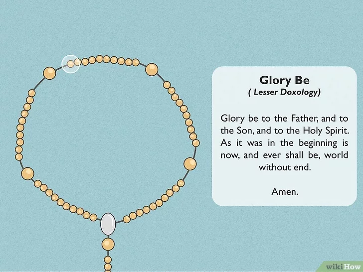

**最后以《圣荣光三颂》结束第三组的诵念。**如下：

- 中文：愿光荣及父、及子、及圣灵。起初如何，今日亦然，直至永远。阿们。
- 拉丁文：Gloria Patri et Filio et Spiritui Sancto. Sicut erat in principio, et nunc et semper et in saecula saeculorum. Amen.
- 英文：Glory be to the Father, and to the Son, and to the Holy Spirit. As it was in the beginning is now, and ever shall be, world without end. Amen.

#### 2.3.4.2 诵《蒂玛圣母祷词》

之后同样的，你还可以选择诵念《法蒂玛圣母祷词》：

- 中文：我的主耶稣，请宽赦我们的罪过，拯救我们于地狱之火；请把我们的灵魂，尤其是那些需要你怜悯的灵魂，引去天国。阿们。
- 拉丁文： (法蒂玛圣母悼词没有正式的拉丁译本。): *Domine Iesu, dimitte nobis debita nostra, salva nos ab igne inferiori, perduc in caelum omnes animas, praesertim eas, quae misericordiae tuae maxime indigent.*
- 英文：O my Jesus, forgive us our sins, save us from the fires of hell, lead all souls to Heaven, especially those who have most need of your mercy.

## 2.4 第四组《圣母经》

### 2.4.1 宣读或默想第四端玫瑰奥迹

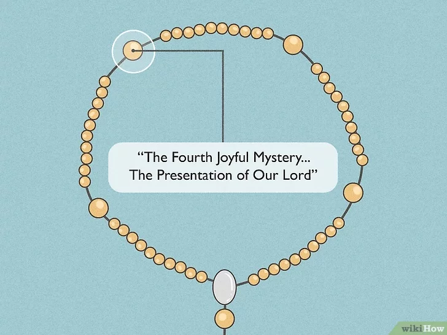

根据今天星期几，从以下选取：

- 欢喜四端：圣母献耶稣于圣殿（路加福音2:22-38）
- 光明四端：耶稣大博尔山显容（马太福音17:1-8）
- 痛苦四端：耶稣背十字架上山（马太福音27:32）
- 荣福四端：圣母蒙召升天

| 周一                                          | 周二                                        | 周三                   | 周四                                         | 周五                                        | 周六                                          | 周日                   |
| --------------------------------------------- | ------------------------------------------- | ---------------------- | -------------------------------------------- | ------------------------------------------- | --------------------------------------------- | ---------------------- |
| 欢喜四端：圣母献耶稣于圣殿（路加福音2:22-38） | 痛苦四端：耶稣背十字架上山（马太福音27:32） | 荣福四端：圣母蒙召升天 | 光明四端：耶稣大博尔山显容（马太福音17:1-8） | 痛苦四端：耶稣背十字架上山（马太福音27:32） | 欢喜四端：圣母献耶稣于圣殿（路加福音2:22-38） | 荣福四端：圣母蒙召升天 |

#### 2.4.1.1 欢喜四端：圣母献耶稣于圣殿（路加福音2:22-38）

* 中文
  * 22 摩西律法規定的潔淨期滿後，約瑟和瑪麗亞把嬰孩帶到耶路撒冷去獻給主， 
  * 23 因為主的律法規定：必須把長子分別出來獻給主。 
  * 24 他們又按照主的律法獻上祭物，即一對斑鳩或兩隻雛鴿。 
  * 25 耶路撒冷有一位公義敬虔、有聖靈同在的人名叫希緬，他一直期待著以色列的安慰者到來。 
  * 26 聖靈曾啟示他：他去世前必能親眼看見主所立的基督。
  * 27 一天，他受聖靈感動進入聖殿，看見約瑟和瑪麗亞抱著嬰孩耶穌進來，要依照律法的規定為祂行奉獻禮， 
  * 28 就把祂抱過來，稱頌上帝說：
  * 29 「主啊，現在你的話已經成就，可以讓你的奴僕安然離世了，
  * 30 因為我已親眼看到你的救恩，
  * 31 就是你為萬民所預備的救恩。
  * 32 這救恩是啟示外族人的光，也是你以色列子民的榮耀。」
  * 33 約瑟和瑪麗亞聽見這番話，感到驚奇。 
  * 34 希緬給他們祝福後，就對孩子的母親瑪麗亞說：「看啊，這孩子必使以色列許多人跌倒、許多人興起。祂將成為眾人攻擊的對象， 
  * 35 好叫許多人的心思意念暴露出來，你自己則會心如刀割。」
  * 36-37 亞設支派中有一位八十四歲高齡的女先知名叫亞拿，是法內利的女兒，婚後七年便開始守寡，之後一直住在聖殿裡，禁食禱告，日夜事奉上帝。 
  * 38 正在那時，她也前來感謝上帝，並把耶穌的事報告給所有盼望耶路撒冷蒙救贖的人。
* 英文
  * 22 When the time came for the purification rites required by the Law of Moses, Joseph and Mary took him to Jerusalem to present him to the Lord 
  * 23 (as it is written in the Law of the Lord, “Every firstborn male is to be consecrated to the Lord”[[a](https://www.biblegateway.com/passage/?search=路加福音2%3A22-38&version=CCB;CCBT;NIV#fen-NIV-24997a)]), 
  * 24 and to offer a sacrifice in keeping with what is said in the Law of the Lord: “a pair of doves or two young pigeons.”[[b](https://www.biblegateway.com/passage/?search=路加福音2%3A22-38&version=CCB;CCBT;NIV#fen-NIV-24998b)]
  * 25 Now there was a man in Jerusalem called Simeon, who was righteous and devout. He was waiting for the consolation of Israel, and the Holy Spirit was on him. 
  * 26 It had been revealed to him by the Holy Spirit that he would not die before he had seen the Lord’s Messiah. 
  * 27 Moved by the Spirit, he went into the temple courts. When the parents brought in the child Jesus to do for him what the custom of the Law required, 
  * 28 Simeon took him in his arms and praised God, saying:
  * 29 “Sovereign Lord, as you have promised, you may now dismiss[[c](https://www.biblegateway.com/passage/?search=路加福音2%3A22-38&version=CCB;CCBT;NIV#fen-NIV-25003c)] your servant in peace.
  * 30 For my eyes have seen your salvation,
  * 31   which you have prepared in the sight of all nations:
  * 32 a light for revelation to the Gentiles, and the glory of your people Israel.”
  * 33 The child’s father and mother marveled at what was said about him. 
  * 34 Then Simeon blessed them and said to Mary, his mother: “This child is destined to cause the falling and rising of many in Israel, and to be a sign that will be spoken against, 
  * 35 so that the thoughts of many hearts will be revealed. And a sword will pierce your own soul too.”
  * 36 There was also a prophet, Anna, the daughter of Penuel, of the tribe of Asher. She was very old; she had lived with her husband seven years after her marriage, 
  * 37 and then was a widow until she was eighty-four.[[d](https://www.biblegateway.com/passage/?search=路加福音2%3A22-38&version=CCB;CCBT;NIV#fen-NIV-25011d)] She never left the temple but worshiped night and day, fasting and praying. 
  * 38 Coming up to them at that very moment, she gave thanks to God and spoke about the child to all who were looking forward to the redemption of Jerusalem.

#### 2.4.1.2 光明四端：耶稣大博尔山显容（马太福音17:1-8）

* 中文
  * 1 六天後，耶穌帶著彼得、雅各和雅各的兄弟約翰暗暗地登上一座高山。 
  * 2 耶穌在他們面前改變了形像，面貌如太陽一樣發光，衣服潔白如光。
  * 3 忽然，摩西和以利亞一起出現，跟耶穌談話。 
  * 4 彼得對耶穌說：「主啊，我們在這裡好極了。如果你願意，我就在這裡搭三座帳篷，一座給你，一座給摩西，一座給以利亞。」
  * 5 他正在說話的時候，一朵燦爛的雲彩籠罩他們。雲中傳出聲音：「這是我的愛子，我甚喜悅祂，你們要聽從祂。」
  * 6 門徒聽見這聲音，便俯伏在地，非常懼怕。 
  * 7 耶穌就過來摸他們，說：「起來吧，別害怕。」 
  * 8 他們抬起頭來，看見只剩下耶穌一個人。
* 英文
  * 1 After six days Jesus took with him Peter, James and John the brother of James, and led them up a high mountain by themselves. 
  * 2 There he was transfigured before them. His face shone like the sun, and his clothes became as white as the light. 
  * 3 Just then there appeared before them Moses and Elijah, talking with Jesus.
  * 4 Peter said to Jesus, “Lord, it is good for us to be here. If you wish, I will put up three shelters—one for you, one for Moses and one for Elijah.”
  * 5 While he was still speaking, a bright cloud covered them, and a voice from the cloud said, “This is my Son, whom I love; with him I am well pleased. Listen to him!”
  * 6 When the disciples heard this, they fell facedown to the ground, terrified. 
  * 7 But Jesus came and touched them. “Get up,” he said. “Don’t be afraid.” 
  * 8 When they looked up, they saw no one except Jesus.

#### 2.4.1.3 痛苦四端：耶稣背十字架上山（马太福音27:32）

* 中文
  * 32 路上，他們遇見一個叫西門的古利奈人，就強迫他背耶穌的十字架。
* 英文
  * 32 As they were going out, they met a man from Cyrene, named Simon, and they forced him to carry the cross.

#### 2.4.1.4 荣福四端：圣母蒙召升天

* 中文
  * 被保留未染丝毫原罪污点的无玷童贞圣母，在结束了人间生活的过程后，身灵一同蒙召升天，被上主荣擢为宇宙之后。
* 英文
  * The Immaculate Virgin, preserved free from all stain of original sin, when the course of her earthly life was finished, was taken up body and soul into heavenly glory, and exalted by the Lord as Queen over all things.

### 2.4.2 诵《天主经》

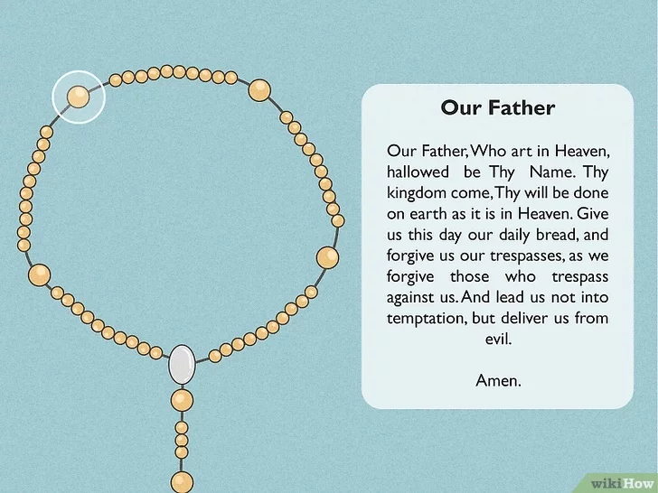

**手拨动大的念珠，诵念《天主经》**：

- 中文：我们的天父，愿你的名受显扬，愿你的国来临，愿你的旨意奉行人间犹如在天上。求你今日赏赐我们日用的食粮，求你宽恕我们的罪过如同我们宽恕他人一样，不要让我们陷于诱惑，但救我们免于凶恶。阿们。
- 拉丁文：Pater noster, qui es in caelis, sanctificetur nomen tuum. Adveniat regnum tuum. Fiat voluntas tua, sicut in caelo et in terra. Panem nostrum quotidianum da nobis hodie, et dimitte nobis debita nostra sicut et nos dimittimus debitoribus nostris. Et ne nos inducas in tentationem, sed libera nos a malo. Amen.
- 英文：Our Father, Who art in Heaven, hallowed be Thy Name. Thy kingdom come, Thy will be done on earth as it is in Heaven. Give us this day our daily bread, and forgive us our trespasses, as we forgive those who trespass against us. And lead us not into temptation, but deliver us from evil. Amen.

### 2.4.3 诵《圣母经》10遍

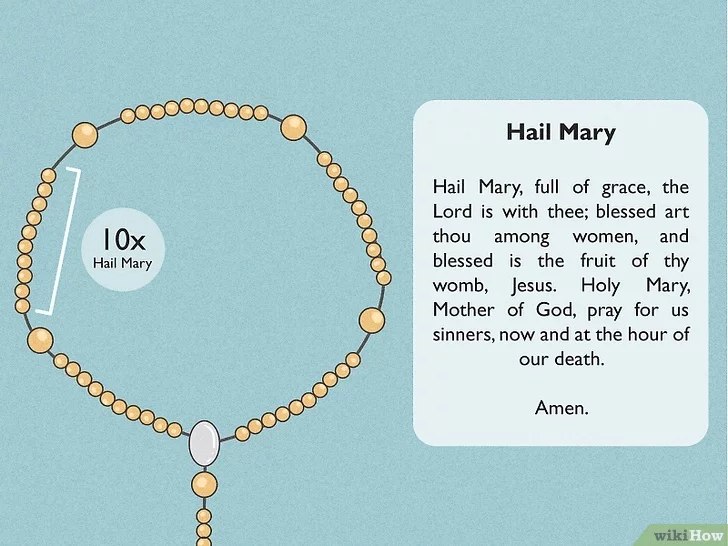

**诵念《圣母经》十遍。**：

- 中文：大慈大悲的万福玛利亚，主与你同在；你在妇女中深受赞颂，你之子耶稣同受赞颂。圣母玛利亚，耶稣之母，此刻及在我们临终之时，愿你为我们的罪人所祈祷。阿们。
- 拉丁文：Ave Maria, gratia plena, Dominus tecum. Benedicta tu in mulieribus, et benedictus fructus ventris tui, Jesus. Sancta Maria, Mater Dei, ora pro nobis peccatoribus, nunc, et in hora mortis nostrae. Amen.
- 英文：Hail Mary, full of grace, the Lord is with thee; blessed art thou among women, and blessed is the fruit of thy womb, Jesus. Holy Mary, Mother of God, pray for us sinners, now and at the hour of our death. Amen.

### 2.4.4 诵《圣荣光三颂》和法蒂玛圣母祷词

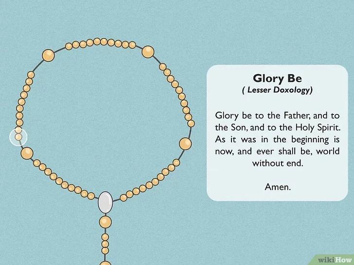

#### 2.4.4.1 向天主诵念《圣三光荣颂》

向天主诵念《圣三光荣颂》，结束此组的诵念。如下：

- 中文：愿光荣及父、及子、及圣灵。起初如何，今日亦然，直至永远。阿们。
- 拉丁文：Gloria Patri et Filio et Spiritui Sancto. Sicut erat in principio, et nunc et semper et in saecula saeculorum. Amen.
- 英文：Glory be to the Father, and to the Son, and to the Holy Spirit. As it was in the beginning is now, and ever shall be, world without end. Amen.

#### 2.4.4.2 诵《法蒂玛圣母祷词》

之后，你可以选择诵念《法蒂玛圣母祷词》，如下：

- 中文：我的主耶稣，请宽赦我们的罪过，拯救我们于地狱之火；请把我们的灵魂，尤其是那些需要你怜悯的灵魂，引去天国。阿们。
- 拉丁文： (法蒂玛圣母悼词没有正式的拉丁译本。): *Domine Iesu, dimitte nobis debita nostra, salva nos ab igne inferiori, perduc in caelum omnes animas, praesertim eas, quae misericordiae tuae maxime indigent.*
- 英文：O my Jesus, forgive us our sins, save us from the fires of hell, lead all souls to Heaven, especially those who have most need of your mercy.

## 2.5 第五组《圣母经》

### 2.5.1 宣读或默想第五端玫瑰奥迹

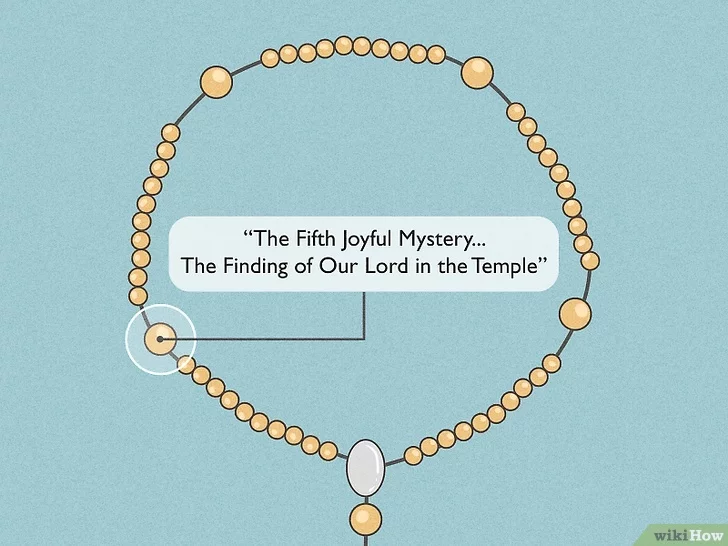

这是最后但也同样重要的一组。根据星期几从以下中选取：

- 欢喜五端：耶稣十二龄讲道（路加福音2:41-52）
- 光明五端：耶稣建立圣体圣事（马所拉经文26）
- 痛苦五端：耶稣十字架上受难（马太福音 27:33-56）
- 荣福五端：天主光荣圣母

| 周一                                        | 周二                                            | 周三                   | 周四                                       | 周五                                            | 周六                                        | 周日                   |
| ------------------------------------------- | ----------------------------------------------- | ---------------------- | ------------------------------------------ | ----------------------------------------------- | ------------------------------------------- | ---------------------- |
| 欢喜五端：耶稣十二龄讲道（路加福音2:41-52） | 痛苦五端：耶稣十字架上受难（马太福音 27:33-56） | 荣福五端：天主光荣圣母 | 光明五端：耶稣建立圣体圣事（马所拉经文26） | 痛苦五端：耶稣十字架上受难（马太福音 27:33-56） | 欢喜五端：耶稣十二龄讲道（路加福音2:41-52） | 荣福五端：天主光荣圣母 |

#### 2.5.1.1 欢喜五端：耶稣十二龄讲道（路加福音2:41-52）

* 中文：

  * 41 約瑟和瑪麗亞每年都上耶路撒冷去過逾越節。 
  * 42 耶穌十二歲那年，跟父母照例上去過節。 
  * 43 節期完了，約瑟和瑪麗亞便啟程回家，他們並不知道少年耶穌仍然留在耶路撒冷， 
  * 44 還以為祂跟在同行的人中間。他們走了一天的路後，才開始在親戚朋友中找祂， 
  * 45 結果沒有找到，只好回到耶路撒冷。 
  * 46 三天後，他們才在聖殿裡找到耶穌，祂正和教師們坐在一起，一邊聽一邊問問題。 
  * 47 祂的知識和對答令聽見的人感到驚奇。 
  * 48 約瑟和瑪麗亞看見耶穌在那裡，大為驚奇。瑪麗亞對祂說：「兒子，你為什麼這樣對我們呢？你父親和我急得到處找你！」
  * 49 耶穌對他們說：「你們為什麼找我呢？難道你們不知道我應該在我父的家嗎？」 
  * 50 但他們不明白祂在講什麼。
  * 51 於是，耶穌隨父母回到拿撒勒，並順從他們。瑪麗亞把這一切事牢記在心。 
  * 52 耶穌漸漸長大，智慧與日俱增，越來越受上帝和人們的喜愛。

* 英文：

  * 41 Every year Jesus’ parents went to Jerusalem for the Festival of the Passover. 

  * 42 When he was twelve years old, they went up to the festival, according to the custom. 

  * 43 After the festival was over, while his parents were returning home, the boy Jesus stayed behind in Jerusalem, but they were unaware of it. 

  * 44 Thinking he was in their company, they traveled on for a day. Then they began looking for him among their relatives and friends. 

  * 45 When they did not find him, they went back to Jerusalem to look for him. 

  * 46 After three days they found him in the temple courts, sitting among the teachers, listening to them and asking them questions. 

  * 47 Everyone who heard him was amazed at his understanding and his answers. 

  * 48 When his parents saw him, they were astonished. His mother said to him, “Son, why have you treated us like this? Your father and I have been anxiously searching for you.”

  * 49 “Why were you searching for me?” he asked. “Didn’t you know I had to be in my Father’s house?”[[a](https://www.biblegateway.com/passage/?search=路加福音2%3A41-52&version=CCB;CCBT;NIV#fen-NIV-25023a)] 

  * 50 But they did not understand what he was saying to them.

    51 Then he went down to Nazareth with them and was obedient to them. But his mother treasured all these things in her heart. 52 And Jesus grew in wisdom and stature, and in favor with God and man.

#### 2.5.1.2 光明五端：耶稣建立圣体圣事（马所拉经文26）

* 中文：
  * 26 他們吃的時候，耶穌拿起餅來，祝謝後掰開分給門徒，說：「拿去吃吧，這是我的身體。」
* 英文：
  * 26 While they were eating, Jesus took bread, and when he had given thanks, he broke it and gave it to his disciples, saying, “Take and eat; this is my body.”

#### 2.5.1.3 痛苦五端：耶稣十字架上受难（马太福音 27:33-56）

* 中文：
  * 33 來到一個地方，名叫各各他——意思是「髑髏地」， 
  * 34 士兵給耶穌喝摻了苦膽汁的酒，祂嚐了一口，不肯喝。
  * 35 他們把耶穌釘在十字架上，還抽籤分了祂的衣服， 
  * 36 然後坐在那裡看守。 
  * 37 他們在祂頭頂上掛了一個牌子，上面寫著祂的罪狀：「這是猶太人的王耶穌」。 
  * 38 有兩個強盜也被釘在十字架上，一個在祂右邊，一個在祂左邊。 
  * 39 過路的人都嘲笑祂，搖著頭說： 
  * 40 「你這聲稱把聖殿拆毀又在三天內重建的人啊，救救自己吧！你要是上帝的兒子，就從十字架上下來吧！」
  * 41 祭司長、律法教師和長老也嘲諷說： 
  * 42 「祂救了別人，卻救不了自己！祂要是以色列的王，就從十字架上跳下來吧！我們就信祂。 
  * 43 祂說信靠上帝，如果上帝喜悅祂，就讓上帝來救祂吧！因為祂自稱是上帝的兒子。」 
  * 44 甚至跟祂一同被釘十字架的強盜也這樣嘲笑祂。
  * 45 從正午一直到下午三點，黑暗籠罩著整個大地。 
  * 46 大約下午三點，耶穌大聲呼喊：「以利，以利，拉馬撒巴各大尼？」意思是：「我的上帝，我的上帝，你為什麼離棄我？」
  * 47 有些站在旁邊的人聽見了，就說：「這人在呼叫以利亞呢。」 
  * 48 其中一人連忙跑去拿了一塊海綿，蘸滿酸酒，綁在葦稈上送給祂喝。 
  * 49 其他人卻說：「等一下！我們看看以利亞會不會來救祂。」
  * 50 耶穌又大喊了一聲，就斷了氣。
  * 51 就在那時，聖殿裡的幔子從上到下裂成兩半，大地震動，岩石崩裂， 
  * 52 墳墓打開，很多死去的聖徒復活過來。 
  * 53 他們在耶穌復活後離開墳墓，進聖城向許多人顯現。
  * 54 看守耶穌的百夫長和士兵看見地震及所發生的一切，都很害怕，說：「這人真是上帝的兒子啊！」 
  * 55 有好些婦女在遠處觀看，她們從加利利就跟隨了耶穌，服事祂。 
  * 56 其中有抹大拉的瑪麗亞、雅各和約西的母親瑪麗亞以及西庇太兩個兒子的母親。
* 英文：
  * 33 They came to a place called Golgotha (which means “the place of the skull”). 
  * 34 There they offered Jesus wine to drink, mixed with gall; but after tasting it, he refused to drink it. 
  * 35 When they had crucified him, they divided up his clothes by casting lots. 
  * 36 And sitting down, they kept watch over him there. 
  * 37 Above his head they placed the written charge against him: this is jesus, the king of the jews.
  * 38 Two rebels were crucified with him, one on his right and one on his left. 
  * 39 Those who passed by hurled insults at him, shaking their heads 
  * 40 and saying, “You who are going to destroy the temple and build it in three days, save yourself! Come down from the cross, if you are the Son of God!” 
  * 41 In the same way the chief priests, the teachers of the law and the elders mocked him. 
  * 42 “He saved others,” they said, “but he can’t save himself! He’s the king of Israel! Let him come down now from the cross, and we will believe in him. 
  * 43 He trusts in God. Let God rescue him now if he wants him, for he said, ‘I am the Son of God.’” 
  * 44 In the same way the rebels who were crucified with him also heaped insults on him.
  * 45 From noon until three in the afternoon darkness came over all the land. 46 About three in the afternoon Jesus cried out in a loud voice, *“Eli, Eli,*[[a](https://www.biblegateway.com/passage/?search=马太福音+27%3A33-56&version=CCB;CCBT;NIV#fen-NIV-24176a)] *lema* *sabachthani?”* (which means “My God, my God, why have you forsaken me?”).[[b](https://www.biblegateway.com/passage/?search=马太福音+27%3A33-56&version=CCB;CCBT;NIV#fen-NIV-24176b)]
  * 47 When some of those standing there heard this, they said, “He’s calling Elijah.”
  * 48 Immediately one of them ran and got a sponge. He filled it with wine vinegar, put it on a staff, and offered it to Jesus to drink. 
  * 49 The rest said, “Now leave him alone. Let’s see if Elijah comes to save him.”
  * 50 And when Jesus had cried out again in a loud voice, he gave up his spirit.
  * 51 At that moment the curtain of the temple was torn in two from top to bottom. The earth shook, the rocks split 
  * 52 and the tombs broke open. The bodies of many holy people who had died were raised to life. 
  * 53 They came out of the tombs after Jesus’ resurrection and[[c](https://www.biblegateway.com/passage/?search=马太福音+27%3A33-56&version=CCB;CCBT;NIV#fen-NIV-24183c)] went into the holy city and appeared to many people.
  * 54 When the centurion and those with him who were guarding Jesus saw the earthquake and all that had happened, they were terrified, and exclaimed, “Surely he was the Son of God!”
  * 55 Many women were there, watching from a distance. They had followed Jesus from Galilee to care for his needs. 
  * 56 Among them were Mary Magdalene, Mary the mother of James and Joseph,[[d](https://www.biblegateway.com/passage/?search=马太福音+27%3A33-56&version=CCB;CCBT;NIV#fen-NIV-24186d)] and the mother of Zebedee’s sons.

#### 2.5.1.4 荣福五端：天主光荣圣母

* 中文：
  * 天上出现了一个大异兆：有一个女人，身披太阳，脚踏月亮，头戴十二颗星的荣冠。
* 英文：
  * A great sign appeared in the sky: a woman clothed with the sun, with the moon under her feet and a crown of twelve stars on her head

### 2.5.2 诵《天主经》

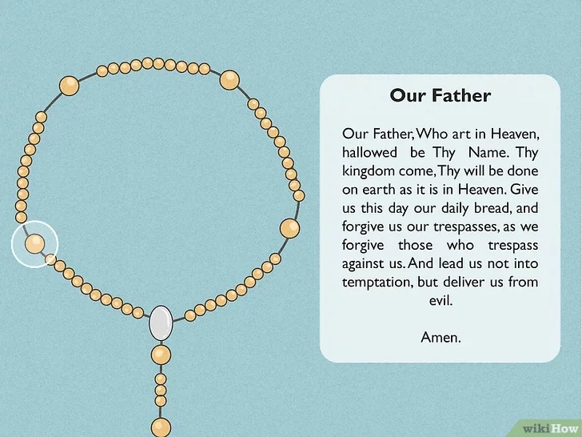

拨动最后一个大念珠，诵《天主经》。真正的感受这一次，因为这是你拥有的最后一次。与祷文融为一体，并体会它们的意义：

- 中文：我们的天父，愿你的名受显扬，愿你的国来临，愿你的旨意奉行人间犹如在天上。求你今日赏赐我们日用的食粮，求你宽恕我们的罪过如同我们宽恕他人一样，不要让我们陷于诱惑，但救我们免于凶恶。阿们。
- 拉丁文：Pater noster, qui es in caelis, sanctificetur nomen tuum. Adveniat regnum tuum. Fiat voluntas tua, sicut in caelo et in terra. Panem nostrum quotidianum da nobis hodie, et dimitte nobis debita nostra sicut et nos dimittimus debitoribus nostris. Et ne nos inducas in tentationem, sed libera nos a malo. Amen.
- 英文：Our Father, Who art in Heaven, hallowed be Thy Name. Thy kingdom come, Thy will be done on earth as it is in Heaven. Give us this day our daily bread, and forgive us our trespasses, as we forgive those who trespass against us. And lead us not into temptation, but deliver us from evil. Amen.

### 2.5.3 诵《圣母经》最后10次

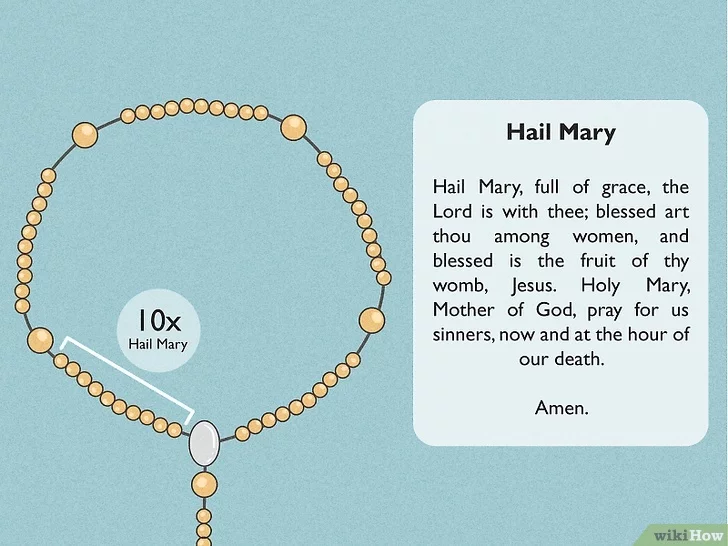

**诵念《圣母经》最后十次。**你的手正缓缓向十字架移动。你仍然保持着默想的姿势，对吧？非常好：

- 中文：大慈大悲的万福玛利亚，主与你同在；你在妇女中深受赞颂，你之子耶稣同受赞颂。圣母玛利亚，耶稣之母，此刻及在我们临终之时，愿你为我们的罪人所祈祷。阿们。
- 拉丁文：Ave Maria, gratia plena, Dominus tecum. Benedicta tu in mulieribus, et benedictus fructus ventris tui, Jesus. Sancta Maria, Mater Dei, ora pro nobis peccatoribus, nunc, et in hora mortis nostrae. Amen.
- 英文：Hail Mary, full of grace, the Lord is with thee; blessed art thou among women, and blessed is the fruit of thy womb, Jesus. Holy Mary, Mother of God, pray for us sinners, now and at the hour of our death. Amen.

### 2.5.4 诵《圣荣光三颂》和法蒂玛圣母祷词

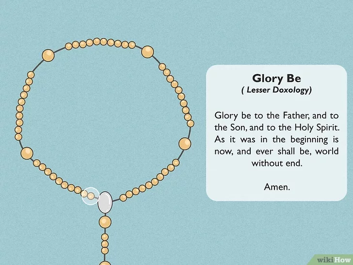

#### 2.5.4.1 诵《圣荣光三颂》

**以《圣荣光三颂》结束最后一组的诵念**：

- 中文：愿光荣及父、及子、及圣灵。起初如何，今日亦然，直至永远。阿们。
- 拉丁文：Gloria Patri et Filio et Spiritui Sancto. Sicut erat in principio, et nunc et semper et in saecula saeculorum. Amen.
- 英文：Glory be to the Father, and to the Son, and to the Holy Spirit. As it was in the beginning is now, and ever shall be, world without end. Amen.

#### 2.5.4.2 诵《法蒂玛圣母祷词》

最后结束这组诵念，你依然可以选择再诵念《法蒂玛圣母祷词》，如下：

- 中文：我的主耶稣，请宽赦我们的罪过，拯救我们于地狱之火；请把我们的灵魂，尤其是那些需要你怜悯的灵魂，引去天国。阿们。
- 拉丁文： (法蒂玛圣母悼词没有正式的拉丁译本。): *Domine Iesu, dimitte nobis debita nostra, salva nos ab igne inferiori, perduc in caelum omnes animas, praesertim eas, quae misericordiae tuae maxime indigent.*
- 英文：O my Jesus, forgive us our sins, save us from the fires of hell, lead all souls to Heaven, especially those who have most need of your mercy.

## 3. 结束

### 3.1 诵《又圣母经》

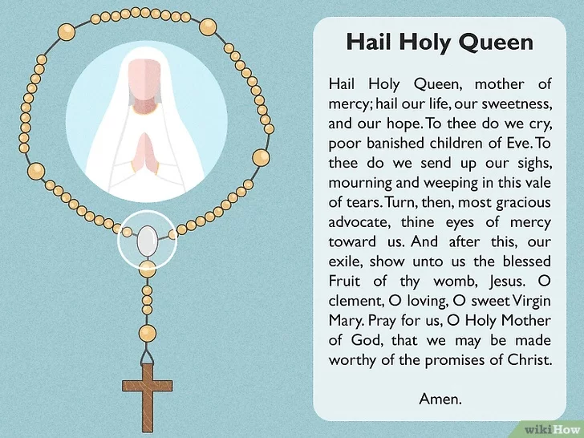

 **诵念《又圣母经》。** 手放在垂饰上了：

- 中文：万福圣母，慈祥的母亲；你是我们的生命，我们的甘饴，我们的希望。厄娃子孙，在此尘世，向你哀呼。在这涕泣之谷，向你叹息哭求。我们的主，求你回顾，怜视我们。一旦流亡期满，使我们得见你的圣子，万民称颂的耶稣。童贞玛利亚，你是宽仁的、慈悲的、甘饴的。天主圣母，请为我们祈求‧使我们堪受基督的恩许。阿们！
- 拉丁文：Salve, Regina, Mater misericordiae; vita, dulcedo, et spes nostra, salve. Ad te clamamus, exsules filii Hevae; ad te suspiramus, gementes et flentes in hac lacrymarum valle. Eia ergo, advocata nostra, illos tuos misericordes oculos ad nos converte; et Jesum, benedictum fructum ventris tui, nobis post hoc exilium ostende. O clemens, O pia, O dulcis Virgo Maria. Amen.
- 英文：Hail Holy Queen, mother of mercy; hail our life, our sweetness, and our hope. To thee do we cry, poor banished children of Eve. To thee do we send up our sighs, mourning and weeping in this vale of tears. Turn, then, most gracious advocate, thine eyes of mercy toward us. And after this, our exile, show unto us the blessed Fruit of thy womb, Jesus. O clement, O loving, O sweet Virgin Mary. Pray for us, O Holy Mother of God, that we may be made worthy of the promises of Christ. Amen.

### 3.2  诵《最后的玫瑰经》

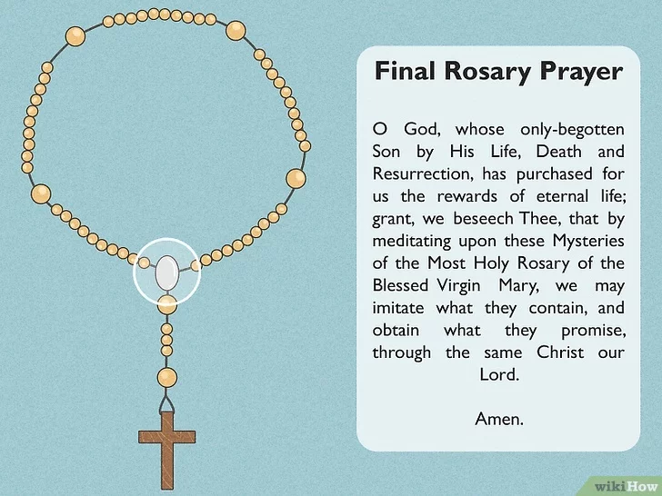

**诵念最后的《玫瑰经》（亦可不诵）。**手持垂饰，如下诵念：

- 中文：天之独子，耶稣，他用生命、死亡、复活，为我们的永生赢得了回报，请应允我们以默想童贞玛利亚之圣洁玫瑰经奥迹来恳求你，我们会仿效他们所拥有的，他们所承诺的，通过同样的我们的主，耶稣。阿们。
- *拉丁文：* Oremus: Deus, cujus Unigenitus, per vitam, mortem et resurrectionem suam nobis salutis aeternæ praemia comparavit: concede, quaesumus; ut, haec mysteria sanctissimo beatae Mariae Virginis Rosario recolentes; et imitemur quod continent, et quod promittunt, assequamur. Per eumdem Christum Dominum nostrum. Amen.
- 英文：O God, whose only-begotten Son by His Life, Death and Resurrection, has purchased for us the rewards of eternal life; grant, we beseech Thee, that by meditating upon these Mysteries of the Most Holy Rosary of the Blessed Virgin Mary, we may imitate what they contain, and obtain what they promise, through the same Christ our Lord. Amen.

### 3.3 诵《**依靠圣母颂**》

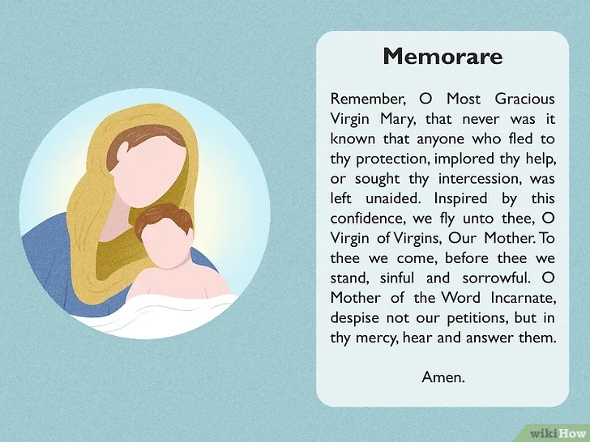

**诵念《依靠圣母颂》（亦可不诵）。**这种经最不平常，但却为你与主的亲密对话画上了一个完美的句号。如下：

- 中文：请记住，我亲爱的童贞玛利亚，人们知道向你寻求庇护，恳求帮助，祈求怜悯绝不是孤立无援的。信心激发，我们投奔于你，我们的圣母，童贞玛利亚。我们为你而来，在你身前是如此罪恶深重，痛苦万分。化身为母亲的玛利亚，不要无视我们请愿，愿你在慈祥中聆听回答他们。阿们。
- *拉丁文：* Memorare, O piissima Virgo Maria, a saeculo non esse auditum, quemquam ad tua currentem praesidia, tua implorantem auxilia, tua petentem suffragia, esse derelictum. Ego tali animatus confidentia, ad te, Virgo Virginum, Mater, curro, ad te venio, coram te gemens peccator assisto. Noli, Mater Verbi, verba mea despicere; sed audi propitia et exaudi. Amen.
- 英文：Remember, O Most Gracious Virgin Mary, that never was it known that anyone who fled to thy protection, implored thy help, or sought thy intercession, was left unaided. Inspired by this confidence, we fly unto thee, O Virgin of Virgins, Our Mother. To thee we come, before thee we stand, sinful and sorrowful. O Mother of the Word Incarnate, despise not our petitions, but in thy mercy, hear and answer them. Amen.

### 3.4 诵《圣母德叙祷文》

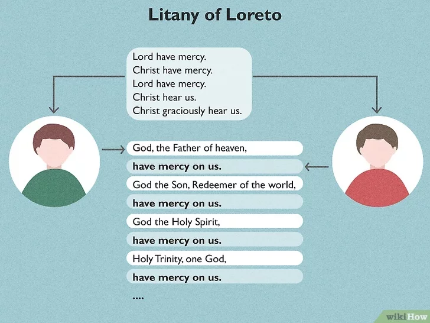

**诵念《圣母德叙祷文》（亦可不诵）。**这部分是呼喊与回应的祷文，前几句是祈求圣灵三位“怜悯我们”，而剩下的几句则是呼唤圣母玛利亚（不同标题下，比如“义德之镜”）“为我们祈祷”。结尾部分和领受圣餐时诵念的"羔羊颂"的版本略有不同。中文完整版本如下（其它语言的參考https://hausjakob.org/resources/mysteries-of-the-rosary/litany-of-the-blessed-virgin/[聖母德敍禱文](https://hausjakob.org/resources/mysteries-of-the-rosary/litany-of-the-blessed-virgin/%e8%81%96%e6%af%8d%e5%be%b7%e6%95%8d%e7%a6%b1%e6%96%87/)/）：

> 天主矜憐我等。
> 基督矜憐我等，
> 天主矜憐我等。
> 基督俯聽我等。
> 基督垂允我等。
> 在天天主父者。*矜憐我等。*
> 贖世天主子者。*矜憐我等。*
> 聖神天主者。*矜憐我等。*
> 三位一體天主者。*矜憐我等。*
>
> 聖瑪利亞。*為我等祈。*
> 天主聖母。*為我等祈*
> 童身之聖童身者。*為我等祈*
> 基督之母。*為我等祈*
> 天主寵愛之母。*為我等祈*
> 至潔之母。*為我等祈*
> 至貞之母。*為我等祈*
> 無損者母。*為我等祈*
> 無玷者母。*為我等祈*
> 可愛者母。*為我等祈*
> 可奇者母。*為我等祈*
> 善導之母。*為我等祈*
> 造物之母。*為我等祈*
> 救世之母。*為我等祈*
> 極智者貞女。*為我等祈*
> 可敬者貞女。*為我等祈*
> 可頌者貞女。*為我等祈*
> 大能者貞女。*為我等祈*
> 寬仁者貞女。*為我等祈*
> 大忠者貞女。*為我等祈*
> 義德之鏡。*為我等祈*
> 上智之座。*為我等祈*
> 吾樂之緣。*為我等祈*
> 妙神之器。*為我等祈*
> 可崇之器。*為我等祈*
> 聖情大器。*為我等祈*
> 玄義玫瑰。*為我等祈*
> 達味敵樓。*為我等祈*
> 象牙寶塔。*為我等祈*
> 黃金之殿。*為我等祈*
> 結約之櫃。*為我等祈*
> 上天之門。*為我等祈*
> 曉明之星。*為我等祈*
> 病人之痊。*為我等祈*
> 罪人之托。*為我等祈*
> 憂苦之慰。*為我等祈*
> 進教之佑。*為我等祈*
> 諸天神之后。*為我等祈*
> 諸聖祖之后。*為我等祈*
> 諸先知之后。*為我等祈*
> 諸宗徒之后。*為我等祈*
> 諸為義致命之后。*為我等祈*
> 諸精修者之后。*為我等祈*
> 諸童身之后。*為我等祈*
> 諸聖人之后。*為我等祈*
> 自始胎無染原罪之后。*為我等祈*
> 蒙召升天之后。*為我等祈*
> 至聖玫瑰之后。*為我等祈*
> 平安之后。*為我等祈*
>
> 除免世罪天主羔羊者。*主赦我等。*
> 除免世罪天主羔羊者。*主允我等。*
> 除免世罪天主羔羊者。*主憐我等。*
>
> **啟**　天主聖母，為我等祈。
> **應**　以致我等，幸承基督所許鴻錫。
>
> 請眾同禱。懇祈吾主天主使爾僕輩，獲享神形永安。暨賴卒世童貞聖瑪利亞之榮耀轉達，幸脫於現在憂，而享永遠歡樂。為爾子耶穌基督我等主，其偕爾偕聖神，為一天主乃生乃王世世。阿們。
>
> **啟**　上主的天使向瑪利亞報喜；
> **應**　她因聖神受孕。
>
> 請眾同禱。懇祈吾主天主使爾僕輩，獲享神形永安。暨賴卒世童貞聖瑪利亞之榮耀轉達，幸脫於現在憂，而享永遠歡樂。為爾子耶穌基督我等主，其偕爾偕聖神，為一天主乃生乃王世世。阿們。
>
> **啟**　妳在生育後仍為童貞女。
> **應**　天主之母，請為我們轉求。
>
> 請眾同禱。懇祈吾主天主使爾僕輩，獲享神形永安。暨賴卒世童貞聖瑪利亞之榮耀轉達，幸脫於現在憂，而享永遠歡樂。為爾子耶穌基督我等主，其偕爾偕聖神，為一天主乃生乃王世世。阿們。
>
> **啟**　童貞聖母瑪利亞喜樂，亞肋路亞。
> **應**　因為主真的復活了，亞肋路亞。
>
> 請眾同禱。天主，祢因著祢的聖子，我們的主耶穌基督之復活而給予天下萬民喜樂；今懇求祢，因藉著祂母親童貞聖母瑪利亞的轉求，而賜給我們得享永生之歡樂。因同一的主基督。阿們。

### 3.5 為逝者祈禱

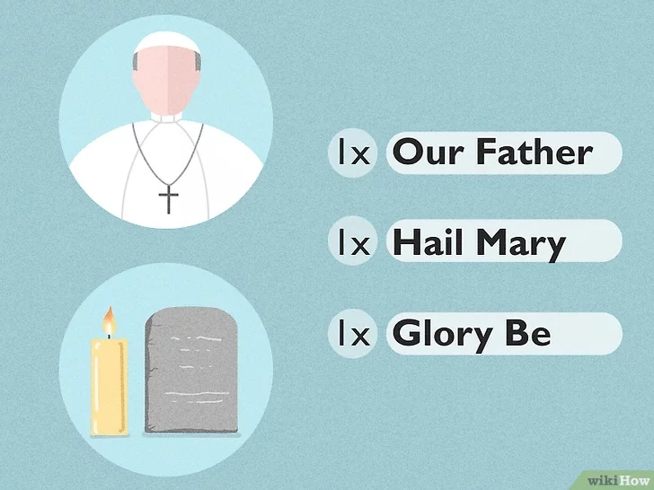

**为教皇和/或逝者祈祷（亦可略过）。**天主教徒有时会为在位教皇加上天主经一遍、圣母经一遍、圣三光荣经一遍，祈祷他身体和精神安康。有的人还会为逝者诵念上面的其他祷文，包括至爱，特别是炼狱中的炼灵。

#### 3.5.1 誦《天主经》

- 中文：我们的天父，愿你的名受显扬，愿你的国来临，愿你的旨意奉行人间犹如在天上。求你今日赏赐我们日用的食粮，求你宽恕我们的罪过如同我们宽恕他人一样，不要让我们陷于诱惑，但救我们免于凶恶。阿们。
- 拉丁文：Pater noster, qui es in caelis, sanctificetur nomen tuum. Adveniat regnum tuum. Fiat voluntas tua, sicut in caelo et in terra. Panem nostrum quotidianum da nobis hodie, et dimitte nobis debita nostra sicut et nos dimittimus debitoribus nostris. Et ne nos inducas in tentationem, sed libera nos a malo. Amen.
- 英文：Our Father, Who art in Heaven, hallowed be Thy Name. Thy kingdom come, Thy will be done on earth as it is in Heaven. Give us this day our daily bread, and forgive us our trespasses, as we forgive those who trespass against us. And lead us not into temptation, but deliver us from evil. Amen.

#### 3.5.2 誦《聖母經》

- 中文：大慈大悲的万福玛利亚，主与你同在；你在妇女中深受赞颂，你之子耶稣同受赞颂。圣母玛利亚，耶稣之母，此刻及在我们临终之时，愿你为我们的罪人所祈祷。阿们。
- 拉丁文：Ave Maria, gratia plena, Dominus tecum. Benedicta tu in mulieribus, et benedictus fructus ventris tui, Jesus. Sancta Maria, Mater Dei, ora pro nobis peccatoribus, nunc, et in hora mortis nostrae. Amen.
- 英文：Hail Mary, full of grace, the Lord is with thee; blessed art thou among women, and blessed is the fruit of thy womb, Jesus. Holy Mary, Mother of God, pray for us sinners, now and at the hour of our death. Amen.

#### 3.5.3誦《聖三光榮訟》

- 中文：愿光荣及父、及子、及圣灵。起初如何，今日亦然，直至永远。阿们。
- 拉丁文：Gloria Patri et Filio et Spiritui Sancto. Sicut erat in principio, et nunc et semper et in saecula saeculorum. Amen.
- 英文：Glory be to the Father, and to the Son, and to the Holy Spirit. As it was in the beginning is now, and ever shall be, world without end. Amen.

#### 3.5.4 其他禱文

以下是我給外婆的禱文：

> 玛利亚良善的圣心，我的祈祷是为了亲爱的外婆，请您为她祈求天主。主啊，请您带领她的灵魂，前往天国，进入永生的光明！
>
> 因父及子及圣灵之名，阿们！

### 3.6 划十字

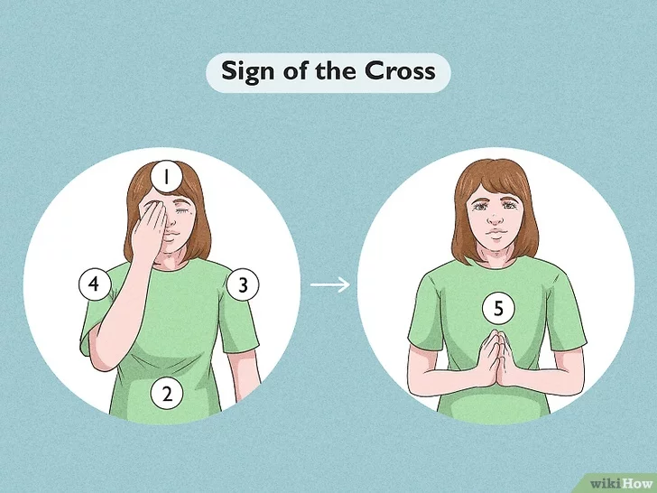

**以划十字手势结束。**抬起头，似被点化过一样，虔诚冥思般的继续你一天的生活。

以下是整篇教程的目錄：

[TOC]

----

整理這篇教程時，和外婆相處的點點滴滴時光，不時浮現眼前。我喜歡讀聖經故事時，她由衷地開心；在夏日的陽台上，她寵溺地陪我看星星，用各種辦法安慰正在想媽媽的小小的我；她帶我去教堂，教我如何參加彌撒；她帶著高燒的我，心急火燎地去醫務室打針；我淘氣時，她罵我；我會說話，她表揚我；犯了錯，媽媽要揍我時，她攔著替我求情；青春期長個時肚子容易餓，每天放學到家她就先給我煮一大碗麵⋯⋯

後來我帶著妻子、孩子們去看她，她很開心，拿各種零食給孩子們吃，不停地說：「好！好！好！」

想到過去的時光再也不會回頭，有時淚水會模糊雙眼。但又想到嫁嫁雖然一生辛勞，畢竟得享高壽。她那麼虔誠，有聖母瑪麗亞的護佑，一定已經快樂地被天主接去了天堂，永生在那光明與幸福的國度。

於是，內心終究洋溢著溫暖、柔和的光⋯⋯

僅以此紀念我親愛的嫁嫁！

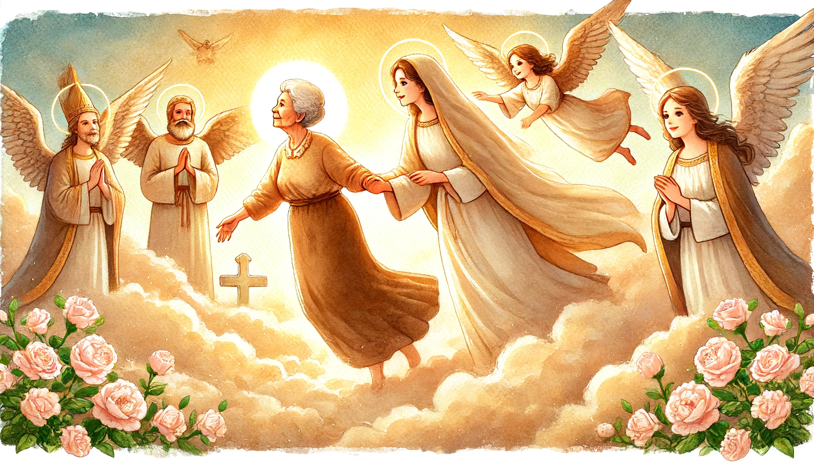