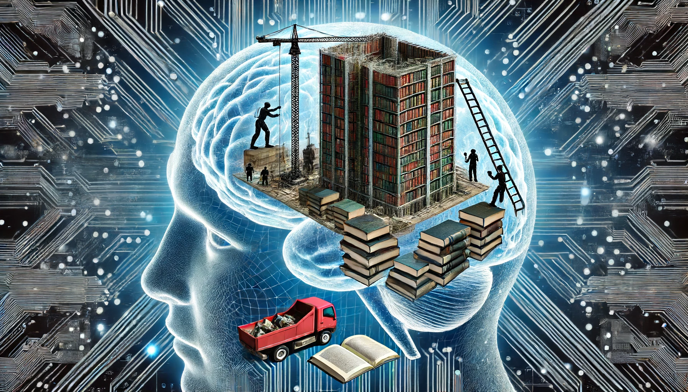
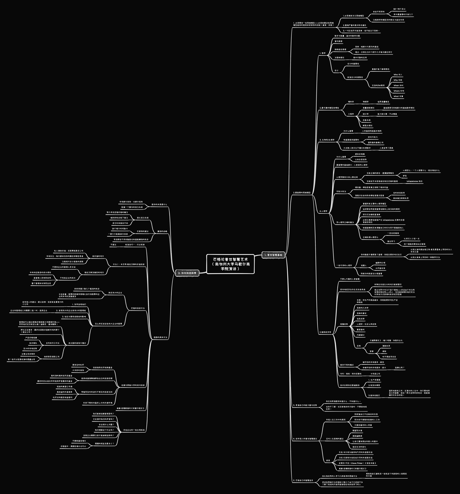

# 【生命⋅修行】重温长者的智慧——再读芒格的《穷查理年鉴》（二）

重读《穷查理年鉴》中芒格的第二篇演讲稿——1994年在南加州大学马歇尔商学院所作——《论基本的、普世的智慧，及其与投资管理和商业的关系》时，浑身上下都沐浴在那种瞥见智慧的愉悦之中。

期间，还接到了一段来自大宝的视频通话，我兴奋地对她说：

> 芒格真是太厉害了，把一套适用于普世智慧的框架，乃至投资、选股的知识框架，讲得是清清楚楚、明明白白！

然后，我打开自己做笔记的思维导图，说：

> 你看，他说，人首先要学习基本的、普世的智慧作为基础，然后再去精通一项专门的艺术——比如选股票。
>
> 就是这么简单，直接。真传一句话！
>
> 投资、乃至做人，一辈子要做的功课都在这里了。不仅仅如此，他还把这个框架中最重要的部分给你划出了，就好像一个超级厉害的老师，直接给你在课本上划了重点。
>
> 等我整理出来，写给你看哈！

以下，便是我的感悟与笔记。

----

与第一篇演讲人生笺言式地告诉我们，获得幸福人生所千万不要做的N件事不同。这一篇演讲，包括之后1996年在斯坦福法学院所做的演讲——《论基本的、普世的智慧》，芒格在尝试着把他这一生的智慧，整体地、框架性地交给我们。

不知你是否还记得，在第一篇演讲中所提到那些不幸福原则中，有这么两条：

* 尽可能从你们自身的经验获得知识，尽量别从其他人成功或失败的经验中广泛地吸取教训，不管他们是古人还是今人。
* 尽可能地减少客观性。

但是，要怎样不仅从自身经验获得知识，还要尽量从其他人（无论古今）成功或失败的经验中广泛地吸取教训，并且尽可能地客观呢？芒格用围绕着《基本的、普世的智慧》这个题目的两次演讲，给出了他完整、系统、并且可以照着一步一步操作的详细答案——也就是他自己一生所学、所用的智慧框架——那为他挣得那许多财富与幸福生活的智慧框架。

## 首先，关于整个智慧大厦的基本结构

整个大厦有两个部分组成：

1. 基本的、普世的智慧
2. 一项专门的艺术——比如选股票

先有了一，才可能有二。现代教育的理论，也是如此的顺序。

## 那么，到底有哪些基本的、普世的智慧呢？

### 一、你必须在头脑中拥有一些思维模型。你必须依靠这些模型组成的框架来安排你的经验，包括间接的和直接的。

那么问题来了，什么是思维模型？什么是这些模型组成的框架？他们和经验之间又是什么关系？

说实话，这几个问题，真好讲明白。但是，或许把这些问题且记下来，然后往下继续看，先看看芒格认为的思维模型是什么？他认为重要的思维模型有什么？他的思维模型组成的是什么框架？他又是怎么把他得到的直接和间接经验挂在这个框架上的？

到最后，这前面三个问题会自然而然地解开。

#### 什么是思维模型呢？

芒格没有直接给出定义，可能他觉得给出定义也没啥用吧。相反，他给出的是构建思维模型与框架的几大原则：

1. 必须拥有多元思维模型——原因很简单，世界太复杂。如果你只有一把锤子，你会扭曲世界，把所有的问题都看成钉子。

   1. 这些模型必须来自不同的学科——只有这样，才能应对这个复杂的世界
   2. 掌握80到90个就差不多可以应付这个世界了
   3. 其中非常重要的，只有几个
   4. 注意跨学科模型之间的有机联系和组合作用（lollapalooza 效应）

2. 警惕严重的意识形态偏见

3. 一切应尽可能简单，但不能过于简单

   ——这是爱因斯坦说的。这也是为什么芒格认为应付这个世界，需要80到90个，约莫不到100个模型的原因。这已经是尽可能简单的结果了。而且芒格说过，这并不难。只要你沿着这个方向，每天比前一天聪明睿智一点点，并且活得足够长，你一定会达成目标，并享受到这个智慧框架带来的世俗好处。
   
   

### 二、有哪些重要的思维模型

1. 首先最重要的是数学，包括：

   1. 能处理数字和数量问题，也就是基本的数学问题
   2. 复利原理
   3. 排列组合原理
      1. 排列组合原理并不难，费马和帕斯卡在一年的通信中就完全解决了这个问题
      2. 真正困难的是，要在日常生活中习惯于每天都应用它。这需要练，天天练。
   4. 决策树理论——高中代数在日常生活中的应用
   5. 会计
      1. 会计知识很重要
      2. 标准会计有局限性
         1. 你得很懂才能明白其局限性在哪里
         2. 可避免局限性的交流原则——5何W（何人Who 何故Why 何时When 何地Where 做何事What）——来自心理学

2. 其它最可靠的模型主要有两类

   1. 硬科学
      1. 比如物理学中的临界质量概念
   2. 工程学
      1. 质量控制理论——基础是费马和帕斯卡的基础数学理论
      2. 统计学——能大致计算即可，不必精通
      3. 后备系统理论
      4. 断裂点理论

3. 生物学 / 生理学

   1. 为什么说生物学重要呢？因为人的基因构造基本相同。
   2. 比如，味道是极其重要的——有好时巧克力和国际香料香精公司的例子为证。
   3. 大多数人类不擅长处理数字——因此，人类发明了图表

4. 心理学

   1. 为什么说心理学重要呢？有两个基本原因：
      1. 人的感知系统会短路
      2. 人的认知系统也会受误导
   2. **其中最重要的部分，就是《人类误判心理学》**——芒格有专门的演讲和文章谈这个
   3. 传统的心理学教材大体上是垃圾，原因如下：
      1. 没有正确的综合已有的知识，遗漏了很多重要概念。比如：
         1. 心理否认：一个人想要什么，就会相信什么
         2. 妒忌
      2. 没有足够重视多因素组合效应（lollapalooza 效应）
   4. 芒格常用的双规分析法
      1. 理性看：哪些因素真正控制了相关利益
      2. 潜意识会自动形成哪些潜意识因素
         1. 这些潜意识因素总的来说其实是有用的
         2. 但放到具体的情况下，却是失灵的
   5. 芒格建议的掌握心理学的正确做法
      1. 首先，掌握所有主要的心理学模型
      2. 然后，还要钻研那些明显很重要但教材上有没有的原则
      3. 把它们当做检查清单
      4. 必须注意那些能够产生 lollapalooza 后果的多因素组合效应
      5. 应用清单时，是依据道德规范来调整自己的行为而不是操控他人
      6. 正确处理心理否认的问题
         1. 一定会犯错误。人不犯错误不可能成长、赚大钱、享有幸福的生活
         2. 我们可以通过学习
            1. 比其它人少犯一点错误
            2. 犯了错能更快地纠正错误
   6. 芒格在文章中还介绍了一些有用且重要的心理学模型
      1. 如果你动脑筋才懂得某个道理，你就会更好地记住它——芒格从他父亲的朋友格兰特·麦克费登那里学到了处世之道，并且从他父亲怎么教会他这件事上，学到了这种教学方法
      2. 要说服人，幽默的比喻很有用；从利益出发更有效
      3. 防欺诈的制度设计非常重要

5. 微观经济学

   1. 芒格说，这是一个不那么可靠的人类智慧

   2. 把市场经济当作生态系统考虑

      1. 动物在合适生长的地方能够繁衍
      2. 商业世界中专注于某个领域——并且由于专注而变得非常优秀——的人，往往能够得到他们无法以其他方式获得的良好经济回报

   3. 规模优势

      1. 规模优势的本质是：你生产的商品越多，你就能更好地生产这种商品

      2. 以下这些都有可能构成规模优势

         * 简单的几何学

         * 简单的事实

         * 信息优势

         * 心理学：社会认同优势

         * 赢家通吃

         * 内部细分

      3. 然而，也有反例

         1. 比如《越野摩托》杂志：这就是缩小规模，加强专业化的结果
         2. 官僚带来的问题：激励失灵、腐败、听不得逆耳忠言的环境

   4. 竞争也有两种模式

      1. 破坏性的市场竞争：比如航空，整体而言没谁赚钱
      2. 非破环性的市场竞争：比如麦片（品牌认同的原因）

   5. 专利、商标、特许经营权，比如卡奈森公司为了自己的商誉，花钱为别人的商标、别人的产品做质检

   6. 要分辨技术是会帮助你还是摧毁你

      1. 对生产率的提高

      2. 钱流向到哪里

      3. 竞争性毁灭的情况

         比如国民收款机公司的例子：**在漫长的人生中，你只要培养自己的智慧，抓住一两次这样的好机会，就能够赚许许多多的钱。**

### 三、弄明白自己的能力圈与优势很重要

你应该弄清楚你知道什么，不知道什么。当你不了解、也没有相关的才能时，不要害怕说出来。

记住，**没有边界的能力，不能称之为能力。**

### 四、芒格还给了年轻人一些关于普世智慧的建议

#### 关于年轻人在工作中的原则

1. 别兜售自己不会购买的东西
2. 别为你不尊敬和钦佩的人工作
3. 只跟你喜欢的人同事

#### 关于应对人生困难的建议

1. 期望别太高
2. 拥有幽默感
3. 让自己置身朋友和家人的爱中
4. 适应生活的变化

#### 一些建议阅读的书

* 杰克·韦尔奇为通用电气写的年度股东信
* 沃伦·巴菲特为伯克希尔写的年度股东信
* 史蒂芬·平克（Steve Pinker）《语言本能》
* 威廉·庞德斯通的《财富方程式》

### 五、在构建普世智慧大厦上，芒格的追求

芒格说，他只有两个目标：

1. 向比我优秀的人学习几种有用的思维方法，帮助我自己避免犯一些我这个年龄段的人容易犯的大错。
2. 将这些思维方法传授给少数几个由于已经差不多了解了我说的内容而能够轻松地向我学习的人。

一点一点学，一点一点教。就在这样一个并不高的合理期望驱动下，他一步一步构建了这个为他赚取惊人财富、赢得幸福生活的智慧大厦。

好了，有了这个基本的，普世的智慧基础。

## 接下来，到底要如何挑选股票呢？

在这个芒格最专业的领域，芒格直接从三个重要的角度，构建了整套体系：

### 第一：股市的本质是什么

芒格否认了流传广泛的「有效市场理论」。他认为市场是部分有效，同时也是部分低效的。股市就像赛马的投注系统：

赛马的投注系统是这样的：赌注的赔率是由对不同赛马获胜下注的人数决定的。很多时候，赌注的赔率正确反应了赛马的获胜概率；但也常常会出现赔率与实际的获胜概率不匹配的机会。

市场也是这样：长远来看，股票的回报率很难比发行该股票的企业的年均利润高很多。但短期，市场先生就好像一个每天都来找你出价的躁狂抑郁症患者。

### 第二：赢钱的战略是什么

因此，赢钱的战略也变得非常简单。类比赛马的投注系统：

1. 努力寻找定错价格的赌注
2. 碰到好机会就下重注
3. 其它时间按兵不动

巴菲特更是直接给出了一个简单、好操作的建议，只要照着做就能大幅提高这一生在股市的总收益率：

1. 拿一张20个格子的考勤卡
2. 每投资一次就划掉一个格子
3. 这一辈子总共只能做20次投资

### 第三： 选股的具体方法是什么

#### 技巧一：行业轮换——这是标准技巧，但是不建议使用

因为，芒格说他身边的大富翁很多，却没有人是用的这个方法。

#### 方法二：本杰明·格拉汉姆的价值投资法

这是一个颇有价值的方法：

1. 私人拥有价值：买股票就是买公司
2. 市场先生：每天都来找你的躁狂抑郁症患者
3. 注意现代会计报表的局限

但格拉汉姆也有他局限，没做到的地方：

1. 不愿和企业的管理人员交谈
2. 不考虑企业的成长，包块并不限于
   1. 市场地位隐含的成长惯性
   2. 某管理人员特别优秀
   3. 整个管理体系特别出色

#### 芒格的投资方法

##### 第一：只购买伟大的企业

* 好好把握少数几个看准的机会
* 长远来看，股票的回报率很难比发行该股票的企业的年均利润高很多

##### 第二：怎么买进这些伟大企业的股票

1. 及早发现他们——给年轻投资者的建议：配以自律，投资有发展潜力的小公司
2. 发现伟大的企业有伟大的管理者（但是，企业和管理者之间需要二选一时，选择企业）
3. 站在长期来考虑税收的影响
4. 成长股的几个有效子模式
   1. 管理者可以通过提高价格就极大地提高利润——然而他们还没有这么做（迪斯尼、喜诗糖果）
   2. 押注正在竞争，最终会获胜并垄断市场的那个（报业公司）
   3. 吉列和可口可乐（产品价格低廉、技术领先、拥有巨大的市场优势）
   4. 政府职员保险公司
      1. 主营业务非常好
      2. 有一些可以轻易砍掉的愚蠢业务

#### 哈佛和耶鲁大学的成功投资

哈佛和耶鲁大学成功的投资有以下原因：

1. 投资债务杠杆收购基金
   1. 更安全的杠杆
   2. 大市好时有效
2. 选择或直接聘请那些出众的投资经理
   1. 高利润的高科技风投基金
   2. 最好的创业者会早早选择声誉最好的基金
3. 明智而及时的进行不常见的投资活动
   1. 低迷的美国公司债
   2. 高收益的外国债券
   3. 杠杆式的固定收益套利
4. 利率下降和市盈率上升的外部环境

当然，如果学不好，反而会有巨大的投资风险。比如那些没学好的模仿者（其它大学的投资基金），在高科技风头基金中巨亏。

#### 芒格评估企业的一些主观标准

1. 我们能够信赖管理层吗？
2. 它会损坏我们的声誉吗？
3. 会出现什么问题？
4. 我们理解这个行业吗？
5. 这家企业需要注资才能继续运转吗？
6. 预期的现金流是多少？不期待直线增长，价格适中，周期性增长也可以。

芒格还推荐了威廉·庞德斯通的《财富方程式》，这本书从另一个侧面证明了，芒格对于股市本质的看法正确性。

<待续>
