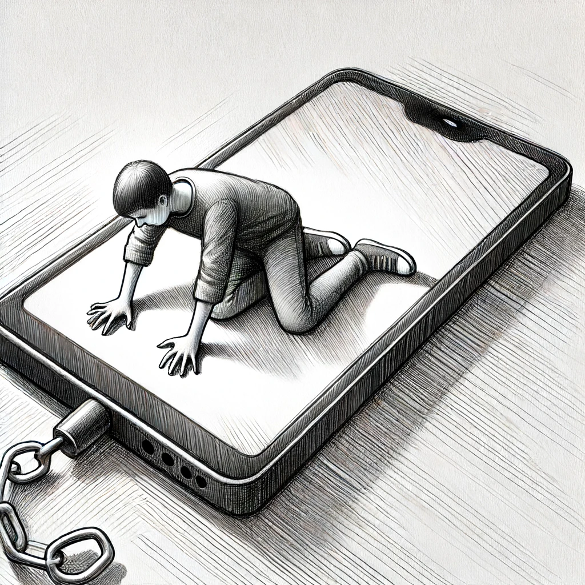
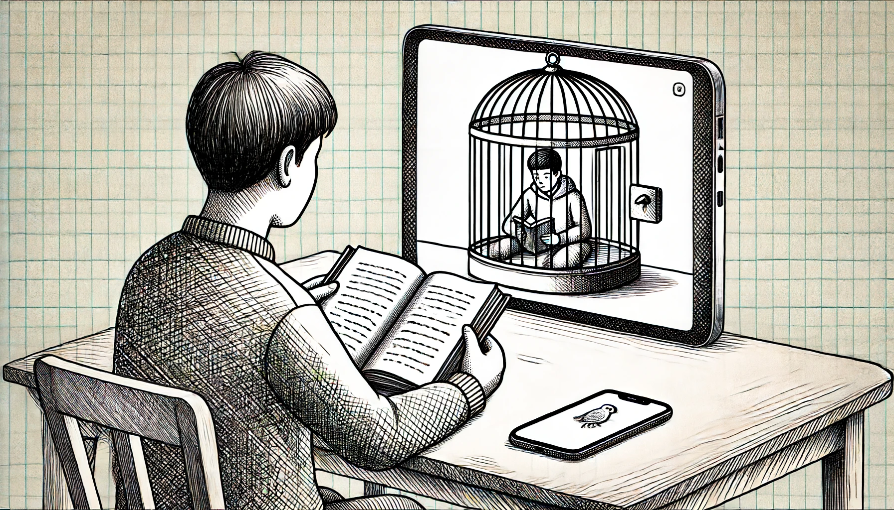

# 【生命⋅修行】人性的弱点与自律的困难

这几天开始了两件事情。一个是重读查理•芒格的《穷查理年鉴》，另一个是学会了如何按天主教的方法诵念《玫瑰经》。两件事情都在进行中，还没能完成：

* 《穷查理年鉴》重读了一半，写了两篇笔记。读得很开心，但输出的笔记，写得不好，按大宝的说法，她根本看不下去；
* 我想要为刚刚去世的外婆至少读7天《玫瑰经》，早晚各一次。今天是第三天，我已经整理了一篇自己可以照着读的「教程」，用了很多次，但总觉得还可以改进，比如用PPT做成一页一页的卡片。

与此同时，我发现自己在这几天里，完全控制不住刷手机——写到这里，我忍不住又拿起了手机，把它的显示改成了黑白灰模式，同时把字体调大了——最近这四、五天，除了中间有一天进行了一次运动，其它时间都是宅在酒店里，而且有好几个晚上，临上床睡觉拿起手机看了几眼，等真正放下睡觉时已经是3、4个小时之后的凌晨3点……

读书、读经，以及整理「笔记」与「教程」的时候，可能都是沉浸在一种接近「心流」的状态中，几个小时一晃而过；而刷手机的过程（大部分时候是看短视频，也有不少时候是在刷公众号文章），也是另一种「无时间感」的状态，同样几个小时一晃而过。主要的区别，就是事后：一个觉得痛快，一个不爽；其实即便在中途，读书与创造也更让人快乐一些，而刷手机时是一种奇怪的，成瘾性的，那种既放不下又不满足的状态。

这就是人性的弱点，或者说是人体这个机器本来的运转机制吧——两件事情的开端几乎一摸一样——那就是首先开始做（哪怕只是1秒钟），然后一切就自动发生了。

**仔细想想更为悲哀的是：**

拿起手机刷短视频几乎是一个下意识的行动，完全不像开始读书或写作时，还要一个小小地推动，来克服某个不知名的阻力。一个是自己有意识地做自己知道自己喜欢也会乐在其中的事情，而另一个则是无数产品、心理学、工程学专家这么多年来在人类共同欲望驱使下，设计好的一个自动化陷阱。

我要用手机沟通：包括和大宝这样亲密的家人，包括和同事这样因为做事儿而聚在一起的团队，也包括能为我提供有价值的思想、信息的认识或不认识的人和老师。

我还要用手机学习：类似Duolinggo 这样的软件，我已经几乎养成了每天打卡的习惯；同时还有ChatGPT，不在电脑边时又需要呼唤它时，还是得拿起手机。

然而只要拿起手机，这么多年养成的潜意识，就会让我从再点一下开始，点、点、点……然后划入那些设计最精妙的「陷阱」之中😭

我不喜欢这样，然而又很无奈，我的基因及身体、大脑的现状，决定了目前用于自律的自控力只有这样一个水平——相比大宝，可能差太远了（而且她不会像我这样在之后还自责许久，更虚耗内力）—— 而且一旦体力、精力在其它事情上消耗过多，那仅存的一点点自律能力会迅速崩塌：

就像昨天晚上，读读写写到了午夜12点半，大致上心满意足地完成了自己想要完成的创作段落之后，竟然还是拿起手机刷了几秒钟短视频，结果就是凌晨3点多快4点才睡觉。真是一个雪上加霜的精力消耗。

**真有一种凭一己之力，来对抗整个商业系统的无奈！**

当然，这毕竟也是一种有些许夸张的错觉。还是得面对，还是得解决，目前看来，能做的事情和策略还是那些：

1. 继续先用那些自己喜欢并且自己觉得有意义的事情填满一天的主要时间。—— Time Boxing的技巧还得继续用着；
2. 就好像重要的事情需要——「不管怎样，先开始，做一分钟再说」一样，刷手机需要——「绝不开始，一秒也不行」；
3. 还是把手机调成黑白灰和大字体吧，之前因为要照相、聊天放弃了这个举措，目前看还是可以捡起来再试试；
4. 运动的时间和强度一定要保证，这能进一步保证睡眠的时间和质量，以便把自己的自控力维持在一个基本够用的水平。

说实话，我真想弄一个可以随身携带带锁的盒子，把手机装在里面。然后，尽可能地调整自己日常工作、学习的工作流程与环境，物理上多多远离手机。

