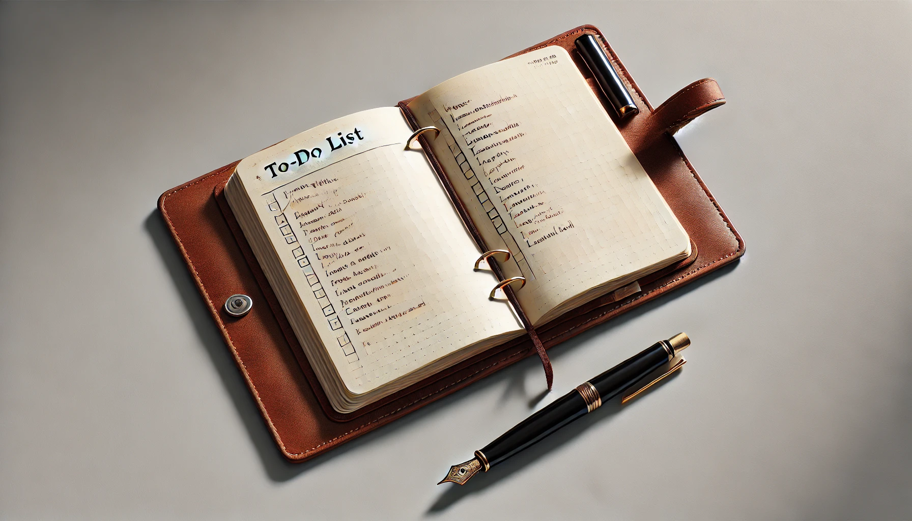

# 【生命⋅修行】再谈一点关于「时间拳击」的体会

之前有一小段时间，一是因为每天的任务相对比较单一，二是因为身心的情况也有些倦怠、状态不太好。便把「时间拳击」的实践搁置了起来……但是，渐渐地越睡越晚，刷手机也越来越多。

我不喜欢这样状态继续滑落的感觉，于是又把「时间拳击」的方法捡了起来。

结合了《跨越不可能》里建议的清单法，我的「时间拳击」方法是这样的：

1. 用传统的纸笔。我就在自己记录To Do List的TN本子里找出一张普通的空白页。
2. 写下所有要做的事情，然后在事情前面写下预估需要的时间块（以5分钟为最小单位）。包括睡觉、洗漱这种小事情也统统写下来。比如某个休息日的：
   1. 108 睡觉
   2. 3 早上洗漱
   3. 12 每日写作
   4. 4 金刚功
   5. 12 运动
   6. 3 早上Duolingo
   7. 3 晚上Duolingo
   8. 12 静坐冥想
   9. 12 读芒格的文章
   10. 4 晚上洗澡
   11. 3 早上微信
   12. 3 晚上微信
   13. 3 计划
3. 完成计划后，我会把总共需要的时间加起来看一下，通常在250以上，288（一天总共只有288个5分钟）以下就差不多了
4. 第二天执行时，完成一条就划掉一条，同时把实际花费的时间块记录在后面；有些计划漏了，但实际做了的事情，也加上去；如果有些事情是在另一件事同步完成的，就在实际花费的时间记录块上打个括号。比如下面这样：
   1. ~~108 睡觉 90~~
   2. ~~3 早上洗漱 3~~
   3. ~~12 每日写作 40~~
   4. ~~4 金刚功 4~~
   5. 12 运动
   6. ~~3 早上Duolingo 3~~
   7. ~~3 晚上Duolingo 3~~
   8. ~~12 静坐冥想 8~~
   9. ~~12 读芒格的文章 48~~
   10. ~~4 晚上洗澡 6~~
   11. ~~3 早上微信 12~~
   12. ~~3 晚上微信 (6)~~
   13. ~~3 计划 4~~
   14. ~~拉屎 3~~
5. 每天晚上临睡前整理前一天的计划，总共实际花费的时间再统计一下（括号里的不算），看看意料之外的事情有哪些，再稍微多享受一下划掉这么多条目的成就感。然后就可以着手定第二天的计划了。
6. 其实，每天晚上整理计划并不一定是临睡前最后一件事。但也差不多是临睡前了，剩下几个小时的实际情况，我可能会在第二天早上再整理一下，或者简单预计一下，大差不差就好。

经过最近的这么一次对比，我对于「时间拳击」的价值又有了新的感悟：

* **明确重点**：它确实能帮你明确一天最重要的事情是什么，不停地把你的注意力拉回到那些更重要的事情上面来。
* **减少了焦虑**：当有许多事情没能完成时，你看一看自己划掉的那么多记录，你会明白自己已经尽力了，不会那么容易开启自我谴责、自我PUA模式
* **提升效率**：截止时间的心理学效应是真的很起作用
* **更客观地认识自己**：把对自己工作效率的错误感知识别出来，有利于更好地安排时间，以及停止PUA自己。

最后这点客观认识自己，真的很有意思。

比如，我再一次认识到，认真读完一篇芒格的演讲稿、再加上记笔记的时间，就需要4个小时左右，而且是整块、几乎不抬头的4个小时。虽然，已经有了笔记，只是再把它整理成一篇文章，但因为这本身就是刚刚学到的知识，一边写一边梳理，再尽可能考虑读者接受的逻辑，这又得花接近4个小时。

**真正有效率的学习、思考与创作，就是需要花整块时间的。越大块越好！**而只要不投入这大块的时间，其实永远也得不到这样的收获和产出。

报销——这件我一直讨厌、惧怕、烦恼又逃不掉的事情，我确实需要花很多时间处理，但也是可以花一个小时，就有一个小时进展，其实是能够一点点推进的。

由此我想到，过去我对于研发一个产品所需要的人力、时间一直没有很清晰的认识，根本原因就是缘于我并没有持续地用这种计划-反思的方法去练习，因此对不同的研发团队、研发人员的真实效率没有清晰认识。虽然了解IPD的整套方法理论，但对于具体执行的研发团队能力，却没有真实的感知和把握。

可能也是菊厂的执行力太强了吧，过去只要把PPT画出来，时间一到，研发团队就能把产品和解决方案拿出来。

离开了菊厂才知道，并不是所有的团队都能自动地把你的PPT如期变成产品的。继续修炼吧！

